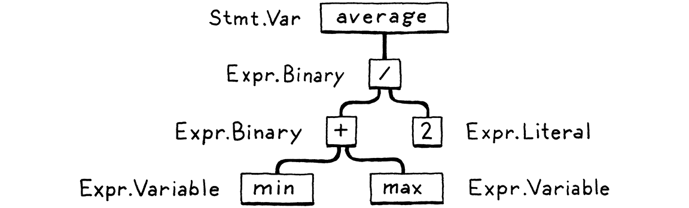

# 疆域的地图

> 你必须有一张地图，无论多么粗糙。否则你会到处游荡。在《指环王》中，我从来没有让任何人在某一天走得比他走得更远。
> 
> -- J. R. R. Tolkien

我们不想漫无目的到处游荡，所以在我们出发之前，让我们浏览一下以前的语言实现者绘制的区域。它将帮助我们了解我们要去的地方以及其他人选择的替代路线。

首先，让我建立一个速记。本书的大部分内容都是关于语言的 *实现*，它以某种柏拉图式的理想形式与*语言本身*截然不同。诸如“堆栈”、“字节码”和“递归下降”之类的东西是特定实现可能使用的具体细节。从用户的角度来看，只要最终的装置忠实地遵循语言的规范，这就是实现细节。

我们将在这些细节上花很多时间，所以如果我每次提到它们都必须写“语言实现”，我会累死的。相反，我将使用“语言”来指代一种语言或它的实现，或两者兼而有之，除非区别很重要。

## 2.1 语言的组成部分

自计算的黑暗时代以来，工程师们一直在构建编程语言。一旦我们可以与计算机对话，我们就发现这样做太难了，于是我们寻求他们的帮助。我觉得很有趣的是，尽管今天的机器实际上快了一百万倍并且​​存储量增加了几个数量级，但我们构建编程语言的方式几乎没有改变。

尽管语言设计者探索的领域广阔，但他们在其中开辟的足迹却寥寥无几。并非每种语言都走完全相同的道路——有些走一两条捷径——但它们在其他方面非常相似，从海军少将 Grace Hopper 的第一个 COBOL 编译器一直到一些热门的、新的、转译到 JavaScript 的语言，其“文档”完全由某处 Git 存储库中一个单一的、编辑不当的 README 文件组成。

> 肯定有死胡同，CS 论文的可悲小死胡同，引用次数为零，现在被遗忘的优化只有在以单个字节测量内存时才有意义。

我将实现可能选择的路径网络想象成爬山。从底部开始将程序作为原始源文本，实际上只是一串字符。每个阶段都会分析程序并将其转换为某种更高级别的表示形式，其中语义（作者希望计算机执行的操作）变得更加明显。

最终我们到达了顶峰。我们可以鸟瞰用户的程序，可以看出他们的代码是什么*意思*。我们从山的另一边开始下山。我们将这种最高级别的表示形式依次向下转换为较低级别的形式，以越来越接近我们知道如何让 CPU 实际执行的东西。


让我们逐一追踪这些足迹和兴趣点。我们的旅程从左侧用户源代码的纯文本开始：


### 2.1.1 扫描

第一步是**扫描**，也称为**词法**分析，或者（如果你想给某人留下深刻印象）**词法分析**。它们的意思几乎相同。我喜欢“lexing”，因为它听起来像是邪恶的超级反派会做的事情，但我会使用“scanning”，因为它似乎稍微更常见一些。

**扫描器**（或**词法分析器**）接收线性**字符流**并将它们组合成一系列更类似于“单词”的东西。在编程语言中，这些词中的每一个都称为**token**。一些token是单个字符，例如`(`和`,`。其他可能有几个字符长，如数字 ( `123`)、字符串文字 ( `"hi!"`) 和标识符 ( `min`)。

> “Lexical”来自希腊词根“lex”，意思是“单词”。

源文件中的某些字符实际上没有任何意义。空格通常是微不足道的，根据定义，注释会被语言忽略。扫描器通常会丢弃这些，留下一个干净的有意义的标记序列。


### 2.1.2 解析

下一步是**解析**。这就是我们的语法获得**文法的地方**——用较小的部分组成较大的表达式和语句的能力。你有没有在英语课上画过句子？如果是这样，您就完成了解析器所做的工作，除了英语有成千上万的“关键字”和充满歧义的聚宝盆。编程语言要简单得多。

**解析器**获取token的序列并构建反映语法嵌套性质的树结构。这些树有几个不同的名称——**解析树**或**抽象语法树**——取决于它们与源语言的裸句法结构的接近程度。在实践中，语言黑客通常称它们为**语法树**、**AST**，或者通常只是**树**。



解析在与人工智能社区密切相关的计算机科学中有着悠久而丰富的历史。今天用于解析编程语言的许多技术最初是由试图让计算机与我们交谈的 AI 研究人员设想的，用于解析*人类语言。*

事实证明，对于那些解析器可以处理的严格语法来说，人类语言过于混乱，但它们非常适合编程语言的更简单的人工语法。我们有缺陷的人仍然设法错误地使用这些简单的语法，因此解析器的工作还包括通过报告语法错误**让我们知道何时使用。

### 2.1.3 静态分析

前两个阶段在所有实现中都非常相似。现在，每种语言的个性特征开始发挥作用。在这一点上，我们知道代码的句法结构——比如哪些表达式嵌套在哪些中——但除此之外我们所知道的不多。

在像 `a + b`这样的表达式中，我们知道我们要添加`a`和`b`，但我们不知道这些名称指的是什么。它们是局部变量吗？全局的？它们在哪里定义？

大多数语言所做的第一位分析称为**绑定 binding或 **解析 resolution。对于每个**identifier**，我们找出该名称的定义位置并将两者连接在一起。这就是**作用域**发挥作用的地方——源代码区域，其中可以使用特定名称来引用特定声明。

如果语言是静态类型的，这是我们类型检查的时候。一旦我们知道`a`和在哪里`b`声明，我们也可以找出它们的类型。然后，如果这些类型不支持相互添加，我们将报告**类型错误**。

> 我们将在本书中构建的语言是动态类型的，因此它稍后会在运行时进行类型检查。

深吸一口气。我们已经登上了山顶，对用户的程序有了全面的了解。我们从分析中看到的所有这些语义洞察力都需要存储在某个地方。有几个地方我们可以把它藏起来：

- 通常，它会作为**属性**存储在语法树本身上——节点中的额外字段在解析期间未初始化但稍后会被填充。

- 其他时候，我们可能会将数据存储在旁边的查找表中。通常，该表的键是标识符——变量名和声明。在这种情况下，我们称它为**符号表**，它与每个键关联的值告诉我们该标识符指的是什么。

- 最强大的记账工具是将树转化为一种全新的数据结构，更直接地表达代码的语义。那是下一节。

到目前为止的一切都被认为是实施的**前端**。你可能会猜到这是**后端**之后的一切，但不是。回到过去，当“前端”和“后端”被创造出来时，编译器要简单得多。后来研究人员发明了新的阶段来填充两半之间。威廉·伍尔夫 (William Wulf) 和他的伙伴并没有丢弃旧术语，而是将这些新阶段归为迷人但空间矛盾的名称 **middle end**。

### 2.1.4 中间表示

您可以将编译器视为一个流水线，其中每个阶段的工作是以一种使下一阶段更易于实现的方式组织表示用户代码的数据。流水线的前端特定于编写程序的源语言。​​后端与程序运行的最终架构有关。

在中间，代码可能存储在与源或目标形式（因此“中间”）没有紧密联系的某种**中间表示**( **IR ) 中。**相反，IR 充当这两种语言之间的接口。

> 那里有一些完善的 IR 样式。点击你选择的搜索引擎，寻找“控制流图”、“静态单一分配”、“连续传递风格”和“三地址代码”。

这使您可以更轻松地支持多种源语言和目标平台。假设您想要实现 Pascal、C 和 Fortran 编译器，并且您想要针对 x86、ARM 以及我不知道的 SPARC。通常，这意味着您要注册编写*九个*完整的编译器：Pascal→x86、C→ARM 以及所有其他组合。

共享的中间表示会显着减少这种情况。您为生成 IR 的每种源语言编写*一个*前端。然后为每个目标架构提供*一个*后端。现在您可以混合搭配它们以获得各种组合。

> 如果您曾经想知道[GCC](https://en.wikipedia.org/wiki/GNU_Compiler_Collection)是如何支持这么多疯狂的语言和体系结构的，例如 Motorola 68k 上的 Modula-3，现在您知道了。语言前端针对少数 IR 之一，主要是[GIMPLE](https://gcc.gnu.org/onlinedocs/gccint/GIMPLE.html)和[RTL](https://gcc.gnu.org/onlinedocs/gccint/RTL.html)。将后端定位为 68k 后端，然后获取这些 IR 并生成本机代码。

我们可能希望将代码转换为一种使语义更加明显的形式的另一个重要原因 。. . 

### 2.1.5 优化

一旦我们理解了用户程序的含义，我们就可以自由地将其替换为具有*相同语义*但更有效地实现它们的不同程序——我们可以对其**进行优化**。

一个简单的例子是**常量折叠**：如果某个表达式总是计算出完全相同的值，我们可以在编译时进行计算，并用它的结果替换表达式的代码。如果用户输入：

```java
pennyArea = 3.14159 * ( 0.75 / 2 ) * ( 0.75 / 2 );
```

我们可以在编译器中完成所有这些运算并将代码更改为：

```java
pennyArea = 0.4417860938 ;
```

优化是编程语言业务的重要组成部分。许多语言黑客在这里度过了他们的整个职业生涯，从他们的编译器中榨取每一点性能，以使他们的基准测试更快一点点。它可以成为一种痴迷。

在本书中，我们主要会跳过那个老鼠洞。许多成功的语言几乎没有编译时优化。例如，Lua 和 CPython 生成相对未优化的代码，并将大部分性能工作集中在运行时。

> 如果你忍不住把脚伸进那个洞，一些让你开始的关键词是“不断传播”，“公共子表达式消除”，“循环不变代码运动”，“全局值编号”，“强度减少”，“聚合的标量替换”、“死代码消除”和“循环展开”。

### 2.1.6 代码生成

我们已经将所有我们能想到的优化应用到用户的程序中。最后一步是将其转换为机器可以实际运行的形式。换句话说，**生成代码**（或**code gen**），这里的“代码”通常是指 CPU 运行的那种原始的类似汇编的指令，而不是人类可能想要阅读的那种“源代码”。

最后，我们在**后端**，从山的另一边下山。从现在开始，我们对代码的表示变得越来越原始，就像进化倒退一样，因为我们越来越接近头脑简单的机器可以理解的东西。

我们要做出决定。我们是为真实 CPU 还是虚拟 CPU 生成指令？如果我们生成真正的机器代码，我们会得到一个操作系统可以直接加载到芯片上的可执行文件。本机代码快如闪电，但生成它需要大量工作。今天的架构有成堆的指令、复杂的管道和足够多的历史包袱来填满 747 的行李舱。

说芯片的语言也意味着您的编译器与特定的体系结构相关联。如果您的编译器以[x86](https://en.wikipedia.org/wiki/X86)机器代码为目标，则它不会在[ARM](https://en.wikipedia.org/wiki/ARM_architecture)设备上运行。一直追溯到 20 世纪 60 年代，在计算机体系结构的寒武纪大爆发期间，缺乏可移植性是一个真正的障碍。

> 例如，[AAD](http://www.felixcloutier.com/x86/AAD.html)（“ASCII Adjust AX Before Division”）指令让您执行除法，这听起来很有用。除了该指令将两个二进制编码的十进制数字作为操作数打包到一个 16 位寄存器中。*您*最后一次在 16 位机器上需要 BCD 是什么时候？

为了解决这个问题，分别以 BCPL 和 Pascal 闻名的 Martin Richards 和 Niklaus Wirth 等黑客让他们的编译器生成*虚拟*机代码。他们不是为一些真实的芯片提供指令，而是为一个假设的、理想化的机器生成代码。Wirth 将此**p 代码**称为可*移植*的，但今天，我们通常将其称为**字节码**，因为每条指令通常只有一个字节长。

这些合成指令旨在更紧密地映射到语言的语义，而不是与任何一种计算机体系结构的特性及其积累的历史问题联系在一起。您可以将其视为语言低级操作的密集二进制编码。

### 2.1.7虚拟机

如果您的编译器生成字节码，那么一旦完成，您的工作就不会结束。由于没有芯片可以读出该字节码，因此您的工作就是翻译。同样，您有两个选择。您可以为每个目标体系结构编写一个小型编译器，将字节码转换为该机器的本机代码。你仍然需要为你支持的每个芯片做工作，但最后这个阶段非常简单，你可以在你支持的所有机器上重用编译器管道的其余部分。您基本上是在使用字节码作为中间表示。

> 这里的基本原则是，您将特定于体系结构的工作推进到管道的下游越远，您可以跨体系结构共享的早期阶段就越多。
> 
> 但是，有一种紧张感。许多优化，如寄存器分配和指令选择，在了解特定芯片的优势和功能时效果最佳。弄清楚编译器的哪些部分可以共享，哪些应该是特定于目标的是一门艺术。

或者，您可以编写一个**虚拟机**( **VM** )，这是一个在运行时模拟支持您的虚拟架构的假想芯片的程序。在 VM 中运行字节码比提前将其转换为本机代码要慢，因为每条指令每次执行时都必须在运行时进行模拟。作为回报，您将获得简单性和便携性。以 C 语言实现您的 VM，您可以在任何具有 C 编译器的平台上运行您的语言。这就是我们在本书中构建的第二个解释器的工作原理。

> 术语“虚拟机”也指不同类型的抽象。**系统虚拟机**在 软件中模拟整个硬件平台和操作系统。这就是您如何在 Linux 机器上玩 Windows 游戏，以及云提供商如何为客户提供控制他们自己的“服务器”的用户体验，而无需为每个用户物理分配单独的计算机。
> 
> 我们将在本书中讨论的 VM 类型是**语言虚拟机** 或**进程虚拟机**（如果您想明确的话）。

### 2.1.8 运行时

我们终于把用户的程序敲成了我们可以执行的形式。最后一步是运行它。如果我们将它编译为机器代码，我们只需告诉操作系统加载可执行文件，然后就可以了。如果我们将它编译为字节码，我们需要启动 VM 并将程序加载到其中。

在这两种情况下，除了最基本的低级语言之外，我们通常需要我们的语言在程序运行时提供的一些服务。例如，如果语言自动管理内存，我们需要一个垃圾收集器来回收未使用的位。如果我们的语言支持“instance of”测试，这样你就可以看到你拥有什么样的对象，那么我们就需要一些表示来在执行过程中跟踪每个对象的类型。

所有这些东西都在运行时进行，所以它被恰当地称为 **运行时**。在完全编译的语言中，实现运行时的代码直接插入生成的可执行文件中。例如，在[Go](https://golang.org/)中，每个编译的应用程序都有自己的 Go 运行时副本直接嵌入其中。如果语言在解释器或 VM 中运行，那么运行时就存在于其中。这就是 Java、Python 和 JavaScript 等语言的大多数实现方式。

## 2.2 捷径和替代路线

这是涵盖您可能实施的每个可能阶段的漫长路径。许多语言确实走完了整条路线，但也有一些捷径和替代路径。

### 2.2.1 单程编译器

一些简单的编译器将解析、分析和代码生成交织在一起，以便它们直接在解析器中生成输出代码，而无需分配任何语法树或其他 IR。这些**单程编译器**限制了语言的设计。您没有中间数据结构来存储有关程序的全局信息，并且您不需要重新访问任何以前解析过的代码部分。这意味着一旦你看到一些表达式，你就需要足够的知识来正确地编译它。

> [**语法制导翻译**](https://en.wikipedia.org/wiki/Syntax-directed_translation)是一种用于构建这些一次性编译器的结构化技术。您将一个*动作*与每个语法片段相关联，通常是生成输出代码的语法片段。然后，每当解析器匹配该语法块时，它就会执行操作，一次一条规则地构建目标代码。

Pascal 和 C 就是围绕这个限制设计的。当时，内存非常宝贵，编译器甚至可能无法在内存中保存整个*源文件* ，更不用说整个程序了。这就是 Pascal 语法要求类型声明首先出现在块中的原因。这就是为什么在 C 中你不能在定义它的代码之上调用一个函数，除非你有一个显式的前向声明告诉编译器它需要知道什么来生成代码来调用后面的函数。

### 2.2.2 树遍历解释器

一些编程语言在将代码解析为 AST 后立即开始执行代码（可能应用了一些静态分析）。为了运行该程序，解释器一次遍历语法树一个分支和一个叶子，评估每个节点。

这种实现风格对于学生项目和小语言很常见，但由于它往往很慢，因此没有广泛用于通用语言。有些人使用“解释器”来表示这些类型的实现，但其他人更广泛地定义了这个词，所以我将使用无可争辩的明确的**树遍历解释器**来指代这些。我们的第一个解释器是这样滚动的。

> 一个值得注意的例外是 Ruby 的早期版本，它们是树遍历解释器。在 1.9 中，Ruby 的规范实现从最初的 MRI（Matz 的 Ruby 解释器）切换到 Koichi Sasada 的 YARV（Yet Another Ruby VM）。YARV 是一个字节码虚拟机。

### 2.2.3 转译器

为一种语言编写完整的后端可能需要大量工作。如果您有一些现有的通用 IR 可以作为目标，您可以将前端固定到它上面。否则，您似乎被困住了。但是，如果您将其他一些*源语言*视为一种中间表示，会怎样呢？

您为您的语言编写前端。然后，在后端，您不必做所有工作来将语义*降低*到某种原始目标语言，而是为与您的语言水平差不多的其他语言生成一串有效源代码。然后，您使用该语言的现有编译工具*作为* 逃生路线，下山并下到您可以执行的东西。

他们过去称其为**source-to-source compiler**或**transcompiler**。在编译成 JavaScript 以便在浏览器中运行的语言兴起之后，它们影响了时髦的**绰号转译器**。

> 第一个转译器 XLT86 将 8080 汇编翻译成 8086 汇编。这可能看起来很简单，但请记住，8080 是一个 8 位芯片，而 8086 是一个 16 位芯片，可以将每个寄存器用作一对 8 位寄存器。XLT86做了数据流分析，跟踪源程序中的寄存器使用情况，然后高效映射到8086的寄存器组。
> 
> 它是由加里·基尔德尔 (Gary Kildall) 编写的，他是计算机科学界的悲剧英雄（如果有的话）。作为最早认识到微型计算机前景的人之一，他创建了 PL/M 和 CP/M，这是它们的第一种高级语言和操作系统。
> 
> 他是一名船长、企业主、持有执照的飞行员和摩托车手。80 年代留着大胡子的英俊帅哥穿着 Kris Kristofferson 风格的电视节目主持人。他接受了比尔盖茨，但像许多人一样，在神秘的情况下在骑自行车的酒吧结束生命之前，他输了。他死得太早，但肯定活在他死之前。

虽然第一个转译器将一种汇编语言翻译成另一种，但今天，大多数转译器都在更高级的语言上工作。在 UNIX 病毒式地传播到各种各样的机器之后，产生了 C 作为其输出语言的编译器的悠久传统开始了。C 编译器在 UNIX 存在的任何地方都可用，并且可以生成高效的代码，因此以 C 为目标是让您的语言在许多体系结构上运行的好方法。

Web 浏览器是当今的“机器”，它们的“机器代码”是 JavaScript，所以现在似乎[几乎所有语言](https://github.com/jashkenas/coffeescript/wiki/list-of-languages-that-compile-to-js)都有一个针对 JS 的编译器，因为这是让代码在浏览器中运行的主要方式。

> JS曾经是在浏览器中执行代码的*唯一*方式。多亏了 [WebAssembly](https://github.com/webassembly/)，编译器现在有了第二种可以在网络上运行的低级语言。

转译器的前端——扫描器和解析器——看起来像其他编译器。然后，如果源语言只是目标语言的简单句法表皮，它可能会完全跳过分析并直接输出目标语言的类似句法。

如果这两种语言在语义上更加不同，您将看到更多完整编译器的典型阶段，包括分析甚至可能优化。然后，当涉及到代码生成时，您不是输出某种二进制语言（如机器代码），而是用目标语言生成一串语法正确的源（好吧，目标）代码。

无论哪种方式，您都可以通过输出语言的现有编译管道运行生成的代码，一切顺利。

### 2.2.4 即时编译

最后一条与其说是一条捷径，不如说是一场危险的高山攀登，最好留给专家。执行代码最快的方法是将其编译为机器代码，但您可能不知道最终用户的机器支持什么架构。该怎么办？

您可以执行与 HotSpot Java 虚拟机 (JVM)、Microsoft 的公共语言运行时 (CLR) 和大多数 JavaScript 解释器相同的操作。在最终用户的机器上，当程序被加载时——无论是从 JS 的源代码，还是 JVM 和 CLR 的平台无关字节码——你将它编译为他们的计算机支持的体系结构的本地代码。很自然地，这被称为**即时编译**。大多数黑客只说“JIT”，发音与“fit”押韵。

最复杂的 JIT 将分析挂钩插入到生成的代码中，以查看哪些区域对性能最关键以及流经它们的数据类型。然后，随着时间的推移，他们将自动重新编译那些具有更高级优化的热点。

> 当然，这正是 HotSpot JVM 得名的地方。

## 2.3 编译器和解释器

既然我已经用字典般的编程语言术语塞满了你的头脑，我们终于可以解决一个自古以来困扰编码人员的问题：编译器和解释器之间有什么区别？

原来这就像问水果和蔬菜的区别。这似乎是一个二选一的选择，但实际上“水果”是一个*植物学* 术语，“蔬菜”是一个*烹饪*术语。一个并不严格地暗示另一个的否定。有不是蔬菜的水果（苹果）和不是水果的蔬菜（胡萝卜），还有既是水果*又*是 蔬菜的可食用植物，例如西红柿。


> 花生（甚至不是坚果）和小麦等谷物实际上是水果，但我画错了。我能说什么，我是软件工程师，不是植物学家。我可能应该把那个花生小家伙抹掉，但他太可爱了，我舍不得。
> 
> 另一方面，现在*松子是植物性食物，既不是水果也不是蔬菜。*至少据我所知。

那么，回到语言：

- **编译**是一种*实现技术*，涉及将源语言翻译成其他一些——通常是较低级别的——形式。当你生成字节码或机器码时，你就是在编译。当您转换为另一种高级语言时，您也在编译。

- 当我们说一种语言实现“是一个**编译器**”时，我们的意思是它将源代码翻译成某种其他形式但不执行它。用户必须获取结果输出并自己运行。

- 相反，当我们说一个实现“是一个**解释器**”时，我们的意思是它接收源代码并立即执行。它“从源代码”运行程序。

就像苹果和橘子一样，一些实现显然是编译器而*不是* 解释器。GCC 和 Clang 获取您的 C 代码并将其编译为机器代码。最终用户直接运行该可执行文件，甚至可能永远不知道使用了哪个工具来编译它。所以那些是C的*编译器。*

在 Matz 的 Ruby 规范实现的旧版本中，用户从源代码运行 Ruby。实现通过遍历语法树直接解析并执行。没有其他翻译发生，无论是在内部还是以任何用户可见的形式。所以这绝对是Ruby的*解释器。*

但是 CPython 呢？当您使用它运行 Python 程序时，代码会被解析并转换为内部字节码格式，然后在 VM 内执行。从用户的角度来看，这显然是一个解释器——他们从源代码运行他们的程序。但是如果你仔细观察 CPython 的鳞片状皮肤，你会发现肯定有一些编译正在进行。

答案是两者兼而有之。CPython*是*一个解释器，它*有*一个编译器。实际上，大多数脚本语言都是这样工作的，如您所见：

> [Go 工具](https://golang.org/)更像是一种园艺好奇心。如果你运行`go build`，它会将你的 Go 源代码编译为机器代码并停止。如果您键入 `go run`，它会执行此操作，然后立即执行生成的可执行文件。
> 
> `go` *编译器也是*如此（你可以将它用作编译代码的工具而不运行它），*是*解释器（你可以调用它以立即从源代码运行程序），还有*编译*器（当你将它用作解释器时，它仍在内部编译）。


中间的重叠区域也是我们的第二个解释器所在的地方，因为它在内部编译为字节码。因此，虽然这本书名义上是关于解释器的，但我们也会涵盖一些汇编。

## 2.4 我们的旅程

一次要吸收很多东西。不用担心。在本章中，您不需要*理解*所有这些片段和部分。我只想让你知道它们就在那里，以及它们大致是如何组合在一起的。

当你探索我们在本书中采用的指导路径之外的领域时，这张地图应该能很好地为你服务。我要留给你独自闯荡的渴望，走遍那座山。

但是，就目前而言，是时候开始我们自己的旅程了。系紧你的鞋带，收紧你的背包，然后走吧。从现在开始，你只需要专注于你面前的道路。

从今以后，我保证要淡化整个山比喻的事情。

---

## [挑战](http://craftinginterpreters.com/a-map-of-the-territory.html#challenges)

1. 选择您喜欢的语言的开源实现。下载源代码并在其中浏览。尝试找到实现扫描器和解析器的代码。它们是手写的，还是使用 Lex 和 Yacc 等工具生成的？（`.l`或`.y`文件通常暗示后者。）

2. 即时编译往往是实现动态类型语言的最快方式，但并非所有语言都使用它。*没有* JIT的原因是什么？

3. 大多数编译为 C 的 Lisp 实现还包含一个解释器，使它们也可以动态执行 Lisp 代码。为什么？
