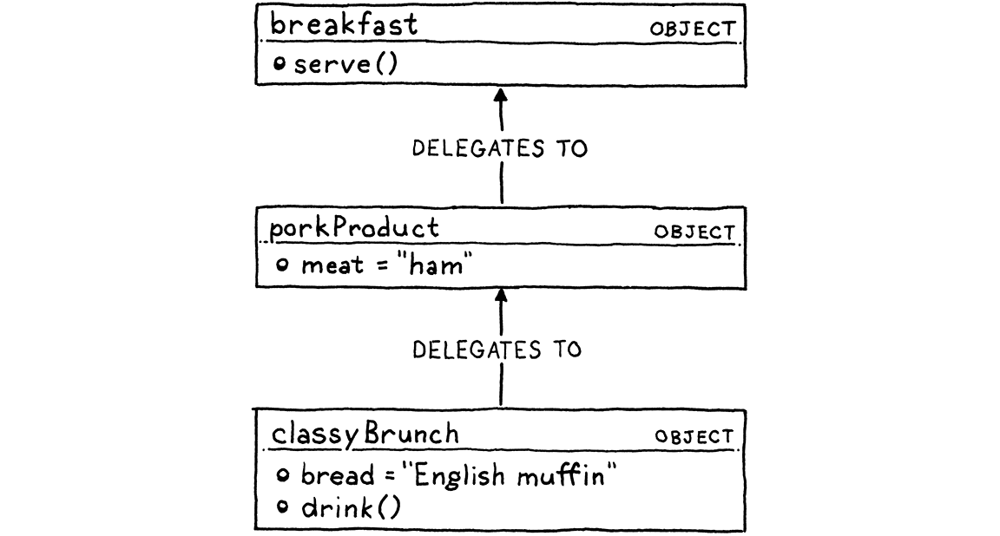

# Lox 语言

> 有什么比为他们做早餐更好的事呢？
> 
> -- Anthony Bourdain

我们将用这本书的其余部分来阐明 Lox 语言的每个黑暗和杂乱的角落，但是让你立即开始为解释器编写代码而不至少瞥见我们最终会得到什么似乎是残酷的.

同时，在您接触文本编辑器之前，我不想让您通过大量的语言律师和规范语言。所以这将是对 Lox 的温和、友好的介绍。它会遗漏很多细节和边缘情况。我们以后有足够的时间来做这些。

> 如果您不能自己尝试代码，教程就不是很有趣。哎，您还没有 Lox 解释器，因为您还没有构建一个！
> 
> 不要怕。你可以用[我](https://github.com/munificent/craftinginterpreters)的。

## 3.1 Hello,Lox

这是您第一次尝到Lox的滋味：

> 您第一次体验 Lox，就是这种语言。不知道大家有没有吃过这种腌制的冷熏三文鱼。如果没有，也试试看。

```c
// Your first Lox program!
print "Hello, world!";
```

正如该`//`行注释和尾随分号所暗示的那样，Lox 的语法是 C 家族的一员。（字符串两边没有括号，因为 `print`它是内置语句，而不是库函数。）

现在，我不会声称C有*很好的*语法。如果我们想要优雅的东西，我们可能会模仿 Pascal 或 Smalltalk。如果我们想要完整的斯堪的纳维亚家具极简主义，我们会做一个方案。这些都有他们的优点。

> 我肯定有偏见，但我认为 Lox 的语法非常简洁。C 最令人震惊的语法问题是围绕类型的。[Dennis Ritchie 有一个叫做“声明反映使用](http://softwareengineering.stackexchange.com/questions/117024/why-was-the-c-syntax-for-arrays-pointers-and-functions-designed-this-way)”的想法，其中变量声明反映了您必须对变量执行的操作才能获得基本类型的值。聪明的想法，但我认为它在实践中效果不佳。
> 
> Lox 没有静态类型，所以我们避免了。

相反，类 C 语法所具有的是您通常会发现在语言中更有价值的东西：*熟悉*度。我知道您已经习惯了这种风格，因为我们将用来*实现*Lox的两种语言——Java和C——也继承了它。对 Lox 使用类似的语法可以让你少学点东西。

## 3.2 高级语言

虽然这本书最终比我希望的要大，但它仍然不够大，无法容纳像 Java 这样的庞大语言。为了在这些页面中容纳 Lox 的两个完整实现，Lox 本身必须非常紧凑。

当我想到小而有用的语言时，我想到的是高级“脚本”语言，如JavaScript、Scheme 和 Lua。在这三者中，Lox 看起来最像 JavaScript，主要是因为大多数 C 语法语言都像。正如我们稍后将了解到的，Lox 的范围界定方法与 Scheme 密切相关。我们将在[第 III 部分](http://craftinginterpreters.com/a-bytecode-virtual-machine.html)中构建的 Lox 的 C 风格在很大程度上得益于 Lua 的干净、高效的实现。

> 现在 JavaScript 已经接管了世界并被用来构建巨大的应用程序，很难将其视为一种“小脚本语言”。但是 Brendan Eich 在*十天内*将第一个 JS 解释器黑进了 Netscape Navigator，使网页上的按钮具有动画效果。JavaScript 从那时起就长大了，但它曾经是一门可爱的小语言。
> 
> 因为 Eich 使用与 MacGyver 的一集大致相同的原材料和时间将 JS 拍打在一起，所以它有一些奇怪的语义角，胶带和回形针可以从中露出来。诸如变量提升、动态绑定 `this`、数组中的空洞和隐式转换之类的东西。
> 
> 我有幸在 Lox 上花时间，所以它应该更干净一些。

Lox 与这三种语言有两个共同点：

### 3.2.1 动态类型

Lox 是动态类型的。变量可以存储任何类型的值，单个变量甚至可以存储不同时间不同类型的值。如果您尝试对错误类型的值执行操作（例如，将数字除以字符串），则会在运行时检测并报告错误。

喜欢静态类型的理由有很多，但它们并没有超过为 Lox 选择动态类型的实用理由。静态类型系统需要大量的学习和实现工作。跳过它会给你一种更简单的语言和一本更短的书。如果我们将类型检查推迟到运行时，我们将更快地启动解释器并执行一些代码。

> 毕竟，我们将用来*实现*Lox 的两种语言都是静态类型的。

### 3.2.2 自动内存管理

高级语言的存在是为了消除容易出错的低级苦差事，还有什么比手动管理存储的分配和释放更乏味的呢？没有人起身迎接早晨的阳光，“我迫不及待地想找出正确的位置来调用`free()`我今天分配的每一字节内存！”

有两种主要的内存管理技术： **引用计数**和**跟踪垃圾收集**（通常简称为 **垃圾收集**或**GC**）。引用计数器的实现要简单得多——我认为这就是 Perl、PHP 和 Python 都开始使用它们的原因。但是，随着时间的推移，引用计数的局限性变得太麻烦了。所有这些语言最终都添加了一个完整的跟踪 GC，或者至少添加了一个足以清理对象循环的垃圾回收器。

> 在实践中，参考计数和追踪更多地是连续统一体的两端而不是对立面。大多数引用计数系统最终都会进行一些跟踪来处理循环，如果你眯着眼睛，分代收集器的写屏障看起来有点像保留调用。
> 
> 有关更多信息，请参阅“[垃圾收集的统一理论](https://researcher.watson.ibm.com/researcher/files/us-bacon/Bacon04Unified.pdf)”(PDF)。

跟踪垃圾收集有一个可怕的名声。在原始内存级别工作有点令人痛苦*。*调试 GC 有时会让您在梦中看到十六进制转储。但是，请记住，这本书是关于驱散魔法和杀死那些怪物的，所以我们*要*编写自己的垃圾收集器。我想您会发现该算法非常简单并且实现起来很有趣。

## 3.3  数据类型

在 Lox 的小宇宙中，构成所有物质的原子是内置数据类型。只有几个：

- **布尔值**。没有逻辑就不能编码，没有布尔值就不能逻辑。“真”与“假”，软件的阴阳。与一些重新利用现有类型来表示真假的古老语言不同，Lox 有一个专用的布尔类型。我们可能在这次探险中遇到了困难，但我们不是*野蛮人*。
  
  > 布尔变量是 Lox 中唯一以乔治布尔命名的数据类型，这就是“布尔”大写的原因。他于 1864 年去世，比数字计算机将他的代数转化为电力早了将近一个世纪。我想知道他看到自己的名字出现在数十亿行 Java 代码中会作何感想。
  
  显然，有两个布尔值，每个都有一个文字。
  
  ```c
  true;  // Not false.
  false; // Not *not* false.
  ```

- **数字**。Lox 只有一种数字：双精度浮点数。由于浮点数也可以表示范围广泛的整数，因此涵盖了很多领域，同时保持简单。
  
  全功能语言有很多数字语法——十六进制、科学记数法、八进制，各种有趣的东西。我们将解决基本的整数和小数文字。
  
  ```c
  1234;  // An integer.
  12.34; // A decimal number.
  ```

- **字符串**。我们已经在第一个示例中看到了一个字符串文字。像大多数语言一样，它们用双引号括起来。
  
  ```c
  "I am a string";
  "";    // The empty string.
  "123"; // This is a string, not a number.
  ```
  
  正如我们在开始实施它们时将看到的那样，在这些无害的字符序列中隐藏着相当多的复杂性。
  
  > 就连“character”这个词也是个骗子。它是 ASCII 码吗？统一码？代码点还是“字素簇”？字符是如何编码的？每个字符的大小是固定的，还是可以变化？

- **Nil**。最后一种内在价值从未受邀参加聚会，但似乎总是出现。它代表“没有价值”。它在许多其他语言中被称为“null”。在 Lox 中，我们拼写它`nil`。（当我们开始实现它时，这将有助于区分我们谈论的是 Lox 还是`nil`Java 或 C。`null`）
  
  由于空指针错误是我们行业的祸害，因此在语言中没有空值是有充分理由的。如果我们正在做一种静态类型的语言，那么尝试禁止它是值得的。但是，在动态类型的类型中，消除它通常比拥有它更烦人。

## 3.4 表达式

如果内置数据类型及其字面量是原子，那么**表达式**一定是分子。其中大部分都是熟悉的。

### 3.4.1 算术表达式

Lox 具有您从 C 和其他语言中了解和喜爱的基本算术运算符：

```c
add + me;
subtract - me;
multiply * me;
divide / me;
```

运算符两边的子表达式是**操作数**。因为有*两个*，所以称为**二元**运算符。（它与“二进制”的 1 和 0 使用无关。）因为运算符固定 *在*操作数的中间，所以这些也称为中**缀**运算符（与运算符位于运算符之前的**前缀**运算符相反）操作数，以及它后面的**后缀）。**

> 有些运算符有两个以上的操作数，并且运算符在它们之间交错。唯一广泛使用的是 C 和朋友的“条件”或“三元”运算符：
> condition ? thenArm : elseArm;

> 有些人称这些**为 mixfix**运算符。一些语言允许您定义自己的运算符并控制它们的定位方式——它们的“固定性”。

一个算术运算符实际上*既是*中缀又是前缀。运算符也可`-` 用于取反一个数。

```c
-negateMe;
```

所有这些运算符都处理数字，将任何其他类型传递给它们都是错误的。`+`运算符是个例外——您也可以将两个字符串传递给它以连接它们。

### 3.4.2 比较与相等

继续前进，我们还有一些始终返回布尔结果的运算符。我们可以使用 Ye Olde 比较运算符来比较数字（并且只能比较数字）。

```c
less < than;
lessThan <= orEqual;
greater > than;
greaterThan >= orEqual;
```

我们可以测试任何类型的两个值是否相等。

```c
1 == 2;         // false.
"cat" != "dog"; // true.
```

甚至不同类型。

```c
314 == "pi"; // false.
```

不同类型的值*永远不会*相等。

```c
123 == "123"; // false.
```

我通常反对隐式转换。

### 3.4.3 逻辑运算符

not 运算符是一个前缀`!`，`false`如果其操作数为真则返回，反之亦然。

```c
!true;  // false.
!false; // true.
```

其他两个逻辑运算符实际上是伪装成表达式的控制流结构。表达式`and`确定两个值是否*都为*真。如果为假，则返回左操作数，否则返回右操作数。

```c
true and false; // false.
true and true;  // true.
```

`or`表达式确定两个值中的任何一个（或两个）是否为*真*。如果为真，则返回左操作数，否则返回右操作数。

```c
false or false; // false.
true or false;  // true.
```

> 对于这些，我使用`and`and而不是and，因为 Lox 不使用 and作为位运算符。只引入双字形式，不引入单字形式，感觉很奇怪。`or``&&``||``&``|`

> 我也有点喜欢用词来形容它们，因为它们实际上是控制流结构，而不是简单的运算符。

`and`和之所以`or`像控制流结构是因为它们 **短路了**。如果它为假，不仅`and`返回左操作数，在这种情况下它甚至不*评估*右操作数。相反（相反？），如果 an 的左操作数`or`为真，则跳过右操作数。

### 3.4.4  优先级和分组

所有这些运算符都具有您期望来自 C 的相同优先级和关联性。（当我们开始解析时，我们会*更*精确地了解这一点。）如果优先级不是您想要的，您可以`()` 用来分组东西。

```c
var average = (min + max) / 2;
```

因为它们在技术上不是很有趣，所以我已经从我们的小语言中删除了典型的操作员动物园的其余部分。没有按位运算符、移位运算符、模运算符或条件运算符。我不会给你打分，但如果你用它们来增强你自己的 Lox 实现，你会在我心中获得加分。

这些是表达形式（除了一些与我们稍后会谈到的特定功能相关的形式），所以让我们更上一层楼。

## 3. 5 语句 Statements

现在我们在发表声明。表达式的主要工作是产生一个*值*，而语句的主要工作是产生一个*效果*。因为，根据定义，语句不会评估为一个值，所以它们必须以某种方式改变世界——通常是修改某些状态、读取输入或产生输出。

您已经看到了几种陈述。第一个是：

```c
print "Hello, world!";
```

`print`语句计算单个表达式并将结果显示给用户。您还看到了一些语句，例如：

> 融入`print`语言而不是仅仅使它成为核心库功能是一种技巧。但这对我们来说是一个*有用*的hack：这意味着我们正在进行的解释器可以在我们实现定义函数所需的所有机制之前开始生成输出，按名称查找并调用它们。

```c
"some expression";
```

后跟分号 ( `;`) 的表达式将表达式提升为语句罩。这被称为（足够富有想象力）**表达式语句**。

如果你想将一系列语句打包到一个应该是单个语句的地方，你可以将它们包装在一个**块**中。

```c
{
  print "One statement.";
  print "Two statements.";
}
```

块也会影响作用域，这将我们带到下一节 。. . 

## 3.6 变量

您使用语句声明变量`var`。如果省略初始值设定项，则变量的值默认为`nil`.

> 这是其中一种情况，其中没有`nil`并强制将每个变量初始化为某个值会比处理`nil` 自身更烦人。

```c
var imAVariable = "here is my value";
var iAmNil;
```

一旦声明，您自然可以使用其名称访问和分配变量。

```c
var breakfast = "bagels";
print breakfast; // "bagels".
breakfast = "beignets";
print breakfast; // "beignets".
```

> 你能看出我倾向于在早上还没吃东西之前写这本书吗？

我不会在这里深入探讨变量范围的规则，因为我们将在后面的章节中花费惊人的时间来映射规则的每一寸。在大多数情况下，它的工作方式与您期望的来自 C 或 Java 的一样。

## 3.7 控制流

如果不能跳过某些代码或多次执行某些代码，就很难编写出有用的程序。这意味着控制流。除了我们已经介绍过的逻辑运算符之外，Lox 还直接从 C 中提取了三个语句。

> 我们已经有了`and`and`or`用于分支，我们*可以*使用递归来重复代码，所以这在理论上就足够了。不过，用命令式风格的语言以这种方式编程会很尴尬。
> 
> 另一方面，Scheme 没有内置的循环结构。它*确实*依赖于递归来重复。Smalltalk 没有内置的分支结构，并且依赖于动态调度来选择性地执行代码。

`if`语句根据某些条件执行两个语句之一。

```c
if (condition) {
  print "yes";
} else {
  print "no";
}
```

只要条件表达式的计算结果为真，循环就会重复执行循环`while` 体。

```c
var a = 1;
while (a < 10) {
  print a;
  a = a + 1;
}
```

我`do while`从 Lox 中删除了循环，因为它们并不常见，并且不会教给您任何您尚未从中学到的东西`while`。如果您满意，请继续将其添加到您的实施中。这是你的派对。

最后，我们有`for`循环。

```c
for (var a = 1; a < 10; a = a + 1) {
  print a;
}
```

这个循环与上一个循环做同样的事情`while`。大多数现代语言也有某种`for-in`or `foreach`循环，用于显式迭代各种序列类型。`for`在真正的语言中，这比我们在这里得到的粗糙的 C 风格循环更好。Lox 保持基本。

> 这是我做出的让步，因为实现是如何跨章节划分的。循环需要迭代器协议中的`for-in`某种动态调度来处理不同类型的序列，但在我们完成控制流之后我们才知道这一点。我们可以回头再添加`for-in`循环，但我不认为这样做会教给你任何超级有趣的东西。

## 3. 8 函数 Functions

函数调用表达式看起来与在 C 中一样。

```c
makeBreakfast(bacon, eggs, toast);
```

您也可以在不向函数传递任何内容的情况下调用函数。

```c
makeBreakfast();
```

与 Ruby 等不同，括号在这种情况下是强制性的。如果你离开它们，名称不会*调用*函数，它只是引用它。

如果不能定义自己的函数，那么语言就不是很有趣。在 Lox 中，您可以使用`fun`.

> 我见过使用`fn`, `fun`,`func`和的语言`function`。我仍然希望发现一个`funct`,`functi`或`functio`某个地方。

```c
fun printSum(a, b) {
  print a + b;
}
```

现在是澄清一些术语的好时机。有些人到处乱扔“参数”和“论点”，好像它们是可以互换的，对许多人来说，它们是可以互换的。我们将花费大量时间围绕语义拆分最好的绒毛，所以让我们提高我们的措辞。从这里开始了：

- **参数**是调用函数时传递给函数的实际值。所以一个函数*调用*有一个*参数*列表。有时您会听到用于这些的**实际参数。**

- **参数**是一个变量，它在函数体内保存参数的值。因此，函数*声明*具有*参数* 列表。其他人称这些**形式参数**或简称为形式**参数**。

> 说到术语，某些静态类型语言（如 C）区分函数的*声明*和*定义*。声明将函数的类型绑定到它的名称，以便可以对调用进行类型检查但不提供函数体。定义声明函数并填充函数体，以便可以编译函数。
> 
> 由于 Lox 是动态类型的，因此这种区别没有意义。函数声明完整地指定了函数，包括它的主体。

函数体总是一个块。在其中，您可以使用`return`语句返回一个值。

```c
fun returnSum(a, b) {
  return a + b;
}
```

如果执行到达块的末尾而没有碰到 a `return`，它会 隐式返回`nil`。

> 看，我告诉过你`nil`会在我们不注意的时候偷偷溜进来。

### 3.8.1 闭包

函数在 Lox 中是*一流*的，这仅意味着它们是您可以获得引用、存储在变量中、传递等的真实值。这有效：

```c
fun addPair(a, b) {
  return a + b;
}

fun identity(a) {
  return a;
}

print identity(addPair)(1, 2); // Prints "3".
```

由于函数声明是语句，您可以在另一个函数内声明局部函数。

```c
fun outerFunction() {
  fun localFunction() {
    print "I'm local!";
  }

  localFunction();
}
```

如果将局部函数、一流函数和块作用域组合在一起，就会遇到这种有趣的情况：

```c
fun returnFunction() {
  var outside = "outside";

  fun inner() {
    print outside;
  }

  return inner;
}

var fn = returnFunction();
fn();
```

在这里，`inner()`访问在周围函数的主体外部声明的局部变量。这是犹太洁食吗？现在很多语言都从 Lisp 那里借鉴了这个特性，你可能知道答案是肯定的。

为了让它工作，`inner()`必须“坚持”对它使用的任何周围变量的引用，以便即使在外部函数返回后它们仍然存在。我们调用执行此操作的函数**closures**。如今，该术语通常用于*任何* 一等函数，但如果该函数没有碰巧关闭任何变量，则它有点用词不当。

> Peter J. Landin 创造了术语“闭包”。是的，他发明了将近一半的编程语言术语。其中大部分来自一篇令人难以置信的论文，“ [The Next 700 Programming Languages](https://homepages.inf.ed.ac.uk/wadler/papers/papers-we-love/landin-next-700.pdf) ”。
> 
> 为了实现这些类型的功能，您需要创建一个数据结构，将函数的代码和它需要的周围变量捆绑在一起。他称之为“闭包”，因为它*关闭*并保留它需要的变量。

可以想象，实现这些会增加一些复杂性，因为我们不能再假设变量作用域严格地像堆栈一样工作，在堆栈中局部变量会在函数返回时消失。我们将愉快地学习如何使它们正确有效地工作。

## 3.9 类

由于 Lox 具有动态类型、词法（粗略地称为“块”）作用域和闭包，因此它已接近成为函数式语言的一半。但是正如您将看到的，它 *也*大约是成为面向对象语言的一半。这两种范式都有很多用武之地，所以我认为值得分别介绍其中的一些范式。

由于课程因不符合宣传的要求而受到抨击，让我首先解释一下为什么我将它们放入 Lox 和本书中。真的有两个问题：

### 3.9.1 为什么任何语言都希望是面向对象的？

现在像Java这样的面向对象语言已经卖完了，只上江湖戏，再喜欢也不酷了。为什么有人会用对象创造一种*新* 语言？这不就像在 8 轨上发布音乐吗？

的确，90 年代的“所有继承”狂潮产生了一些可怕的类层次结构，但**面向对象编程**( **OOP** ) 仍然非常流行。数十亿行成功的代码是用 OOP 语言编写的，为满意的用户提供了数百万个应用程序。当今大多数工作的程序员可能都在使用面向对象的语言。他们不可能都*错*了。

特别是，对于动态类型语言，对象非常方便。我们需要*某种*方式来定义复合数据类型，以便将大量数据捆绑在一起。

如果我们也可以将方法挂在这些方法之外，那么我们就不需要在所有函数前面加上它们所操作的数据类型的名称，以避免与不同类型的相似函数发生冲突。比方说，在 Racket 中，您最终不得不将函数命名为`hash-copy`（复制哈希表）和 `vector-copy`（复制向量）这样它们就不会相互干扰。方法限定在对象范围内，这样问题就消失了。

### 3.9.2 为什么 Lox 是面向对象的？

我可以说对象很时髦，但仍然超出本书的范围。大多数编程语言书籍，尤其是那些试图实现一门完整语言的书籍，都将对象排除在外。对我来说，这意味着该主题没有得到很好的涵盖。有了如此广泛的范式，这种遗漏让我很难过。

考虑到我们中有多少人整天都在*使用*OOP 语言，似乎全世界都可以使用一些关于如何*制作*OOP 语言的文档。正如您将看到的，结果非常有趣。并不像您担心的那么难，但也不像您想象的那么简单。

### 3.9.3 类或原型

说到对象，实际上有两种方法，[类](https://en.wikipedia.org/wiki/Class-based_programming) 和[原型](https://en.wikipedia.org/wiki/Prototype-based_programming)。类首先出现，并且由于 C++、Java、C# 和朋友的出现而变得更加普遍。在 JavaScript 意外接管世界之前，原型几乎是一个被遗忘的分支。

在基于类的语言中，有两个核心概念：实例和类。实例存储每个对象的状态并引用实例的类。类包含方法和继承链。要在实例上调用方法，总会有一个间接级别。您查找实例的类，然后在*那里*找到方法 ：

> 在像 C++ 这样的静态类型语言中，方法查找通常在编译时根据实例的*静态类型进行，从而为您提供***static dispatch**。相比之下，**动态调度**在运行时查找实际实例对象的类。这就是静态类型语言中的虚拟方法和动态类型语言（如 Lox）中的所有方法的工作方式。


基于原型的语言合并了这两个概念。只有对象——没有类——每个单独的对象都可能包含状态和方法。对象可以直接相互继承（或用原型术语“委托给”）：

> 在实践中，基于类和基于原型的语言之间的界限是模糊的。JavaScript 的“构造函数”概念[促使您非常努力](http://gameprogrammingpatterns.com/prototype.html#what-about-javascript) 地定义类类对象。同时，基于类的 Ruby 非常乐意让您将方法附加到各个实例。



这意味着在某些方面原型语言比类更基础。它们非常易于实现，因为它们*非常*简单。此外，它们可以表达许多不寻常的模式，这些模式会让你远离这些模式。

但我看过*很多*用原型语言编写的代码——包括 [一些我自己设计的](http://finch.stuffwithstuff.com/). 您知道人们通常会利用原型的所有功能和灵活性做什么吗？ . . . 他们用它们来重塑类。

我不知道*为什么*会这样，但人们似乎自然而然地更喜欢基于类（Classic？Classy？）的风格。原型在语言*上*更简单，但它们似乎只能通过将复杂性推给用户来实现。因此，对于 Lox，我们将为用户省去麻烦并直接烘焙课程。

> Perl 的发明者/先知 Larry Wall 将其称为“[水床理论](http://wiki.c2.com/?WaterbedTheory)”。一些复杂性是必不可少的，无法消除。如果你把它压在一个地方，它就会在另一个地方膨胀起来。
> 
> 原型语言并没有*消除*类的复杂性，因为它们确实让*用户*通过构建自己的类元编程库来承担这种复杂性。

### 3.9.4 Lox 中类

足够的理由，让我们看看我们实际上有什么。类包含大多数语言的一系列特性。对于 Lox，我选择了我认为最亮的星星。您声明一个类及其方法，如下所示：

```c
class Breakfast {
  cook() {
    print "Eggs a-fryin'!";
  }

  serve(who) {
    print "Enjoy your breakfast, " + who + ".";
  }
}
```

类的主体包含它的方法。它们看起来像函数声明但没有`fun` 关键字。执行类声明时，Lox 创建一个类对象并将其存储在以该类命名的变量中。就像函数一样，类在 Lox 中是一流的。

> 不过，它们仍然同样有趣。

```c
// Store it in variables.
var someVariable = Breakfast;

// Pass it to functions.
someFunction(Breakfast);
```

接下来，我们需要一种创建实例的方法。我们可以添加某种`new` 关键字，但为了简单起见，在 Lox 中，类本身是实例的工厂函数。像调用函数一样调用一个类，它会生成一个新的自身实例。

```c
var breakfast = Breakfast();
print breakfast; // "Breakfast instance".
```

### 3.9.5 实例化和初始化

只有行为的类并不是非常有用。面向对象编程背后的思想是将行为*和状态*封装在一起。为此，您需要字段。与其他动态类型语言一样，Lox 允许您自由地向对象添加属性。

```c
breakfast.meat = "sausage";
breakfast.bread = "sourdough";
```

分配给一个字段会创建它（如果它尚不存在）。

如果你想从一个方法中访问当前对象的字段或方法，你可以使用 good old `this`。

```c
class Breakfast {
  serve(who) {
    print "Enjoy your " + this.meat + " and " +
        this.bread + ", " + who + ".";
  }

  // ...
}
```

在对象中封装数据的一部分是确保对象在创建时处于有效状态。为此，您可以定义一个初始化程序。如果您的类有一个名为 的方法`init()`，则在构造对象时会自动调用该方法。传递给类的任何参数都被转发给它的初始化器。

```c
class Breakfast {
  init(meat, bread) {
    this.meat = meat;
    this.bread = bread;
  }

  // ...
}

var baconAndToast = Breakfast("bacon", "toast");
baconAndToast.serve("Dear Reader");
// "Enjoy your bacon and toast, Dear Reader."
```

### 3.9.6 继承 inheritance

每种面向对象的语言不仅允许您定义方法，还允许您在多个类或对象中重用它们。为此，Lox 支持单继承。声明类时，可以使用小于 ( `<`)运算符指定它继承自的类。

```c
class Brunch < Breakfast {
  drink() {
    print "How about a Bloody Mary?";
  }
}
```

为什么是`<`运营商？我不想引入像 `extends`. Lox 不`:`用于任何其他用途，所以我也不想保留它。相反，我从 Ruby 中获取了一个页面并使用了`<`.

如果您了解任何类型理论，您会发现这并不是一个*完全*随意的选择。子类的每个实例也是其超类的实例，但超类的实例可能不是子类的实例。这意味着，在对象的世界中，子类对象的集合小于超类的集合，尽管类型书呆子通常使用`<:`这种关系。

在这里，Brunch 是**派生类**或**子类**，Breakfast 是 **基类**或**超类**。

超类中定义的每个方法也可用于其子类。

```c
var benedict = Brunch("ham", "English muffin");
benedict.serve("Noble Reader");
```

甚至`init()`方法也被继承了。实际上，子类通常`init()`也想定义自己的方法。但是还需要调用原始类，以便超类可以保持其状态。我们需要一些方法来在我们自己的*实例*上调用一个方法而不用调用我们自己的*方法*。

> Lox 不同于不继承构造函数的 C++、Java 和 C#，但类似于继承构造函数的 Smalltalk 和 Ruby。

与在 Java 中一样，您可以使用`super`它。

```c
class Brunch < Breakfast {
  init(meat, bread, drink) {
    super.init(meat, bread);
    this.drink = drink;
  }
}
```

这就是面向对象。我试图将功能集保持在最低限度。这本书的结构确实迫使我们做出妥协。Lox 不是*纯粹* 的面向对象语言。在真正的 OOP 语言中，每个对象都是一个类的实例，即使是原始值，如数字和布尔值。

因为直到我们开始使用内置类型之后才实现类，所以这会很困难。因此，原始类型的值不是类实例意义上的真实对象。它们没有方法或属性。如果我想让 Lox 成为真实用户的真实语言，我会解决这个问题。

## 3.10 标准库

我们快完成了。这就是整个语言，所以剩下的就是“核心”或“标准”库——直接在解释器中实现的一组功能，所有用户定义的行为都建立在其之上。

这是Lox最可悲的地方。它的标准库超越了极简主义，转向了彻底的虚无主义。对于书中的示例代码，我们只需要演示代码在运行并做它应该做的事情。为此，我们已经有了内置`print`语句。

稍后，当我们开始优化时，我们将编写一些基准测试，看看执行代码需要多长时间。这意味着我们需要跟踪时间，因此我们将定义一个内置函数 ，`clock()`它返回自程序启动以来的秒数。

和 。. . 就是这样。我知道，对吧？太丢脸了。

如果你想把 Lox 变成一种真正有用的语言，你应该做的第一件事就是充实它。字符串操作、三角函数、文件 I/O、网络，哎呀，甚至*读取用户的输入*都会有所帮助。但本书不需要这些，添加它也不会教给你任何有趣的东西，所以我把它去掉了。

别担心，语言本身会有很多令人兴奋的东西让我们忙起来。

---

## [挑战](http://craftinginterpreters.com/the-lox-language.html#challenges)

1. 编写一些示例 Lox 程序并运行它们（您可以在[我的存储库](https://github.com/munificent/craftinginterpreters)中使用 Lox 的实现）。尝试想出我没有在此处指定的极端情况行为。它能达到您的预期吗？为什么或者为什么不？

2. 这个非正式的介绍留下了*很多*未指明的内容。列出几个关于该语言的语法和语义的开放性问题。你认为答案应该是什么？

3. Lox 是一种非常小的语言。您认为它缺少哪些功能会使实际程序使用起来很烦人？（当然，标准库除外。）

## [设计说明：表达式和语句](http://craftinginterpreters.com/the-lox-language.html#design-note)

Lox 既有表达式也有语句。有些语言省略了后者。相反，它们也将声明和控制流结构视为表达式。这些“一切皆表达式”的语言往往具有函数式血统，包括大多数 Lisp、SML、Haskell、Ruby 和 CoffeeScript。

为此，对于语言中的每个“类似语句”的结构，您需要确定它的计算值。其中一些很简单：

- `if`表达式求值为所选分支的结果。同样，一个`switch`或其他多路分支会根据选择的情况进行评估。

- 变量声明的计算结果为变量的值。

- 块的计算结果为序列中最后一个表达式的结果。

有些人变得有点陌生。循环应该评估什么？CoffeeScript 中的`while`循环求值为一个数组，其中包含正文求值的每个元素。如果您不需要数组，这可能很方便，或者浪费内存。

您还必须决定这些类似语句的表达式如何与其他表达式组合——您必须将它们放入语法的优先级表中。例如，Ruby 允许：

```c
puts 1 + if true then 2 else 3 end + 4
```

这是你所期望的吗？这是您的*用户*期望的吗？这对您设计“语句”语法的方式有何影响？请注意，Ruby 有一个显式 `end`指示`if`表达式何时完成。没有它， the`+ 4`可能会被解析为`else`子句的一部分。

将每一个陈述变成一个表达式会迫使你回答一些像这样的毛茸茸的问题。作为回报，您消除了一些冗余。C 既有用于排序语句的块，也有用于排序表达式的逗号运算符。它同时具有`if`语句和`?:`条件运算符。如果一切都是 C 中的表达式，那么您可以统一它们中的每一个。

取消语句的语言通常还具有**隐式返回的特点**——一个函数自动返回它的主体计算的任何值，而不需要一些显式`return`语法。对于小的函数和方法，这真的很方便。事实上，许多有语句的语言都添加了语法，比如`=>`能够定义函数体是单个表达式求值结果的函数。

但是让*所有*功能都以这种方式工作可能有点奇怪。如果你不小心，你的函数会泄漏一个返回值，即使你只是想让它产生副作用。但在实践中，这些语言的用户并不觉得这是个问题。

对于 Lox，出于平淡无奇的原因，我给了它陈述。为了熟悉起见，我选择了类似 C 的语法，并尝试采用现有的 C 语句语法并将其解释为表达式变得非常快。
