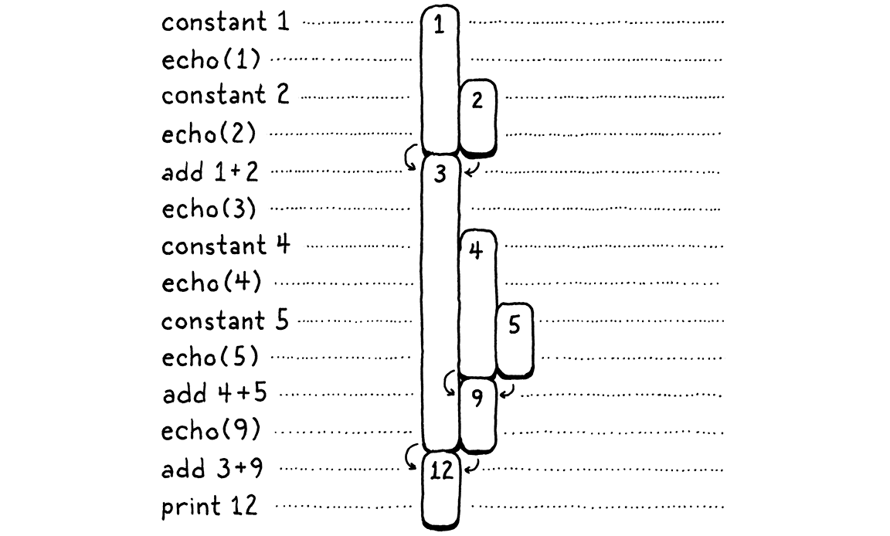

# 虚拟机

> 魔术师保护他们的秘密，不是因为秘密很大很重要，而是因为它们很小很微不足道。舞台上创造的美妙效果往往是一个如此荒谬的秘密的结果，以至于魔术师都不好意思承认它是如何做到的。
> 
> -- Christopher Priest,?*The Prestige*

我们花了很多时间讨论如何将程序表示为字节码指令序列，但这感觉就像只使用填充的、死去的动物来学习生物学。我们知道理论上的指令是什么，但从未见过它们的实际应用，因此很难真正理解它们的*作用*。当对字节码的行为方式没有很好的理解时，很难编写一个输出字节码的编译器。

因此，在开始构建新解释器的前端之前，我们将从后端开始――执行指令的虚拟机。它给了字节码生命。观察这些指令让我们更清楚地了解编译器如何将用户的源代码翻译成一系列指令。

## 15.1 执行指令的机器

虚拟机是解释器内部架构的一部分。将一段代码交给它――实际上是一个块――它会运行它。VM 的代码和数据结构实现在一个新模块中。

```c
#ifndef clox_vm_h
#define clox_vm_h

#include "chunk.h"

typedef struct {
  Chunk* chunk;
} VM;

void initVM();
void freeVM();

#endif
// vm.h, create new file
```

像往常一样，我们从简单开始。VM 将逐渐获得它需要跟踪的一整堆状态，因此现在定义一个结构来填充所有内容。目前，存储的只是它执行的块。

就像对创建的大多数数据结构所做的那样，还定义了创建和销毁 VM 的函数。这是实现：

```c
#include "common.h"
#include "vm.h"

VM vm; 

void initVM() {
}

void freeVM() {
}
// vm.c, create new file
```

好的，将这些函数称为“实现”有点牵强。目前还没有任何有趣的状态可以初始化或销毁，所以函数是空的。相信我，我们会到达那里。

这里稍微有趣一点的是变量`vm`的声明.该模块将来会具有很多函数，将 VM 的指针传递给所有这些函数将是一件苦差事。所以，我们声明了一个单一的全局 VM 对象。无论如何，我们只需要一个，这样可以使书中的代码在页面上更简洁。

> 选择拥有静态 VM 实例是本书的让步，但对于真正的语言实现来说不一定是合理的工程选择。如果您正在构建一个旨在嵌入到其他主机应用程序中的 VM，那么如果您明确采用 VM 指针并四处传递它，它会为主机提供更大的*灵活性*。
> 
> 这样，主机应用程序可以控制何时何地为 VM 分配内存、并行运行多个 VM 等。
> 
> 我在这里做的是一个全局变量，[你听说过的关于全局变量的所有不好](http://gameprogrammingpatterns.com/singleton.html)的事情在大范围编程时仍然是正确的。但是当为了一本书而保持小的东西时...

在开始将有趣的代码注入我们的 VM 之前，让我们继续将它连接到解释器的主入口点。

```c
int main(int argc, const char* argv[]) {
  initVM();

  Chunk chunk;
// main.c, in main()
```

在解释器首次启动时启动虚拟机。然后，当退出时，将其关闭。

```c
  disassembleChunk(&chunk, "test chunk");
  freeVM();
  freeChunk(&chunk);
// main.c, in main()  
```

最后一项是导入头文件vm.h：

```c
#include "debug.h"
#include "vm.h"

int main(int argc, const char* argv[]) {
// main.c
```

现在，当您运行 clox 时，它会在创建[上一章](http://craftinginterpreters.com/chunks-of-bytecode.html#disassembling-chunks)中的手写块之前启动 VM 。VM 已准备就绪并等待，所以让我们教它做一些事情。

### 15.1.1 执行指令

当我们命令 VM 解释一大块字节码时，VM 就会开始行动。

```c
  disassembleChunk(&chunk, "test chunk");
  interpret(&chunk);
  freeVM();
// main.c, in main()
```

此函数是进入 VM 的主要入口点。它是这样声明的：

```c
void freeVM();
InterpretResult interpret(Chunk* chunk);

#endif
// vm.h, add after freeVM()
```

VM 运行该块，然后使用此枚举中的值进行响应：

```c
} VM;

typedef enum {
  INTERPRET_OK,
  INTERPRET_COMPILE_ERROR,
  INTERPRET_RUNTIME_ERROR
} InterpretResult;

void initVM();
void freeVM();
// vm.h, add after struct VM
```

我们还没有使用结果，但是当我们有一个报告静态错误的编译器和一个检测运行时错误的 VM 时，解释器将使用它来知道如何设置进程的退出代码。

我们正在逐步实现代码。

```c
InterpretResult interpret(Chunk* chunk) {
  vm.chunk = chunk;
  vm.ip = vm.chunk->code;
  return run();
}
// vm.c, add after freeVM()
```

首先，将正在执行的块存储在 VM 中。然后我们调用`run()`，一个实际运行字节码指令的内部辅助函数。在这两个部分之间有一条耐人寻味的关联。`ip`有什么用？

当 VM 处理字节码时，它会跟踪它的位置――当前正在执行的指令的位置。我们不为此在`run()`内部使用局部变量，因为最终其他函数将需要访问它。作为替代，我们将其存储为 VM 中的一个字段。

> 如果我们试图从字节码解释器中榨取每一丝的速度，将会把`ip`存储在一个局部变量中。它在执行期间被频繁修改，所以我们希望 C 编译器将它保存在寄存器中。

```c
typedef struct {
  Chunk* chunk;
  uint8_t* ip;
} VM;
// vm.h, in struct VM
```

它的类型是byte指针。使用一个真正的 C 指针指向字节码数组，而不是像整数索引这样的东西，因为引用指针比通过索引在数组中查找元素更快。

“IP”这个名称很传统，而且――与 CS 中的许多传统名称不同――实际上是有道理的：它是一个[指令指针](https://en.wikipedia.org/wiki/Program_counter)。世界上几乎每一个指令集，无论是真实的还是虚拟的，都有一个这样的寄存器或变量。

> x86、x64 和 CLR 称之为“IP”。68k、PowerPC、ARM、p-code 和 JVM 称其为“PC”，表示**程序计数器**。

通过将`ip`指向块中代码的第一个字节来进行初始化。还没有执行那条指令，所以`ip`指向*即将执行*的指令。在 VM 运行的整个过程中都是如此：IP 始终指向下一条指令，而不是当前正在处理的指令。

真正有意思的发生在`run`（）。

```c
static InterpretResult run() {
#define READ_BYTE() (*vm.ip++)

  for (;;) {
    uint8_t instruction;
    switch (instruction = READ_BYTE()) {
      case OP_RETURN: {
        return INTERPRET_OK;
      }
    }
  }

#undef READ_BYTE
}
// vm.c, add after freeVM()
```

到目前为止，这是所有 clox 中最重要的功能。当解释器执行用户的程序时，它会花费大约 90% 的时间在里面`run()`。它是虚拟机跳动的心脏。

> 或者，至少，当它有足够的内容有用时，它*会*在几章中出现。现在，这还算不上软件魔法的奇迹。

尽管有戏剧性的介绍，但它在概念上非常简单。有一个不断运行的外循环。每次通过该循环，都会读取并执行一条字节码指令。

要处理一条指令，首先要弄清楚正在处理的是哪种指令。`READ_BYTE`宏读取`ip`当前指向的字节，然后前进指令指针。任何指令的第一个字节都是操作码。给定一个数字操作码，需要找到实现该指令语义的正确 C 代码。这个过程称为**解码**或**分派**指令。

> 请注意`ip`，在真正开始执行指令之前，一旦我们读取了操作码，它就会前进。因此，再次`ip`指向要使用的*下一个*字节。

每条指令都执行该过程，每次执行一次，因此这是整个虚拟机中性能最关键的部分。编程语言知识充满了高效执行字节码派发的巧妙技术，可以追溯到计算机的早期。

> 如果您想学习其中一些技术，请查找“direct threaded code”、“direct threaded code”和“computed goto”。

但是，最快的解决方案要么需要对 C 的非标准扩展，要么需要手写汇编代码。对于 clox，我们将保持简单。就像我们的反汇编程序一样，有一个巨大的`switch`语句，每个操作码都有一个case。每个case的主体都实现了该操作码的行为。

到目前为止，我们只处理了一条指令，`OP_RETURN`它所做的唯一一件事就是完全退出循环。最终，该指令将用于从当前 Lox 函数返回，但还没有函数，因此将暂时重新调整用途用来结束执行。

让我们继续支持另一条指令。

```c
   switch (instruction = READ_BYTE()) {
      case OP_CONSTANT: {
        Value constant = READ_CONSTANT();
        printValue(constant);
        printf("\n");
        break;
      }
      case OP_RETURN: {
// vm.c, in run()
```

我们还没有足够的机制来用常量做任何有用的事情。现在，只是将其打印出来，这样解释器黑客就可以看到 VM 内部发生了什么。该调用`printf()`需要包含。

```c
#include <stdio.h>

#include "common.h"
// vm.c, add to top of file
```

我们还有一个新的宏要定义。

```c
#define READ_BYTE() (*vm.ip++)
#define READ_CONSTANT() (vm.chunk->constants.values[READ_BYTE()])

  for (;;) {

// vm.c, in run()
```

`READ_CONSTANT()`从字节码中读取下一个字节，将结果数字视为索引，并在块的常量表中查找相应的值。在后面的章节中，我们将添加一些带有引用常量的操作数的指令，因此我们现在设置这个辅助宏。

和前面的`READ_BYTE`宏一样，`READ_CONSTANT`只在`run()`内部使用。为了使该范围更加明确，宏定义本身仅限于该函数。在开始时定义它们，并且――因为我们关心――在最后取消定义它们。

```c
#undef READ_BYTE
#undef READ_CONSTANT
}
// vm.c, in run()
```

> 显式地取消定义这些宏似乎是不必要的挑剔，但 C 倾向于惩罚草率的用户，而 C 预处理器更是如此。

### 15.1.2 执行跟踪

如果你现在运行 clox，它会执行上一章中手工编写的块并输出`1.2`到终端。我们可以看到它正在工作，但这只是因为我们实现的`OP_CONSTANT`是用临时代码来输出值。一旦该指令执行了它应该执行的操作并将该常量与其他想要使用它的操作一起使用，VM 将变成一个黑匣子。这让我们作为 VM 实现者的工作更加艰难。

为了帮助我们自己，现在是向 VM 添加一些诊断日志记录的好时机，就像对块本身所做的那样。事实上，我们甚至会重用相同的代码。不希望一直启用此日志记录――它只是为了我们 VM 黑客，而不是 Lox 用户――所以首先创建一个标志来隐藏它。

```c
#include <stdint.h>

#define DEBUG_TRACE_EXECUTION

#endif
// common.h
```

定义此标志后，VM 会在执行前反汇编并打印每条指令。之前的反汇编器静态地遍历整个块一次，而这个动态地动态反汇编指令。

```c
for (;;) {
#ifdef DEBUG_TRACE_EXECUTION
    disassembleInstruction(vm.chunk,
                           (int)(vm.ip - vm.chunk->code));
#endif

    uint8_t instruction;
// vm.c, in run()  
```

由于`disassembleInstruction()`采用整数字节*偏移量*并且我们将当前指令引用存储为直接指针，因此进行一点指针数学运算以转换`ip`为相对字节码开头的偏移量。然后我们反汇编从该字节开始的指令。

和以往一样，先引入函数的声明，然后调用它。

```c
#include "common.h"
#include "debug.h"
#include "vm.h"
// vm.c
```

我知道这段代码到目前为止还不是特别令人印象深刻――它实际上是一个包裹在`for`循环中的 switch 语句，但不管你信不信，这是VM 的两个主要组件之一。有了这个，我们可以命令式地执行指令。它的简单性是一种美德――它做的工作越少，它就能做得越快。将此与我们在 jlox 中使用访问者模式遍历 AST 的所有复杂性和开销进行对比。

## 15.2 堆栈管理

除了命令式副作用之外，Lox 还具有生成、修改和使用值的表达式。因此，我们编译的字节码需要一种方法来在需要它们的不同指令之间穿梭。例如：

```
print 3 - 2;
```

显然，我们需要常数 3 和 2、`print`语句和减法的指令。但是减法指令怎么知道3是被减数，2是减数呢？print 指令如何知道打印内容？

> 是的，我确实不得不在字典中查找“减数”和“被减数”。但这不是令人愉快的话吗？“被减数”听起来像是一种伊丽莎白时代的舞蹈，而“减数”可能是某种地下旧石器时代的纪念碑。

为了更好地说明这一点，请看这里的这个东西：

```c
fun echo(n) {
  print n;
  return n;
}

print echo(echo(1) + echo(2)) + echo(echo(4) + echo(5));
```

我将每个子表达式包装在对`echo()`打印的调用中并返回其参数。这种副作用意味着我们可以看到确切的操作顺序。

暂时不要担心 VM。只考虑 Lox 本身的语义。算术运算符的操作数显然需要先求值，然后才能执行运算本身。（如果你不知道什么是`a`什么是`b`，就很难计算`a + b`。）另外，当我们在 jlox 中实现表达式时，我们决定必须先计算左操作数，然后再计算右操作数。

> 我们可以不指定评估顺序，让每个实现来决定。这为优化编译器以重新排序算术表达式以提高效率打开了大门，即使在操作数具有明显副作用的情况下也是如此。C 和 Scheme 未指定评估顺序。Java 指定了从左到右的评估，就像我们为 Lox 所做的那样。
> 
> 我认为确定这样的东西通常对用户来说更好。当表达式未按照用户直觉的顺序求值时――可能在不同的实现中以不同的顺序求值！-弄清楚发生了什么可能是一种痛苦的痛苦。

这是该`print`语句的语法树：


给定从左到右的评估以及表达式的嵌套方式，任何正确的 Lox 实现都*必须*按以下顺序打印这些数字：

```c
1  // from echo(1)
2  // from echo(2)
3  // from echo(1 + 2)
4  // from echo(4)
5  // from echo(5)
9  // from echo(4 + 5)
12 // from print 3 + 9
```

之前的 jlox 解释器通过递归遍历 AST 来实现这一点。它进行后序遍历。首先它向下递归左操作数分支，然后是右操作数分支，最后计算节点本身。

在评估左操作数之后，jlox 需要在忙于向下遍历右操作数树时将结果临时存储在某个地方。为此，我们在 Java 中使用局部变量。递归树遍历解释器为每个被评估的节点创建了一个唯一的 Java 调用栈帧，因此可以根据需要拥有尽可能多的局部变量。

在 clox 中，`run()`函数不是递归的――嵌套的表达式树被展平为一系列线性指令。我们没有使用 C 局部变量的豪华享受，那么应该如何以及在哪里存储这些临时值呢？您可能已经猜到了，但我想真正深入研究这一点，因为这是我们认为理所当然的编程的一个方面，但我们很少了解*为什么*计算机是这样设计的。

> 提示：它在本节的名称中，它是 Java 和 C 管理函数递归调用的方式。

让我们做一个奇怪的练习。我们将逐步执行上述程序：


左边是代码的步骤。右边是我们正在跟踪的值。每个条代表一个数字。它在第一次产生值时开始――无论是常数还是加法的结果。条形的长度跟踪先前生成的值何时需要保留，并在该值最终被操作消耗时结束。

当您逐步执行时，您会看到值出现，然后被消耗。寿命最长的是从加法的左侧产生的值。当我们处理右侧的操作数表达式时，那些会留下来。

在上图中，我为每个唯一编号提供了自己的可视列。让我们更节俭一点。一旦一个数字被消耗，我们允许它的列被重新用于另一个以后的值。换句话说，我们把所有这些空白都放在上面并填补它们，从右边推入数字：



这里发生了一些有趣的事情。当我们把所有东西都移过来时，每个数字在其整个生命周期中仍然设法留在一个列中。此外，没有留下任何间隙。换句话说，只要一个数字比另一个数字出现得早，那么它至少会和第二个数字一样长。第一个出现的数字是最后一个被消耗的。啊...后进先出...为什么，那是堆！

> 这也是一个堆栈：


在第二张图中，每次我们引入一个数字时，我们都会将其从右侧压入堆栈。当数字被消耗时，它们总是从最右边到左边弹出。

由于我们需要跟踪的临时值很自然的具有类似堆栈的行为，因此 VM 将使用堆栈来管理它们。当一条指令“产生”一个值时，它会将它压入堆栈。当它需要使用一个或多个值时，它通过将它们从堆栈中弹出来获取它们。

### 15.2.1 虚拟机的堆栈

也许这看起来不像是一个启示，但我*喜欢*基于堆栈的虚拟机。当您第一次看到魔术时，会觉得它真的很神奇。但随后你了解了它是如何工作的――通常是一些机械的噱头或误导――而惊奇感消失了。计算机科学中有一些想法，即使在我将它们分开并了解所有来龙去脉之后，一些最初的火花仍然存在。基于堆栈的虚拟机就是其中之一。

> 堆――[数据结构](https://en.wikipedia.org/wiki/Heap_(data_structure))，而不是[内存管理](https://en.wikipedia.org/wiki/Memory_management#HEAP)――是另一回事。还有 Vaughan Pratt 的自上而下的运算符优先级解析方案，我们将[在适当的时候](http://craftinginterpreters.com/compiling-expressions.html)了解它。

正如您将在本章中看到的，在基于堆栈的 VM 中执行指令非常简单。在后面的章节中，您还会发现将源语言编译为基于堆栈的指令集是小菜一碟。然而，这种架构足够快，可以被生产语言实现使用。这几乎感觉像是在编程语言游戏中作弊。

> 摘掉一点光彩：基于堆栈的解释器不是灵丹妙药。它们通常是*足够的*，但 JVM、CLR 和 JavaScript 的现代实现都使用复杂的[即时编译](https://en.wikipedia.org/wiki/Just-in-time_compilation)管道来动态生成*更快*的本机代码。

好吧，现在是编码时间！这是堆栈：

```c
typedef struct {
  Chunk* chunk;
  uint8_t* ip;
  Value stack[STACK_MAX];
  Value* stackTop;
} VM;
// vm.h, in struct VM
```

我们自己在原始 C 数组之上实现堆栈语义。堆栈的底部――第一个被压入的值和最后一个被弹出的值――位于数组中的元素 0 处，随后压入的值紧随其后。如果我们按顺序将“crepe”（我最喜欢的可堆叠早餐食品）的字母压入堆栈，生成的 C 数组如下所示：


由于堆栈随着值的压入和弹出而增长和收缩，因此我们需要跟踪堆栈顶部在数组中的位置。与`ip` 一样，使用直接指针而不是整数索引，因为取消引用指针比每次我们需要时从索引计算偏移量更快。

指针指向刚好*超过*包含堆栈顶部值的元素的数组元素。这看起来有点奇怪，但几乎每个实现都这样做。这意味着我们可以通过指向数组中的元素零来指示堆栈为空。


如果我们指向顶部元素，那么对于一个空堆栈，我们需要指向元素 -1。这在 C 中是未定义的。当我们将值压入堆栈时...

> 聪明的读者，当堆栈已满时怎么办？C标准比你领先一步。允许并明确规定有一个指向数组末尾的数组指针。


...`stackTop`总是指向刚刚过去的最后一项。


我记得是这样的：`stackTop`指向下一个要push的值的位置。可以在堆栈中存储的值的最大数量（至少现在）是：

```c
#include "chunk.h"

#define STACK_MAX 256

typedef struct {
// vm.h
```

为VM 提供固定的堆栈大小意味着某些指令序列可能会压入过多的值并耗尽堆栈空间――经典的“堆栈溢出”。可以根据需要动态地增加堆栈，但现在将保持简单。由于 VM 使用 Value，需要包含它的声明。

```c
#include "chunk.h"
#include "value.h"

#define STACK_MAX 256
// vm.h
```

现在 VM 有一些有趣的状态，我们开始初始化它。

```c
void initVM() {
  resetStack();
}
// vm.c, in initVM()
```

使用这个辅助函数：

```c
static void resetStack() {
  vm.stackTop = vm.stack;
}
// vm.c, add after variable vm
```

由于堆栈数组是在 VM 结构中直接内联声明的，**因此不需要分配它**。甚至不需要清除数组中未使用的单元格――在值存储在其中之前我们不会访问它们。我们唯一需要的初始化是设置`stackTop`指向数组的开头以指示堆栈为空。

堆栈协议支持两种操作：

```c
InterpretResult interpret(Chunk* chunk);
void push(Value value);
Value pop();

#endif
// vm.h, add after interpret()
```

您可以将新值压入栈顶，然后弹出最近压入的值。这是第一个功能：

```c
void push(Value value) {
  *vm.stackTop = value;
  vm.stackTop++;
}
// vm.c, add after freeVM()
```

如果您对 C 指针语法和操作感到生疏，这是一个很好的热身。第一行存储`value`在栈顶的数组元素中。请记住，`stackTop`指向刚刚*过去*的最后一个使用的元素，指向下一个可用的元素。这会将值存储在该插槽中。然后我们增加指针本身以指向数组中下一个未使用的槽，因为前一个槽已被占用。

弹出是值。

```c
Value pop() {
  vm.stackTop--;
  return *vm.stackTop;
}
// vm.c, add after push()
```

首先，我们将堆栈指针*移回*数组中最近使用的槽位。然后我们查找该索引处的值并将其返回。我们不需要明确地将它从数组中“移除”――向下移动`stackTop`就足以将该槽标记为不再使用。

### 15.2.2 堆栈跟踪

现在有一个工作堆栈，但很难*看出*它在工作。当开始实现更复杂的指令并编译和运行更大的代码段时，我们最终会在该数组中塞入大量值。如果我们对堆栈有一定的了解，这将使我们作为 VM 黑客的生活变得更轻松。

为此，每当跟踪执行时，我们还会在解释每条指令之前显示堆栈的当前内容。

```c
#ifdef DEBUG_TRACE_EXECUTION
    printf("          ");
    for (Value* slot = vm.stack; slot < vm.stackTop; slot++) {
      printf("[ ");
      printValue(*slot);
      printf(" ]");
    }
    printf("\n");
    disassembleInstruction(vm.chunk,
// vm.c, in run()
```

我们循环打印数组中的每个值，从第一个（堆栈底部）开始，到顶部结束。这让我们可以观察每条指令对堆栈的影响。输出非常冗长，但当我们通过外科手术从解释器的内部提取一个讨厌的错误时，它很有用。

堆栈在手，让我们重新审视我们的两条指令。第一：

```c
 case OP_CONSTANT: {
        Value constant = READ_CONSTANT();
        push(constant);
        break;
// vm.c, in run(), replace 2 lines
```

在上一章中，我对`OP_CONSTANT`指令如何“加载”一个常量一窍不通。现在我们有了一个堆栈，您知道实际产生一个值意味着什么：它被压入堆栈。

```c
 case OP_RETURN: {
        printValue(pop());
        printf("\n");
        return INTERPRET_OK;
// vm.c, in run()
```

然后我们`OP_RETURN`弹出堆栈并在退出前打印顶部值。当我们向 clox 添加对实函数的支持时，我们将更改此代码。但是，就目前而言，它为我们提供了一种让 VM 执行简单指令序列并显示结果的方法。

## 15.3 算术计算器

我们 VM 的核心和灵魂现在就位。字节码循环分派和执行指令。**堆栈随着值流过它而增长和收缩**。这两部分工作，但很难感觉到它们与我们目前仅有的两条基本指令的相互作用有多巧妙。所以让我们教解释器做算术。

我们将从最简单的算术运算开始，一元取反。

```c
var a = 1.2;
print -a; // -1.2.
```

前缀`-`运算符接受一个操作数，即要求反的值。它产生一个结果。现在还没法使用解析器，所以要添加上述语法将编译成的字节码指令。

```c
  OP_CONSTANT,
  OP_NEGATE,
  OP_RETURN,
// chunk.h, in enum OpCode
```

我们像这样执行它：

```c
      }
      case OP_NEGATE:   push(-pop()); break;
      case OP_RETURN: {
// vm.c, in run()
```

该指令需要一个值来操作，它从堆栈中弹。对这个值取反，然后将结果放回以供以后使用。没有比这更容易的了。我们也可以反汇编它。

```c
    case OP_CONSTANT:
      return constantInstruction("OP_CONSTANT", chunk, offset);
    case OP_NEGATE:
      return simpleInstruction("OP_NEGATE", offset);
    case OP_RETURN:
// debug.c, in disassembleInstruction()
```

可以在测试块中尝试一下。

```c
  writeChunk(&chunk, constant, 123);
  writeChunk(&chunk, OP_NEGATE, 123);

  writeChunk(&chunk, OP_RETURN, 123);
// main.c, in main() 
```

在加载常量之后，但在返回之前，执行取反指令。这用它的取反后的值替换了堆栈上的常量。然后返回指令打印出来：

```
-1.2
```

我噻！好神奇。

### 15.3.1 二元运算符

好吧，一元运算符并没有*那么*令人印象深刻。我们在堆栈上仍然只有一个值。要真正看到一些深层次的东西，需要二元运算符。Lox 有四个二进制算术运算符：加法、减法、乘法和除法。我们将继续实现它们。

> Lox 还有其他一些二元运算符――比较和相等――但它们不会产生数字，所以我们还没有为它们做好准备。

```c
  OP_CONSTANT,
  OP_ADD,
  OP_SUBTRACT,
  OP_MULTIPLY,
  OP_DIVIDE,
  OP_NEGATE,
// chunk.h, in enum OpCode  
```

回到字节码循环，它们是这样执行的：

```c
      }
      case OP_ADD:      BINARY_OP(+); break;
      case OP_SUBTRACT: BINARY_OP(-); break;
      case OP_MULTIPLY: BINARY_OP(*); break;
      case OP_DIVIDE:   BINARY_OP(/); break;
      case OP_NEGATE:   push(-pop()); break;
// vm.c, in run()
```

这四个指令之间的唯一区别是它们最终使用哪个底层 C 运算符来组合两个操作数。核心算术表达式周围是一些样板代码，用于从堆栈中提取值并推送结果。当稍后添加动态类型时，该样板文件将会增长。为了避免重复该代码四次，将其封装在一个宏中。

```c
#define READ_CONSTANT() (vm.chunk->constants.values[READ_BYTE()])
#define BINARY_OP(op) \
    do { \
      double b = pop(); \
      double a = pop(); \
      push(a op b); \
    } while (false)

  for (;;) {
// vm.c, in run()
```

我承认这是对 C 预处理器的一种相当冒险的使用。我犹豫是否要这样做，但在后面的章节中，当我们需要为每个操作数和其他东西添加类型检查时，你会很高兴的。引导您四次完成相同的代码将是一件苦差事。

> 您是否知道可以将*运算符*作为参数传递给宏？你现在可以了。预处理器不关心运算符不是 C 中元素。就它而言，它只是文本标记。
> 
> 我知道，你可以*感受到*滥用它的诱惑，不是吗？

如果您还不熟悉这个技巧，那么外层`do while`循环可能看起来很奇怪。这个宏需要展开成一系列语句。宏的作者要小心，我们要确保这些语句在扩展宏时都在相同的范围内结束。想象一下，如果您定义：

```c
#define WAKE_UP() makeCoffee(); drinkCoffee();
```

然后像这样使用它：

```c
if (morning) WAKE_UP();
```

目的是仅当`morning`为真时才执行宏主体的两个语句。但它扩展到：

```c
if (morning) makeCoffee(); drinkCoffee();;
```

呀。`if`仅附加到第一个*语句*。您可能认为可以使用块来解决此问题。

```c
#define WAKE_UP() { makeCoffee(); drinkCoffee(); }
```

那更好，但你仍然有风险：

```c
if (morning)
  WAKE_UP();
else
  sleepIn();
```

现在你会在`else`得到一个编译错误，因为在宏块之后`;`。在宏中使用`do while`循环看起来很有趣，但它为您**提供了一种在块内包含多个语句的方法**，而且该块*还*允许在末尾使用分号。

我们刚刚说到哪了？是的，所以该宏的主体所做的事情很简单。二元运算符有两个操作数，所以它弹出两次。它对这两个值执行操作，然后push结果。

密切注意两个 pop 操作 的*顺序*。请注意，将第一个弹出的操作数分配给`b`，而不是`a`。它向后看。当计算操作数本身时，首先评估左侧，然后评估右侧。这意味着左操作数被push到右操作数之前。所以右操作数会在栈顶。因此，我们弹出的第一个值是`b`。

例如，如果我们编译`3 - 1`，指令之间的数据流如下所示：


正如对内部的其他宏所做的那样`run()`，在函数结束时清理。

```c
#undef READ_CONSTANT
#undef BINARY_OP
}
// vm.c, in run()
```

最后是反汇编支持

```c
    case OP_CONSTANT:
      return constantInstruction("OP_CONSTANT", chunk, offset);
    case OP_ADD:
      return simpleInstruction("OP_ADD", offset);
    case OP_SUBTRACT:
      return simpleInstruction("OP_SUBTRACT", offset);
    case OP_MULTIPLY:
      return simpleInstruction("OP_MULTIPLY", offset);
    case OP_DIVIDE:
      return simpleInstruction("OP_DIVIDE", offset);
    case OP_NEGATE:
// debug.c, in disassembleInstruction()
```

算术指令格式很简单，如`OP_RETURN`.即使算术运算*符*采用操作数――在堆栈中找到――算术*字节码指令*也没有。

让我们通过评估一个更大的表达式来完成一些新指令：


在现有的示例块的基础上，这里是我们需要手动将该 AST 编译为字节码的附加指令。

```c
  int constant = addConstant(&chunk, 1.2);
  writeChunk(&chunk, OP_CONSTANT, 123);
  writeChunk(&chunk, constant, 123);

  constant = addConstant(&chunk, 3.4);
  writeChunk(&chunk, OP_CONSTANT, 123);
  writeChunk(&chunk, constant, 123);

  writeChunk(&chunk, OP_ADD, 123);

  constant = addConstant(&chunk, 5.6);
  writeChunk(&chunk, OP_CONSTANT, 123);
  writeChunk(&chunk, constant, 123);

  writeChunk(&chunk, OP_DIVIDE, 123);
  writeChunk(&chunk, OP_NEGATE, 123);

  writeChunk(&chunk, OP_RETURN, 123);
// main.c, in main() 
```

加法操作在前。左侧常量 1.2 的指令已经存在，因此添加另一个指令3.4。然后 把两个使用`OP_ADD`计算加法，将其push堆栈中。这是除法的左侧。接下来我们push 5.6，并将加法结果除以它。最后，我们对结果取反。

请注意`OP_ADD` 的输出是如何隐式成为`OP_DIVIDE`操作数的，而没有任何一条指令直接相互耦合。这就是堆栈的魔力。它让我们可以自由地编写指令，而不需要任何复杂性或对数据流的了解。堆栈就像一个共享的工作区，他们都可以从中读取和写入。

在这个微小的示例块中，堆栈仍然只有两个值的高度，但是当开始将 Lox 源代码编译为字节码时，将拥有使用更多堆栈的块。同时，尝试使用这个手工编写的块来计算不同的嵌套算术表达式，并查看值如何流经指令和堆栈。

你现在也可以把它从你的系统中取出来。这是我们将手动构建的最后一个块。当我们下次重新访问字节码时，我们将编写一个编译器来为我们生成它。

---

## [挑战](http://craftinginterpreters.com/a-virtual-machine.html#challenges)

1. 您将为以下表达式生成什么字节码指令序列：
   
   ```c
   1 * 2 + 3
   1 + 2 * 3
   3 - 2 - 1
   1 + 2 * 3 - 4 / -5
   ```
   
   （请记住，Lox 没有负数文字的语法，因此`-5`它对数字 5 取反。）

2. 如果我们真的想要一个最小的指令集，我们可以消除`OP_NEGATE`或`OP_SUBTRACT`。显示您将为以下内容生成的字节码指令序列：
   
   ```c
   4 - 3 * -2
   ```
   
   首先，不使用`OP_NEGATE`.然后，不使用`OP_SUBTRACT`.
   
   鉴于上述情况，您认为同时拥有这两条指令是否有意义？为什么或者为什么不？您是否会考虑包括任何其他冗余指令？

3. 我们的 VM 堆栈有固定大小，我们不检查压入一个值是否溢出它。这意味着错误的指令系列可能会导致我们的解释器崩溃或进入未定义的行为。通过根据需要动态增长堆栈来避免这种情况。
   
   这样做的成本和收益是什么？

4. 为了解释`OP_NEGATE`，我们pop操作数，取反，然后push结果。这是一个简单的实现，但它会不必要地递增和递减`stackTop`，因为堆栈最终达到相同的高度。简单地取反堆栈中的值并保持`stackTop`原样可能会更快。尝试一下，看看是否可以衡量性能差异。
   
   还有其他说明可以进行类似的优化吗？

## [设计说明：基于寄存器的字节码](http://craftinginterpreters.com/a-virtual-machine.html#design-note)

对于本书的其余部分，我们将围绕基于堆栈的字节码指令集精心实现一个解释器。还有另一个字节码架构家族――*基于寄存器的*.尽管名称如此，但这些字节码指令并不像x64等实际芯片中的寄存器那样难以使用。对于真正的硬件寄存器，您通常只有少数几个用于整个程序，因此您需要花费大量精力[来尝试有效地使用它们并在其中穿梭进出](https://en.wikipedia.org/wiki/Register_allocation)。

基于寄存器的字节码更接近SPARC 芯片支持的[*寄存器窗口。*](https://en.wikipedia.org/wiki/Register_window)

在基于寄存器的 VM 中，您仍然有一个堆栈。临时值仍然会被推送到它上面，并在不再需要时弹出。主要区别在于指令可以从堆栈中的任何位置读取它们的输入，并且可以将它们的输出存储到特定的堆栈槽中。

拿这个小 Lox 脚本来说：

```c
var a = 1;
var b = 2;
var c = a + b;
```

在我们基于堆栈的 VM 中，最后一条语句将被编译为如下内容：

```c
load <a>  // Read local variable a and push onto stack.
load <b>  // Read local variable b and push onto stack.
add       // Pop two values, add, push result.
store <c> // Pop value and store in local variable c.
```

[（如果您还没有完全理解加载和存储指令，请不要担心。我们将在实现变量时](http://craftinginterpreters.com/global-variables.html)更详细地介绍它们。）我们有四个独立的指令。这意味着通过字节码解释循环四次，解码和分派四个指令。它至少有七个字节的代码――四个用于操作码，另外三个用于标识要加载和存储哪些局部变量的操作数。三push三pop。很多工作！

在基于寄存器的指令集中，指令可以直接读取和存储局部变量。上面最后一条语句的字节码如下所示：

```c
add <a> <b> <c> // Read values from a and b, add, store in c.
```

add 指令更大――它有三个指令操作数，它们定义了它在堆栈中读取输入并将结果写入的位置。但由于局部变量存在于堆栈中，它可以直接读取`a`，`b`然后将结果直接存储到`c`.

只有一条指令用于解码和分派，整个指令只占四个字节。由于额外的操作数，解码更加复杂，但它仍然是一个净赢。没有push和pop或其他堆栈操作。

Lua 的主要实现曾经是基于堆栈的。对于Lua 5.0，实现者切换到寄存器指令集并注意到速度有所提高。自然，改进的数量在很大程度上取决于语言语义、特定指令集和编译器复杂性的细节，但这应该引起您的注意。

Lua 开发团队――Roberto Ierusalimschy、Waldemar Celes 和 Luiz Henrique de Figueiredo――就此写了一篇*精彩*的论文，这是我一直以来最喜欢的计算机科学论文之一，“[Lua 5.0 的实现](https://www.lua.org/doc/jucs05.pdf)”

这就提出了一个明显的问题，即为什么我要用本书的其余部分来编写基于堆栈的字节码。寄存器 VM 很简洁，但要为其编写编译器要困难得多。对于可能是您的第一个编译器，我想坚持使用易于生成和执行的指令集。基于堆栈的字节码非常简单。

它在文学和社区中也*更*为人所知。即使您最终可能会转向更高级的东西，但与您的其他语言黑客同行分享这是一个很好的共同点。