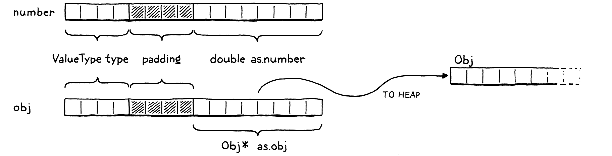

# 字符串

> “啊？对体力劳动的一点厌恶？”医生挑了挑眉毛。“可以理解，但用错了地方。人们应该珍惜那些让身体忙碌但让思想和心灵不受束缚的单调乏味的工作。”
> 
> -- 泰德・威廉姆斯，*龙骨之椅*

我们的小 VM 现在可以表示三种类型的值：数字、布尔值和`nil`. 这些类型有两个重要的共同点：它们是不可变的并且它们很小。数字是最大的，它们仍然适合两个 64 位字。这是一个足够小的代价，我们可以为所有值支付它，甚至不需要那么多空间的布尔值和零值。

不幸的是，字符串不是那么娇小。字符串没有最大长度。即使我们人为地将它限制在某些人为的限制（如255 个字符），这仍然需要太多的内存，无法对每个值上都这样。

> UCSD Pascal 是 Pascal 的第一个实现之一，有这个确切的限制。Pascal 字符串以长度值开始，而不是像 C 那样使用终止空字节来指示字符串的结尾。由于 UCSD 仅使用一个字节来存储长度，因此字符串的长度不能超过 255 个字符。


我们需要一种方法来支持大小变化很大的值类型。这正是堆上动态分配的目的。可以根据需要分配尽可能多的字节，返回一个指针，用于在值流经 VM 时跟踪该值。

## 19.1  值类型和对象类型

将堆用于较大的可变大小的值，将栈用于较小的原子值会导致两级表示。对 Lox 来说，  每个存储在变量中或从表达式返回的都将是一个Value。对于像数字这样的小型固定大小类型，有效负载直接存储在 Value 结构本身中。

如果对象较大，则其数据位于堆中。然后 Value 的有效负载是*指向*该内存块的指针。我们最终将在 clox 中拥有一些堆分配的类型：字符串、实例、函数。每种类型都有自己独特的数据，但也有它们共享的状态，[我们未来的垃圾收集器](http://craftinginterpreters.com/garbage-collection.html)将使用该状态来管理它们的内存。



我们将这种通用表示称为“Obj”。状态存在于堆上的每个 Lox 值都是一个 Obj。因此，我们可以使用一个新的 ValueType  case来引用所有堆分配的类型。

> “Obj”是“object”的缩写，natch。

```c
  VAL_NUMBER,
  VAL_OBJ
} ValueType;
// value.h, in enum ValueType
```

当 Value 的类型为`VAL_OBJ`时，有效负载是指向堆内存的指针，因此我们为此向联合添加另一个 case

```c
    double number;
    Obj* obj;
  } as; 
// value.h, in struct Value
```

正如我们对其他值类型所做的那样，我们制作了几个有用的宏来处理 Obj 值。

```c
#define IS_NUMBER(value)  ((value).type == VAL_NUMBER)
#define IS_OBJ(value)     ((value).type == VAL_OBJ)

#define AS_BOOL(value)    ((value).as.boolean)
// value.h, add after struct Value
```

如果给定的值是 Obj那么评估结果是`true`。如果是这样，我们可以使用这个：

```c
#define IS_OBJ(value)     ((value).type == VAL_OBJ)

#define AS_OBJ(value)     ((value).as.obj)
#define AS_BOOL(value)    ((value).as.boolean)
// value.h
```

它从值中提取 Obj 指针。我们也可以走另一条路。

```c
#define NUMBER_VAL(value) ((Value){VAL_NUMBER, {.number = value}})
#define OBJ_VAL(object)   ((Value){VAL_OBJ, {.obj = (Obj*)object}})

typedef struct {
// value.h
```

这需要一个裸 Obj 指针并将其包装在一个完整的值中。

## 19.2 基于结构的继承

每个堆分配的值都是一个 Obj，但 Obj并不完全相同。对于字符串，我们需要字符数组。而类的实例，将需要数据字段。一个函数对象需要它的字节码块。如何处理不同的有效载荷和大小？我们不能像我们为 Value 所做的那样使用另一个联合，因为大小到处都是。

> 不，我也不知道“objs”怎么发音。感觉某处应该有一个元音。

相反，我们将使用另一种技术。它已经存在了很长时间，以至于 C 规范为它制定了特定的支持，但我不知道它有一个规范的名称。[*这是类型双关语*](https://en.wikipedia.org/wiki/Type_punning)的一个例子，但这个术语太宽泛了。在没有任何更好的想法的情况下，我将其称为**struct inheritance**，因为它依赖于 structs 并且大致遵循状态的单一继承在面向对象语言中的工作方式。

与tagged union一样，每个 Obj 都以一个tag字段开始，该tag字段标识它是什么类型的对象――字符串、实例等。接下来是有效负载字段。与统一的union不同，每种类型都是它自己的独立结构。棘手的部分是如何统一对待这些结构，因为 C 没有继承或多态性的概念。我很快就会解释，但首先让我们先了解一下初步的内容。

名称“Obj”本身指的是一个包含所有对象类型共享的状态的结构。它有点像对象的“基类”。由于值和对象之间存在一些循环依赖，我们在“value”模块中前向声明它。

```c
#include "common.h"

typedef struct Obj Obj;

typedef enum {
// value.h
```

实际定义在一个新模块中。

```c
#ifndef clox_object_h
#define clox_object_h

#include "common.h"
#include "value.h"

struct Obj {
  ObjType type;
};

#endif
// object.h, create new file
```

现在，它只包含类型标签type。很快，我们将为内存管理添加一些其他信息。类型枚举是这样的：

```c
#include "value.h"

typedef enum {
  OBJ_STRING,
} ObjType;

struct Obj {
// object.h
```

显然，在我们添加更多堆分配类型后，这在后面的章节中会更有用。由于我们将经常访问这些标签类型，因此有必要制作一个小宏来从给定的值中提取对象类型标签。

```c
#include "value.h"

#define OBJ_TYPE(value)        (AS_OBJ(value)->type)

typedef enum {
// object.h
```

那是我们的基础。

现在，让我们在它之上构建字符串。字符串的有效负载在单独的结构中定义。同样，我们需要前向声明(forward-declare)它。

```c
typedef struct Obj Obj;
typedef struct ObjString ObjString;

typedef enum {
// value.h
```

该定义与 Obj 并存。

```c
};

struct ObjString {
  Obj obj;
  int length;
  char* chars;
};

#endif
// object.h, add after struct Obj
```

字符串对象包含一个字符数组。它们存储在一个单独的堆分配数组中，因此我们只为每个字符串留出所需的空间。我们还将字节数存储在数组中。这不是绝对必要的，但让我们知道为字符串分配了多少内存，而无需遍历字符数组来查找空终止符。

因为ObjString是一个Obj，所以它也需要所有Objs共享的状态。它通过将第一个字段设为 Obj 来实现这一点。**C 指定结构字段按照声明的顺序排列在内存中**。此外，当嵌套结构时，内部结构的字段会在适当的位置展开。所以 Obj 和 ObjString 的内存看起来像这样：


请注意 ObjString 的第一个字节如何与 Obj 完全对齐。这不是巧合――C要求它。这是为了实现一种巧妙的模式：您可以获取一个指向结构的指针，并将其安全地转换为指向其第一个字段的指针，然后返回。

> 规范的关键部分是：
> 
> § 6.7.2.1 13
> 
> 在结构对象中，非位域成员和位域所在的单元的地址按照它们声明的顺序递增。指向结构对象的指针经过适当转换后指向其初始成员（或者如果该成员是位域，则指向它所在的单元），反之亦然。结构对象中可能有未命名的填充，但不是在它的开头。

给定一个`ObjString*`，您可以安全地将它转换为`Obj*`然后从中访问`type`字段。在 OOP 的“is”的意义上 ,每个 ObjString “is”一个 Obj 。当我们稍后添加其他对象类型时，每个结构将有一个 Obj 作为其第一个字段。任何想要处理所有对象的代码都可以将它们视为基本`Obj*`，并忽略可能碰巧跟随的任何其他字段。

你也可以往另一个方向走。给一个`Obj*`，您可以将它“向下转换”为一个`ObjString*`.当然，需要确保拥有的`Obj*`指针确实指向实际 ObjString 的`obj`字段。否则，您将不安全地重新解释随机的内存位。为了检测这样的转换是否安全，我们添加了另一个宏。

```c
#define OBJ_TYPE(value)        (AS_OBJ(value)->type)

#define IS_STRING(value)       isObjType(value, OBJ_STRING)

typedef enum {
// object.h
```

它需要一个值，而不是原始`Obj*`值，因为 VM 中的大多数代码都使用值。它依赖于这个内联函数：

```c
};

static inline bool isObjType(Value value, ObjType type) {
  return IS_OBJ(value) && AS_OBJ(value)->type == type;
}

#endif
// object.h, add after struct ObjString
```

突击测验：为什么不直接将此函数的主体放在宏中呢？与其他相比，这个有什么不同？对，是因为函数体使用`value`了两次。通过在参数名称出现在主体中的每个地方插入参数*表达式*来扩展宏。如果宏多次使用一个参数，则该表达式会被计算多次。

如果表达式有副作用，那就太糟糕了。如果我们将 `isObjType()`放入宏定义中,而且做了以下操作，比如说，

```c
IS_STRING(POP())
```

然后它会从堆栈中pop两个值！使用一个函数可以解决这个问题。

只要我们确保在创建某种类型的 Obj 时正确设置类型标签，该宏就会告诉我们何时可以安全地将值转换为特定对象类型。我们可以使用这些来做到这一点：

```c
#define IS_STRING(value)       isObjType(value, OBJ_STRING)

#define AS_STRING(value)       ((ObjString*)AS_OBJ(value))
#define AS_CSTRING(value)      (((ObjString*)AS_OBJ(value))->chars)

typedef enum {
// object.h
```

这两个宏采用一个值，该值应包含指向堆上有效 ObjString 的指针。第一个返回`ObjString*`指针。第二个通过它返回字符数组本身，因为这通常是我们最终需要的。

## 19.3 字符串

好的，我们的 VM 现在可以表示字符串值了。是时候给语言本身添加字符串了。像往常一样，我们从前端开始。词法分析器已经标记了字符串文字，所以轮到解析器了。

```c
  [TOKEN_IDENTIFIER]    = {NULL,     NULL,   PREC_NONE},
  [TOKEN_STRING]        = {string,   NULL,   PREC_NONE},
  [TOKEN_NUMBER]        = {number,   NULL,   PREC_NONE},
// compiler.c, replace 1 line
```

当解析器遇到字符串token时，它会调用此解析函数：

```c
static void string() {
  emitConstant(OBJ_VAL(copyString(parser.previous.start + 1,
                                  parser.previous.length - 2)));
}
// compiler.c, add after number()
```

这直接从词素中获取字符串的字符。`+ 1`和`- 2`部分修剪前引号和尾随引号。然后它创建一个字符串对象，将其包装在一个值中，并将其填充到常量表中。

> 如果 Lox 支持像`\n`这样的字符串转义序列，我们会在此处进行翻译。既然没有，我们可以照原样使用字符。

要创建字符串，我们使用`copyString()`，它在 中声明`object.h`。

```c
};

ObjString* copyString(const char* chars, int length);

static inline bool isObjType(Value value, ObjType type) {
// object.h, add after struct ObjString
```

编译器模块需要包含它。

```c
#define clox_compiler_h

#include "object.h"
#include "vm.h"
// compiler.h
```

我们的“object”模块获得了一个实现文件，我们在其中定义了新函数。

```c
#include <stdio.h>
#include <string.h>

#include "memory.h"
#include "object.h"
#include "value.h"
#include "vm.h"

ObjString* copyString(const char* chars, int length) {
  char* heapChars = ALLOCATE(char, length + 1);
  memcpy(heapChars, chars, length);
  heapChars[length] = '\0';
  return allocateString(heapChars, length);
}
// object.c, create new file
```

首先，我们在堆上分配一个新数组，刚好足够容纳字符串的字符和结尾的终止符，使用这个低级宏分配一个具有给定元素类型和大小的数组：

```c
#include "common.h"

#define ALLOCATE(type, count) \
    (type*)reallocate(NULL, 0, sizeof(type) * (count))

#define GROW_CAPACITY(capacity) \
// memory.h
```

一旦我们有了数组，我们就从词素中复制字符并终止它。

> 我们需要自己终止字符串，因为词素指向整体源字符串中的一系列字符并且没有终止。
> 
> 由于 ObjString 显式存储长度，我们*可以*让字符数组保持未终止状态，但在末尾添加一个终止符只会花费我们一个字节，并让我们将字符数组传递给需要终止字符串的 C 标准库函数。

您可能想知道为什么 ObjString 不能直接指向源字符串中的原始字符。作为连接等字符串操作的结果，一些 ObjString 将在运行时动态创建。这些字符串显然需要为字符动态分配内存，这意味着字符串要在不再需要时*释放该内存。*

如果我们有一个字符串文字的 ObjString，并试图释放它指向原始源代码字符串的字符数组，就会发生不好的事情。因此，对于文字，我们先发制人地将字符复制到堆中。这样，每个 ObjString 都可靠地拥有它的字符数组并可以释放它。

创建字符串对象的真正工作发生在这个函数中：

```c
#include "vm.h"

static ObjString* allocateString(char* chars, int length) {
  ObjString* string = ALLOCATE_OBJ(ObjString, OBJ_STRING);
  string->length = length;
  string->chars = chars;
  return string;
}
// object.c
```

它在堆上创建一个新的 ObjString，然后初始化它的字段。它有点像 OOP 语言中的构造函数。因此，它首先使用新宏调用“基类”构造函数来初始化 Obj 状态。

```c
#include "vm.h"

#define ALLOCATE_OBJ(type, objectType) \
    (type*)allocateObject(sizeof(type), objectType)

static ObjString* allocateString(char* chars, int length) {
// object.c
```

与前面的宏一样，它的存在主要是为了避免冗余地转换`void*`回所需的类型。实际功能在这里：

> 我承认这一章有大量的辅助函数和宏需要阅读。我尽量保持代码的良好分解，但这会导致微小函数的分散。当我们稍后重用它们时，它们会得到回报。

```c
#define ALLOCATE_OBJ(type, objectType) \
    (type*)allocateObject(sizeof(type), objectType)

static Obj* allocateObject(size_t size, ObjType type) {
  Obj* object = (Obj*)reallocate(NULL, 0, size);
  object->type = type;
  return object;
}

static ObjString* allocateString(char* chars, int length) {
// object.c
```

它在堆上分配给定大小的对象。请注意，大小*不仅仅是*Obj 本身的大小。调用者传入字节数，以便为正在创建的特定对象类型所需的额外有效负载字段留出空间。

然后它初始化 Obj 状态――现在，这只是type 标签。此函数返回到`allocateString()`，完成 ObjString 字段的初始化。*瞧*，我们可以编译和执行字符串文字。


> 不要将“voilà”与“viola”混淆。一个意思是“就在那里”，另一个是弦乐器，介于小提琴和大提琴之间。是的，我确实花了两个小时画了一把中提琴，只是为了提一下。

## 19.4 字符串操作

我们漂亮的字符串就在那里，但它们还没有做很多事情。一个好的第一步是让现有的打印代码不会拒绝新的值类型。

```c
    case VAL_NUMBER: printf("%g", AS_NUMBER(value)); break;
    case VAL_OBJ: printObject(value); break;
  }
// value.c, in printValue()
```

如果该值是一个堆分配的对象，它会延迟调用“对象”模块中的辅助函数。

```c
ObjString* copyString(const char* chars, int length);
void printObject(Value value);

static inline bool isObjType(Value value, ObjType type) {
// object.h, add after copyString()
```

实现看起来像这样：

```c
void printObject(Value value) {
  switch (OBJ_TYPE(value)) {
    case OBJ_STRING:
      printf("%s", AS_CSTRING(value));
      break;
  }
}
// object.c, add after copyString()
```

我们现在只有一个对象类型，但是这个函数会在后面的章节中产生额外的 switch case。对于字符串对象，它只是将字符数组打印为 C 字符串。

> 我告诉过你终止字符串会派上用场。

相等运算符还需要优雅地处理字符串。考虑：

```c
"string" == "string"
```

这是两个独立的字符串文字。编译器将对`copyString()`进行两次独立的调用，创建两个不同的 ObjString 对象并将它们作为两个常量存储在块中。它们是堆中的不同对象。但是用户（因此我们）希望字符串具有相等的值。上述表达式的计算结果应为`true`.这需要一些特殊的支持。

```c
    case VAL_NUMBER: return AS_NUMBER(a) == AS_NUMBER(b);
    case VAL_OBJ: {
      ObjString* aString = AS_STRING(a);
      ObjString* bString = AS_STRING(b);
      return aString->length == bString->length &&
          memcmp(aString->chars, bString->chars,
                 aString->length) == 0;
    }
    default:         return false; // Unreachable.
// value.c, in valuesEqual()
```

如果这两个值都是字符串，那么如果它们的字符数组包含相同的字符，则它们相等，无论它们是两个单独的对象还是完全相同的对象。这确实意味着字符串相等性比其他类型的相等性慢，因为它必须遍历整个字符串。我们稍后会对其进行[修改，](http://craftinginterpreters.com/hash-tables.html)但这暂时为我们提供了正确的语义。

最后，为了使用`memcmp()`和“object”模块中的新内容，我们需要包含一些头文件。这里：

```c
#include <stdio.h>
#include <string.h>

#include "memory.h"
// value.c
```

和这里：

```c
#include <string.h>

#include "object.h"
#include "memory.h"
// value.c
```

### 19.4.1 字符串连接

成熟的语言提供了许多处理字符串的操作――访问单个字符、字符串的长度、改变大小写、拆分、连接、搜索等。当你实现你的语言时，你可能需要所有这些。但是对于本书，我们将内容保持*得非常*精简。

我们支持的唯一有趣的字符串操作是`+`.如果您在两个字符串对象上使用该运算符，它会生成一个新字符串，该字符串是两个操作数的连接。由于 Lox 是动态类型的，我们无法在编译时判断需要哪种行为，因为直到运行时我们才知道操作数的类型。因此，该`OP_ADD`指令动态检查操作数并选择正确的操作。

```c
      case OP_LESS:     BINARY_OP(BOOL_VAL, <); break;
      case OP_ADD: {
        if (IS_STRING(peek(0)) && IS_STRING(peek(1))) {
          concatenate();
        } else if (IS_NUMBER(peek(0)) && IS_NUMBER(peek(1))) {
          double b = AS_NUMBER(pop());
          double a = AS_NUMBER(pop());
          push(NUMBER_VAL(a + b));
        } else {
          runtimeError(
              "Operands must be two numbers or two strings.");
          return INTERPRET_RUNTIME_ERROR;
        }
        break;
      }
      case OP_SUBTRACT: BINARY_OP(NUMBER_VAL, -); break;
// vm.c, in run(), replace 1 line
```

如果两个操作数都是字符串，它会连接起来。如果它们都是数字，则将它们相加。操作数类型的任何其他组合都是运行时错误。

> 这比大多数语言更保守。在其他语言中，如果一个操作数是字符串，则另一个可以是任何类型，并且在连接两者之前将隐式转换为字符串。
> 
> 我认为这是一个很好的特性，但需要为每种类型编写乏味的“转换为字符串”代码，所以我将它从 Lox 中删除了。

为了连接字符串，我们定义了一个新函数。

```c
static void concatenate() {
  ObjString* b = AS_STRING(pop());
  ObjString* a = AS_STRING(pop());

  int length = a->length + b->length;
  char* chars = ALLOCATE(char, length + 1);
  memcpy(chars, a->chars, a->length);
  memcpy(chars + a->length, b->chars, b->length);
  chars[length] = '\0';

  ObjString* result = takeString(chars, length);
  push(OBJ_VAL(result));
}
// vm.c, add after isFalsey()
```

它非常冗长，因为处理字符串的 C 代码往往如此。首先，我们根据操作数的长度计算结果字符串的长度。我们为结果分配一个字符数组，然后将两半复制进去。一如既往，我们仔细确保字符串终止。

为了调用`memcpy()`，VM 需要包含一个头文件。

```c
#include <stdio.h>
#include <string.h>

#include "common.h"
// vm.c
```

最后，我们生成一个 ObjString 来包含这些字符。这次我们使用一个新函数，`takeString()`.

```c
};

ObjString* takeString(char* chars, int length);
ObjString* copyString(const char* chars, int length);
// object.h, add after struct ObjString
```

实现看起来像这样：

```c
ObjString* takeString(char* chars, int length) {
  return allocateString(chars, length);
}
// object.c, add after allocateString()
```

前面的`copyString()`函数假定它*不能*取得您传入的字符的所有权。相反，它保守地在 ObjString 可以拥有的堆上创建字符的副本。对于传入字符位于源字符串中间的字符串文字来说，这是正确的做法。

但是，对于字符串连接，已经在堆上动态分配了一个字符数组。制作另一个副本将是多余的（并且意味着`concatenate()`必须记住释放其副本）。相反，此函数声明对您提供的字符串的所有权。

像往常一样，将此功能拼接在一起需要包含几个头文件。

```c
#include "debug.h"
#include "object.h"
#include "memory.h"
#include "vm.h"
// vm.c
```

## 19.5 释放对象

看看这个看似无伤大雅的表达式：

```c
"st" + "ri" + "ng"
```

当编译器仔细检查这个时，它为这三个字符串文字中的每一个分配一个 ObjString 并将它们存储在块的常量表中并生成这个字节码：

> 这是每条指令后堆栈的样子：


```
0000    OP_CONSTANT         0 "st"
0002    OP_CONSTANT         1 "ri"
0004    OP_ADD
0005    OP_CONSTANT         2 "ng"
0007    OP_ADD
0008    OP_RETURN
```

前两条指令将`"st"`和`"ri"`压入堆栈。然后`OP_ADD`弹出那些并将它们连接起来。这会在堆上动态分配一个新`"stri"`字符串。VM push它，然后push`"ng"`常量。最后`OP_ADD`弹出`"stri"`和`"ng"`，将它们连接起来，并push结果：`"string"`。太好了，这就是我们所期望的。

可是等等。那个`"stri"`字符串是怎么回事？我们动态分配它，然后 VM 在将它与 `"ng"` 连接后丢弃它。我们将它从堆栈中弹出，不再有对它的引用，但从未释放它的内存。我们遇到了典型的内存泄漏。

当然，*Lox 程序*完全可以忘记中间字符串而不用担心释放它们。Lox 代表用户自动管理内存。管理内存的责任不会*消失*。相反，它落在我们作为 VM 实现者的肩上。

完整的解决方案是在程序运行时回收未使用的内存的[垃圾收集器。](http://craftinginterpreters.com/garbage-collection.html)在我们准备好处理那个项目之前，还有一些其他的东西要到位。在那之前，我们的生活是借来的。我们等待添加收集器的时间越长，就越难做到。

> 我已经看到很多人在尝试开始 GC 之前实现了大量他们的语言。对于您通常在开发语言时运行的那种玩具程序，您实际上不会在程序结束之前用完内存，所以这会让您走得更远。
> 
> 但这低估了以后添加垃圾收集器的难度。*收集器*必须确保它可以找到仍在使用的每一位内存，*这样*它就不会收集实时数据。语言实现可以在数百个地方存储对某个对象的引用。如果你没有找到所有这些，你就会遇到噩梦般的错误。
> 
> 我已经看到语言实现死掉了，因为以后很难让 GC 进入。如果你的语言需要 GC，请尽快让它工作。这是一个涉及整个代码库的横切关注点。

今天，我们至少应该做最低限度的事情：通过确保 VM 仍然可以找到每个分配的对象来避免内存*泄漏*，即使 Lox 程序本身不再引用它们。高级内存管理器使用许多复杂的技术来为对象分配和跟踪内存。我们将采用最简单实用的方法。

我们将创建一个链表来存储每个 Obj。VM 可以遍历该列表以找到已在堆上分配的每个对象，无论用户的程序或 VM 的堆栈是否仍具有对它的引用。

我们可以定义一个单独的链表节点结构，但我们也必须分配它们。相反，我们将使用**侵入式列表**――Obj结构本身将是链表节点。每个 Obj 都有一个指向链中下一个 Obj 的指针。

```c
struct Obj {
  ObjType type;
  struct Obj* next;
};
// object.h, in struct Obj
```

VM 存储指向列表头部的指针。

```c
  Value* stackTop;
  Obj* objects;
} VM;
// vm.h, in struct VM
```

当我们第一次初始化 VM 时，没有分配的对象。

```c
  resetStack();
  vm.objects = NULL;
}
// vm.c, in initVM()  
```

每次我们分配一个 Obj 时，我们将它插入到列表中。

```c
  object->type = type;

  object->next = vm.objects;
  vm.objects = object;
  return object;
// object.c, in allocateObject()
```

因为这是一个单向链表，所以最容易插入的地方就是表头。这样，我们就不需要存储指向尾部的指针并保持更新。

“object”模块直接使用`vm`“vm”模块中的全局变量，因此我们需要将其暴露在外部。

```c
} InterpretResult;

extern VM vm;

void initVM();
// vm.h, add after enum InterpretResult
```

最终，垃圾收集器将在 VM 仍在运行时释放内存。但是，即便如此，当用户的程序完成时，通常仍有一些未使用的对象仍在内存中徘徊。虚拟机也应该释放它们。

没有复杂的逻辑。程序完成后，我们可以释放*每个*对象。我们现在可以而且应该实现它。

```c
void freeVM() {
  freeObjects();
}
// vm.c, in freeVM()
```

我们在finally 做某事[时](http://craftinginterpreters.com/a-virtual-machine.html#an-instruction-execution-machine)定义的那个空函数！它称之为：

```c
void* reallocate(void* pointer, size_t oldSize, size_t newSize);
void freeObjects();

#endif
// memory.h, add after reallocate()
```

下面是我们如何释放对象：

```c
void freeObjects() {
  Obj* object = vm.objects;
  while (object != NULL) {
    Obj* next = object->next;
    freeObject(object);
    object = next;
  }
}
// memory.c, add after reallocate()
```

这是遍历链表并释放其节点的 CS 101 教科书实现。对于每个节点，我们调用：

```c
static void freeObject(Obj* object) {
  switch (object->type) {
    case OBJ_STRING: {
      ObjString* string = (ObjString*)object;
      FREE_ARRAY(char, string->chars, string->length + 1);
      FREE(ObjString, object);
      break;
    }
  }
}
// memory.c, add after reallocate()
```

我们不仅要释放 Obj 本身。由于某些对象类型还分配了它们拥有的其他内存，因此我们还需要一些特定于类型的代码来处理每个对象类型的特殊需求。在这里，这意味着我们释放字符数组，然后释放 ObjString。那些都使用最后一个内存管理宏。

```c
     (type*)reallocate(NULL, 0, sizeof(type) * (count))

#define FREE(type, pointer) reallocate(pointer, sizeof(type), 0)

#define GROW_CAPACITY(capacity) \
// memory.h
```

它是对`reallocate()`简单包装，只是将分配的内容“调整大小”到零字节。

> 使用`reallocate()`释放内存似乎毫无意义。为什么不直接调用`free()`？稍后，这将帮助 VM 跟踪仍在使用的内存量。如果所有的分配和释放都通过了`reallocate()`，就很容易对分配内存的字节数进行动态计数。

像往常一样，我们需要一个包含将所有内容连接在一起。

```c
#include "common.h"
#include "object.h"

#define ALLOCATE(type, count) \
// memory.h
```

然后在实现文件中：

```c
#include "memory.h"
#include "vm.h"

void* reallocate(void* pointer, size_t oldSize, size_t newSize) {
// memory.c
```

这样，我们的 VM 就不会再泄漏内存了。就像一个好的 C 程序一样，它在退出之前清理它的混乱。但它不会在 VM 运行时释放任何对象。稍后，当可以编写运行时间更长的 Lox 程序时，VM 将在运行过程中消耗越来越多的内存，直到整个程序完成才放弃一个字节。

[在我们添加一个真正的垃圾收集器](http://craftinginterpreters.com/garbage-collection.html)之前我们不会解决这个问题，但这是一大步。我们现在拥有支持各种不同类型的动态分配对象的基础设施。我们用它来将字符串添加到 clox，这是大多数编程语言中最常用的类型之一。字符串反过来使我们能够构建另一种基本数据类型，尤其是在动态语言中：古老的[哈希表](http://craftinginterpreters.com/hash-tables.html)。但那是下一章的事了...

---

## [挑战](http://craftinginterpreters.com/strings.html#challenges)

1. 每个字符串都需要两个单独的动态分配――一个用于 ObjString，另一个用于字符数组。从一个值访问字符需要两个指针间接寻址，这可能对性能不利。更有效的解决方案依赖于一种称为[灵活数组成员](https://en.wikipedia.org/wiki/Flexible_array_member)的技术。使用它将 ObjString 及其字符数组存储在单个连续分配中。

2. 当我们为每个字符串文字创建 ObjString 时，我们将字符复制到堆上。这样，当稍后释放字符串时，我们知道释放字符也是安全的。
   
   这是一种更简单的方法，但会浪费一些内存，这在非常受限的设备上可能是个问题。相反，我们可以跟踪哪些 ObjStrings 拥有它们的字符数组，哪些是“常量字符串”，它们只是指向原始源字符串或其他一些不可释放的位置。添加对此的支持。

3. 如果 Lox 是您的语言，当用户尝试使用`+`一个字符串操作数而另一个使用其他类型时，您会让它做什么？证明你的选择。其他语言有什么作用？

## [设计说明：字符串编码](http://craftinginterpreters.com/strings.html#design-note)

在本书中，我尽量不回避您在实际语言实现中会遇到的棘手问题。我们可能并不总是使用最*复杂的*解决方案――毕竟这是一本介绍性的书――但我认为假装问题根本不存在是不诚实的。然而，我确实避开了一个非常棘手的难题：决定如何表示字符串。

字符串编码有两个方面：

- **什么是字符串中的单个“字符”**  有多少种不同的值，它们代表什么？第一个被广泛采用的标准答案是[ASCII](https://en.wikipedia.org/wiki/ASCII)。它给了你 127 个不同的字符值并指定了它们是什么。很棒...如果你只关心英语。虽然它有一些奇怪的、几乎被遗忘的字符，如“记录分隔符”和“同步空闲”，但它没有一个变音符、锐音符或重音符。它不能代表“jalape?o”、“na?ve”、“Gruyère”或“M?tley Crüe”。
  
  不用说，一种不允许人们讨论 Gruyère 或 M?tley Crüe 的语言是一种不值得使用的语言。
  
  接下来是[Unicode](https://en.wikipedia.org/wiki/Unicode)。最初，它支持 16,384 个不同的字符（**code points**），这些字符非常适合 16 位，还有一些备用位。后来它越来越大，现在有超过 100,000 个不同的代码点，包括人类交流的重要工具，如（Unicode 字符“PILE OF POO”，`U+1F4A9`）。
  
  即使是那么长的代码点列表也不足以表示一种语言可能支持的每个可能的可见字形。为了解决这个问题，Unicode 还具有?修改前面代码点的**组合字符。**例如，“a”后跟组合字符“¨”就是“?”。（为了让事情更混乱，Unicode*还有*一个看起来像“?”的单一代码点。）
  
  如果用户访问“na?ve”中的第四个“字符”，他们期望返回“v”还是“¨”？前者意味着他们将每个代码点及其组合字符视为一个单元――Unicode称之为?**扩展字素簇**――后者意味着他们正在考虑单独的代码点。您的用户期望哪个？

- **单个单元在内存中如何表示？**大多数使用 ASCII 的系统为每个字符分配一个字节，并保留高位未使用。Unicode 有一些常见的编码。UTF-16 将大多数代码点打包成 16 位。当每个代码点都适合该大小时，这很棒。当它溢出时，他们添加了使用多个 16 位代码单元来表示单个代码点的*代理对。*UTF-32 是 UTF-16 的下一步发展――它为每个代码点提供了完整的 32 位。
  
  UTF-8 比其中任何一个都复杂。它使用可变数量的字节来编码代码点。较低值的代码点适合较少的字节。由于每个字符可能占用不同的字节数，因此您不能直接索引字符串来查找特定的代码点。如果你想要，比方说，第 10 个代码点，你不知道在没有遍历和解码所有前面的字符串的情况下，字符串中有多少字节。

选择字符表示和编码涉及基本的权衡。就像工程中的许多事情一样，没有完美的解决方案：

这个问题有多难的一个例子来自 Python。从 Python 2 到 3 的漫长过渡令人痛苦，主要是因为它围绕字符串编码进行了更改。

- ASCII 内存效率高且速度快，但它会将非拉丁语言排在一边。

- UTF-32 速度很快并且支持整个 Unicode 范围，但会浪费大量内存，因为大多数代码点往往位于较低的值范围内，不需要完整的 32 位。

- UTF-8 内存效率高，支持整个 Unicode 范围，但其可变长度编码使其访问任意代码点的速度变慢。

- UTF-16 比所有这些都糟糕――这是 Unicode 超出其早期 16 位范围的丑陋结果。它的内存效率低于 UTF-8，但由于代理对，它仍然是一种可变长度编码。如果可以，请避免使用它。las，如果您的语言需要在浏览器、JVM 或 CLR 上运行或与浏览器、JVM 或 CLR 互操作，您可能会坚持使用它，因为它们的字符串都使用 UTF-16，并且您不想必须转换每个将字符串传递给底层系统的时间。

一种选择是采取最大限度的方法并做“最正确”的事情。支持所有 Unicode 代码点。在内部，根据每个字符串的内容为每个字符串选择一种编码――如果每个代码点都适合一个字节，则使用 ASCII，如果没有代理对，则使用 UTF-16，等等。提供 API 让用户迭代代码点和扩展字形簇.

这涵盖了您的所有基础，但确实很复杂。实施、调试和优化的工作量很大。在序列化字符串或与其他系统互操作时，您必须处理所有编码。用户需要了解这两个索引 API 并知道何时使用哪个。这是更新的大型语言倾向于采用的方法――比如 Raku 和 Swift。

一个更简单的折衷方案是始终使用 UTF-8 进行编码，并且只公开适用于代码点的 API。对于想要使用字素簇的用户，让他们为此使用第三方库。这不像 ASCII 那样以拉丁语为中心，但也没有复杂得多。你失去了按代码点快速直接索引，但你通常可以没有它或者负担得起让它*O(n)*而不是*O(1)*。

如果我要为编写大型应用程序的人设计一种大型主力语言，我可能会采用最大方法。对于我的小型嵌入式脚本语言[Wren](http://wren.io/)，我使用了 UTF-8 和代码点。