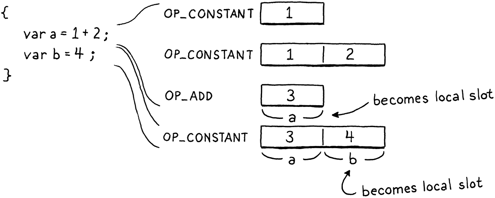

# 局部变量

> 当想像力化为  
> 未知事物的形式时，诗人的笔  
> 将它们变成形状，并赋予空气中的任何东西  
> 一个当地的住所和一个名字。
> 
> -- William Shakespeare,*A Midsummer Night’s Dream*

[上一章](http://craftinginterpreters.com/global-variables.html)介绍了 clox 的变量，但仅限于全局变量。在本章中，我们将对其进行扩展以支持块、块作用域和局部变量。在 jlox 中，我们设法将所有这些和全局变量打包到一个章节中。对于 clox，这是两章的工作，部分原因是，坦率地说，在 C 中一切都需要更多的努力。

> 这里可能有一些愚蠢的“全球思考，本地行动”笑话，但我正在努力寻找它。

但一个更重要的原因是我们处理局部变量的方法将与实现全局变量的方法大不相同。全局变量在 Lox 中是后期绑定的。在这种情况下，“后期”意味着“在编译时间后解析”。这有利于保持编译器简单，但不利于性能。局部变量是语言中最常用的部分之一。如果局部变量很慢，那么*一切*都很慢。所以我们想要一个尽可能高效的局部变量策略。

> 函数参数也被大量使用。它们也像局部变量一样工作，因此我们将对它们使用相同的实现技术。

幸运的是，词法作用域可以帮助我们。顾名思义，词法作用域意味着我们可以通过查看程序文本来解析局部变量――局部变量*不是*后期绑定的。我们在编译器中所做的任何处理工作都是在运行时*不必*做的工作，因此我们对局部变量的实现将严重依赖于编译器。

## 22.1 表示局部变量

在现代黑客攻击一种编程语言的好处是可以从其他语言的悠久血统中学习。那么C和Java是如何管理它们的局部变量的呢？为什么，当然是在栈上！它们通常使用芯片和操作系统支持的本机堆栈机制。这来说有点太低级了，但在 clox 的虚拟世界中，我们有自己的栈可以使用。

现在，我们只用它来保存**临时数据**――在计算表达式时需要记住的零时数据块。只要不妨碍它们，也可以将局部变量填充到栈中。这对性能很有帮助。为新本地变量分配空间只需要递增`stackTop`指针，而释放同样是递减。从已知堆栈槽访问变量是数组索引查找。

不过，我们确实需要小心。VM 期望栈的行为就像一个栈。我们必须接受仅在栈顶部分配新局部变量，并且必须接受只有当栈上没有任何局部变量时才能丢弃局部变量。此外，需要确保临时对象不会干扰。

方便的是，Lox 的设计与这些限制相协调。新的局部变量总是由声明语句创建。语句不嵌套在表达式中，因此当语句开始执行时，栈上永远不会有任何临时对象。块是严格嵌套的。当一个块结束时，它总是带走最里面的、最近声明的局部变量。由于这些也是最后进入范围的局部变量，因此它们应该位于我们需要它们的堆栈顶部。

> 这种对齐显然不是巧合。我将 Lox 设计为可以单程编译为基于栈的字节码。但是我不必对语言进行太多调整以适应这些限制。它的大部分设计应该感觉很自然。
> 
> 这在很大程度上是因为语言的历史与单程遍编译以及――在较小程度上――基于栈的架构密切相关。Lox 的块作用域遵循可以追溯到 BCPL 的传统。作为程序员，即使在今天，我们对一种语言中什么是“正常”的直觉仍然受到过去硬件限制的影响。

逐步执行此示例程序并观察局部变量如何进入和离开作用域：


看看它们如何完美地适合栈？栈似乎可以在运行时用于存储局部变量。但可以走得更远。我们不仅知道*它们*将在栈中，而且我们甚至可以精确地确定*它们*将在栈中的位置。由于编译器在任何时间点都确切地知道哪些局部变量在作用域内，因此它可以在编译期间有效地模拟栈并记录每个变量在栈中的位置。

我们将通过使用这些栈偏移量作为读取和存储局部变量的字节码指令的操作数来利用这一点。这使得与本地变量的合作变得非常快――就像索引数组一样简单。

> 在本章中，局部变量从 VM 栈数组的底部开始，并从那里开始索引。当我们添加[功能](http://craftinginterpreters.com/calls-and-functions.html)时，该方案会变得有点复杂。每个函数都需要自己的栈区域来存储其参数和局部变量。但是，正如将看到的，这并没有像您预期的那样增加复杂性。

我们需要在编译器中跟踪很多状态才能使整个过程顺利进行，所以让我们从那里开始吧。在 jlox 中，我们使用“环境”HashMap 的链表来跟踪当前在范围内的局部变量。这是代表词法范围的经典教科书方式。对于 clox，像往常一样，我们更接近机器。所有的状态都生活在一个新的结构中。

```c
} ParseRule;

typedef struct {
  Local locals[UINT8_COUNT];
  int localCount;
  int scopeDepth;
} Compiler;

Parser parser;
// compiler.c, add after struct ParseRule
```

我们有一个简单的扁平数组，其中包含编译过程中每个点范围内的所有局部变量。它们按照它们的声明在代码中出现的顺序排列在数组中。由于将用于对本地变量进行编码的指令操作数是单个字节，因此 VM 对一次可以在范围内的本地变量数量有一个硬性限制。这意味着也可以给 locals 数组一个固定的大小。

> 我们正在编写一个单程编译器，所以我们没有*太多*其他选项来决定如何在数组中对它们进// 行排序。

```c
#define DEBUG_TRACE_EXECUTION

#define UINT8_COUNT (UINT8_MAX + 1)

#endif
// common.h
```

回到 Compiler 结构，该`localCount`字段跟踪作用域内有多少局部变量――其中有多少数组槽正在使用中。我们还跟踪“作用域深度”。这是我们正在编译的当前代码位周围的blocks数量。

我们的 Java 解释器使用Map链将每个块的变量与其他块的变量分开。这一次，我们将简单地用它们出现的嵌套级别对变量进行编号。零是全局范围，一是第一个顶级块，二是往里面，你明白了。使用它来跟踪每个局部变量属于哪个块，以便知道在一个块结束时要丢弃哪些局部变量。

数组中的每个本地变量都是以下之一：

```c
} ParseRule;

typedef struct {
  Token name;
  int depth;
} Local;

typedef struct {
// compiler.c, add after struct ParseRule
```

我们存储变量的名称。当解析标识符时，将标识符的词素与每个本地变量名称进行比较以找到匹配项。如果不知道变量的名称，就很难解析它。该`depth`字段记录了声明局部变量的块的作用域深度。这就是现在需要的所有状态。

这与我们在 jlox 中的表示非常不同，但它仍然可以让我们回答编译器需要询问词法环境的所有相同问题。下一步是弄清楚编译器是如何*进入*这个状态的。如果我们是有原则的工程师，会给前端的每个函数一个参数，该参数接受指向编译器的指针。我们会在开始时创建一个 Compiler 并仔细地传给其贯穿每个函数调用...  但这将意味着对已经编写的代码进行大量无聊的更改，因此这里使用一个全局变量：

> 特别是，如果我们想在多线程应用程序中使用我们的编译器，可能有多个并行运行的编译器，那么使用全局变量不是一个*好*主意。

```c
Parser parser;
Compiler* current = NULL;
Chunk* compilingChunk;
// compiler.c, add after variable parser
```

这是一个初始化编译器的小函数：

```c
static void initCompiler(Compiler* compiler) {
  compiler->localCount = 0;
  compiler->scopeDepth = 0;
  current = compiler;
}
// compiler.c, add after emitConstant()
```

当我们第一次启动虚拟机时，我们调用它来让一切都进入干净状态。

```c
  initScanner(source);
  Compiler compiler;
  initCompiler(&compiler);
  compilingChunk = chunk;
// compiler.c, in compile()
```

我们的编译器有它需要的数据，但没有对该数据的操作。无法创建和销毁作用域，或者添加和解析变量。我们会根据需要添加它们。首先，让我们开始构建一些语言功能。

## 22.2 块语句

在可以拥有任何局部变量之前，我们需要一些局部作用域。这些来自两件事：函数体和块。[函数是我们将在后面的章节](http://craftinginterpreters.com/calls-and-functions.html)中处理的一大块工作，所以现在只处理块。像往常一样，从语法开始。我们将介绍的新语法是：

```c
statement      → exprStmt
               | printStmt
               | block ;

block          → "{" declaration* "}" ;
```

仔细想想，“块”是一个奇怪的名字。作为比喻，“块”通常表示一个不可分割的小单元，但出于某种原因，Algol 60 委员会决定用它来指代*复合*结构――一系列语句。我想情况可能更糟。Algol 58 称`begin`和`end`为 “语句括号”。


块是一种statement，因此它们的规则适用于`statement`产生式。编译一个的相应代码如下所示：

```c
  if (match(TOKEN_PRINT)) {
    printStatement();
  } else if (match(TOKEN_LEFT_BRACE)) {
    beginScope();
    block();
    endScope();
  } else {
// compiler.c, in statement()
```

解析初始花括号后，我们使用这个辅助函数来编译块的其余部分：

> 这个函数稍后会在编译函数体时派上用场。

```c
static void block() {
  while (!check(TOKEN_RIGHT_BRACE) && !check(TOKEN_EOF)) {
    declaration();
  }

  consume(TOKEN_RIGHT_BRACE, "Expect '}' after block.");
}
// compiler.c, add after expression()
```

它会一直解析声明和语句，直到遇到右大括号。正如我们在解析器中处理任何循环一样，我们也检查token流的结尾。这样，如果存在缺少结尾 的}程序，编译器就不会陷入循环。

执行一个块只是意味着一个接一个地执行它包含的语句，因此编译它们并不需要太多。块所做的语义上有趣的事情是创建作用域。在编译一个块的主体之前，我们调用这个函数来进入一个新的本地作用域：

```c
static void beginScope() {
  current->scopeDepth++;
}
// compiler.c, add after endCompiler()
```

为了“创建”作用域，我们所做的就是增加当前scopeDepth。这肯定比jlox快多了，jlox为每一个都分配了一个全新的HashMap。鉴于`beginScope()`，您可能可以猜出`endScope()`是什么。

```c
static void endScope() {
  current->scopeDepth--;
}
// compiler.c, add after beginScope()
```

这就是块和作用域――或多或少――所以我们准备好将一些变量填充到它们中。

## 22.3 声明局部变量

通常我们先需要开始解析，但编译器已经支持解析和编译变量声明。现在有`var`语句、标识符表达式和赋值。只是编译器假定所有变量都是全局变量。所以不需要任何新的解析支持，只需要将新的作用域语义连接到现有代码。


变量声明解析开始于`varDeclaration()`并依赖于其他几个函数。首先，`parseVariable()`消费变量名的标识符token，将其词素作为字符串添加到块的常量表中，然后返回添加它的常量表索引。然后，在`varDeclaration()`编译初始化程序后，它调用`defineVariable()`发出字节码以将变量的值存储在全局变量哈希表中。

这两个辅组函数都需要进行一些更改以支持局部变量。在`parseVariable()`中，我们添加：

```c
  consume(TOKEN_IDENTIFIER, errorMessage);

  declareVariable();
  if (current->scopeDepth > 0) return 0;

  return identifierConstant(&parser.previous);
// compiler.c, in parseVariable()
```

首先，我们“declare”变量。我们马上就会明白这意味着什么。之后，如果我们在本地作用域内，将退出该函数。在运行时，不会按名称查找本地变量。不需要将变量的名称填充到常量表中，因此如果声明在局部范围内，我们将返回一个虚拟表索引。

在 `defineVariable()`中，如果我们在局部作用域内，需要发出代码来存储局部变量。它看起来像这样：

```c
static void defineVariable(uint8_t global) {
  if (current->scopeDepth > 0) {
    return;
  }

  emitBytes(OP_DEFINE_GLOBAL, global);
// compiler.c, in defineVariable()
```

等等，这样吗？是的。就是这样。没有在运行时创建局部变量的代码。想想 VM 处于什么状态。它已经执行了变量初始化器的代码（如果用户省略了初始化器，则隐式执行`nil`），并且该值作为唯一剩余的临时值位于堆栈顶部。我们还知道，新的局部变量被分配在栈顶... 就在那个值已经存在的地方。因此，没有什么可做的。临时变量只是*成为*局部变量。没有比这更有效率的了。



> 左边的代码编译成右边的指令序列。

好的，那什么是“declaring”呢？这是它的作用：

```c
static void declareVariable() {
  if (current->scopeDepth == 0) return;

  Token* name = &parser.previous;
  addLocal(*name);
}
// compiler.c, add after identifierConstant()
```

这是编译器记录变量存在的地方。我们只为本地变量做这件事，所以如果在顶级全局作用域内，就退出。因为全局变量是后期绑定的，所以编译器不会跟踪它看到了哪些声明。

但是对于局部变量，编译器确实需要记住变量的存在。这就是声明它所做的――它将添加到当前作用域内的编译器变量列表中。我们使用另一个新函数来实现它。

```c
static void addLocal(Token name) {
  Local* local = & current->locals->locals[current->localCount++];
  local->name = name;
  local->depth = current->scopeDepth;
}
//compiler.c, add after identifierConstant()
```

这将初始化编译器变量数组中的下一个可用 Local。它存储变量的名称和拥有该变量的作用域的深度。

> 担心变量名称字符串的生命周期？Local 直接存储标识符的 Token 结构的副本。token存储指向其词素的第一个字符和词素长度的指针。该指针指向正在编译的脚本或 REPL 条目的原始源字符串。
> 
> 只要该字符串在整个编译过程中都存在――这是必须的，因为我们正在编译它――那么所有指向它的token都没有问题。

我们的实现对于正确的 Lox 程序来说没问题，但是无效代码呢？我们的目标是健壮。要处理的第一个错误实际上并不是用户的错，而更多是 VM 的限制。使用局部变量的指令通过槽索引引用它们。该索引存储在一个单字节操作数中，这意味着 VM 一次最多只支持范围内的 256 个局部变量。

如果我们试图解决这个问题，不仅不能在运行时引用它们，而且编译器也会覆盖它自己的 locals 数组。让我们阻止它。

```c
static void addLocal(Token name) {
  if (current->localCount == UINT8_COUNT) {
    error("Too many local variables in function.");
    return;
  }

  Local* local = & current->locals[current->localCount++];
// compiler.c, in addLocal()
```

下一个案例比较棘手。考虑：

```js
{
  var a = "first";
  var a = "second";
}
```

在顶层，Lox 允许重新声明一个与先前声明同名的变量，因为这对 REPL 很有用。但在本地作用域内，这是一件很奇怪的事情。这很可能是一个错误，许多语言，包括我们自己的 Lox，将其作为一个错误抛出。

> 有趣的是，Rust 编程语言*确实*允许这样做，并且惯用代码依赖于它。

请注意，上面的程序与这个程序不同：

```js
{
  var a = "outer";
  {
    var a = "inner";
  }
}
```

*在不同*的作用域内有两个同名的变量是可以的，即使作用域重叠使得两个变量同时可见。那是变量遮蔽，而 Lox 确实允许这样做。*在同一个*局部范围内有两个同名变量只是一个错误。

我们像这样检测到该错误：

```c
  Token* name = &parser.previous;
  for (int i = current->localCount - 1; i >= 0; i--) {
    Local* local = & current->locals[i];
    if (local->depth != -1 && local->depth < current->scopeDepth) {
      break; 
    }

    if (identifiersEqual(name, &local->name)) {
      error("Already a variable with this name in this scope.");
    }
  }

  addLocal(*name);
}
// compiler.c, in declareVariable()
```

> 不要担心那个奇怪的`depth != -1`部分。我们稍后会谈到那是什么。

局部变量在声明时追加到数组，这意味着当前作用域总是在数组的末尾。当我们声明一个新变量时，从末尾开始并向后工作，寻找同名的现有变量。如果在当前作用域内又找到一个，我们将报告错误。否则，如果我们到达数组的开头或另一个作用域拥有的变量，那么就知道已经检查了作用域中的所有现有变量。

要查看两个标识符是否相同，我们使用：

```c
static bool identifiersEqual(Token* a, Token* b) {
  if (a->length != b->length) return false;
  return memcmp(a->start, b->start, a->length) == 0;
}
// compiler.c, add after identifierConstant()
```

因为我们知道两个词位的长度，所以我们首先检查它。对于许多不相等的字符串，这将很快失败。如果长度相同，我们使用检查字符`memcmp()`。要到达`memcmp()`，我们需要一个包含。

> 如果我们可以检查它们的哈希值，那将是一个不错的小优化，但是token不是完整的 LoxStrings，所以我们还没有计算它们的哈希值。

```c
#include <stdlib.h>
#include <string.h>

#include "common.h"
// compiler.c
```

有了这个，我们就可以产生变量。但是，就像幽灵一样，它们会在声明的作用域之外徘徊。当一个块结束时，我们需要让它们休息。

```c
  current->scopeDepth--;

  while (current->localCount > 0 &&
         current->locals[current->localCount - 1].depth >
            current->scopeDepth) {
    emitByte(OP_POP);
    current->localCount--;
  }
}
// compiler.c, in endScope()
```

当我们弹出一个作用域时，我们向后遍历局部数组，寻找在刚刚离开的作用域深度声明的任何变量。我们通过简单地减少数组的长度来丢弃它们。

这也有一个运行时组件。局部变量占用栈上的槽位。当一个局部变量超出作用域时，那个槽就不再需要了，应该被释放。因此，对于我们丢弃的每个变量，我们还发出一条`OP_POP`指令将其从栈中pop。

> 当多个局部变量同时超出范围时，您会得到一系列`OP_POP`指令，一次解释一个指令。您可以添加到 Lox 实现中的一个简单优化是一条专门的`OP_POPN`指令，该指令采用一个操作数来表示要弹出的槽的数量，并一次将它们全部弹出。

## 22.4 使用局部变量

我们现在可以编译和执行局部变量声明。在运行时，它们的值位于它们应该在栈中的位置。让我们开始使用它们。将同时进行变量访问和赋值，因为它们涉及编译器中的相同函数。

我们已经有了获取和设置全局变量的代码，而且――就像优秀的小软件工程师一样――我们希望尽可能多地重用现有代码。是这样的：

```c
static void namedVariable(Token name, bool canAssign) {
  uint8_t getOp, setOp;
  int arg = resolveLocal(current, &name);
  if (arg != -1) {
    getOp = OP_GET_LOCAL;
    setOp = OP_SET_LOCAL;
  } else {
    arg = identifierConstant(&name);
    getOp = OP_GET_GLOBAL;
    setOp = OP_SET_GLOBAL;
  }

  if (canAssign && match(TOKEN_EQUAL)) {
// compiler.c, in namedVariable(), replace 1 line
```

我们没有对为变量访问和赋值发出的字节码指令进行硬编码，而是使用了几个 C 变量。首先，我们尝试找到一个具有给定名称的局部变量。如果我们找到了，我们会使用与本地变量对应的指令。否则，我们假设它是一个全局变量并使用现有的全局字节码指令。

再往下一点，使用这些变量来发出正确的指令。对于作业：

```c
  if (canAssign && match(TOKEN_EQUAL)) {
    expression();
    emitBytes(setOp, (uint8_t)arg);
  } else {
// compiler.c, in namedVariable(), replace 1 line
```

和访问：

```c
    emitBytes(setOp, (uint8_t)arg);
  } else {
    emitBytes(getOp, (uint8_t)arg);
  }
// compiler.c, in namedVariable(), replace 1 line
```

本章的真正核心，解析局部变量的部分，在这里：

```c
static int resolveLocal(Compiler* compiler, Token* name) {
  for (int i = compiler->localCount - 1; i >= 0; i--) {
    Local* local = &compiler->locals[i];
    if (identifiersEqual(name, &local->name)) {
      return i;
    }
  }

  return -1;
}
// compiler.c, add after identifiersEqual()
```

尽管如此，这很简单。我们遍历当前作用域内的本地变量列表。如果与标识符token同名，则标识符必须引用该变量。我们找到了！我们向后遍历数组，以便找到*最后*声明的具有标识符的变量。这确保了内部局部变量正确地隐藏了周围作用域中同名的局部变量。

在运行时，我们使用堆栈槽索引加载和存储局部变量，因此这是编译器在解析变量后需要计算的内容。每当声明一个变量时，我们都会将其附加到 Compiler 中的 locals 数组。这意味着第一个局部变量在索引 0 处，下一个在索引 1 处，依此类推。换句话说，编译器中的本地数组与虚拟机堆栈在运行时的布局完全相同。变量在 locals 数组中的索引与其栈槽相同。多方便啊！

如果我们遍历整个数组而没有找到具有给定名称的变量，则它一定不是局部变量。在这种情况下，我们返回`-1`信号表示它没有找到并且应该被假定为一个全局变量。

### 22.4.1 解释局部变量

我们的编译器正在发出两条新指令，所以让它们开始工作吧。首先是加载局部变量：

```c
  OP_POP,
  OP_GET_LOCAL,
  OP_GET_GLOBAL,
// chunk.h, in enum OpCode
```

及其实现：

```c
      case OP_POP: pop(); break;
      case OP_GET_LOCAL: {
        uint8_t slot = READ_BYTE();
        push(vm.stack[slot]); 
        break;
      }
      case OP_GET_GLOBAL: {
// vm.c, in run()
```

对于本地变量所在的栈槽，它需要一个单字节操作数。它从该索引加载值，然后将其压入栈顶，以便后面的指令可以找到它。

> 将本地值压入堆栈似乎是多余的，因为它已经在堆栈中较低的某处。问题是其他字节码指令只在栈顶查找*数据*。这是使我们的字节码指令集基于*堆栈*的核心方面。[基于寄存器的](http://craftinginterpreters.com/a-virtual-machine.html#design-note)字节码指令集以具有更多操作数的更大指令为代价避免了这种堆栈杂耍。

接下来是赋值：

```c
  OP_GET_LOCAL,
  OP_SET_LOCAL,
  OP_GET_GLOBAL,
// chunk.h, in enum OpCode
```

您可能可以预测实现。

```c
      }
      case OP_SET_LOCAL: {
        uint8_t slot = READ_BYTE();
        vm.stack[slot] = peek(0);
        break;
      }
      case OP_GET_GLOBAL: {
// vm.c, in run()
```

它从栈顶取出赋值，存入局部变量对应的栈槽中。请注意，它不会从堆栈中弹出值。请记住，赋值是一个表达式，每个表达式都会产生一个值。赋值表达式的值是赋值本身，因此 VM 只是将值留在堆栈上。

如果不支持这两条新指令，反汇编程序是不完整的。

```c
      return simpleInstruction("OP_POP", offset);
    case OP_GET_LOCAL:
      return byteInstruction("OP_GET_LOCAL", chunk, offset);
    case OP_SET_LOCAL:
      return byteInstruction("OP_SET_LOCAL", chunk, offset);
    case OP_GET_GLOBAL:
// debug.c, in disassembleInstruction()
```

编译器将局部变量编译为直接槽访问。局部变量的名称永远不会让编译器将其放入块中。这对性能来说很好，但对内省来说就不是那么好了。当我们反汇编这些指令时，我们无法像使用全局变量那样显示变量的名称。相反，我们只显示槽号。

> 如果我们想为我们的 VM 实现调试器，那么在编译器中擦除局部变量名是一个真正的问题。当用户单步执行代码时，他们希望看到按名称组织的局部变量的值。为了支持这一点，我们需要输出一些附加信息来跟踪每个堆栈槽中每个局部变量的名称。

```c
static int byteInstruction(const char* name, Chunk* chunk,
                           int offset) {
  uint8_t slot = chunk->code[offset + 1];
  printf("%-16s %4d\n", name, slot);
  return offset + 2; 
}
// debug.c, add after simpleInstruction()
```

### 22.4.2 另一个作用域边缘案例

我们已经花了一些时间来处理作用域内的一些奇怪的边缘情况。我们确保变量遮蔽正常工作。如果同一局部作用域中的两个变量具有相同的名称，将报告错误。由于我不完全清楚的原因，可变作用域似乎有很多这样的问题。我从未见过一种感觉完全优雅的语言。

> 不，甚至不是 Scheme。

在结束本章之前，我们还有一个边缘案例需要处理。回想一下我们在[jlox 的变量解析实现中](http://craftinginterpreters.com/resolving-and-binding.html#resolving-variable-declarations)第一次遇到的这个奇怪的野兽：

```js
{
  var a = "outer";
  {
    var a = a;
  }
}
```

然后我们通过将一个变量的声明分成两个阶段来杀死它，我们将在这里再次这样做：


一旦变量声明开始――换句话说，在它的初始值设定项之前――名称就在当前范围内声明。变量存在，但处于特殊的“未初始化”状态。然后我们编译初始化器。如果在该表达式中的任何一点我们解析了一个指向该变量的标识符，我们将看到它尚未初始化并报告错误。编译完初始化程序后，我们将变量标记为已初始化并可以使用。

为了实现这一点，当我们声明一个局部变量时，我们需要以某种方式指示“未初始化”状态。我们可以向 Local 添加一个新字段，但让我们在内存方面更加节约。相反，我们将变量的范围深度设置为一个特殊的标记值，`-1`。

```c
  local->name = name;
  local->depth = -1;
}
// compiler.c, in addLocal(), replace 1 line
```

稍后，一旦编译了变量的初始值设定项，我们就将其标记为已初始化。

```c
  if (current->scopeDepth > 0) {
    markInitialized();
    return;
  }
// compiler.c, in defineVariable()
```

这是这样实现的：

```c
static void markInitialized() {
  current->locals[current->localCount - 1].depth =
      current->scopeDepth;
}
// compiler.c, add after parseVariable()
```

**所以这就是编译器中“声明 declaring”和“定义 defining”变量的真正含义。“声明”是将变量添加到作用域，“定义”是变量可供使用**。

当我们解析对局部变量的引用时，检查作用域深度以查看它是否已完全定义。

```c
    if (identifiersEqual(name, &local->name)) {
      if (local->depth == -1) {
        error("Can't read local variable in its own initializer.");
      }
      return i;
// compiler.c, in resolveLocal()
```

如果变量具有哨兵深度-1，则它必须是对其自身初始化器中变量的引用，我们将其报告为错误。

这就是本章的内容！我们添加了块、局部变量和真实的、诚实的词法范围。鉴于我们为变量引入了完全不同的运行时表示，我们不必编写大量代码。实现最终变得非常干净和高效。

您会注意到我们编写的几乎所有代码都在编译器中。在运行时，它只是两个小指令。与 jlox 相比，您会看到 clox 的持续趋势。优化器工具箱中最大的锤子之一是将工作推进到编译器中，这样您就不必在运行时进行。在本章中，这意味着准确解决每个局部变量占用的栈槽。这样，在运行时，不需要进行查找或解析。

> 您可以将静态类型视为这种趋势的一个极端例子。静态类型语言进行所有类型分析和类型错误处理，并在编译期间将其全部整理出来。然后运行时不必浪费任何时间来检查值是否具有适合其操作的正确类型。事实上，在一些像 C 这样的静态类型语言中，您甚至不*知道*运行时的类型。编译器完全擦除值类型的任何表示，只留下裸露的位。

---

## [挑战](http://craftinginterpreters.com/local-variables.html#challenges)

1. 我们简单的局部数组使得计算每个局部变量的栈槽变得容易。但这意味着当编译器解析对变量的引用时，我们必须对数组进行线性扫描。
   
   想出一些更有效率的东西。您认为额外的复杂性值得吗？

2. 其他语言如何处理这样的代码：
   
   ```js
   var a = a;
   ```
   
   如果这是你的语言，你会怎么做？为什么？

3. 许多语言对可以重新分配的变量和不能重新分配的变量进行了区分。在 Java 中，`final`修饰符会阻止您对变量进行赋值。在 JavaScript 中，声明为 with 的变量`let`可以赋值，但声明为 `const`的变量不能。Swift 将`let`其视为单一赋值并`var`用于可赋值变量。Scala 和 Kotlin 使用`val`和`var`。
   
   为单赋值变量形式选择一个关键字以添加到 Lox。证明您的选择是正确的，然后实现它。尝试分配给使用 new 关键字声明的变量会导致编译错误。

4. 扩展 clox 以允许一次超过 256 个局部变量在范围内。