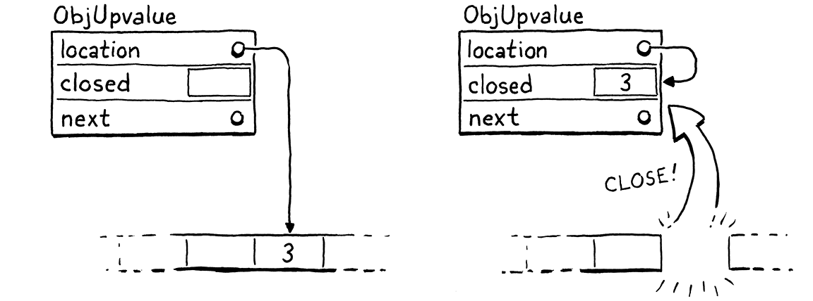

# 闭包

> 正如男人所说，对于每个复杂的问题都有一个简单的解决方案，这是错误的。
> 
> -- Umberto Eco,*Foucault’s Pendulum*

由于我们[上一章](http://craftinginterpreters.com/calls-and-functions.html)的辛勤劳动，已经拥有了一个可以工作的虚拟机。它缺少的是闭包。除了全局变量，这是他们自己的动物品种，一个函数没有办法引用在它自己的主体之外声明的变量。

```js
var x = "global";
fun outer() {
  var x = "outer";
  fun inner() {
    print x;
  }
  inner();
}
outer();
```

现在运行此示例，它会打印“global”。它应该打印“outer”。为了解决这个问题，需要在解析变量时包含所有外围函数的整个词法作用域。

这个问题在 clox 中比在 jlox 中更难，因为字节码 VM 将局部变量存储在栈中。使用栈是因为我声称局部变量具有栈语义――变量以与创建它们相反的顺序被丢弃。但是对于闭包，这只是*大多数*情况下是正确的。

```js
fun makeClosure() {
  var local = "local";
  fun closure() {
    print local;
  }
  return closure;
}

var closure = makeClosure();
closure();
```

外部函数`makeClosure()`声明了一个变量`local`.它还创建了一个内部函数，`closure()`用于捕获该变量。然后`makeClosure()`返回对该函数的引用。由于闭包在赋值给局部变量时逃逸(var closure =)，`local`应该必须比创建它的函数生命周期更长。


> 哦不，他正在逃逸！

可以通过为所有局部变量动态分配内存来解决这个问题。在 jlox 就是这样做的，它把所有东西都放在若干Environment 对象,  而Environment 对象在java堆中创建。但现在我们不想。使用栈非常快。大多数局部变量不被闭包捕获并且具有栈语义。为了个别(被闭包捕获)的局部变量的利益，让所有这些都慢下来是很糟糕的措施。

> 毕竟，C 和 Java 将栈用于局部变量是有原因的。

这意味着比之前在 Java 解释器中使用的方法更复杂。因为一些局部变量的生存周期差异很大，我们将有两种实施策略。对于不在闭包中使用的局部变量，将保留它们在栈中。当一个局部变量被闭包捕获时，将采用另一种解决方案，将它们提升到堆上，在那里它们可以根据需要生存。

自早期 Lisp 以来，闭包就一直存在，当时内存字节和 CPU 周期比翡翠更珍贵。在其间的几十年里，黑客设计了各种方式来将闭包编译为各种优化的运行时表示。有些效率更高，但需要更复杂的编译过程，所以不太可能轻松地改造到 clox 中。

> 搜索“closure conversion”或“lambda lifting”开始探索。

我在这里解释的技术来自 Lua VM 的设计。它速度快，节省内存，并且用相对较少的代码实现。更令人印象深刻的是，它自然适合 clox 和 Lua 都使用的单程编译器。不过，它有些复杂。可能需要一段时间才能在您的脑海中将所有片段拼凑在一起。我们将一步一步地构建它们，我将尝试分阶段介绍这些概念。

## 25.1 闭包对象

VM 使用 ObjFunction 表示运行时函数。这些对象是前端在编译时创建的。在运行时，VM 所做的只是从常量表中加载函数对象并将其绑定到名称。没有在运行时“创建”函数的操作。与字符串和数字非常相似，它们是纯粹在编译时实例化的常量。

> 换句话说，Lox 中的函数声明是一种字面量――一种定义内置类型常量值的语法。

这是有道理的，因为组成函数的所有数据在编译时都是已知的：从函数主体编译的字节码块，以及主体中使用的常量。但是，一旦引入闭包，这种表示方式就不再足够了。看看：

```js
fun makeClosure(value) {
  fun closure() {
    print value;
  }
  return closure;
}

var doughnut = makeClosure("doughnut");
var bagel = makeClosure("bagel");
doughnut();
bagel();
```

该`makeClosure()`函数定义并返回一个函数。我们调用它两次并返回两个闭包。它们由相同的嵌套函数声明`closure`创建，但封闭不同的值。当调用这两个闭包时，每个都打印不同的字符串。这意味着 需要闭包的运行时表示，它捕获函数周围的局部变量，因为它们在执行函数声明时存在，而不仅仅是在编译时。

我们将逐步捕获变量，但最好是在第一步定义该对象表示。现有的 ObjFunction 类型表示 函数声明的“原始”编译时状态，因为从单个声明创建的所有闭包共享相同的代码和常量。在运行时，当执行函数声明时，我们将 ObjFunction 包装在一个新的 ObjClosure 结构中。后者 引用了原始的函数 并包含了 原始函数闭包变量的  运行时状态。

> Lua 实现将包含字节码的原始函数对象称为“原型”，这个词很适合描述这一点，除了这个词还被重载以指代[原型继承](https://en.wikipedia.org/wiki/Prototype-based_programming)。


我们将把每个函数都包装在一个 ObjClosure 中，即使该函数实际上并没有关闭并捕获任何周围的局部变量。这有点浪费，但它简化了 VM，因为我们总是可以假设调用的函数是一个 ObjClosure。这个新结构是这样开始的：

```c
typedef struct {
  Obj obj;
  ObjFunction* function;
} ObjClosure;
// object.h, add after struct ObjString
```

现在，它只是指向一个 ObjFunction 并添加必要的对象头内容。通过向 clox 添加新对象类型的通常仪式，我们声明一个 C 函数来创建一个新的闭包。

```c
} ObjClosure;

ObjClosure* newClosure(ObjFunction* function);
ObjFunction* newFunction();
// object.h, add after struct ObjClosure
```

然后在这里实现它：

```c
ObjClosure* newClosure(ObjFunction* function) {
  ObjClosure* closure = ALLOCATE_OBJ(ObjClosure, OBJ_CLOSURE);
  closure->function = function;
  return closure;
}
// object.c, add after allocateObject()
```

它需要一个指向它包装的 ObjFunction 的指针。它还将类型字段初始化为新类型。

```c
typedef enum {
  OBJ_CLOSURE,
  OBJ_FUNCTION,
// object.h, in enum ObjType
```

当我们完成一个闭包时，我们释放它的内存。

```c
  switch (object->type) {
    case OBJ_CLOSURE: {
      FREE(ObjClosure, object);
      break;
    }
    case OBJ_FUNCTION: {
// memory.c, in freeObject()
```

我们只释放 ObjClosure 本身，而不释放 ObjFunction。那是因为闭包不拥有该ObjFunction。可能有多个闭包都引用同一个ObjFunction，并且没有一个闭包声称对它有任何特殊特权。在引用它的所有对象都消失之前，我们无法释放 ObjFunction――甚至包括它的外围函数,因为它常量表中包含它。跟踪听起来很棘手，而且确实如此！这就是为什么我们很快就会编写一个垃圾收集器来为我们管理它。

我们还有用于检查值类型的常用宏。

> 也许我应该定义一个宏，以便更容易地生成这些宏。也许那会有点太元编程了。

```c
#define OBJ_TYPE(value)        (AS_OBJ(value)->type)

#define IS_CLOSURE(value)      isObjType(value, OBJ_CLOSURE)
#define IS_FUNCTION(value)     isObjType(value, OBJ_FUNCTION)
// object.h
```

和转换值：

```c
#define IS_STRING(value)       isObjType(value, OBJ_STRING)

#define AS_CLOSURE(value)      ((ObjClosure*)AS_OBJ(value))
#define AS_FUNCTION(value)     ((ObjFunction*)AS_OBJ(value))
// object.h
```

闭包是一级对象，所以你可以打印它们。

```c
  switch (OBJ_TYPE(value)) {
    case OBJ_CLOSURE:
      printFunction(AS_CLOSURE(value)->function);
      break;
    case OBJ_FUNCTION:
// object.c, in printObject()
```

它们的显示与 ObjFunction 完全一样。从用户的角度来看，ObjFunction 和 ObjClosure 之间的区别纯粹是一个隐藏的实现细节。有了这个，我们就有了一个有效但空的闭包表示。

### 25.1.1 编译闭包对象

我们有了闭包对象，但虚拟机从不创建它们。下一步是让编译器发出指令，告诉运行时何时创建新的 ObjClosure 来包装给定的 ObjFunction。这发生在函数声明的末尾。

```c
  ObjFunction* function = endCompiler();
  emitBytes(OP_CLOSURE, makeConstant(OBJ_VAL(function)));
}
// compiler.c, in function(), replace 1 line
```

以前，函数声明的最终字节码是单条OP_CONSTANT`指令，用于从周围函数的常量表中加载已编译函数并将其压入堆栈。现在有一个新指令。

```c
  OP_CALL,
  OP_CLOSURE,
  OP_RETURN,
// chunk.h, in enum OpCode  
```

与 `OP_CONSTANT`一样，它有一个操作数，其值是函数常量表索引。但是当我们转到运行时实现时，会做一些更有趣的事情。

首先，让我们成为勤奋的 VM 黑客，并在反汇编程序中插入指令支持。

```c
    case OP_CALL:
      return byteInstruction("OP_CALL", chunk, offset);
    case OP_CLOSURE: {
      offset++;
      uint8_t constant = chunk->code[offset++];
      printf("%-16s %4d ", "OP_CLOSURE", constant);
      printValue(chunk->constants.values[constant]);
      printf("\n");
      return offset;
    }
    case OP_RETURN:
// debug.c, in disassembleInstruction()
```

这里发生的事情比我们通常在反汇编程序中发生的要多。到本章结束时，您会发现这`OP_CLOSURE`是一条非常不寻常的指令。现在它很简单――只是一个单字节操作数――但我们会添加它。这里的代码预示着那个未来。

### 25.1.2 解释函数声明

需要做的大部分工作都在运行时。自然地，我们必须处理新指令。但还需要触及 VM 中与 ObjFunction 一起使用的每一段代码，并将其改为使用 ObjClosure―函数调用、调用帧等。不过，我们将从指令开始。

```c
      }
      case OP_CLOSURE: {
        ObjFunction* function = AS_FUNCTION(READ_CONSTANT());
        ObjClosure* closure = newClosure(function);
        push(OBJ_VAL(closure));
        break;
      }
      case OP_RETURN: {
// vm.c, in run()
```

就像之前使用的`OP_CONSTANT`指令一样，首先从常量表中加载编译后的函数。现在的不同之处在于将该函数包装在一个新的 ObjClosure 中并将结果压入堆栈。

一旦你有一个闭包，你最终会想要调用它

```c
    switch (OBJ_TYPE(callee)) {
      case OBJ_CLOSURE:
        return call(AS_CLOSURE(callee), argCount);
      case OBJ_NATIVE: {
// vm.c, in callValue(), replace 2 lines
```

我们删除了调用类型为 `OBJ_FUNCTION`的对象的代码。由于将所有函数包装在 ObjClosures 中，运行时将永远不会再尝试调用裸 ObjFunction。这些对象只存在于常量表中，并在其他任何东西看到它们之前立即被包裹在闭包中。

> 我们不希望任何裸函数在 VM 周围徘徊！邻居会怎么说？

用非常相似的代码替换旧代码来调用闭包。唯一的区别是传递给`call()`的对象类型。该功能的真正变化都包含在这个函数中。首先，我们更新它的签名。

```c
static bool call(ObjClosure* closure, int argCount) {
  if (argCount != function->arity) {
// vm.c, function call(), replace 1 line
```

然后，在正文中，需要修复所有引用该函数的内容，以处理引入了一个间接层的事实。从 arity 检查开始：

```c
static bool call(ObjClosure* closure, int argCount) {
  if (argCount != closure->function->arity) {
    runtimeError("Expected %d arguments but got %d.",
        closure->function->arity, argCount);
    return false;
// vm.c, in call(), replace 3 lines
```

唯一的变化是我们打开闭包以获取底层函数。`call()`接下来要做的是创建一个新的 CallFrame。我们更改该代码以将闭包存储在 CallFrame 中并从闭包的函数中获取字节码指针。

```c
  CallFrame* frame = &vm.frames[vm.frameCount++];
  frame->closure = closure;
  frame->ip = closure->function->chunk.code;
  frame->slots = vm.stackTop - argCount - 1;
// vm.c, in call(), replace 2 lines
```

这也需要更改 CallFrame 的声明。

```c
typedef struct {
  ObjClosure* closure;
  uint8_t* ip;
// vm.h, in struct CallFrame, replace 1 line
```

该更改会触发其他一些级联更改。VM 中访问 CallFrame 函数的每个地方都需要使用闭包。首先，从当前函数的常量表中读取常量的宏：

```c
    (uint16_t)((frame->ip[-2] << 8) | frame->ip[-1]))

#define READ_CONSTANT() \
    (frame->closure->function->chunk.constants.values[READ_BYTE()])

#define READ_STRING() AS_STRING(READ_CONSTANT())
// vm.c, in run(), replace 2 lines
```

`DEBUG_TRACE_EXECUTION`启用时，它需要从闭包中获取块。

```c
    printf("\n");
    disassembleInstruction(&frame->closure->function->chunk,
        (int)(frame->ip - frame->closure->function->chunk.code));
#endif
// vm.c, in run(), replace 2 lines
```

同样在报告运行时错误时：

```c
    CallFrame* frame = &vm.frames[i];
    ObjFunction* function = frame->closure->function;
    size_t instruction = frame->ip - function->chunk.code - 1;
// vm.c, in runtimeError(), replace 1 line
```

快好了。最后一段是设置第一个 CallFrame 以开始执行 Lox 脚本的顶级代码块。

```c
  push(OBJ_VAL(function));
  ObjClosure* closure = newClosure(function);
  pop();
  push(OBJ_VAL(closure));
  call(closure, 0);

  return run();
// vm.c, in interpret(), replace 1 line
```

编译脚本时，编译器仍然返回一个原始的 ObjFunction。这很好，但这意味着需要在 VM 执行它之前将它包装在 ObjClosure 中。

> 代码看起来有点傻，因为我们仍然将原始 ObjFunction 压入堆栈。然后我们在创建闭包后弹出它，然后才压入闭包。为什么要把 ObjFunction 放在那里？像往常一样，当你看到奇怪的堆栈事情发生时，这是为了让[即将到来的垃圾收集器](http://craftinginterpreters.com/garbage-collection.html)知道一些堆分配的对象。

我们又回到了解析器。用户看不出有什么区别，但是编译器现在生成代码告诉 VM 为每个函数声明创建一个闭包。每次 VM 执行函数声明时，它都会将 ObjFunction 包装在一个新的 ObjClosure 中。VM 的其余部分现在处理那些浮动的 ObjClosures。那是无聊的事情。现在我们准备好让这些闭包真正做点什么了。

## 252 上值 Upvalues

现有的读写局部变量的指令仅限于单个函数的栈窗口。来自周围函数的局部变量位于内部函数的窗口之外。我们需要一些新的指令。

最简单的方法可能是一条指令，该指令使用当前函数窗口栈槽 相对偏移,  以便获取的前边函数窗口栈槽数据。如果封闭变量总是在栈上，那将起作用。但正如之前看到的，这些变量有时比声明它们的函数生命周期还长。这意味着他们不能总是在栈上(函数执行完后会销毁栈帧)。

那么，下一个最简单的方法是让任何被关闭的局部变量并让它始终存在于堆中。当周围函数中的局部变量声明被执行时，VM 会动态地为其分配内存。这样它就可以在需要的时候延长生命周期。

如果 clox 不是单程编译器，这将是一个很好的方法。但是我们的选择，在实现时很多限制使事情变得更加困难。看看这个例子：

```js
fun outer() {
  var x = 1;    // (1)
  x = 2;        // (2)
  fun inner() { // (3)
    print x;
  }
  inner();
}
```

在到达`inner()`声明`(3)`时，编译器编译 `x` 声明`(1)` 并发出赋值代码`(2)`，这些已经完成了， 然后发现`x`实际上已经封闭。我们没有一种简单的方法可以返回并修复已发出的代码以进行`x`特殊处理。所以，我们想要一个解决方案，允许闭包变量完全像普通局部变量一样存在于栈中，直到它被封闭。

幸运的是，多亏了 Lua 开发团队，我们有了一个解决方案。使用他们称为 **上值(upvalue)** 的间接层。上值(upvalue)指的是封闭函数中的局部变量。每个闭包都维护一个上值数组，每个上值对应闭包使用的每个周围局部变量。

upvalue 指向栈中它捕获的变量所在的位置。当闭包需要访问一个封闭变量时，它会通过相应的上值来获取它。首次执行函数声明并为其创建闭包时，VM 会创建上值数组并将它们连接起来以“捕获”闭包所需的周围局部变量。

例如，如果把这个程序丢给 clox，

```js
{
  var a = 3;
  fun f() {
    print a;
  }
}
```

编译器和运行时将共同在内存中构建一组对象，如下所示：


这可能看起来势不可挡，但不要害怕。我们会努力解决的。重要的部分是 upvalues 用作继续查找捕获的局部变量所需的间接层，即使它离开栈也是如此。但在开始之前，让我们专注于编译捕获的变量。

### 25.2.1 编译上值 compiling upvalues

像往常一样，我们希望在编译期间做尽可能多的工作，以保持运行时简单和快速。由于局部变量在 Lox 中是词法作用域的，在编译时有足够的知识来解决函数访问哪些周围局部变量以及声明这些局部变量的位置。反过来，这意味着我们知道闭包需要多少上值，它们捕获哪些变量，以及声明函数的栈窗口中哪些栈槽包含这些变量。

目前，当编译器解析(resolves)一个标识符时，它会从最内层到最外层遍历当前函数的块作用域。如果在该函数中没有找到该变量，假设该变量必须是全局变量。我们不考虑闭包函数的局部作用域――它们会被直接跳过。那么，第一个变化是为那些外围本地作用域插入一个解析步骤(The first change, then, is inserting a resolution step for those outer local scopes.)。

```c
  if (arg != -1) {
    getOp = OP_GET_LOCAL;
    setOp = OP_SET_LOCAL;
  } else if ((arg = resolveUpvalue(current, &name)) != -1) {
    getOp = OP_GET_UPVALUE;
    setOp = OP_SET_UPVALUE;
  } else {
// compiler.c, in namedVariable() 
```

这个新`resolveUpvalue()`函数查找在任何周围函数中声明的局部变量。如果找到一个，它会返回该变量的“上值索引”。（我们稍后会了解这意味着什么。）否则，它返回 -1 以指示未找到该变量。如果找到，我们将使用这两条新指令通过其上值读取或写入变量：

```c
  OP_SET_GLOBAL,
  OP_GET_UPVALUE,
  OP_SET_UPVALUE,
  OP_EQUAL,
// chunk.h, in enum OpCode
```

这是自上而下的实现方式，所以我将很快向您展示这些在运行时是如何工作的。现在要关注的部分是编译器如何实际解析标识符。

```c
static int resolveUpvalue(Compiler* compiler, Token* name) {
  if (compiler->enclosing == NULL) return -1;

  int local = resolveLocal(compiler->enclosing, name);
  if (local != -1) {
    return addUpvalue(compiler, (uint8_t)local, true);
  }

  return -1;
}
// compiler.c, add after resolveLocal()
```

在当前函数作用域内无法解析局部变量(resolveLocal)后调用它(addUpvalue)，因此知道该变量不在当前编译器中。回想一下，Compiler 存储了一个指向闭包函数的 Compiler 的指针，这些指针形成了一个链表，一直到顶级代码的根 Compiler。因此，如果封闭的 Compiler 是`NULL`，我们知道已经到达最外层的函数而没有找到局部变量。该变量必定是全局的，所以返回 -1。

> 它可能最终成为一个完全未定义的变量，甚至不是全局变量。但在 Lox 中，我们直到运行时才检测到该错误，因此从编译器的角度来看，它是“希望是全局的”。

否则，我们会尝试将标识符解析为*封闭*编译器中的局部变量 。也就是说，我们在当前函数之外寻找它。例如：

```js
fun outer() {
  var x = 1;
  fun inner() {
    print x; // (1)
  }
  inner();
}
```

在编译标识符表达式时`(1)`，`resolveUpvalue()`查找在`outer()`中声明的局部变量`x`。如果找到――就像在这个例子中一样――那么就成功地解析了变量。我们创建一个上值，以便内部函数可以通过它访问变量。upvalue 在这里创建：

```c
static int addUpvalue(Compiler* compiler, uint8_t index,
                      bool isLocal) {
  int upvalueCount = compiler->function->upvalueCount;
  compiler->upvalues[upvalueCount].isLocal = isLocal;
  compiler->upvalues[upvalueCount].index = index;
  return compiler->function->upvalueCount++;
}
// compiler.c, add after resolveLocal()
```

编译器保留一个 upvalue 数组来跟踪它在每个函数的主体中解析的封闭标识符。还记得编译器的 Local 数组如何反映运行时局部变量所在的栈槽索引吗？这个新的上值数组以同样的方式工作。编译器数组中的索引与运行时 ObjClosure 中上值所在的索引相匹配。

此函数向该数组添加一个新的上值。它还跟踪函数使用的上值数。它将计数直接存储在 ObjFunction 本身中，因为我们还需要在运行时使用该数字。

> 与常量和函数元数(arity)一样，upvalue 计数是另一个构成编译器和运行时之间桥梁的那些小数据中。

`index`字段跟踪封闭局部变量的槽索引。这样编译器就知道需要捕获封闭函数中的哪个变量。我们很快就会回到那个`isLocal`字段的用途。最后，`addUpvalue()`返回创建的上值在函数的上值列表中的索引。该索引成为`OP_GET_UPVALUE`和`OP_SET_UPVALUE`指令的操作数。

这是解析上值的基本思想，但该函数尚未完全成熟。闭包可以多次引用周围函数中的同一个变量。在那种情况下，我们不想浪费时间和内存为每个标识符表达式创建一个单独的上值。为了解决这个问题，在我们添加一个新的上值之前，我们首先检查函数是否已经有一个封闭该变量的上值。

```c
  int upvalueCount = compiler->function->upvalueCount;

  for (int i = 0; i < upvalueCount; i++) {
    Upvalue* upvalue = &compiler->upvalues[i];
    if (upvalue->index == index && upvalue->isLocal == isLocal) {
      return i;
    }
  }

  compiler->upvalues[upvalueCount].isLocal = isLocal;
// compiler.c, in addUpvalue()
```

如果我们在数组中找到一个上值，其槽索引与我们添加的那个相匹配，只需返回该上值索引并重新使用它。否则，查找失败后并添加新的上值。

这两个函数访问和修改一堆新状态，所以让我们定义它。首先，将上值计数添加到 ObjFunction。

```c
  int arity;
  int upvalueCount;
  Chunk chunk;
// object.h, in struct ObjFunction
```

我们是认真的 C 程序员，所以在第一次分配 ObjFunction 时对其进行零初始化。

```c
  function->arity = 0;
  function->upvalueCount = 0;
  function->name = NULL;
// object.c, in newFunction()
```

在编译器中，为上值数组添加了一个字段。

```c
  int localCount;
  Upvalue upvalues[UINT8_COUNT];
  int scopeDepth;
// compiler.c, in struct Compiler
```

为了简单起见，给了它一个固定的大小。`OP_GET_UPVALUE`和 `OP_SET_UPVALUE`指令使用单字节操作数对上值索引进行编码，因此函数可以拥有多少个上值是有限制的――它可以关闭多少个唯一变量。鉴于此，我们可以负担得起这么大的静态数组。我们还需要确保编译器不会溢出该限制。

```c
    if (upvalue->index == index && upvalue->isLocal == isLocal) {
      return i;
    }
  }

  if (upvalueCount == UINT8_COUNT) {
    error("Too many closure variables in function.");
    return 0;
  }

  compiler->upvalues[upvalueCount].isLocal = isLocal;
// compiler.c, in addUpvalue()
```

最后，Upvalue 结构类型本身。

```c
typedef struct {
  uint8_t index;
  bool isLocal;
} Upvalue;
// compiler.c, add after struct Local
```

`index`字段存储正在捕获的上值本地插槽。该`isLocal`字段拥有自己的部分，我们将在接下来进行介绍。

### 25.2.2 展开上值 flattening-upvalues

在我之前展示的示例中，闭包正在访问在 紧邻的封闭函数中声明的变量。Lox 还支持访问在*任何*封闭范围内声明的局部变量，如：

```js
fun outer() {
  var x = 1;
  fun middle() {
    fun inner() {
      print x;
    }
  }
}
```

在这里，我们在`inner()`访问`x`。该变量不是在`middle()`中定义的，而是在`outer()`中定义的。我们也需要处理这样的情况。您可能认为这并不难，因为变量只是位于栈中更靠下的位置。但是考虑这个狡猾的例子：

> 如果你在编程语言上工作的时间足够长，你将培养出一种精心磨练的技能，可以创建像这样的奇异程序，这些程序在技术上是有效的，但可能会绊倒那些想象力不如你的人编写的实现。

```js
fun outer() {
  var x = "value";
  fun middle() {
    fun inner() {
      print x;
    }

    print "create inner closure";
    return inner;
  }

  print "return from outer";
  return middle;
}

var mid = outer(); //(1)
var in = mid();    //(2)
in();
```

当你运行它时，它应该打印：

```
return from outer
create inner closure
value
```

我知道，这很复杂。重要的部分是`outer()`(`x`在此处声明) ,   在执行`inner()`声明之前 (1)处 outer()已经返回并弹出堆栈中的所有变量。因此，在我们创建`inner()`闭包的时候，`x`已经脱离了栈。

在这里，我为您追踪了执行流程：


顺着执行箭头查看如何`x`在捕获 ② 之前弹出① , 然后稍后访问 ③？我们确实有两个问题：

1. 需要解析在 紧邻封闭函数之外的周围函数中声明的局部变量。

2. 需要能够捕获已经离开堆栈的变量。

幸运的是，我们正在向 VM 添加上值，并且上值明确设计用于跟踪已逃脱堆栈的变量。因此，在一个巧妙的自引用中，可以使用 upvalues 来  允许 upvalues 捕获在紧邻函数外部声明的变量。

解决方案是允许闭包捕获局部变量或紧邻封闭函数中的**现有**上值。如果一个深度嵌套的函数引用了一个在几步之外声明的局部变量，将通过让每个函数捕获一个上值以供下一个函数获取，将其线索通过所有的中间函数。


在上面的示例中，`middle()`捕获`x`紧邻封闭函数`outer()`中的局部变量并将其存储在它自己的上值中。即使`middle()`本身不引用`x`.然后，当`inner()`的声明执行时，它的闭包从`middle()` ObjClosure中获取捕获的 upvalue`x`。一个函数只从紧邻的函数中捕获――无论是局部值还是上值――它保证在内部函数声明执行的那一刻仍然存在。

为了实现这一点，`resolveUpvalue()`变得递归。

```c
  if (local != -1) {
    return addUpvalue(compiler, (uint8_t)local, true);
  }

  int upvalue = resolveUpvalue(compiler->enclosing, name);  //<<
  if (upvalue != -1) {
    return addUpvalue(compiler, (uint8_t)upvalue, false); 
  }                                                         //<<

  return -1;
// compiler.c, in resolveUpvalue()
```

这仅有三行代码，但我发现这个函数第一次做对真的很有挑战性。尽管事实上我并没有发明任何新东西，只是从 Lua 移植了这个概念。大多数递归函数要么在递归调用之前完成所有工作（**前序遍历**，或“进行中”），要么在递归调用之后完成所有工作（**后序遍历**，或“进行中备份”）。这个函数两者兼而有之。递归调用就在中间。

我们将慢慢介绍它。首先，我们在封闭函数中寻找匹配的局部变量。如果找到一个，捕获那个本地并返回。这是基本情况。

> 当然，另一种基本情况是没有封闭函数。在这种情况下，该变量无法按词法解析，而是被视为全局变量。

否则，我们会在紧邻封闭的函数之外寻找局部变量。通过递归调用`resolveUpvalue()` 传入*enclosing*编译器而不是当前的编译器来做到这一点。这一系列`resolveUpvalue()`调用沿着嵌套编译器链进行，直到它遇到一个基本情况――要么它找到一个实际的局部变量来捕获，要么它用完编译器。

当找到局部变量时，嵌套最深的`resolveUpvalue()`调用会捕获它并返回上值索引。这将返回到对内部函数声明的下一次调用。该调用捕获*周围*函数的上值，依此类推。随着对每个`resolveUpvalue()`嵌套调用的返回，我们向下钻取到最里面的函数声明，其中出现了我们正在解析的标识符。在此过程中的每一步，我们都会向中间函数添加一个上值，并将生成的上值索引传递给下一个调用。

> 每次`resolveUpvalue()`递归调用都会走出一层函数嵌套。因此，内部递归调用引用外部嵌套声明。查找局部变量的最内层`resolveUpvalue()`递归调用将针对*最外层*函数，就在实际声明该变量的封闭函数内。

解析`x`时，遍历原始示例可能会有所帮助：


注意，对`addUpvalue()` 新的调用参数`isLocal`值是`false`。现在您看到该标志控制闭包是捕获局部变量还是捕获周围函数的上值。

当编译器到达函数声明的末尾时，每个变量引用都已解析为局部、上值或全局。每个 upvalue 可以依次从周围的函数中捕获一个局部变量，或者在传递闭包的情况下捕获一个 upvalue。终于有足够的数据来发出字节码，它在运行时创建一个闭包来捕获所有正确的变量。

```c
  emitBytes(OP_CLOSURE, makeConstant(OBJ_VAL(function)));

  for (int i = 0; i < function->upvalueCount; i++) {
    emitByte(compiler.upvalues[i].isLocal ? 1 : 0);
    emitByte(compiler.upvalues[i].index);
  }
}
// compiler.c, in function()
```

`OP_CLOSURE`指令的独特之处在于它具有可变大小的编码。对于闭包捕获的每个上值，都有两个单字节操作数。每对操作数指定该上值捕获的内容。如果第一个字节是1，它会捕获封闭函数中的一个局部变量。如果为0，它会捕获函数的一个上值。下一个字节是要捕获的本地槽或上值索引。

这种奇怪的编码意味着我们需要在反汇编代码中为`OP_CLOSURE`.

```c
      printf("\n");

      ObjFunction* function = AS_FUNCTION(
          chunk->constants.values[constant]);
      for (int j = 0; j < function->upvalueCount; j++) {
        int isLocal = chunk->code[offset++];
        int index = chunk->code[offset++];
        printf("%04d      |                     %s %d\n",
               offset - 2, isLocal ? "local" : "upvalue", index);
      }

      return offset;
// debug.c, in disassembleInstruction()
```

例如，采用以下脚本：

```js
fun outer() {
  var a = 1;
  var b = 2;
  fun middle() {
    var c = 3;
    var d = 4;
    fun inner() {
      print a + c + b + d;
    }
  }
}
```

如果我们反汇编创建闭包的指令`inner()`，它会打印：

```
0004    9 OP_CLOSURE          2 <fn inner>
0006      |                     upvalue 0
0008      |                     local 1
0010      |                     upvalue 1
0012      |                     local 2
```

我们还有另外两个更简单的指令来添加反汇编程序支持。

```c
    case OP_SET_GLOBAL:
      return constantInstruction("OP_SET_GLOBAL", chunk, offset);
    case OP_GET_UPVALUE:
      return byteInstruction("OP_GET_UPVALUE", chunk, offset);
    case OP_SET_UPVALUE:
      return byteInstruction("OP_SET_UPVALUE", chunk, offset);
    case OP_EQUAL:
// debug.c, in disassembleInstruction()
```

它们都有一个单字节操作数，所以没有什么令人兴奋的事情发生。我们确实需要添加一个incluce，以便调试模块可以访问`AS_FUNCTION()`.

```c
#include "debug.h"
#include "object.h"
#include "value.h"
// debug.c
```

有了它，我们的编译器就在我们想要的地方。对于每个函数声明，它输出一条`OP_CLOSURE`指令，后跟一系列操作数字节对，用于在运行时需要捕获的每个上值。是时候跳到 VM 的那一边并开始运行了。

## 25.3 上值对象 upvalue objects

现在，每条`OP_CLOSURE`指令后跟一系列字节，这些字节指定 ObjClosure 应拥有的上值。在处理这些操作数之前，需要一个上值的运行时表示。

```c
typedef struct ObjUpvalue {
  Obj obj;
  Value* location;
} ObjUpvalue;
// object.h, add after struct ObjString
```

我们知道 upvalues 必须管理不再存在于堆栈中的封闭变量，这意味着一定量的动态分配。在 VM 中执行此操作的最简单方法是在已有的对象系统上构建。这样，在[下一章](http://craftinginterpreters.com/garbage-collection.html)实现垃圾收集器时，GC 也可以管理 upvalues 的内存。

因此，运行时上值结构是一个具有典型 Obj 标头字段的 ObjUpvalue。接下来是一个`location`指向封闭变量的字段。请注意，这是指向值的指针，而不是值本身。它是对变量的引用，而不是值。这很重要，因为这意味着当将上值分配给捕获的变量时，我们正在分配给实际变量，而不是副本。例如：

```js
fun outer() {
  var x = "before";
  fun inner() {
    x = "assigned";
  }
  inner();
  print x;
}
outer();
```

这个程序应该打印“assigned”，即使闭包赋值给`x`它并且周围的函数访问它。

因为上值是对象，所以我们有所有常见的对象机制，从一个类似构造函数的函数开始：

```c
ObjString* copyString(const char* chars, int length);
ObjUpvalue* newUpvalue(Value* slot);
void printObject(Value value);
// object.h, add after copyString()
```

它采用封闭变量所在的槽的地址。这是实现：

```c
ObjUpvalue* newUpvalue(Value* slot) {
  ObjUpvalue* upvalue = ALLOCATE_OBJ(ObjUpvalue, OBJ_UPVALUE);
  upvalue->location = slot;
  return upvalue;
}
// object.c, add after copyString()
```

我们简单地初始化对象并存储指针。这需要一个新的对象类型。

```c
  OBJ_STRING,
  OBJ_UPVALUE
} ObjType;
// object.h, in enum ObjType
```

当然还有一个类似析构函数的函数：

```c
      FREE(ObjString, object);
      break;
    }
    case OBJ_UPVALUE:
      FREE(ObjUpvalue, object);
      break;
  }
// memory.c, in freeObject()
```

多个闭包可以关闭同一个变量，因此 ObjUpvalue 不拥有它引用的变量。因此，唯一要释放的是 ObjUpvalue 本身。

最后，打印：

```c
    case OBJ_STRING:
      printf("%s", AS_CSTRING(value));
      break;
    case OBJ_UPVALUE:
      printf("upvalue");
      break;
  }
// object.c, in printObject()
```

打印对最终用户没有用。Upvalues 只是对象，因此我们可以利用 VM 的内存管理。它们不是 Lox 用户可以在程序中直接访问的一等值。所以这段代码永远不会真正执行... 但它可以防止编译器对我们大喊大叫未处理的 switch case，所以我们到了。

### 25.3.1 闭包中的上值 upvalues in closures

当第一次介绍上值时，说过每个闭包都有一个上值数组。我们终于努力回到实施这一点。

```c
  ObjFunction* function;
  ObjUpvalue** upvalues;
  int upvalueCount;
} ObjClosure;
// object.h, in struct ObjClosure
```

不同的闭包可能有不同数量的上值，所以需要一个动态数组。upvalues 本身也是动态分配的，所以最终得到一个二级指针――一个指向动态分配的 upvalues 指针数组的指针。我们还存储数组中元素的数量。

> 将上值计数存储在闭包中是多余的，因为 ObjClosure 引用的 ObjFunction 也保留该计数。和往常一样，这段奇怪的代码是为了安抚 GC。在闭包对应的 ObjFunction 已经被释放后，收集器可能需要知道 ObjClosure 的上值数组大小。

当创建一个 ObjClosure 时，分配了一个适当大小的上值数组，在编译时确定并存储在 ObjFunction 中。

```c
ObjClosure* newClosure(ObjFunction* function) {
  ObjUpvalue** upvalues = ALLOCATE(ObjUpvalue*,
                                   function->upvalueCount);
  for (int i = 0; i < function->upvalueCount; i++) {
    upvalues[i] = NULL;
  }

  ObjClosure* closure = ALLOCATE_OBJ(ObjClosure, OBJ_CLOSURE);
// object.c, in newClosure()
```

在创建闭包对象本身之前，分配上值数组并将它们全部初始化为`NULL`.这个围绕记忆的奇怪仪式是一种精心的舞蹈，以取悦（即将到来的）垃圾收集神。它确保内存管理器永远不会看到未初始化的内存。

然后我们将数组存储在新的闭包中，并从 ObjFunction 复制计数。

```c
  closure->function = function;
  closure->upvalues = upvalues;
  closure->upvalueCount = function->upvalueCount;
  return closure;
// object.c, in newClosure()
```

当我们释放一个 ObjClosure 时，我们也释放了上值数组。

```c
    case OBJ_CLOSURE: {
      ObjClosure* closure = (ObjClosure*)object;
      FREE_ARRAY(ObjUpvalue*, closure->upvalues,
                 closure->upvalueCount);
      FREE(ObjClosure, object);
// memory.c, in freeObject()
```

ObjClosure 本身并不拥有 ObjUpvalue 对象，但它拥有包含指向这些上值的指针的数组。

当它创建一个闭包时，在解释器中填充上值数组。在`OP_CLOSURE`之后，遍历所有操作数，以查看每个插槽捕获的上值类型。

```c
        push(OBJ_VAL(closure));
        for (int i = 0; i < closure->upvalueCount; i++) {
          uint8_t isLocal = READ_BYTE();
          uint8_t index = READ_BYTE();
          if (isLocal) {
            closure->upvalues[i] =
                captureUpvalue(frame->slots + index);
          } else {
            closure->upvalues[i] = frame->closure->upvalues[index];
          }
        }
        break;
// vm.c, in run()
```

这段代码是闭包生效的神奇时刻。我们迭代闭包期望的每个上值。对于每一个，读取一对操作数字节。如果 upvalue 在封闭函数中关闭了一个局部变量，我们就让`captureUpvalue()`完成工作。

否则，从周围的函数中捕获一个上值。在函数声明的末尾发出一条`OP_CLOSURE`指令。在我们执行该声明的那一刻，*当前*函数就是周围的函数。这意味着当前函数的闭包存储在调用堆栈顶部的 CallFrame 中。因此，要从封闭函数中获取上值，我们可以直接从本地变量`frame`中读取它，该变量缓存了对该 CallFrame 的引用。

关闭局部变量更有趣。大部分工作发生在一个单独的函数中，但首先我们计算要传递给它的参数。我们需要在周围函数的栈窗口中获取指向捕获的本地槽的指针。该窗口从 `frame->slots`开始，指向插槽零。将`index`偏移量添加到我们要捕获的本地插槽中。我们在这里传递该指针：

```c
static ObjUpvalue* captureUpvalue(Value* local) {
  ObjUpvalue* createdUpvalue = newUpvalue(local);
  return createdUpvalue;
}
// vm.c, add after callValue()
```

这似乎有点傻。它所做的只是创建一个新的 ObjUpvalue 来捕获给定的堆栈槽并将其返回。我们需要一个单独的函数吗？嗯，不，还*没有*。但是你知道我们最终会在这里添加更多代码。

首先，让我们总结一下正在做的事情。回到用于处理`OP_CLOSURE`的解释器代码中，我们最终完成了对上值数组的迭代并初始化了每个数组。完成后，我们有一个新的闭包，其中包含一个充满指向变量的上值的数组。

有了它，我们就可以实现与这些上值一起使用的指令。

```c
      }
      case OP_GET_UPVALUE: {
        uint8_t slot = READ_BYTE();
        push(*frame->closure->upvalues[slot]->location);
        break;
      }
      case OP_EQUAL: {
// vm.c, in run()
```

操作数是当前函数的上值数组的索引。所以我们简单地查找相应的上值并解引用其位置指针以读取该槽中的值。设置变量是类似的。

```c
      }
      case OP_SET_UPVALUE: {
        uint8_t slot = READ_BYTE();
        *frame->closure->upvalues[slot]->location = peek(0);
        break;
      }
      case OP_EQUAL: {
// vm.c, in run()
```

我们将栈顶部的值存储到所选上值指向的槽中。正如局部变量的指令一样，这些指令的速度很重要。用户程序不断地读取和写入变量，所以如果它很慢，那么一切都很慢。而且，像往常一样，使它们快速的方法是保持它们的简单。这两条新指令非常好：没有控制流，没有复杂的算法，只有几个间接指针和一个`push()`.

> set 指令不会从堆栈中*弹出*值，因为请记住，赋值是 Lox 中的表达式。因此，赋值的结果――赋值――需要保留在周围表达式的堆栈中。

这是一个里程碑。只要所有变量都保留在堆栈中，我们就有了可以工作的闭包。尝试这个：

```js
fun outer() {
  var x = "outside";
  fun inner() {
    print x;
  }
  inner();
}
outer();
```

运行它，它会正确打印“outside”。

## 25.4  封闭的上值 closed-upvalues

当然，闭包的一个关键特性是它们会根据需要保留变量，即使在声明变量的函数返回之后也是如此。这是另一个*应该*起作用的例子：

```c
fun outer() {
  var x = "outside";
  fun inner() {
    print x;
  }

  return inner;
}

var closure = outer();
closure();
```

但是如果你现在运行它... 谁知道它的作用？在运行时，它将从不再包含封闭变量的栈槽中读取。就像我多次提到的那样，问题的症结在于闭包中的变量没有栈语义。这意味着当声明它们的函数返回时，必须将它们从栈中取出。本章的最后一节就是这样做的。

### 25.4.1  值和变量

在开始编写代码之前，我想深入探讨一个重要的语义点。闭包是关闭一个值还是一个(引用)变量？这不仅仅是一个学术问题。我不只是吹毛求疵。考虑：

> 如果 Lox 不允许分配，那*将*是一个学术问题。

```c
var globalSet;
var globalGet;

fun main() {
  var a = "initial";

  fun set() { a = "updated"; }
  fun get() { print a; }

  globalSet = set;
  globalGet = get;
}

main();
globalSet();
globalGet();
```

外部`main()`函数创建两个闭包并将它们存储在全局变量中，以便它们比`main()`自身的执行时间更长。这两个闭包都捕获相同的变量。第一个闭包为其分配一个新值，第二个闭包读取该变量。

> 我使用几个全局变量这一事实并不重要。我需要一些方法从一个函数返回两个值，并且在 Lox 中没有任何类型的集合类型，我的选择是有限的。

`globalGet()`打印的调用是什么？如果闭包捕获*值*，那么每个闭包都会获得自己`a`的副本，其中包含闭包函数声明执行时的值。对`globalSet()`的调用将修改`set()`的副本`a`，但`get()`的副本将不受影响。因此，调用`globalGet()`将打印“initial”。

如果闭包关闭变量，则`get()`和`set()`都将捕获（引用）同*一个可变变量*。`set()`更改`a`时，它会更改`get()`读取`a`的内容。只有一个`a`。反过来，这意味着调用`globalGet()`将打印“updated”。

应该是哪个？Lox 和我所知道的大多数其他闭包语言的答案是后者。闭包捕获变量。您可以将它们视为捕获*值所在的位置*。当我们处理不再在堆栈上的封闭变量时，请记住这一点很重要。当一个变量移动到堆中时，我们需要确保捕获该变量的所有闭包都保留对其*一个*新位置的引用。这样，当变量发生变化时，所有闭包都会看到变化。

### 25.4.2  正在的上值 closing upvalues

我们知道局部变量总是从堆栈开始。这样速度更快，并且让我们的单程编译器在发现变量已被捕获之前发出代码。还知道，如果闭包比声明捕获变量的函数生命周期更长，则闭包变量需要移动到堆中。

在 Lua 之后，我们将使用**open upvalue**来引用指向仍在堆栈上的局部变量的 upvalue。当一个变量移动到堆中时，我们正在*关闭*上值，结果自然是一个**关闭的上值 （closed upvalue）**。我们需要回答的两个问题是：

1. 封闭变量在堆上的什么位置？

2. 什么时候关闭upvalue？

第一个问题的答案很简单。我们已经在堆上有一个方便的对象，它表示对变量的引用――ObjUpvalue本身。封闭变量将移动到 ObjUpvalue 结构内部的新字段中。这样就不需要做任何额外的堆分配来关闭上值。

第二个问题也很简单。只要变量在堆栈上，就可能有代码引用它，并且该代码必须正常工作。所以将变量提升到堆的逻辑时间越晚越好。如果我们在局部变量超出作用域时将其转移，可以肯定在该点之后没有代码会尝试从栈中访问它。变量超出作用域后，如果任何代码试图使用它，编译器将报告错误。

> 这里的“之后”，我指的是词汇或文本意义包含封闭变量声明的块`}`之后的代码。

当局部变量超出范围时，编译器已经发出`OP_POP`指令。如果一个变量被闭包捕获，我们将改为发出一条不同的指令将该变量从栈中提升到其对应的上值中。为此，编译器需要知道哪些局部变量被关闭。

> 编译器不会弹出函数体内立即声明的参数和局部变量。我们也会在运行时处理这些。

编译器已经为函数中的每个局部变量维护了一个 Upvalue 结构数组，以准确跟踪该状态。该数组非常适合回答“这个闭包使用哪些变量？”  但它不太适合回答  “有*没有*函数捕获这个局部变量？”  特别是，一旦某个闭包的编译器完成，其变量已被捕获的封闭函数的编译器将无法再访问任何上值状态。

换句话说，编译器维护从上值到它们捕获的局部变量的指针，但不是在另一个方向。所以我们首先需要在现有的本地结构中添加一些额外的跟踪，以便我们可以判断给定的本地是否被闭包捕获。

```c
  int depth;
  bool isCaptured;
} Local;
// compiler.c, in struct Local
```

 如果local被任何以后的嵌套函数声明捕获该字段是`true`。最初，并未捕获所有局部变量。

```c
  local->depth = -1;
  local->isCaptured = false;
}
// compiler.c, in addLocal()
```

同样，编译器隐式声明的特殊“slot zero local”也没有被捕获。

> 在本书的后面，用户*将*有可能捕获此变量。只是在这里建立一些预期。

```c
  local->depth = 0;
  local->isCaptured = false;
  local->name.start = "";
// compiler.c, in initCompiler()
```

在解析标识符时，如果我们最终为局部变量创建了一个上值，我们将其标记为已捕获。

```c
  if (local != -1) {
    compiler->enclosing->locals[local].isCaptured = true;
    return addUpvalue(compiler, (uint8_t)local, true);
// compiler.c, in resolveUpvalue()
```

现在，在块作用域的末尾，当编译器发出代码为局部变量释放堆栈槽时，可以判断哪些需要提升到堆上。我们将为此使用一条新指令。

```c
  while (current->localCount > 0 &&
         current->locals[current->localCount - 1].depth >
            current->scopeDepth) {
    if (current->locals[current->localCount - 1].isCaptured) {
      emitByte(OP_CLOSE_UPVALUE);
    } else {
      emitByte(OP_POP);
    }
    current->localCount--;
  }
// compiler.c, in endScope(), replace 1 line
```

该指令不需要操作数。我们知道，在这条指令执行的时候，变量总是在栈顶。我们声明指令。

```c
  OP_CLOSURE,
  OP_CLOSE_UPVALUE,
  OP_RETURN,
// chunk.h, in enum OpCode
```

并为其添加简单的反汇编程序支持：

```c
    }
    case OP_CLOSE_UPVALUE:
      return simpleInstruction("OP_CLOSE_UPVALUE", offset);
    case OP_RETURN:
// debug.c, in disassembleInstruction()
```

完美！现在生成的字节码准确地告诉运行时每个捕获的局部变量必须何时移动到堆中。更好的是，它只对被闭包使用并需要这种特殊待遇的局部变量这样做。这符合我们希望用户只为他们使用的功能付费的总体性能目标。没有被闭包使用的变量完全在栈上生存和死亡，就像它们以前一样。

### 25.4.3 跟踪开放的上值  tracking-open-upvalues

让我们转到运行时方面。在我们可以解释`OP_CLOSE_UPVALUE`指令之前，有一个问题需要解决。早些时候，当我谈到闭包是捕获变量还是值时，我说过重要的是，如果多个闭包访问同一个变量，它们最终会引用内存中完全相同的存储位置。这样一来，如果一个闭包写入变量，另一个闭包就会看到变化。

现在，如果两个闭包捕获相同的局部变量，则 VM 会为每个闭包创建一个单独的 Upvalue。缺少必要的共享。当我们将变量移出栈时，如果我们仅将其移入其中一个上值，则另一个上值将具有孤立值。

> 如果一个闭包从周围的函数中捕获了一个*上值*，则VM确实共享上值。嵌套案例工作正常。但是，如果两个兄弟闭包捕获相同的局部变量，则它们各自创建一个单独的 ObjUpvalue。

为了解决这个问题，每当 VM 需要一个捕获特定局部变量槽的上值时，将首先搜索指向该槽的现有上值。如果找到，会重复使用它。挑战在于所有先前创建的上值都隐藏在各种闭包的上值数组中。这些闭包可能位于 VM 内存中的任何位置。

第一步是为 VM 提供它自己的所有开放上值列表，这些上值指向仍在栈中的变量。每次 VM 需要一个 upvalue 时搜索列表听起来可能很慢，但实际上，这还不错。实际关闭的堆栈上的变量数量往往很小。创建闭包的函数声明很少出现在用户程序的性能关键执行路径上。

> 闭包经常在热循环中被调用。想一想传递给集合上典型的高阶函数的闭包，例如[`map()`](https://en.wikipedia.org/wiki/Map_(higher-order_function))和[`filter()`](https://en.wikipedia.org/wiki/Filter_(higher-order_function))。那应该很快。*但是创建*闭包的函数声明只发生一次并且通常在循环之外。

更好的是，我们可以通过它们指向的栈槽索引来对开放值列表进行排序。常见的情况是插槽*尚未*被捕获――在闭包之间共享变量并不常见――并且闭包倾向于捕获靠近堆栈顶部的局部变量。如果我们按堆栈槽顺序存储开放的上值数组，一旦我们越过我们正在捕获的本地所在的槽，我们就知道它不会被发现。当局部变量接近栈顶时，我们可以很早地退出循环。

维护一个排序列表需要在中间有效地插入元素。这建议使用链接列表而不是动态数组。由于我们自己定义了 ObjUpvalue 结构，最简单的实现是一个侵入式列表，它将 next 指针放在 ObjUpvalue 结构本身的内部。

```c
  Value* location;
  struct ObjUpvalue* next;
} ObjUpvalue;
// object.h, in struct ObjUpvalue
```

当我们分配一个 upvalue 时，它??还没有附加到任何列表，所以链接是?`NULL`。

```c
  upvalue->location = slot;
  upvalue->next = NULL;
  return upvalue;
// object.c, in newUpvalue()
```

VM 拥有该列表，因此头指针正好位于主 VM 结构内。

```c
  Table strings;
  ObjUpvalue* openUpvalues;
  Obj* objects;
// vm.h, in struct VM
```

该列表一开始是空的。

```c
  vm.frameCount = 0;
  vm.openUpvalues = NULL;
}
// vm.c, in resetStack()
```

从 VM 指向的第一个 upvalue 开始，每个打开的 upvalue 都指向下一个打开的 upvalue，该 upvalue 引用堆栈更下方的局部变量。这个脚本，例如，

```js
{
  var a = 1;
  fun f() {
    print a;
  }
  var b = 2;
  fun g() {
    print b;
  }
  var c = 3;
  fun h() {
    print c;
  }
}
```

应该产生一系列链接的上值，如下所示：


每当我们关闭一个局部变量时，在创建一个新的上值之前，我们都会在列表中寻找一个现有的。

```c
static ObjUpvalue* captureUpvalue(Value* local) {
  ObjUpvalue* prevUpvalue = NULL;
  ObjUpvalue* upvalue = vm.openUpvalues;
  while (upvalue != NULL && upvalue->location > local) {
    prevUpvalue = upvalue;
    upvalue = upvalue->next;
  }

  if (upvalue != NULL && upvalue->location == local) {
    return upvalue;
  }

  ObjUpvalue* createdUpvalue = newUpvalue(local);
// vm.c, in captureUpvalue()
```

我们从列表的头部开始，这是最接近堆栈顶部的上值。我们遍历列表，使用一个小的指针比较来遍历每个指向我们正在寻找的槽上方的槽的上值。在这样做的同时，我们会跟踪列表中前面的上值。如果我们最终在它之后插入一个节点，我们将需要更新该节点的`next`指针。

> 这是一个单链表。除了从头开始并从那里前进，我们没有其他选择。

我们可以退出循环的三个原因：

1. **停在的本地插槽就是我们正在寻找的插槽**。我们发现一个现有的上值捕获变量，所以我们重用那个上值。

2. **用完了 upvalues 来搜索**。当`upvalue`是时`NULL`，这意味着列表中的每个开放上值都指向我们正在寻找的插槽上方的局部变量，或者（更有可能）上值列表为空。无论哪种方式，我们都没有为我们的插槽找到升值。

3. **我们找到了一个 upvalue，它的本地槽位低于我们正在寻找的槽位**。由于列表已排序，这意味着我们已经超过了我们正在关闭的插槽，因此它一定没有现有的上值。

在第一种情况下，我们已经完成并返回了。否则，我们为本地槽创建一个新的上值并将其插入列表中正确的位置。

```c
  ObjUpvalue* createdUpvalue = newUpvalue(local);
  createdUpvalue->next = upvalue;

  if (prevUpvalue == NULL) {
    vm.openUpvalues = createdUpvalue;
  } else {
    prevUpvalue->next = createdUpvalue;
  }

  return createdUpvalue;
// vm.c, in captureUpvalue()
```

这个函数的当前版本已经创建了上值，所以我们只需要添加代码来将上值插入到列表中。我们通过越过列表末尾或停止在栈槽低于我们正在寻找的栈槽的第一个上值来退出列表遍历。在任何一种情况下，这意味着我们需要在指向的对象*之前*插入新的上值（如果我们到达列表的末尾`upvalue`可能是`NULL`）。

正如您可能在数据结构 101 中了解到的那样，要将一个节点插入到链表中，您需要将前一个节点的`next`指针设置为指向您的新节点。当我们遍历列表时，我们一直在方便地跟踪前面的节点。还需要处理在列表头部插入新上值的特殊情况，在这种情况下，“next”指针是 VM 的头指针。

> 有一个较短的实现，它通过使用指向指针的指针来统一处理头指针或前一个上值指针的更新`next`，但这种代码几乎让所有没有达到禅师水平的指针专业知识的人感到困惑。我采用了基本`if`语句方法。

有了这个更新的功能，VM 现在可以确保任何给定的本地插槽只有一个 ObjUpvalue。如果两个闭包捕获相同的变量，它们将获得相同的上值。现在准备好将这些上值移出堆栈。

### 25.4.4 运行时关闭上值 closing upvalues at runtime

编译器会发出一条`OP_CLOSE_UPVALUE`指令，准确地告诉 VM 何时应将局部变量提升到堆上。执行该指令是解释器的责任。

```c
      }
      case OP_CLOSE_UPVALUE:
        closeUpvalues(vm.stackTop - 1);
        pop();
        break;
      case OP_RETURN: {
// vm.c, in run()
```

当运行到此指令时，正在提升的变量就在堆栈的顶部。我们调用一个辅助函数，传递栈槽的地址。该函数负责关闭上值并将本地从栈移动到堆。之后，VM 可以通过调用`pop()`自由丢弃堆栈槽.

有趣的事情发生在这里：

```c
static void closeUpvalues(Value* last) {
  while (vm.openUpvalues != NULL &&
         vm.openUpvalues->location >= last) {
    ObjUpvalue* upvalue = vm.openUpvalues;
    upvalue->closed = *upvalue->location;
    upvalue->location = &upvalue->closed;
    vm.openUpvalues = upvalue->next;
  }
}
// vm.c, add after captureUpvalue()
```

这个函数接受一个指向栈槽的指针。它关闭可以找到的开放上值(open upvalue)，包含栈上当前槽或当前槽上方任意槽(vm.openUpvalues->location >= last)。现在，我们只将指针传递给栈的顶部位置，因此“或当前槽上方”部分不会起作用，但很快就会起作用。

为此，我们再次从上到下遍历 VM 的开放上值列表。如果 upvalue 的位置指向要关闭的插槽范围，我们将关闭 upvalue。否则，一旦我们达到范围之外的上值，我们知道剩余部分也会如此，所以停止迭代。

upvalue 关闭的方式非常酷。首先，我们将变量的值复制到ObjUpvalue 的`closed`字段中。这就是封闭变量存在于堆中的地方。`OP_GET_UPVALUE`和`OP_SET_UPVALUE`指令需要在移动后的地方查找变量。我们可以在解释器代码中为这些指令添加一些条件逻辑，以检查上值是打开还是关闭的一些标志。

但是已经有一定程度的间接性在起作用――那些指令解引用`location`指针以获取变量的值。当变量从栈移动到`closed`字段时，我们只需将`location`更新为 ObjUpvalue的`closed`字段的地址。

我不是在这里赞美自己。这都是Lua开发团队的创新。



根本不需要改变`OP_GET_UPVALUE`和`OP_SET_UPVALUE`解释方式。这使它们保持简单，从而使它们保持快速。不过，确实需要将新字段添加到 ObjUpvalue。

```c
  Value* location;
  Value closed;
  struct ObjUpvalue* next;
// object.h, in struct ObjUpvalue
```

当我们创建一个 ObjUpvalue 时，我们应该将它归零，这样就没有未初始化的内存在周围浮动。

```c
  ObjUpvalue* upvalue = ALLOCATE_OBJ(ObjUpvalue, OBJ_UPVALUE);
  upvalue->closed = NIL_VAL;
  upvalue->location = slot;
// object.c, in newUpvalue()
```

每当编译器到达块的末尾时，它会丢弃该块中的所有局部变量，并为每个被关闭的局部变量发出一个`OP_CLOSE_UPVALUE`。编译器不会*在*定义函数体的最外层块作用域的末尾发出任何指令。该作用域包含函数的参数和在函数内部立即声明的任何局部变量。那些也需要关闭。

> 没有什么能*阻止*我们关闭编译器中最外层的函数作用域并发出`OP_POP`指令`OP_CLOSE_UPVALUE`。这样做是不必要的，因为运行时在弹出调用帧时会隐式丢弃函数使用的所有堆栈槽。

这就是`closeUpvalues()`接受指向栈槽的指针的原因。当一个函数返回时，我们调用同一个 辅助函数 并传入函数拥有的第一个栈槽。

```c
        Value result = pop();
        closeUpvalues(frame->slots);
        vm.frameCount--;
vm.c, in run()
```

通过传递函数栈窗口中的第一个槽，我们关闭了返回函数拥有的所有剩余的开放上值。这样，我们现在就有了一个功能完备的闭包实现。只要捕获它们的函数需要它们，封闭变量就会存在。

这是很多工作！在 jlox 中，闭包自然地从我们的环境表示中消失了。在 clox 中，我们不得不添加大量代码――新的字节码指令、编译器中的更多数据结构以及新的运行时对象。VM 在很大程度上将闭包中的变量与其他变量区别开来。

这是有原因的。在实现复杂性方面，jlox 为我们“免费”提供了闭包。但就*性能*而言，jlox 的闭包却无济于事。通过在堆上分配*所有*环境，jlox 为*所有*局部变量付出了显着的性能代价，即使是大多数从未被闭包捕获的变量。

使用 clox，我们有一个更复杂的系统，但这允许我们调整实现以适应我们观察到的局部变量的两种使用模式。对于大多数确实具有栈语义的变量，将它们完全分配在栈上，这样既简单又快速。然后，对于少数不起作用的局部变量，有第二条较慢的路径，可以根据需要选择加入。

幸运的是，用户不会察觉到其中的复杂性。在他们看来，Lox 中的局部变量是简单和统一的。该*语言本身*与 jlox 的实现一样简单。但在幕后，clox 正在观察用户的行为并针对他们的特定用途进行优化。随着您的语言实现变得越来越复杂，您会发现自己会越来越多地这样做。很大一部分“优化”是关于添加检测特定用途的特殊情况代码，并为适合该模式的代码提供定制的、更快的路径。

我们现在已经在 clox 中完全使用了词法范围，这是一个重要的里程碑。而且，现在我们有了具有复杂生命周期的函数和变量，我们也有*很多*对象漂浮在 clox 的堆中，指针网络将它们串在一起。[下一步](http://craftinginterpreters.com/garbage-collection.html)是弄清楚如何管理该内存，以便我们可以在不再需要时释放其中一些对象。

---

## [挑战](http://craftinginterpreters.com/closures.html#challenges)

1. 将每个 ObjFunction 包装在 ObjClosure 中会引入一个具有性能成本的间接层。对于 不关闭任何变量的函数来说，该成本不是必需的，但它确实让运行时统一处理所有调用。
   
   将 clox 更改为仅包装需要上值的 ObjClosures 中的函数。与始终包装函数相比，代码复杂性和性能如何？注意使用和不使用闭包的基准程序。您应该如何权衡每个基准的重要性？如果一个变得更慢，一个变得更快，您如何决定在选择实现策略时做出什么样的权衡？

2. 阅读下面的设计说明。我会等。现在，你认为 Lox应该如何表现？更改实现为每个循环迭代创建一个新变量。

3. 一个[著名的公案](http://wiki.c2.com/?ClosuresAndObjectsAreEquivalent)告诉我们“对象是穷人的闭包  (objects are a poor man’s closure)”（反之亦然）。我们的 VM 还不支持对象，但现在有了闭包，我们可以近似它们。使用闭包，编写一个模拟二维向量“对象”的 Lox 程序。它应该：
   
   - 定义一个“构造函数”以创建具有给定*x*和*y*坐标的新向量。
   
   - 提供“方法”以访问从该构造函数返回的值的*x*和*y*坐标。
   
   - 定义一个加法“方法”，将两个向量相加并产生第三个向量。

## [设计说明：循环变量闭包](http://craftinginterpreters.com/closures.html#design-note)

闭包捕获变量。当两个闭包捕获相同的变量时，它们共享对相同底层存储位置的引用。当给变量设置新值时，这对所有变量是可见的。显然，如果两个闭包捕获不同的变量，就没有共享。

```js
var globalOne;
var globalTwo;

fun main() {
  {
    var a = "one";
    fun one() {
      print a;
    }
    globalOne = one;
  }

  {
    var a = "two";
    fun two() {
      print a;
    }
    globalTwo = two;
  }
}

main();
globalOne();
globalTwo();
```

这将打印“one”然后“two”。在这个例子中，很明显这两个`a`变量是不同的。但它并不总是那么明显。考虑：

```c
var globalOne;
var globalTwo;

fun main() {
  for (var a = 1; a <= 2; a = a + 1) {
    fun closure() {
      print a;
    }
    if (globalOne == nil) {
      globalOne = closure;
    } else {
      globalTwo = closure;
    }
  }
}

main();
globalOne();
globalTwo();
```

代码很复杂，因为 Lox 没有集合类型。重要的部分是该`main()`函数执行循环的两次迭代`for`。每次通过循环，它都会创建一个闭包来捕获循环变量。它将第一个闭包存储在 中`globalOne`，第二个闭包存储在 中`globalTwo`。

肯定有两种不同的关闭方式。他们关闭两个不同的变量吗？在循环的整个持续时间内是否只有一个`a`，或者每次迭代都有自己不同的`a`变量？

此处的脚本很奇怪且人为设计，但这确实以不像 clox 那样最小的语言出现在真实代码中。这是一个 JavaScript 示例：

```js
var closures = [];
for (var i = 1; i <= 2; i++) {
  closures.push(function () { console.log(i); });
}

closures[0]();
closures[1]();
```

这是先打印“1”再打印“2”，还是打印两次“3” ？听到它打印了两次“3”，您可能会感到惊讶。在这个 JavaScript 程序中，只有一个`i`变量，其生命周期包括循环的所有迭代，包括最终退出。

> 你想知道*3*是如何进入画面的吗？在第二次迭代后，执行`i++`，递增`i`到 3。这就是导致`i <= 2`评估为假并结束循环的原因。如果`i`从未达到3，循环将永远运行。

如果您熟悉 JavaScript，您可能知道使用`var`声明的变量会隐式*提升*到周围的函数或顶级范围。就好像你真的写了这个：

```js
var closures = [];
var i;
for (i = 1; i <= 2; i++) {
  closures.push(function () { console.log(i); });
}

closures[0]();
closures[1]();
```

在这一点上，只有一个`i`.现在考虑是否更改程序以使用新的`let`关键字：

```js
var closures = [];
for (let i = 1; i <= 2; i++) {
  closures.push(function () { console.log(i); });
}

closures[0]();
closures[1]();
```

这个新程序的行为是否相同？没有。在这种情况下，它先打印“1”，然后打印“2”。每个闭包都有自己的`i`.当你想到它时，这有点奇怪。增量子句是`i++`.这看起来很像它正在分配和改变一个现有变量，而不是创建一个新变量。

让我们尝试一些其他语言。这是Python：

```py
closures = []
for i in range(1, 3):
  closures.append(lambda: print(i))

closures[0]()
closures[1]()
```

Python 并没有真正的块作用域。变量是隐式声明的，并自动限定在周围函数的作用域内。有点像在 JS 中提升，我认为是这样。所以两个闭包都捕获相同的变量。但是，与 C 不同的是，我们不会通过递增`i`*超过*最后一个值来退出循环，因此它会打印两次“2”。

Ruby呢？Ruby 有两种典型的数字迭代方式。这是经典的命令式风格：

```ruby
closures = []
for i in 1..2 do
  closures << lambda { puts i }
end

closures[0].call
closures[1].call
```

这和 Python 一样，打印“2”两次。但更惯用的 Ruby 风格是在范围对象上使用高阶`each()`方法：

```py
closures = []
(1..2).each do |i|
  closures << lambda { puts i }
end

closures[0].call
closures[1].call
```

如果您不熟悉 Ruby，该`do |i| ... end`部分基本上是一个创建并传递给`each()`方法的闭包。`|i|`是闭包的参数签名。`each()`方法调用该闭包两次，`i`第一次传入 1，第二次传入 2。

在这种情况下，“循环变量”实际上是一个函数参数。而且，由于循环的每次迭代都是对函数的单独调用，因此对于每次调用而言，这些绝对是单独的变量。所以这打印“1”然后“2”。

如果一门语言有更高级的基于迭代器的循环结构`foreach`，如 C#、Java 的“增强型 for”、`for-of`JavaScript、`for-in`Dart 等，那么我认为读者很自然地希望每次迭代都创建一个新变量。代码*看起来*像一个新变量，因为循环头看起来像一个变量声明。并且没有增量表达式看起来像是在改变该变量以前进到下一步。

如果你深入了解 StackOverflow 和其他地方，你会发现证据表明这是用户所期望的，因为当他们*没有*得到它时，他们会非常惊讶。特别是，C# 最初并*没有*为循环的每次迭代创建新的循环变量`foreach`。这是用户混淆的常见来源，以至于他们采取了非常罕见的步骤，对语言进行了重大更改。在 C# 5 中，每次迭代都会创建一个新变量。

旧的 C 风格`for`循环更难。increment 子句确实看起来像突变。这意味着每一步都会更新一个变量。但是每次迭代共享一个循环变量几乎没有*用*。唯一一次你甚至可以检测到它是在闭包捕获它的时候。拥有一个引用变量的闭包几乎没有帮助，该变量的值是导致您退出循环的任何值。

实用的答案可能是做 JavaScript`let`在`for`循环中所做的事情。让它看起来像突变但实际上每次都创建一个新变量，因为那是用户想要的。但是，当您考虑它时，这有点奇怪。