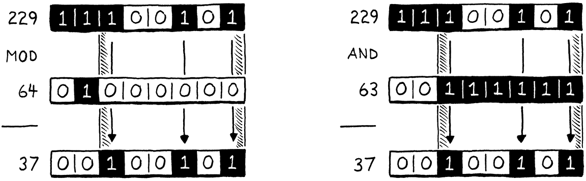
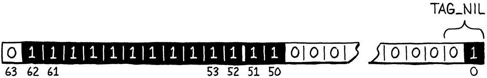

# 优化

> 晚上是一天中最美好的时光。你已经完成了一天的工作。现在您可以站起来享受它了。
> 
> -- Kazuo Ishiguro,*The Remains of the Day*

如果我还住在新奥尔良，我会把这一章称为*lagniappe*，免费赠送给顾客的一些额外东西。你已经有了整本书和一个完整的虚拟机，但我希望你对 clox 进行一些更有趣的黑客攻击。这一次，我们要追求纯粹的性能。我们将对虚拟机应用两种截然不同的优化。在此过程中，您将真正感受到衡量和改进语言实现或任何程序的性能。

## 30.1 度量性能

**优化**意味着使应用程序工作并提高其性能。一个优化的程序做同样的事情，只是需要更少的资源。我们在优化时通常想到的资源是运行时速度，但减少内存使用、启动时间、持久存储大小或网络带宽也很重要。所有物理资源都有一些成本――即使成本主要是浪费人力时间――因此优化工作通常会有回报。

在计算的早期，有一段时间，熟练的程序员可以在脑海中掌握整个硬件架构和编译器管道，并通过认真思考来理解程序的性能。那些日子早已一去不复返了，被微代码、缓存行、分支预测、深度编译器管道和庞大的指令集与现在分开了。我们喜欢假装 C 是一种“低级”语言，但现在 在

```js
printf("Hello, world!");
```

和屏幕上出现的问候语  之间的技术栈 高得吓人。

今天的优化是一门经验科学。我们的程序是一只边境牧羊犬冲过硬件的障碍训练场。如果我们想让她更快地到达终点，我们就不能坐下来思考犬类生理学，直到灵感来袭。相反，我们需要观察她的表现，看看她在哪里绊倒，然后为她找到更快的路径。

就像敏捷训练只针对一只狗和一个障碍赛一样，我们不能假设虚拟机优化将使 所有Lox 程序 在所有硬件  上运行得更快。不同的 Lox 程序强调 VM 的不同区域，不同的架构各有优缺点。

### 30.1.1  基准

当我们添加新功能时，我们通过编写测试来验证正确性――使用新功能并验证 VM 行为的 Lox 程序。测试确定语义并确保我们在添加新功能时不会破坏现有功能。在性能方面，我们有类似的需求：

1. 我们如何验证优化*确实*提高了性能，提高了多少？

2. 我们如何确保其他不相关的更改不会*降低*性能？

我们为实现这些目标而编写的 Lox 程序是**基准 (benchmarks)**。这些是精心设计的程序，强调语言实现的某些部分。他们衡量的不是程序做*了什么*，而是执行它需要多长时间。

> 大多数基准测量运行时间。但是，当然，您最终会发现自己需要编写基准测试来衡量内存分配、垃圾收集器花费的时间、启动时间等。

通过测量更改前后基准的性能，您可以了解更改的效果。当您进行优化时，所有测试的行为都应该与之前完全相同，但希望基准测试运行得更快。

一旦你有了一套完整*的*基准测试，你不仅可以衡量*优化*改变性能， 还可以衡量代码的*种类*。通常您会发现一些基准测试变得更快，而另一些则变得更慢。然后，您必须就您的语言实现针对哪种代码进行优化做出艰难的决定。

您选择编写的基准套件是该决定的关键部分。就像您的测试围绕正确行为的样子编码您的选择一样，您的基准是在性能方面优先考虑的体现。它们将指导您实施哪些优化，因此请谨慎选择您的基准，并且不要忘记定期反思它们是否正在帮助您实现更大的目标。

> 在 JavaScript VM 的早期扩散中，第一个广泛使用的基准测试套件是来自 WebKit 的 SunSpider。在浏览器大战期间，营销人员使用 SunSpider 结果声称他们的浏览器是最快的。这高度激励了 VM 黑客针对这些基准进行优化。
> 
> 不幸的是，SunSpider 程序通常与真实世界的 JavaScript 不匹配。它们大多是微基准测试――快速完成的小玩具程序。这些基准测试会惩罚复杂的即时编译器，这些编译器启动速度较慢，但一旦 JIT 有足够的时间来优化和重新编译热代码路径，就会变得更快。这让 VM 黑客陷入了一个不幸的境地，他们必须在让 SunSpider 数量变得更好，或者实际优化真实用户运行的程序种类之间做出选择。
> 
> 谷歌的 V8 团队通过分享他们的 Octane 基准套件作为回应，该套件在当时更接近真实世界的代码。多年后，随着 JavaScript 使用模式的不断发展，甚至 Octane 也失去了它的用处。期望您的基准测试将随着您的语言生态系统的发展而发展。
> 
> 请记住，最终目标是让*用户程序*更快，而基准测试只是一个代理。

基准测试是一门微妙的艺术。与测试一样，您需要在不过度拟合您的实现的同时确保基准确实满足您关心的代码路径。当您测量性能时，您需要补偿由 CPU 节流、缓存和其他奇怪的硬件和操作系统怪癖引起的差异。我不会在这里给你一个完整的布道，而是将基准测试视为一种随着实践而提高的自身技能。

### 30.1.2 剖析 Profiling

好的，现在您已经有了一些基准。你想让他们走得更快。怎么办？首先，假设您已经完成了所有显而易见的简单工作。您正在使用正确的算法和数据结构――或者，至少，您没有使用严重错误的算法和数据结构。我不认为使用哈希表代替线性搜索通过巨大的未排序数组“优化”与其说是“良好的软件工程”。

由于硬件太复杂，无法根据基本原理推断我们程序的性能，因此我们必须实地考察。这意味着*剖析*。**探查器 (profiler)**（如果您从未使用过的话）是一种运行程序并在代码执行时跟踪硬件资源使用情况的工具。简单的显示您在程序中的每个功能上花费了多少时间。复杂的记录数据缓存未命中、指令缓存未命中、分支预测错误、内存分配和各种其他指标。

> 这里的“你的程序”是指运行*其他*Lox 程序的 Lox VM 本身。我们正在尝试优化 clox，而不是用户的 Lox 脚本。当然，选择将哪个 Lox 程序加载到我们的 VM 中将极大地影响 clox 的哪些部分受到压力，这就是基准测试如此重要的原因。
> 
> 探查器*不会*向我们显示正在运行的脚本中的每个*Lox*函数花费了多少时间。我们必须编写自己的“Lox 探查器”才能做到这一点，这稍微超出了本书的范围。

有许多针对各种操作系统和语言的分析器。无论您在什么平台上编程，都值得熟悉一个像样的分析器。你不需要成为大师。我在将程序扔给分析器几分钟后就学到了一些东西，而这些东西我需要*几天*才能通过反复试验自己发现。分析器是美妙而神奇的工具。

## 30.2 加速哈希表探测

说得够多了，让我们看一些向上和向右的性能图表。事实证明，我们要做的第一个优化是可以对 VM 进行的*最小可能更改。*

当我第一次得到 clox 派生的字节码虚拟机时，我做了任何有自尊的 VM 黑客都会做的事情。我拼凑了几个基准，启动了一个分析器，并通过我的解释器运行这些脚本。在像 Lox 这样的动态类型语言中，很大一部分用户代码是字段访问和方法调用，所以我的一个基准测试看起来像这样：

```js
class Zoo {
  init() {
    this.aardvark = 1;
    this.baboon   = 1;
    this.cat      = 1;
    this.donkey   = 1;
    this.elephant = 1;
    this.fox      = 1;
  }
  ant()    { return this.aardvark; }
  banana() { return this.baboon; }
  tuna()   { return this.cat; }
  hay()    { return this.donkey; }
  grass()  { return this.elephant; }
  mouse()  { return this.fox; }
}

var zoo = Zoo();
var sum = 0;
var start = clock();
while (sum < 100000000) {
  sum = sum + zoo.ant()
            + zoo.banana()
            + zoo.tuna()
            + zoo.hay()
            + zoo.grass()
            + zoo.mouse();
}

print clock() - start;
print sum;
```

> 这个基准测试要谨慎做的另一件事是*使用*它执行的代码的结果。通过计算滚动总和并打印结果，我们确保 VM*必须*执行所有 Lox 代码。这是一个重要的习惯。与我们简单的 Lox VM 不同，许多编译器会进行积极的死代码消除，并且足够聪明，可以丢弃其结果从未使用过的计算。
> 
> 许多编程语言黑客对 VM 在某些基准测试中的出色性能印象深刻，只是意识到这是因为编译器将整个基准测试程序优化得一无是处。

如果您以前从未见过基准测试，这可能看起来很可笑。*这*是怎么回事？该程序本身并不打算做任何有用的事情。它所做的是调用一堆方法并访问一堆字段，因为这些是我们感兴趣的语言部分。字段和方法存在于哈希表中，因此它至少要注意填充*一些*有趣的键在那些表中。这一切都包含在一个大循环中，以确保我们的探查器有足够的执行时间来深入研究并查看循环的去向。

> 如果你真的想对哈希表性能进行基准测试，你应该使用许多不同大小的表。我们在此处添加到每个表的六个键甚至不足以超过哈希表的八元素最小阈值。但我不想向您抛出一个巨大的基准测试脚本。如果你愿意，可以随意添加更多的小动物和零食。

在我告诉你探查器向我展示了什么之前，请花一分钟时间进行一些猜测。您认为 VM 花费大部分时间在 clox 的代码库中的什么地方？我们在前面的章节中是否有任何您怀疑特别慢的代码？

这是我发现的：自然地，包含时间最长的函数是`run()`.（**包含时间**是指在某个函数和它调用的所有其他函数上花费的总时间――从你进入该函数到它返回的总时间。）因为`run()`是主要的字节码执行循环，它驱动一切。

在`run()`内部，在字节码switch各种case下，有一些小块时间用于常见指令，如`OP_POP`,`OP_RETURN`和`OP_ADD`。大而重的指令`OP_GET_GLOBAL`占执行时间的 17%，`OP_GET_PROPERTY`占12%，`OP_INVOKE`占总运行时间的 42%。

所以我们要优化三个热点？实际上，不。因为事实证明，这三个指令几乎所有时间都花在了对同一函数的调用中：`tableGet()`该函数占用了整个 72% 的执行时间（同样包括在内）。现在，在动态类型语言中，我们期望花费相当多的时间在哈希表中查找内容――这是动态的代价。但是，仍然，*哇。*

### 30.2.1 慢键包装

如果您查看`tableGet()`，您会发现它主要是对实际哈希表查找发生位置的 `findEntry()`调用的包装。为了刷新您的记忆，这里是完整的：

```c
static Entry* findEntry(Entry* entries, int capacity,
                        ObjString* key) {
  uint32_t index = key->hash % capacity;
  Entry* tombstone = NULL;

  for (;;) {
    Entry* entry = &entries[index];
    if (entry->key == NULL) {
      if (IS_NIL(entry->value)) {
        // Empty entry.
        return tombstone != NULL ? tombstone : entry;
      } else {
        // We found a tombstone.
        if (tombstone == NULL) tombstone = entry;
      }
    } else if (entry->key == key) {
      // We found the key.
      return entry;
    }

    index = (index + 1) % capacity;
  }
}
```

当运行之前的基准测试时――至少在我的机器上――VM将 70% 的总执行时间花在这个函数的一行上。能猜出是哪一行吗？不？是这样的：

```c
uint32_t index = key->hash % capacity;
```

指针间接引用不是问题。是这个小`%`。事实证明模运算符*真的很*慢。比其他算术运算符慢得多。我们能做得更好吗？

> 流水线使得很难谈论单个 CPU 指令的性能，但为了让您感受一下，除法和取模比 x86 上的加法和减法慢大约 30-50倍。

在一般情况下，很难以比 CPU 本身更快的方式在用户代码中重新实现基本算术运算符。毕竟，我们的 C 代码最终会编译成 CPU 自己的算术运算。如果有我们可以用来更快的技巧，芯片早就在使用它们了。

然而，我们可以利用我们比 CPU 更了解我们的问题这一事实。我们在这里使用模数来获取关键字符串的哈希码并将其包装以适合表条目数组的范围。该数组从八个元素开始，每次增长两倍。我们知道――而 CPU 和 C 编译器不知道――我们的表的大小总是 2 的幂。

因为我们是聪明的bit玩弄者，所以我们知道一种更快的方法来计算一个数对 2 的幂取模的余数：**位掩码**。假设我们要计算 229 d对64的模。答案是 37，这在十进制中不是特别明显，但是当您以二进制查看这些数字时会更清楚：



在插图的左侧，注意结果 (37) 是 被除数 (229)  简单地去掉最高的两位的结果 ，最高的两位是在被除数中唯一的1的左侧。

在右侧，我们取得  将 229 和 63 按位AND运算得到相同的结果，这比我们原来的除数的幂小一。从 2 的幂中减去 1 得到一系列 1 位。这正是我们为了去除最左边的两个位而需要的掩码。

换句话说，您计算一个数对 2 的任意幂的模 ,可以通过简单地 通  2 的任意幂减 1 计算AND 来获取 。我不是一个足够的数学家来向你*证明*这是可行的，但如果你仔细想想，它应该是有道理的。我们可以用非常快的递减和按位与替换那个慢的模运算符。我们只需将有问题的代码行更改为：

```c
static Entry* findEntry(Entry* entries, int capacity,
                        ObjString* key) {
  uint32_t index = key->hash & (capacity - 1);
  Entry* tombstone = NULL;
// table.c, in findEntry(), replace 1 line
```

CPU 喜欢按位运算符，因此很难对其进行改进。

> 另一个潜在的改进是通过直接存储位掩码而不是容量来消除递减。在我的测试中，这没有什么不同。如果 CPU 在其他地方出现瓶颈，指令流水线可以让一些操作基本上免费。

我们的线性探测搜索可能需要环绕数组的末尾，因此还有另一个模数`findEntry()`要更新。

```c
      // We found the key.
      return entry;
    }

    index = (index + 1) & (capacity - 1);
  }
// table.c, in findEntry(), replace 1 line
```

这行没有出现在探查器中，因为大多数搜索都没有换行。

该`findEntry()`函数有一个姊妹函数，`tableFindString()`它对驻留(intern)字符串进行哈希表查找。我们也可以在那里应用相同的优化。只有在驻留(intern)字符串时才会调用此函数，而我们的基准测试并未对此施加很大压力。但是创建大量字符串的 Lox 程序可能会明显受益于此更改。

```c
  if (table->count == 0) return NULL;

  uint32_t index = hash & (table->capacity - 1);
  for (;;) {
    Entry* entry = &table->entries[index];
// table.c, in tableFindString(), replace 1 line
```

以及当线性探测回绕时。

```c
      return entry->key;
    }

    index = (index + 1) & (table->capacity - 1);
  }
// table.c, in tableFindString(), replace 1 line
```

让我们看看修复是否值得。我调整了动物学基准以计算它可以在 10 秒内运行多少批次的 10,000 次调用。更多批次等于更快的性能。在我使用未优化代码的机器上，基准测试通过了 3,192 个批次。优化后，跳到 6,249。


在相同的时间内，这几乎是工作量的两倍。我们使 VM 的速度提高了一倍（通常的警告：在此基准测试中）。在优化方面，这是一个巨大的胜利。如果你能在这里或那里抓住几个百分点，通常你会感觉很好。由于方法、字段和全局变量在 Lox 程序中非常普遍，因此这种微小的优化可以全面提高性能。几乎每个 Lox 计划都会受益。

> 我们最初的基准测试固定了*工作量*，然后测量了*时间*。更改脚本以计算它在 10 秒内可以执行多少批调用可以确定时间并衡量工作量。对于性能比较，我喜欢后一种衡量标准，因为报告的数字代表*速度*。您可以直接比较优化前后的数字。在测量执行时间时，您必须做一些算术运算才能获得良好的性能相对测量值。

现在，本节的重点*并不是*说模运算符是极其邪恶的，你应该从你编写的每个程序中杜绝它。微观优化也不是一项重要的工程技能。性能问题很少有如此狭窄、有效的解决方案。我们很幸运。

关键是，在分析器告诉我们之前，我们不*知道*模运算符会消耗性能。如果我们在 VM 的代码库中四处走动，盲目地猜测热点，我们可能不会注意到它。我想让你明白的是，在你的工具箱中拥有一个探查器是多么重要。

为了强调这一点，让我们继续在我们现在优化的 VM 中运行原始基准测试，看看分析器向我们展示了什么。在我的机器上，`tableGet()`仍然有相当大的执行时间。对于动态类型的语言来说，这是可以预料的。但它已从占总执行时间的 72% 下降到 35%。这更符合我们希望看到的情况，表明我们的优化不仅使程序更快，而且以*我们预期的方式*使其更快。探查器对于验证解决方案和发现问题一样有用。

## 30.3 NaN Boxing

下一个优化有一个非常不同的感觉。值得庆幸的是，尽管名字很奇怪，但它并不涉及打你的祖母。它是不同的，但并没有*那么*不同。通过我们之前的优化，分析器告诉我们问题出在哪里，我们只需要发挥一些聪明才智来想出解决方案。

这种优化更加微妙，其性能影响在整个虚拟机中更加分散。探查器不会帮助我们想出这个。相反，它是由深入思考机器架构最低层的人发明的。

> 我不确定是谁第一个想出这个把戏的。我能找到的最早资料是 David Gudeman 1993 年的论文“Representing Type Information in Dynamically Typed Languages”。其他人都引用了这一点。但古德曼自己说，这篇论文并不是小说作品，而是“汇集了大量民间传说”。
> 
> 也许发明者已经迷失在时间的迷雾中，或者它已经被重新发明了很多次。任何在 IEEE 754 上思考足够长的人都可能开始考虑尝试将一些有用的东西塞入所有那些未使用的 NaN 位中。

正如标题所说，这种优化称为**NaN 装箱 (?NaN boxing)** 或有时 称为**NaN 标记(NaN tagging)**。我个人喜欢后一个名称，因为“装箱”往往暗示某种堆分配表示形式，但前者似乎是使用更广泛的术语。这种技术改变了我们在 VM 中表示值的方式。

在 64 位机器上，我们的 Value 类型占用 16 个字节。该结构有两个字段，一个类型标记和一个用于有效负载的union。union中最大的字段是一个 Obj 指针和一个 double，都是 8 个字节。为了使union字段与 8 字节边界对齐，编译器也在标记后添加了填充：


那是相当大的。如果我们可以减少它，那么 VM 可以将更多值打包到相同数量的内存中。现在大多数计算机都有足够的 RAM，因此直接节省内存并不是什么大问题。但是较小的表示意味着更多的值适合缓存行。这意味着更少的缓存未命中，这会影响*速度*。

如果 Values 需要与其最大有效负载大小对齐，而 Lox 数字或 Obj 指针需要完整的 8 个字节，我们如何才能变得更小在像 Lox 这样的动态类型语言中，每个值不仅需要携带其有效负载，还**需要携带足够的附加信息来确定运行时值的类型**。如果一个 Lox 数字已经使用了完整的 8 个字节，我们可以在哪里储存一些额外的位来告诉运行时“这是一个数字”？

这是动态语言黑客长期存在的问题之一。它特别困扰他们，因为静态类型语言通常没有这个问题。每个值的类型在编译时都是已知的，因此在运行时不需要额外的内存来跟踪它。当您的 C 编译器编译 32 位 int 时，生成的变量*恰好*获得32 位存储空间。

动态语言的人讨厌在静态阵营中失利，所以他们想出了很多非常聪明的方法来将类型信息和有效载荷打包成少量的比特。NaN boxing 就是其中之一。它特别适合 JavaScript 和 Lua 等语言，其中所有数字都是双精度浮点数。Lox 也在同一条船上。

### 30.3.1 什么是（不是）数字？

在我们开始优化之前，需要真正了解 CPU 如何表示浮点数。今天几乎所有的机器都使用相同的方案，编码在古老的卷轴[IEEE 754](https://en.wikipedia.org/wiki/IEEE_754)中，凡人称为“浮点运算的 IEEE 标准”。

在您的计算机眼中，一个64 位、双精度、IEEE 浮点数看起来像这样：

> 一个句子有很多连字符。


- 从右边开始，前 52 位是**fraction**、**mantissa**或**significand**位。它们将数字的有效数字表示为二进制整数。

- 旁边是 11 个**指数**位。这些告诉您尾数从小数点（嗯，二进制）点偏移了多远。

- 最高位是**符号位**，表示这个数是正数还是负数。

我知道这有点含糊，但本章并不是对浮点表示的深入探讨。如果您想知道指数和尾数如何一起发挥作用，那里已经有比我写的更好的解释了。

> 由于符号位始终存在，即使数字为零，这也意味着“正零”和“负零”具有不同的位表示形式，事实上，IEEE 754 确实区分了它们。

对于我们的目的而言，重要的部分是规范制定了一个特例指数。当设置了**所有指数位**时，该值不仅代表一个非常大的数字，而且具有不同的含义。这些值是“Not a Number”（因此是**NaN**）值。它们代表无穷大或除以零的结果等概念。

无论尾数位如何，指数位**都**已设置的任何双精度数都是 NaN。这意味着有许许多多不同的NaN 位模式。IEEE 754 将它们分为两类。最高尾数位为 0 的值称为**信号 NaN (signalling NaNs)**，而其他值称为**安静 NaN (quiet NaNs)**。信号 NaN 旨在作为错误计算的结果，例如被零除。芯片可以检测何时产生这些值之一并完全中止程序。如果您尝试阅读它们，它们可能会自我毁灭。

> 我不知道是否有任何 CPU 实际上*会*捕获 NaN 信号并中止。规范只是说他们*可以*。

Quiet NaN 应该使用起来更安全。它们不代表有用的数值，但至少应该不会在您触摸它们时让您的手着火。

设置了所有指数位和设置了最高尾数位的每个 double 都是一个安静的 NaN。这留下 52 位下落不明。我们将避免其中一个，这样我们就不会踩到 Intel 的“QNaN 浮点不确定”值，留下 51 位。那些剩余的位可以是任何东西。我们说的是 2,251,799,813,685,248 个独特的安静 NaN 位模式。


这意味着 64 位双精度数有足够的空间来存储所有各种不同的数字浮点值，并且*还有*空间容纳我们可以随意使用的另外 51 位数据。这有足够的空间来预留几个位模式来表示 Lox 的`nil`、`true`和`false`值。但是 Obj 指针呢？指针不需要完整的 64 位吗？

幸运的是，我们还有另一个妙招。是的，从技术上讲，64 位架构上的指针是 64 位的。但是，我所知道的体系结构实际上没有使用整个地址空间。相反，当今最广泛使用的芯片只使用低48位。其余 16 位未指定或始终为零。

> 48 位足以寻址 262,144 GB 的内存。现代操作系统还为每个进程提供了自己的地址空间，因此应该足够了。

如果我们有 51 位，我们可以在其中填充一个 48 位指针，并留出 3 位。这三位刚好足以存储微小的类型标签以区分`nil`、布尔值和 Obj 指针。

这就是 NaN boxing。在单个 64 位双精度数中，您可以存储所有不同的浮点数值、指针或其他几个特殊标记值中的任何一个。我们当前 Value 结构的内存使用量减半，同时保留所有保真度。

这种表示的特别好的地方在于不需要*将*数字双精度值转换为“boxed”形式。Lox 数字*只是*普通的 64 位双精度数。我们仍然需要在使用它们之前*检查*它们的类型，因为 Lox 是动态类型的，但是我们不需要进行任何位移或指针间接来从“值”到“数字”。

对于其他值类型，当然有一个转换步骤。但是，幸运的是，我们的 VM 隐藏了从值到原始类型的所有机制，这些机制隐藏在一些宏后面。重写那些以实现 NaN boxing，VM 的其余部分应该可以正常工作。

### 30.3.2 有条件支持

我知道您还不清楚这个新表示的细节。别担心，它们会在我们实施过程中具体化。在开始之前，我们将放置一些编译时脚手架。

对于我们之前的优化，我们重写了之前比较慢的代码，就完成了。这个有点不同。NaN 装箱依赖于芯片如何表示浮点数和指针的一些非常低级的细节。它*可能*适用于您可能遇到的大多数 CPU，但您永远无法完全确定。

如果我们的 VM 仅仅因为它的值表示而完全失去对架构的支持，那就太糟糕了。为避免这种情况，我们将继续支持Value的 old tagged union 实现和新的 NaN boxing形式。我们使用此标志在编译时选择我们想要的表示形式：

```c
#include <stdint.h>

#define NAN_BOXING
#define DEBUG_PRINT_CODE
// common.h
```

如果已定义，VM 将使用新的形式。否则，它将恢复为旧样式。只需关注 值表示细节的几段代码――主要是一些用于包装和解包值的宏――根据是否设置了这个标志而有所不同。VM 的其余部分可以继续其愉快的方式。

大部分工作发生在“value”模块中，我们在其中为新类型添加了一个部分。

```c
typedef struct ObjString ObjString;

#ifdef NAN_BOXING

typedef uint64_t Value;

#else

typedef enum {
// value.h
```

当启用 NaN 装箱时，值的实际类型是一个扁平的无符号 64 位整数。我们可以改用 double，这将使处理 Lox 数字的宏更简单一些。但是所有其他宏都需要进行按位运算，而 uint64_t 是一种更友好的类型。在这个模块之外，VM 的其余部分并不真正关心这种或那种方式。

在我们开始重新实现这些宏之前，我们关闭旧表示定义末尾的`#ifdef`的 `#else`分支 。

```c
#define OBJ_VAL(object)   ((Value){VAL_OBJ, {.obj = (Obj*)object}})

#endif

typedef struct {
// value.h
```

我们剩下的任务只是简单地用`#ifdef`第一部分中已有的所有内容的`#else`新实现来填充第一部分。我们将一次处理一种值类型，从最简单到最难。

### 30.3.3 数字

我们将从数字开始，因为它们在 NaN boxing下具有最直接的表示。要将 C double“转换”为 NaN boxing的 clox 值，我们不需要触摸任何一位―表示完全相同。但是我们确实需要让我们的 C 编译器相信这个事实，我们通过将 Value 定义为 uint64_t 来使它变得更难。

我们需要让编译器获取一组它认为是双精度的位，并将这些位用作 uint64_t，反之亦然。这称为**类型双关(type punning)**。自喇叭裤和 8 轨时代以来，C 和 C++ 程序员一直在这样做，但语言规范犹豫不决，无法说明官方认可的多种方法中的哪一种。

> 规范作者不喜欢类型双关，因为它使优化变得更加困难。一项关键的优化技术是重新排序指令以填充 CPU 的执行管道。显然，编译器只有在这样做不会产生用户可见的效果时才能重新排序代码。
> 
> 指针使这更难。如果两个指针指向相同的值，则不能对一个写入和另一个读取进行重新排序。但是两个*不同*类型的指针呢？如果它们可以指向同一个对象，那么基本上*任何*两个指针都可以是同一个值的别名。这极大地限制了编译器可以自由重新排列的代码量。
> 
> 为避免这种情况，编译器希望采用**严格的别名**――不兼容类型的指针不能指向相同的值。类型双关本质上打破了这个假设。

我知道一种将 `double`来回转换`Value`的方法，我相信 C 和 C++ 规范都支持这种方法。不幸的是，它不适合单个表达式，因此转换宏必须调用辅助函数。这是第一个宏：

```c
typedef uint64_t Value;

#define NUMBER_VAL(num) numToValue(num)

#else
// value.h
```

该宏在这里传递了双精度值：

```c
#define NUMBER_VAL(num) numToValue(num)

static inline Value numToValue(double num) {
  Value value;
  memcpy(&value, &num, sizeof(double));
  return value;
}

#else
// value.h
```

我知道，很奇怪，对吧？将一系列字节视为具有不同类型而不改变它们的值的方法是`memcpy()`？这看起来慢得可怕：创建一个局部变量。通过系统调用将其地址传递给操作系统以复制几个字节。然后返回结果，它与输入的字节完全相同。值得庆幸的是，因为这*是*支持类型双关的习惯用法，所以大多数编译器都能识别该模式并`memcpy()`完全优化掉。

“展开”一个 Lox 数是镜像。

```c
typedef uint64_t Value;

#define AS_NUMBER(value)    valueToNum(value)

#define NUMBER_VAL(num) numToValue(num)
// value.h
```

该宏调用此函数：

```c
#define NUMBER_VAL(num) numToValue(num)

static inline double valueToNum(Value value) {
  double num;
  memcpy(&num, &value, sizeof(Value));
  return num;
}

static inline Value numToValue(double num) {
// value.h
```

它的工作原理完全相同，只是我们交换了类型。同样，编译器将消除所有这些。即使那些调用`memcpy()`将消失，我们仍然需要显示我们正在调用的编译，`memcpy()`所以我们还需要一个include。

> 如果您发现自己使用的编译器无法优化`memcpy()`，请尝试以下操作：
> 
> ```c
> double valueToNum(Value value) {
>   union {
>     uint64_t bits;
>     double num;
>   } data;
>   data.bits = value;
>   return data.num;
> }
> ```

```c
#define clox_value_h

#include <string.h>

#include "common.h"
// value.h
```

那是很多代码，最终什么都不做，只是让 C 类型检查器静音。对 Lox 编号进行运行时类型*测试*会更有趣一些。如果我们所拥有的只是一个 double 的位，我们如何判断它*是*一个 double是时候玩转了。

```c
typedef uint64_t Value;

#define IS_NUMBER(value)    (((value) & QNAN) != QNAN)

#define AS_NUMBER(value)    valueToNum(value)
// value.h
```

我们知道，每个*不是*数字的值都将使用特殊的安静 NaN 表示。我们假设我们已经正确地避免了任何可能通过对数字进行算术而实际产生的有意义的 NaN 表示。

如果 double 设置了所有 NaN 位，并且设置了 quiet NaN 位，并且为了更好的衡量标准还设置了一个，我们可以非常确定它是我们自己为其他类型预留的位模式之一。为了检查这一点，我们屏蔽了除了我们的一组安静的 NaN 位之外的所有位。如果*所有*这些位都已设置，则它必须是其他 Lox 类型的 NaN boxing值。否则，它实际上是一个数字。

> 相当确定，但不能严格保证。据我所知，没有什么能阻止 CPU 产生 NaN 值作为某些操作的结果，其位表示与我们声明的位表示冲突。但是在我对许多架构的测试中，我还没有看到它发生。

一组安静的 NaN 位声明如下：

```c
#ifdef NAN_BOXING

#define QNAN     ((uint64_t)0x7ffc000000000000)

typedef uint64_t Value;
// value.h
```

如果 C 支持二进制文字就好了。但是，如果您进行转换，您会看到该值与此相同：


这正是所有的指数位，加上安静的 NaN 位，再加上一个额外的位来避开 Intel 值。

### 30.3.4 Nil, true, and false

下一个要处理的类型是`nil`。这很简单，因为只有一个`nil`值，因此我们只需要一个位模式来表示它。还有另外两个单例值，两个布尔值，`true`和`false`。这需要总共三个独特的位模式。

两位给了我们四种不同的组合，这已经足够了。我们将未使用的尾数空间的两个最低位声明为“类型标签”，以确定我们正在查看这三个单例值中的哪一个。三个类型标签定义如下：

```c
#define QNAN     ((uint64_t)0x7ffc000000000000)

#define TAG_NIL   1 // 01.
#define TAG_FALSE 2 // 10.
#define TAG_TRUE  3 // 11.

typedef uint64_t Value;
// value.h
```

因此，我们的表示`nil`是定义我们的安静 NaN 表示所需的所有位以及`nil`类型标记位：



在代码中，我们像这样检查这些位：

```c
#define AS_NUMBER(value)    valueToNum(value)

#define NIL_VAL         ((Value)(uint64_t)(QNAN | TAG_NIL))
#define NUMBER_VAL(num) numToValue(num)
// value.h
```

我们简单地按位OR安静的 NaN 位和类型标记，然后做一个小演员舞蹈来告诉 C 编译器我们想要这些位表示什么。

由于`nil`只有一位表示，我们可以在 uint64_t 上使用相等性来查看 Value 是否为`nil`。

```c
typedef uint64_t Value;

#define IS_NIL(value)       ((value) == NIL_VAL)
#define IS_NUMBER(value)    (((value) & QNAN) != QNAN)
// value.h
```

你可以猜到我们是如何定义`true`和`false`值的。

```c
#define AS_NUMBER(value)    valueToNum(value)

#define FALSE_VAL       ((Value)(uint64_t)(QNAN | TAG_FALSE))
#define TRUE_VAL        ((Value)(uint64_t)(QNAN | TAG_TRUE))
#define NIL_VAL         ((Value)(uint64_t)(QNAN | TAG_NIL))
// value.h
```

这些位看起来像这样：


要将 C bool 转换为 Lox Boolean，我们依赖于这两个单例值和良好的旧条件运算符。

```c
#define AS_NUMBER(value)    valueToNum(value)

#define BOOL_VAL(b)     ((b) ? TRUE_VAL : FALSE_VAL)
#define FALSE_VAL       ((Value)(uint64_t)(QNAN | TAG_FALSE))
// value.h
```

可能有一种更聪明的按位方式来做到这一点，但我的直觉是编译器可以比我更快地找出一个。转向另一个方向更简单。

```c
#define IS_NUMBER(value)    (((value) & QNAN) != QNAN)

#define AS_BOOL(value)      ((value) == TRUE_VAL)
#define AS_NUMBER(value)    valueToNum(value)
// value.h
```

因为我们知道在 Lox 中恰好有两个布尔位表示――不像在 C 中，任何非零值都可以被认为是“真”――如果它不是`true`，它一定是`false`。此宏确实假设您仅在您知道*是*Lox 布尔值的值上调用它。为了检查这一点，还有一个宏。

```c
typedef uint64_t Value;

#define IS_BOOL(value)      (((value) | 1) == TRUE_VAL)
#define IS_NIL(value)       ((value) == NIL_VAL)
// value.h
```

这看起来有点奇怪。一个更明显的宏看起来像这样：

```c
#define IS_BOOL(v) ((v) == TRUE_VAL || (v) == FALSE_VAL)
```

不幸的是，这并不安全。扩展中提到`v`了两次，这意味着如果该表达式有任何副作用，它们将被执行两次。我们可以让宏调用一个单独的函数，但是，呃，多麻烦啊。

相反，我们对值进行按位或1 以合并仅有的两个有效布尔位模式。这留下了值可以处于的三个潜在状态：

1. 它曾经`FALSE_VAL`并且现在已经转换为`TRUE_VAL`.

2. 过去是`TRUE_VAL`，`| 1`什么也没做，现在仍然是`TRUE_VAL`。

3. 这是其他一些非布尔值。

那时，我们可以简单地将结果与`TRUE_VAL`进行比较，看看我们是处于前两种状态还是第三种状态。

### 30.3.5 对象

最后一种值类型是最难的。与单例值不同，我们需要将数十亿个不同的指针值装入 NaN 中。这意味着我们既需要某种标记来指示这些特定的 NaN*是*Obj 指针，也需要为地址本身留出空间。

我们用于单例值的标记位位于我决定存储指针本身的区域，因此我们不能轻易地在那里使用不同的位来指示该值是一个对象引用。然而，还有一点我们没有使用。由于我们所有的 NaN 值都不是数字――它就在名称中――符号位不用于任何事情。我们将继续使用它作为对象的类型标签。如果我们的一个 quiet NaN 设置了符号位，那么它就是一个 Obj 指针。否则，它必须是先前的单例值之一。

> 实际上，即使值是 Obj 指针，我们也*可以使用最低位来存储类型标记。*这是因为 Obj 指针总是与 8 字节边界对齐，因为 Obj 包含一个 64 位字段。反过来，这意味着 Obj 指针的三个最低位将始终为零。我们可以在其中存储我们想要的任何内容，并在取消引用指针之前将其屏蔽掉。
> 
> 这是另一种值表示优化，称为**指针标记**。

如果设置了符号位，则剩余的低位存储指向 Obj 的指针：


要将原始 Obj 指针转换为值，我们获取指针并设置所有安静的 NaN 位和符号位。

```c
#define NUMBER_VAL(num) numToValue(num)
#define OBJ_VAL(obj) \
    (Value)(SIGN_BIT | QNAN | (uint64_t)(uintptr_t)(obj))

static inline double valueToNum(Value value) {
// value.h
```

指针本身是一个完整的 64 位，原则上，它可能因此与一些安静的 NaN 和符号位重叠。但实际上，至少在我测试过的体系结构中，指针中第 48 位以上的所有内容始终为零。这里进行了很多转换，我发现这是满足一些最挑剔的 C 编译器所必需的，但最终结果只是将一些位拼凑在一起。

> 当涉及到本书中的代码时，我尽量遵循法律的条文，所以这一段是可疑的。在优化时，您不仅要突破*规范所说*的可以做的事情，还要突破真正的编译器和芯片让您摆脱困境的界限。
> 
> 超出规范会有风险，但在无法无天的领域也有回报。由您决定收益是否值得。

我们这样定义符号位：

```c
#ifdef NAN_BOXING

#define SIGN_BIT ((uint64_t)0x8000000000000000)
#define QNAN     ((uint64_t)0x7ffc000000000000)

// value.h
```

要恢复 Obj 指针，我们只需屏蔽掉所有这些额外的位即可。

```c
#define AS_NUMBER(value)    valueToNum(value)
#define AS_OBJ(value) \
    ((Obj*)(uintptr_t)((value) & ~(SIGN_BIT | QNAN)))

#define BOOL_VAL(b)     ((b) ? TRUE_VAL : FALSE_VAL)
// value.h
```

波浪号 (`~`)，如果您之前没有做过足够多的位操作来遇到它，则按位取反。它切换其操作数中的所有 1 和 0。通过用 quiet NaN 和符号位的按位求反来屏蔽值，我们*清除*了这些位并让指针位保留。

最后一个宏：

```c
#define IS_NUMBER(value)    (((value) & QNAN) != QNAN)
#define IS_OBJ(value) \
    (((value) & (QNAN | SIGN_BIT)) == (QNAN | SIGN_BIT))

#define AS_BOOL(value)      ((value) == TRUE_VAL)
// value.h
```

存储 Obj 指针的值已设置其符号位，但任何负数也是如此。要判断一个 Value 是否是一个 Obj 指针，我们需要检查符号位和所有安静的 NaN 位是否都已设置。这类似于我们检测单例值类型的方式，只是这次我们使用符号位作为标记。

### 30.3.6 值函数 value functions

VM 的其余部分在使用值时通常会通过宏，所以我们几乎完成了。然而，“value”模块中有几个函数可以窥视 Value 的其他黑盒子并直接使用它的编码。我们也需要解决这些问题。

第一个是`printValue()`。每个值类型都有单独的代码。我们不再有可以打开的显式类型枚举，因此我们使用一系列类型测试来处理每种值。

```c
void printValue(Value value) {
#ifdef NAN_BOXING
  if (IS_BOOL(value)) {
    printf(AS_BOOL(value) ? "true" : "false");
  } else if (IS_NIL(value)) {
    printf("nil");
  } else if (IS_NUMBER(value)) {
    printf("%g", AS_NUMBER(value));
  } else if (IS_OBJ(value)) {
    printObject(value);
  }
#else
  switch (value.type) {
// value.c, in printValue()
```

这在技术上比开关慢一点，但与实际写入流的开销相比，它可以忽略不计。

我们仍然支持原始的标记联合表示，因此我们保留旧代码并将其包含在`#else`条件部分中。

```c
  }
#endif
}
// value.c, in printValue()
```

另一个操作是测试两个值是否相等。

```c
bool valuesEqual(Value a, Value b) {
#ifdef NAN_BOXING
  return a == b;
#else
  if (a.type != b.type) return false;
// value.c, in valuesEqual()
```

没有比这更简单的了！如果两个位表示相同，则值相等。这对单例值来说是正确的，因为每个单例值都有唯一的位表示，并且它们只等于它们自己。它也为 Obj 指针做了正确的事情，因为对象使用标识来表示相等――只有当两个 Obj 引用指向完全相同的对象时它们才相等。

数字也*大多是*正确的。大多数具有不同位表示的浮点数都是不同的数值。然而，IEEE 754 包含一个坑洞，让我们感到困惑。由于我不完全清楚的原因，规范要求 NaN values are not equal to themselves。对于我们为自己的目的使用的特殊安静 NaN，这不是问题。但是在 Lox 中产生一个“真正的”算术 NaN 是可能的，如果我们想正确地实现 IEEE 754 数字，那么结果值不应该等于它本身。更具体地说：

```c
var nan = 0/0;
print nan == nan;
```

IEEE 754 说这个程序应该打印“false”。它使用我们旧的标记联合表示做正确的事情，因为这种`VAL_NUMBER`情况适用`==`于 C 编译器知道是双精度的两个值。因此，编译器生成正确的 CPU 指令来执行 IEEE 浮点相等。

我们的新表示通过将 Value 定义为 uint64_t 打破了这一点。如果我们想*完全*符合 IEEE 754，我们需要处理这种情况。

```c
#ifdef NAN_BOXING
  if (IS_NUMBER(a) && IS_NUMBER(b)) {
    return AS_NUMBER(a) == AS_NUMBER(b);
  }
  return a == b;
// value.c, in valuesEqual()
```

我知道，这很奇怪。每次我们检查两个 Lox 值是否相等时，进行这种类型测试都会产生性能成本。如果我们愿意牺牲一点兼容性――谁*真正*关心 NaN 是否不等于它自己？-我们可以把它关掉。我会留给你来决定你想变得多么迂腐。

> 事实上，jlox 弄错了 NaN 相等性。当您使用 比较原始双打时，Java 会做正确的事情`==`，但如果您将它们装箱到 Double 或 Object 并使用 比较它们，Java 就会做正确的事情`equals()`，这就是 jlox 实现相等性的方式。

最后，我们关闭围绕旧实现的条件编译部分。

```c
  }
#endif
}
// value.c, in valuesEqual()
```

就是这样。这个优化就完成了，我们的 clox 虚拟机也是如此。那是书中新代码的最后一行。

### 30.3.7 评估性能

代码已经完成，但我们仍然需要弄清楚我们是否真的通过这些更改做了更好的事情。像这样评估优化与之前的优化有很大不同。在那里，我们在探查器中看到了一个清晰的热点。我们修复了那部分代码，可以立即看到热点变得更快。

更改值表示的影响更加分散。宏在使用它们的任何地方都被扩展，因此性能变化以许多分析器难以很好跟踪的方式分布在整个代码库中，尤其是在优化构建中。

> 在进行分析工作时，您几乎总是希望分析程序的优化“发布”版本，因为它反映了最终用户体验的性能故事。编译器优化（如内联）可以显着影响代码的哪些部分是性能热点。手动优化调试构建可能会让您放弃“修复”优化编译器已经为您解决的问题。
> 
> 确保您不会意外地对调试版本进行基准测试和优化。我似乎每年至少犯一次这样的错误。

我们也不能轻易*推断*出我们的变化的影响。我们使值更小，从而减少了整个 VM 的缓存未命中率。但该更改的实际性能效果在很大程度上取决于正在运行的 Lox 程序的内存使用情况。一个微小的 Lox 微基准测试可能没有足够的值散布在内存中以致于效果不明显，甚至像 C 内存分配器分发给我们的地址之类的东西也会影响结果。

如果我们做对了工作，基本上一切都会变得更快一些，尤其是在更大、更复杂的 Lox 程序上。但是，当 NaN 装箱值时，我们执行的额外按位运算可能会抵消更好的内存使用带来的收益。像这样进行性能工作令人不安，因为您无法轻易*证明*您已经使 VM 变得更好。你不能指着一个单一的手术目标微基准说，“在那里，看到了吗？”

相反，我们真正需要的是*一套*更大的基准。理想情况下，它们应该是从现实世界的应用程序中提炼出来的――而不是像 Lox 这样的玩具语言存在这样的事情。然后我们可以衡量所有这些方面的总体绩效变化。我尽力拼凑了一些较大的 Lox 程序。在我的机器上，新的值表示似乎使一切都快了大约 10%。

这并不是一个巨大的改进，尤其是与使哈希表查找速度更快的深远影响相比。我添加此优化在很大程度上是因为它是您可能遇到的某种性能工作的一个很好的例子，老实说，因为我认为它在技术上真的很酷。如果我认真地尝试使 clox 更快，这可能不是我首先要做的事情。可能还有其他更容易实现的成果。

但是，如果您发现自己从事的项目已经取得了所有轻松的胜利，那么在某些时候您可能需要考虑调整您的价值表示。我希望本章已经阐明了您在该领域的一些选择。

## 30.4 下一步去哪里

我们将在 Lox 语言和我们的两个解释器上停止。我们可以永远修补它，添加新的语言功能和巧妙的速度改进。但是，对于这本书，我认为我们已经自然而然地完成了我们的工作。我不会重复我们在过去许多页中学到的所有内容。你和我在一起，你记得。相反，我想花一点时间谈谈您从这里可以去哪里。您的编程语言之旅的下一步是什么？

你们中的大多数人可能不会将职业生涯的大部分时间花在编译器或解释器上。它只占计算机科学学术界的一小部分，在工业软件工程中所占的比例甚至更小。没关系。即使您这辈子再也没有使用过编译器，您也一定会*使用*它，我希望这本书能让您更好地理解您所使用的编程语言是如何设计和实现的。

您还学习了一些重要的基础数据结构，并获得了一些进行低级分析和优化工作的实践。无论您在哪个领域编程，这种专业知识都会有所帮助。

我也希望我给了你一种看待和解决问题的新方法。即使您再也没有研究过一种语言，您可能会惊讶地发现有多少编程问题可以被视为类语言*问题*。也许您需要编写的报告生成器可以建模为生成器“执行”的一系列基于堆栈的“指令”。您需要呈现的用户界面看起来非常像遍历 AST。

> 这也适用于其他领域。我不认为我在编程中学到的任何一个主题――甚至在编程之外――我最终都发现在其他领域有用。我最喜欢的软件工程方面之一是它对那些具有不拘一格兴趣的人的奖励。

如果您确实想深入了解编程语言的兔子洞，这里有一些关于探索隧道中哪些分支的建议：

- 我们简单的单程字节码编译器将我们推向了主要的运行时优化。在一个成熟的语言实现中，编译时优化通常更为重要，编译器优化的领域非常丰富。拿起一本经典的编译器书籍，将 clox 或 jlox 的前端重建为一个复杂的编译管道，其中包含一些有趣的中间表示和优化过程。
  
  动态类型会对你能走多远施加一些限制，但你仍然可以做很多事情。或者你可能想要大跃进并向 Lox 添加静态类型和类型检查器。这肯定会让你的前端有更多的东西可以咀嚼。
  
  我喜欢 Cooper 和 Torczon 的*Engineering a Compiler* for this。Appel 的 *Modern Compiler Implementation*书籍也很受欢迎。

- 在这本书中，我的目标是正确，但不是特别严格。我的目标主要是让您对从事语言工作有直觉和感觉。如果你喜欢更精确，那么整个编程语言学术界都在等着你。语言和编译器在我们拥有计算机之前就已经被正式研究过，因此不乏关于解析器理论、类型系统、语义和形式逻辑的书籍和论文。沿着这条路走下去还会教你如何阅读 CS 论文，这本身就是一项很有价值的技能。

- 或者，如果您真的喜欢黑客攻击和创造语言，您可以使用 Lox 并将其变成您自己的玩物。将语法更改为令您满意的内容。添加缺少的功能或删除您不喜欢的功能。在那里堵塞新的优化。

> 这本书的文字版权归我所有，但 jlox 和 clox 的代码*和*实现使用非常宽松的*MIT*[许可证](https://en.wikipedia.org/wiki/MIT_License)。非常欢迎您[选择其中任何一位解释器](https://github.com/munificent/craftinginterpreters)，并随心所欲地与他们为伍。去镇上。
> 
> 如果您对语言进行重大更改，最好也更改名称，主要是为了避免混淆人们对“Lox”这个名称所代表的含义。

 最终你可能会达到这样一个地步，即你拥有一些你认为其他人也可以使用的东西。这将带您进入编程语言*流行*的截然不同的世界。期望花费大量时间编写文档、示例程序、工具和有用的库。该领域充满了争夺用户的语言。要在该领域蓬勃发展，您必须戴上营销帽子并进行*销售*。不是每个人都喜欢这种面向公众的工作，但如果你喜欢，看到人们使用你的语言来表达自己会非常令人欣慰。

或者也许这本书已经满足了你的渴望，你会在这里停下来。无论你走哪条路，或者不走哪条路，我都希望给你一个教训。像我一样，您最初可能会被编程语言吓倒。但在这些章节中，您已经看到，如果我们亲力亲为，一步一个脚印，即使是真正具有挑战性的材料也可以由我们凡人解决。如果您可以处理编译器和解释器，那么您可以做任何您想做的事情。

---

## [挑战](http://craftinginterpreters.com/optimization.html#challenges)

在学校的最后一天布置家庭作业似乎很残酷，但如果你真的想在暑假期间做点什么：

1. 启动您的分析器，运行几个基准测试，并在 VM 中寻找其他热点。您在运行时看到任何可以改进的地方吗？

2. 实际用户程序中的许多字符串都很小，通常只有一两个字符。这在 clox 中不太重要，因为我们会保留字符串，但大多数 VM 不会。对于那些不这样做的人，堆为每个小字符串分配一个小字符数组，然后将值表示为指向该数组的指针是一种浪费。通常，指针比字符串的字符大。一个经典的技巧是为小字符串使用单独的值表示，将字符内联存储在值中。
   
   从 clox 的原始标记联合表示开始，实施该优化。编写一些相关的基准测试，看看是否有帮助。

3. 回顾你读这本书的经历。它的哪些部分对你有用？什么没有？自下而上或自上而下学习对您来说更容易吗？插图有帮助还是分散注意力？这些类比是澄清还是混淆？
   
   你越了解你的个人学习风格，你就越能有效地将知识上传到你的头脑中。您可以专门针对可以教您最好的学习方式的材料。