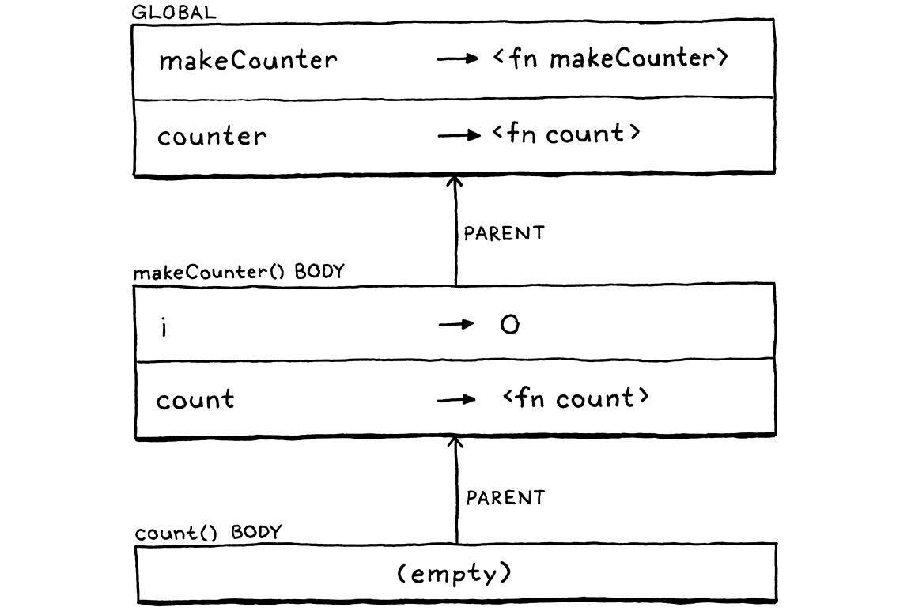

# 函数

> 这也是人类思维的工作方式――通过将旧思想复合成新结构，新结构成为新思想，这些新思想本身可以用于化合物中，并且无休止地循环，越来越远离每个人的基本地球意象。语言的土壤。
> 
> -- Douglas R. Hofstadter,*I Am a Strange Loop*

本章标志着大量辛勤工作的高潮。前面的章节本身就添加了有用的功能，但每一章只是提供了一块拼图。我们将把这些部分――表达式、语句、变量、控制流和词法作用域――添加更多，并将它们全部组装成对真正的用户定义函数和函数调用的支持。


## 10.1 函数调用

您肯定熟悉 C 风格的函数调用语法，但语法比您可能意识到的要微妙得多。调用通常是对命名函数的调用，例如：

```c
average(1, 2);
```

但被调用函数的名称实际上并不是调用语法的一部分。被调用的东西――**被调用者**――可以是任何求值为函数的表达式。（好吧，它确实必须是一个非常*高优先级*的表达式，但是括号会处理这一点。）例如：

> 该名称*是*Pascal 中调用语法的一部分。您只能调用命名函数或直接存储在变量中的函数。

```c
getCallback()();
```

这里有两个调用表达式。第一对括号`getCallback`是它的被调用者。但是第二个调用将整个`getCallback()`表达式作为其被调用者。表达式后面的括号表示函数调用。您可以将调用视为有点像以 `(` 开头的后缀运算符。

这个“运算符”的优先级高于任何其他运算符，甚至是一元运算符。所以我们通过让`unary`规则冒泡到一个新规则`call`来将它放入语法中。

```
unary          → ( "!" | "-" ) unary | call ;
call           → primary ( "(" arguments? ")" )* ;
```

此规则匹配一个primary表达式，后跟零个或多个函数调用。如果没有括号，这将解析仅仅一个primary表达式。否则，每个调用都由一对括号识别，其中包含可选的参数列表。参数列表语法是：

> 该规则使用`*`允许匹配一系列调用，例如`fn(1)(2)(3)`.像这样的代码在 C 风格的语言中并不常见，但它属于从 ML 派生的语言家族。在那里，定义一个带多个参数的函数的正常方法是作为一系列嵌套函数。每个函数接受一个参数并返回一个新函数。该函数使用下一个参数，返回另一个函数，依此类推。最终，一旦所有参数都被消耗掉，最后一个函数就完成了操作。
> 
> 这种风格，称为**currying**，在 Haskell Curry（同一个人，他的名字为*其他*著名的函数式语言增光添彩）之后，被直接融入语言语法中，所以它看起来不像这里那么奇怪。

```
arguments      → expression ( "," expression )* ;
```

此规则需要至少一个参数表达式，后跟零个或多个其他表达式，每个表达式前面都有一个逗号。为了处理零参数调用，`call`规则本身将整个`arguments`产生式视为可选。

我承认，对于非常常见的“零个或多个逗号分隔的事物”模式，这在语法上似乎比您预期的更尴尬。有一些复杂的元语法可以更好地处理这个问题，但在我们的 BNF 和我见过的许多语言规范中，它就是这么麻烦。

在我们的语法树生成器中，我们添加了一个新节点。

```java
      "Binary   : Expr left, Token operator, Expr right",
      "Call     : Expr callee, Token paren, List<Expr> arguments",
      "Grouping : Expr expression",
// tool/GenerateAst.java, in main()
```

> 为新节点生成的代码在[附录 II](http://craftinginterpreters.com/appendix-ii.html#call-expression)中。

它存储被调用者表达式和参数的表达式列表。它还存储右括号的标记。当我们报告由函数调用引起的运行时错误时，我们将使用该标记的位置。

修改解析器。`unary()`以前直接跳转到`primary()`，改成call，嗯，`call()`。

```java
      return new Expr.Unary(operator, right);
    }

    return call();
  }
// lox/Parser.java, in unary(), replace 1 line
```

它的定义是：

```java
  private Expr call() {
    Expr expr = primary();

    while (true) { 
      if (match(LEFT_PAREN)) {
        expr = finishCall(expr);
      } else {
        break;
      }
    }

    return expr;
  }
// lox/Parser.java, add after unary() 
```

> 使用`while (match(LEFT_PAREN))`这段代码代替代替愚蠢的`while (true)`和`break`会更简单。别担心，当我们稍后扩展解析器来处理对象的属性时，它会很有意义。

这里的代码不太符合语法规则。我移动了一些东西来使代码更清晰――这是我们拥有手写解析器的奢侈品之一。但它与我们解析中缀运算符的方式大致相似。首先，我们解析一个primary表达式，即调用的“左操作数”。然后，每次我们看到 `(`时，我们调用`finishCall()`以使用先前解析的表达式作为被调用者来解析调用表达式。返回的表达式变成新的`expr`，我们循环查看结果是否被调用。

解析参数列表的代码在这个辅助函数中：

```java
  private Expr finishCall(Expr callee) {
    List<Expr> arguments = new ArrayList<>();
    if (!check(RIGHT_PAREN)) {
      do {
        arguments.add(expression());
      } while (match(COMMA));
    }

    Token paren = consume(RIGHT_PAREN,
                          "Expect ')' after arguments.");

    return new Expr.Call(callee, paren, arguments);
  }
// lox/Parser.java, add after unary()
```

这或多或少是`arguments`翻译成代码的语法规则，除了还处理零参数的情况。首先通过查看下一个token是否为`)` 来检查这种情况。如果是，则不会尝试解析任何参数。

否则，会解析一个表达式，然后寻找一个逗号，表示在那之后还有另一个参数。只要在每个表达式后找到逗号，就会继续这样做。当找不到逗号时，必须完成参数列表并且使用预期的右括号。最后，将被调用者和那些参数包装到调用 AST 节点中。

### 10.1.1 最大参数数量

现在，我们解析参数的循环没有界限。如果你想调用一个函数并向它传递一百万个参数，解析器不会有问题。要限制它吗？

其他语言有不同的方法。C 标准表示符合标准的实现必须支持*至少*127 个函数参数，但没有说明有任何上限。Java 规范规定一个方法最多可以接受255 个*参数*。

> 如果该方法是实例方法，则限制为 254 个参数。那是因为`this`――方法的接收者――就像一个隐式传递给方法的参数一样工作，所以它声明了一个槽。

我们的 Lox Java 解释器实际上不需要限制，但参数的最大数量将简化我们在[第 III 部分](http://craftinginterpreters.com/a-bytecode-virtual-machine.html)中的字节码解释器。我们希望我们的两个解释器彼此兼容，即使在像这样奇怪的极端情况下也是如此，因此将向 jlox 添加相同的限制。

```java
      do {
        if (arguments.size() >= 255) {
          error(peek(), "Can't have more than 255 arguments.");
        }
        arguments.add(expression());
// lox/Parser.java, in finishCall()
```

注意，此处的代码在遇到参数过多时会*报错*，但不会*抛出*该错误。抛出是我们进入恐慌模式的方式，如果解析器处于混乱状态并且不再知道它在语法中的位置，这就是我们想要的。但在这里，解析器仍然处于完全有效的状态――它只是发现了太多的参数。所以它报告错误并继续保持。

### 10.1.2 解释函数调用

现在没有任何可以调用的函数，所以首先开始实现调用似乎很奇怪，但是当我们到达那里时我们会担心的。首先，解释器需要一个导入一些新的包。

```java
import java.util.ArrayList;
import java.util.List;
// lox/Interpreter.java
```

与往常一样，解释从新的调用表达式节点的新访问方法开始。

```java
  @Override
  public Object visitCallExpr(Expr.Call expr) {
    Object callee = evaluate(expr.callee);

    List<Object> arguments = new ArrayList<>();
    for (Expr argument : expr.arguments) { 
      arguments.add(evaluate(argument));
    }

    LoxCallable function = (LoxCallable)callee;
    return function.call(this, arguments);
  }
// lox/Interpreter.java, add after visitBinaryExpr() 
```

首先，评估被调用者的表达式。通常，这个表达式只是一个标识符，它通过名称查找函数，但它可以是任何东西。然后按顺序评估每个参数表达式并将结果值存储在列表中。

> 这是另一个微妙的语义选择。由于参数表达式可能有副作用，因此它们的求值顺序可能是用户可见的。尽管如此，某些语言（如 Scheme 和 C）并未指定顺序。这使编译器可以自由地对它们重新排序以提高效率，但这意味着如果参数未按他们期望的顺序求值，用户可能会感到不愉快。

一旦准备好被调用者和参数，剩下的就是执行调用。通过将被调用者转换为LoxCallable然后在其上调用`call()`方法来做到这一点。可以像函数一样调用的任何 Lox 对象的 Java 表示都将实现此接口。这自然包括用户定义的函数，但也包括类对象，因为类被“调用”以构造新实例。我们很快还会将它用于另一个目的。

> 我在名称前加了“Lox”，以区别于 Java 标准库自带的 Callable 接口。las，所有好的简单名称都已被使用。

这个新接口没有太多内容。

```java
package com.craftinginterpreters.lox;

import java.util.List;

interface LoxCallable {
  Object call(Interpreter interpreter, List<Object> arguments);
}
// lox/LoxCallable.java, create new file
```

我们传入解释器以防类实现`call()`需要它。我们还给它评估参数值的列表。实现类的工作就是返回调用表达式产生的值。

### 10.1.3 调用类型错误

在开始实现 LoxCallable 之前，我们需要使访问方法更健壮一些。它目前忽略了一些我们不能假装不会发生的故障模式。首先，如果被调用者实际上不是可以调用的对象，会发生什么情况？如果您尝试这样做会怎样：

```java
"totally not a function"();
```

Lox 中不可调用字符串。Lox 字符串的运行时表示是 Java 字符串，因此将其转换为 LoxCallable 时，JVM 将抛出 ClassCastException。我们不希望解释器吐出一些讨厌的 Java 堆栈跟踪然后死掉。相反，我们需要先自己检查类型。

```java
    }

    if (!(callee instanceof LoxCallable)) {
      throw new RuntimeError(expr.paren,
          "Can only call functions and classes.");
    }

    LoxCallable function = (LoxCallable)callee;
// lox/Interpreter.java, in visitCallExpr()
```

仍然抛出一个异常，但现在我们抛出自己的异常类型，一种解释器知道可以优雅地捕获和报告的异常类型。

### 10.1.4 检查传入参数数量

另一个问题与函数的**arity**有关。Arity 是函数或操作期望的参数数量的奇特术语。一元运算符的元数为 1，二元运算符的元数为 2，等等。对于函数，元数由它声明的参数数量决定。

```java
fun add(a, b, c) {
  print a + b + c;
}
```

这个函数定义了三个参数，`a`,`b`, 和`c`，所以它的元数是三个，它需要三个参数。那么，如果您尝试这样调用它：

```java
add(1, 2, 3, 4); // Too many.
add(1, 2);       // Too few.
```

不同的语言对这个问题采取不同的方法。当然，大多数静态类型语言会在编译时检查这一点，如果参数计数与函数的元数不匹配，则拒绝编译代码。JavaScript 会丢弃您传递的任何额外参数。如果你传递的不够多，它会用神奇的 sort-of-like-null-but-not-really value 填充缺失的参数`undefined`。Python 更严格。如果参数列表太短或太长，它会引发运行时错误。

我认为后者是更好的方法。传递错误数量的参数几乎总是一个错误，这是我在实践中犯的错误。鉴于此，实施越早引起我的注意越好。所以对于 Lox，我们将采用 Python 的方法。在调用可调用对象之前，我们检查参数列表的长度是否与可调用对象的元数匹配。

```java
    LoxCallable function = (LoxCallable)callee;
    if (arguments.size() != function.arity()) {
      throw new RuntimeError(expr.paren, "Expected " +
          function.arity() + " arguments but got " +
          arguments.size() + ".");
    }

    return function.call(this, arguments);
// lox/Interpreter.java, in visitCallExpr()
```

这需要 LoxCallable 接口上的一个新方法来询问它的元数。

```java
interface LoxCallable {
  int arity();
  Object call(Interpreter interpreter, List<Object> arguments);
// lox/LoxCallable.java, in interface LoxCallable
```

我们*可以*将 arity 检查推入`call()`.但是，由于我们将有多个类实现 LoxCallable，因此最终会在几个类中进行冗余验证。将它提升到访问方法中可以在一个地方完成它。

## 10.2 原生函数

理论上我们可以调用函数，但是还没有函数可以调用。在介绍用户定义的函数之前，现在是介绍语言实现的一个重要但经常被忽视的方面的好时机――**原生函数**。这些是解释器向用户代码公开的函数，但它们是用宿主语言（在我们的例子中是 Java）而不是被实现的语言（Lox）实现的。

有时这些被称为**原语**、**外部函数**或**外部函数**。由于可以在用户程序运行时调用这些函数，因此它们构成了实现运行时的一部分。许多编程语言书籍都掩盖了这些，因为它们在概念上并不有趣。他们大多是繁重的工作。

> 奇怪的是，这些函数的两个名称――“native”和“foreign”――是反义词。也许这取决于选择该术语的人的观点。如果您认为自己“生活”在运行时的实现（在我们的例子中是 Java）中，那么用它编写的函数就是“原生的”。但是如果你有你的语言*用户*的心态，那么运行时是用其他一些“外国”语言实现的。
> 
> 或者可能是“native”指的是底层硬件的机器代码语言。在 Java 中，“native”方法是用 C 或 C++ 实现并编译为本地机器代码的方法。


但是，要使您的语言真正擅长做有用的事情，您的实现提供的native功能是关键。它们提供对所有程序定义所依据的基本服务的访问。如果您不提供访问文件系统的native函数，用户将很难编写读取和显示文件的程序。

> 几乎每一种语言都提供的经典本机功能是将文本打印到标准输出。在 Lox 中，我做`print`了一个内置声明，以便我们可以在本章之前的章节中将内容显示在屏幕上。
> 
> 一旦我们有了函数，我们就可以通过撕掉旧的打印语法并将其替换为本机函数来简化语言。但这意味着本书前面的例子不会在后面章节的解释器上运行，反之亦然。所以，对于这本书，我不会去管它。
> 
> 但是，如果您正在为*自己的*语言构建解释器，您可能需要考虑一下。

许多语言还允许用户提供自己的原生功能。这样做的机制称为**外部函数接口**(**FFI**)、**本机扩展**、**本机接口**或类似的东西。这些很好，因为它们使语言实现者无需提供对底层平台支持的每一个功能的访问。我们不会为 jlox 定义 FFI，但我们会添加一个原生函数，让您了解它大概是什么样子。

### 10.2.1 输出时间

当到达[第 III 部分](http://craftinginterpreters.com/a-bytecode-virtual-machine.html)并开始着手更有效地实现 Lox 时，我们将非常关心性能。性能工作需要衡量，而这又意味着**基准**。这些程序会测量执行解释器某个角落所需的时间。

我们可以测量启动解释器、运行基准测试和退出所需的时间，但这会增加很多开销――JVM启动时间、操作系统恶作剧等。当然，这些东西确实很重要，但如果你只是试图验证对某些解释器的优化，您不希望这种开销掩盖您的结果。

更好的解决方案是让基准脚本本身测量代码中两点之间经过的时间。为此，Lox 程序需要能够判断时间。现在没有办法做到这一点――如果不访问计算机上的底层时钟，您就无法“从头开始”实现有用的时钟。

所以我们将添加`clock()`一个原生函数，它返回自某个固定时间点以来经过的秒数。两次连续调用之间的差异告诉您两次调用之间经过了多少时间。这个函数是在全局范围内定义的，所以让我们确保解释器可以访问它。

```java
class Interpreter implements Expr.Visitor<Object>,
                             Stmt.Visitor<Void> {
  final Environment globals = new Environment();
  private Environment environment = globals;

  void interpret(List<Stmt> statements) {
// lox/Interpreter.java, in class Interpreter, replace 1 line
```

当我们进入和退出本地范围时，解释器中的`environment`字段会发生变化。它跟踪*当前*环境。这个新`globals`领域拥有对最外层全局环境的固定引用。

当实例化一个解释器时，将原生函数填充到该全局范围内。

```java
  private Environment environment = globals;

  Interpreter() {
    globals.define("clock", new LoxCallable() {
      @Override
      public int arity() { return 0; }

      @Override
      public Object call(Interpreter interpreter,
                         List<Object> arguments) {
        return (double)System.currentTimeMillis() / 1000.0;
      }

      @Override
      public String toString() { return "<native fn>"; }
    });
  }

  void interpret(List<Stmt> statements) {
// lox/Interpreter.java, in class Interpreter 
```

这定义了一个名为“clock”的变量。它的值是一个实现 LoxCallable 的 Java 匿名类。该`clock()`函数不接受任何参数，因此它的元数为零。`call()`的实现调用相应的 Java 函数并将结果以秒为单位转换为 double 值。

> 在 Lox 中，函数和变量占用相同的命名空间。在 Common Lisp 中，两人生活在自己的世界里。具有相同名称的函数和变量不会发生冲突。如果调用名称，它会查找函数。如果你引用它，它会查找变量。当您确实想将函数作为一流值引用时，这确实需要跳过一些步骤。
> 
> Richard P. Gabriel 和 Kent Pitman 创造了术语“Lisp-1”来指代像 Scheme 这样将函数和变量放在同一个命名空间中的语言，而“Lisp-2”则指像 Common Lisp 这样将它们分开的语言。尽管完全不透明，但这些名称一直沿用至今。Lox 是 Lisp-1。

如果我们想添加其他原生功能――读取用户输入、处理文件等――我们可以将它们分别添加为实现 LoxCallable 的自己的匿名类。但是对于这本书，这本书真的是我们所需要的。

让我们摆脱功能定义业务，让我们的用户接管...

## 10.3 函数声明

现在终于可以在`declaration`添加变量时引入的规则中添加一个新的产生式。函数声明，像变量一样，绑定一个新名称。这意味着它们只能在允许声明的地方使用。

> 命名函数声明并不是真正的单一原始操作。它是两个不同步骤的语法糖：(1) 创建一个新的函数对象，以及 (2) 将一个新变量绑定到它。如果 Lox 有匿名函数的语法，我们就不需要函数声明语句了。你可以这样做：
> 
> ```c
> var add = fun (a, b) {
>   print a + b;
> };
> ```

> 然而，由于命名函数是常见的情况，我继续为它们提供 Lox 漂亮的语法。

```
declaration    → funDecl
               | varDecl
               | statement ;
```

更新后的`declaration`规则引用了这条新规则：

```
funDecl        → "fun" function ;
function       → IDENTIFIER "(" parameters? ")" block ;
```

主`funDecl`规则使用单独的辅助规则`function`。函数*声明语句*是`fun`关键字，后跟实际的函数内容。当我们进入类时，将重用该`function`规则来声明方法。这些看起来类似于函数声明，但前面没有`fun`.

> 方法太优雅了，没有乐趣。

函数本身是一个名称，后跟带括号的参数列表和主体。主体始终是花括号块，使用与块语句相同的语法规则。参数列表使用此规则：

```
parameters     → IDENTIFIER ( "," IDENTIFIER )* ;
```

它类似于前面的`arguments`规则，只是每个参数都是一个标识符，而不是一个表达式。这是解析器需要仔细研究的许多新语法，但生成的 AST节点还不错。

```java
      "Expression : Expr expression",
      "Function   : Token name, List<Token> params," +
                  " List<Stmt> body",
      "If         : Expr condition, Stmt thenBranch," +
// tool/GenerateAst.java, in main()
```

> 为新节点生成的代码在[附录 II](http://craftinginterpreters.com/appendix-ii.html#function-statement)中。

函数节点有一个名称、一个参数列表（它们的名称），然后是函数体。我们将函数体存储为花括号内包含的语句列表。

在解析器中，我们注入了新的声明。

```java
    try {
      if (match(FUN)) return function("function");
      if (match(VAR)) return varDeclaration();
//lox/Parser.java, in declaration()
```

与其他语句一样，函数由前导关键字识别。当我们遇到时`fun`，调用`function`。这对应于`function`语法规则，因为已经匹配并使用了`fun`关键字。我们将一次构建一个方法，从这个开始：

```java
 private Stmt.Function function(String kind) {
    Token name = consume(IDENTIFIER, "Expect " + kind + " name.");
  }
// lox/Parser.java, add after expressionStatement()  
```

现在，它只使用函数名称的标识符token。您可能想知道那个`kind`参数有什么用。就像我们重用语法规则一样，稍后将重用该`function()`方法来解析类内部的方法。当我们这样做时，我们将传入“method”，`kind`以便错误消息特定于正在解析的声明类型。

接下来，解析参数列表和包裹在它周围的一对括号。

```java
    Token name = consume(IDENTIFIER, "Expect " + kind + " name.");
    consume(LEFT_PAREN, "Expect '(' after " + kind + " name.");
    List<Token> parameters = new ArrayList<>();
    if (!check(RIGHT_PAREN)) {
      do {
        if (parameters.size() >= 255) {
          error(peek(), "Can't have more than 255 parameters.");
        }

        parameters.add(
            consume(IDENTIFIER, "Expect parameter name."));
      } while (match(COMMA));
    }
    consume(RIGHT_PAREN, "Expect ')' after parameters.");
  }
// lox/Parser.java, in function()
```

这类似于在调用中处理参数的代码，只是没有拆分成辅助方法。外层`if`语句处理零参数情况，内层`while`循环解析参数只要我们找到逗号分隔它们。结果是每个参数名称的token列表。

就像处理函数调用的参数一样，在解析时验证您没有超过函数允许的最大参数数量。

最后，我们解析主体并将其全部包装在一个函数节点中。

```java
    consume(RIGHT_PAREN, "Expect ')' after parameters.");

    consume(LEFT_BRACE, "Expect '{' before " + kind + " body.");
    List<Stmt> body = block();
    return new Stmt.Function(name, parameters, body);
  }
// lox/Parser.java, in function()
```

请注意，我们在调用`block()`之前消耗了主体的开头`{`。那是因为`block()`假设大括号标记已经匹配。如果没有找到`{`，在这里使用它可以让我们报告更准确的错误消息，因为我们知道它在函数声明的上下文中。

## 10.4 函数对象

我们已经解析了一些语法，所以已经准备好进行解释，但首先需要考虑如何在 Java 中表示 Lox 函数。我们需要跟踪参数，以便可以在调用函数时将它们绑定到参数值。当然，需要保留函数体的代码，以便可以执行它。

这基本上就是 Stmt.Function 类的内容。我们可以用那个吗？差不多，但不完全是。我们还需要一个实现 LoxCallable 的类，以便我们可以调用它。我们不希望解释器的运行时阶段渗透到前端的语法类中，因此我们不希望 Stmt.Function 本身实现它。相反，我们将其包装在一个新类中。

```java
package com.craftinginterpreters.lox;

import java.util.List;

class LoxFunction implements LoxCallable {
  private final Stmt.Function declaration;
  LoxFunction(Stmt.Function declaration) {
    this.declaration = declaration;
  }
}
// lox/LoxFunction.java, create new file
```

我们像这样实现 LoxCallable 的`call()`：

```java
  @Override
  public Object call(Interpreter interpreter,
                     List<Object> arguments) {
    Environment environment = new Environment(interpreter.globals);
    for (int i = 0; i < declaration.params.size(); i++) {
      environment.define(declaration.params.get(i).lexeme,
          arguments.get(i));
    }

    interpreter.executeBlock(declaration.body, environment);
    return null;
  }
// lox/LoxFunction.java, add after LoxFunction()  
```

这几行代码是我们解释器中最基本、最强大的部分之一。正如我们[在语句和状态](http://craftinginterpreters.com/statements-and-state.html)一章中看到的，管理名称环境是语言实现的核心部分。功能与此密切相关。

> [我们将在下一章](http://craftinginterpreters.com/resolving-and-binding.html)更深入地探讨环境。

参数是函数的核心，尤其是函数*封装*了它的参数――函数之外的其他代码看不到它们。这意味着每个函数都有自己的环境来存储这些变量。

此外，必须动态创建此环境。每个函数*调用*都有自己的环境。否则，递归会中断。如果同时有多个对同一个函数的调用，每个调用都需要*自己的*环境，即使它们都是对同一个函数的调用。

例如，这里有一个复杂的数到三的方法：

```java
fun count(n) {
  if (n > 1) count(n - 1);
  print n;
}

count(3);
```

想象一下，在解释器即将在最内层嵌套调用中打印 1 时暂停解释器。对 print 2 和 3 的外部调用还没有打印它们的值，因此内存中一定有环境仍然存储`n`在一个上下文中绑定到 3，在另一个上下文中绑定到 2，在最里面绑定到 1 的事实，例如：


这就是为什么在每次*调用*时创建一个新环境，而不是在函数*声明*处。我们之前看到的`call()`方法就是这样做的。在调用开始时，它会创建一个新环境。然后它以同步的方式遍历参数和参数列表。对于每一对，它使用参数的名称创建一个新变量并将其绑定到参数的值。

所以，对于这样的程序：

```java
fun add(a, b, c) {
  print a + b + c;
}

add(1, 2, 3);
```

在调用 时`add()`，解释器创建如下内容：


然后`call()`告诉解释器在这个新的函数局部环境中执行函数体。到目前为止，当前环境是调用函数的环境。现在，我们从那里传送到我们为函数创建的新参数空间内。

这就是将数据传递给函数所需的全部内容。通过在执行主体时使用不同的环境，使用相同的代码调用相同的函数可能会产生不同的结果。

一旦函数体执行完毕，就`executeBlock()`丢弃该函数局部环境并恢复之前在调用点处于活动状态的环境。最后，`call()`returns `null`，它返回`nil`给调用者。（我们稍后会添加返回值。）

从机械上讲，代码非常简单。走几个清单。绑定一些新变量。调用一个方法。但这就是函数声明的结晶*代码*变成活生生的*调用*的地方。这是整本书中我最喜欢的片段之一。如果您愿意，请花点时间冥想一下。

完了吗？好的。请注意，当绑定参数时，我们假设参数和参数列表具有相同的长度。这是安全的，因为`visitCallExpr()`在调用`call()`之前检查 arity。它依赖于报告其数量的功能来做到这一点。

```java
  @Override
  public int arity() {
    return declaration.params.size();
  }
// lox/LoxFunction.java, add after LoxFunction()  
```

这就是我们的大部分对象表示。当我们在这里时，也可以实现`toString()`.

```java
@Override
  public String toString() {
    return "<fn " + declaration.name.lexeme + ">";
  }
// lox/LoxFunction.java, add after LoxFunction()  
```

如果用户决定打印函数值，这会提供更好的输出。

```java
fun add(a, b) {
  print a + b;
}

print add; // "<fn add>".
```

### 10.4.1 解释函数声明

我们很快就会回来完善 LoxFunction，但这足以开始了。现在我们可以访问一个函数声明。

```java
  @Override
  public Void visitFunctionStmt(Stmt.Function stmt) {
    LoxFunction function = new LoxFunction(stmt);
    environment.define(stmt.name.lexeme, function);
    return null;
  }
// lox/Interpreter.java, add after visitExpressionStmt()  
```

这类似于我们解释其他字面值表达式的方式。采用函数*语法节点*――函数的编译时表示――并将其转换为其运行时表示。在这里，这是一个包装语法节点的 LoxFunction。

函数声明不同于其他字面值节点，因为声明*还将*结果对象绑定到新变量。因此，在创建 LoxFunction 之后，我们在当前环境中创建一个新绑定并在其中存储对它的引用。

这样，我们就可以在 Lox 中定义和调用我们自己的函数。试一试：

```java
fun sayHi(first, last) {
  print "Hi, " + first + " " + last + "!";
}

sayHi("Dear", "Reader");
```

我不了解你，但对我来说，这看起来像是一种真正的编程语言。

## 10.5 Return语句

可以通过传递参数将数据传入函数，但没有办法将结果*取回*。如果 Lox 是像 Ruby 或 Scheme 这样的面向表达式的语言，那么函数体将是一个表达式，其值隐式为函数的结果。但在 Lox 中，函数体是一个不产生值的语句列表，因此我们需要专门的语法来发出结果。换句话说，`return`语句。相信你已经猜到了语法。

> 加州旅馆的数据。

```java
statement      → exprStmt
               | forStmt
               | ifStmt
               | printStmt
               | returnStmt
               | whileStmt
               | block ;

returnStmt     → "return" expression? ";" ;
```

我们还有一步――实际上是最后一步――按照可敬的`statement`规则制作。`return`语句是`return`关键字后跟一个可选表达式并以分号结束。

返回值是可选的，以支持从不返回有用值的函数中提前退出。在静态类型语言中，“void”函数不返回值，非 void 函数返回值。由于 Lox 是动态类型的，因此没有真正的 void 函数。编译器无法阻止您获取调用不包含`return`语句的函数的结果值。

```java
fun procedure() {
  print "don't return anything";
}

var result = procedure();
print result; // ?
```

这意味着每个 Lox 函数都必须返回*something*，即使它根本不包含任何`return`语句。为此我们使用`nil`，这就是 LoxFunction 的实现在最后`call()`返回的原因`null`。同样，如果您在`return`语句中省略了值，只是将其视为等同于：

```java
return nil;
```

在AST 生成器中，添加了一个新节点。

```java
      "Print      : Expr expression",
      "Return     : Token keyword, Expr value",
      "Var        : Token name, Expr initializer",
// tool/GenerateAst.java, in main()
```

> 为新节点生成的代码在[附录 II](http://craftinginterpreters.com/appendix-ii.html#return-statement)中。

它保留`return`关键字token，因此可以使用它的位置来报告错误，以及返回的值（如果有）。像其他语句一样解析它，首先通过识别初始关键字

```java
    if (match(PRINT)) return printStatement();
    if (match(RETURN)) return returnStatement();
    if (match(WHILE)) return whileStatement();
// lox/Parser.java, in statement()
```

这分支到：

```java
  private Stmt returnStatement() {
    Token keyword = previous();
    Expr value = null;
    if (!check(SEMICOLON)) {
      value = expression();
    }

    consume(SEMICOLON, "Expect ';' after return value.");
    return new Stmt.Return(keyword, value);
  }
// lox/Parser.java, add after printStatement() 
```

在找到之前使用的`return`关键字后，我们寻找一个值表达式。由于许多不同的token可能会启动一个表达式，因此很难判断是否存在返回*值*。相反，我们检查它是否*不存在*。由于分号不能开始一个表达式，如果下一个token是那个，我们知道一定没有值。

### 10.5.1 从调用中返回

解释一个`return`语句是棘手的。您可以从函数体内的任何地方返回，甚至可以深入嵌套在其他语句中。执行返回时，解释器需要一路跳出它当前所在的任何上下文并导致函数调用完成，就像某种被顶起的控制流构造一样。

例如，假设我们正在运行这个程序，我们将要执行`return`语句：

```java
fun count(n) {
  while (n < 100) {
    if (n == 3) return n; // <--
    print n;
    n = n + 1;
  }
}

count(1);
```

Java 调用堆栈目前大致如下所示：

```java
Interpreter.visitReturnStmt()
Interpreter.visitIfStmt()
Interpreter.executeBlock()
Interpreter.visitBlockStmt()
Interpreter.visitWhileStmt()
Interpreter.executeBlock()
LoxFunction.call()
Interpreter.visitCallExpr()
```

我们需要从栈顶一直返回到`call()`。我不知道你怎么认为，但对我来说这听起来像是异常。当我们执行一个`return`语句时，我们将使用一个异常来让解释器通过所有包含语句的访问方法回到开始执行主体的代码。

我们新的 AST 节点的访问方法如下所示：

```java
  @Override
  public Void visitReturnStmt(Stmt.Return stmt) {
    Object value = null;
    if (stmt.value != null) value = evaluate(stmt.value);

    throw new Return(value);
  }
// lox/Interpreter.java, add after visitPrintStmt() 
```

如果有返回值，评估它，否则，我们使用`nil`.然后获取该值并将其包装在自定义异常类中并抛出它。

```java
package com.craftinginterpreters.lox;

class Return extends RuntimeException {
  final Object value;

  Return(Object value) {
    super(null, null, false, false);
    this.value = value;
  }
}
// lox/Return.java, create new file
```

此类使用 Java 运行时异常类所需的装备包装返回值。带有这些参数`null`和`false`参数的奇怪的超级构造函数调用禁用了一些我们不需要的 JVM 机制。由于将异常类用于控制流而不是实际的错误处理，因此我们不需要像堆栈跟踪这样的开销。

> 作为记录，我通常不喜欢使用异常来控制流程。但在一个高度递归的树行走解释器中，这是要走的路。由于我们自己的语法树评估与 Java 调用堆栈密切相关，因此我们不得不偶尔进行一些重量级的调用堆栈操作，而异常是一个方便的工具。

我们希望它一直展开到函数调用开始的地方，即LoxFunction 中的`call()`方法。

```java
         arguments.get(i));
    }

    try {
      interpreter.executeBlock(declaration.body, environment);
    } catch (Return returnValue) {
      return returnValue.value;
    }
    return null;
// lox/LoxFunction.java, in call(), replace 1 line
```

我们将调用包装`executeBlock()`在 try-catch 块中。当它捕获到返回异常时，它会提取值并将其作为`call()`返回值。如果它从未捕获到`return`这些异常之一，则意味着该函数在没有命中语句的情况下到达了其主体的末尾。在这种情况下，它隐式返回`nil`。

让我们试试看。终于有足够的能力来支持这个经典的例子――一个计算斐波那契数列的递归函数：

```c
fun fib(n) {
  if (n <= 1) return n;
  return fib(n - 2) + fib(n - 1);
}

for (var i = 0; i < 20; i = i + 1) {
  print fib(i);
}
```

这个小程序几乎练习了我们在过去几章中实现的所有语言特性――表达式、算术、分支、循环、变量、函数、函数调用、参数绑定和返回。

> 您可能会注意到这非常慢。显然，递归不是计算 Fibonacci 数的最有效方法，但作为微基准，它可以很好地对我们的解释器实现函数调用的速度进行压力测试。
> 
> 如您所见，答案是“不是很快”。没关系。我们的 C 解释器会更快。

## 10.6 局部函数和闭包

我们的函数功能非常齐全，但有一个漏洞需要修补。事实上，这是一个足够大的差距，我们将在[下一章](http://craftinginterpreters.com/resolving-and-binding.html)中花费大部分时间来解决它，但我们可以从这里开始。

LoxFunction 的实现`call()`创建了一个绑定函数参数的新环境。当我向您展示该代码时，忽略了一个重点：该环境的*父*级是什么？

现在，它始终是顶级全局环境`globals`。这样，如果一个标识符没有在函数体内定义，解释器可以在全局范围内的函数外部寻找它。`fib`在 Fibonacci 示例中，这就是解释器能够在函数自身内部查找递归调用 的方式――`fib`是一个全局变量。

但回想一下，在 Lox 中，函数声明可以*在任何*可以绑定名称的地方使用。这包括 Lox 脚本的顶层，也包括块或其他函数的内部。Lox 支持在另一个函数内定义或嵌套在块内的**局部函数。**

考虑这个经典示例：

```c
fun makeCounter() {
  var i = 0;
  fun count() {
    i = i + 1;
    print i;
  }

  return count;
}

var counter = makeCounter();
counter(); // "1".
counter(); // "2".
```

在这里，`count()`中的`i`是在其外部的`makeCounter()`函数中声明。`makeCounter()`返回对`count()`函数的引用，然后它自己的函数体已经执行完了。

同时，顶层代码调用返回的`count()`函数。这会执行`count()`的函数体，它赋值并读取`i`，即使定义的函数`i`已经退出。

如果您以前从未遇到过带有嵌套函数的语言，这可能看起来很疯狂，但用户确实希望它能工作。但是，如果你现在运行它，你会在调用`counter()`时  会得到一个未定义的变量错误`i`。那是因为环境链实际上是这样的：


当我们调用时`count()`（通过存储在`counter`中的对它的引用），我们为函数体创建了一个新的空环境。它的父级是全局环境。我们失去了`makeCounter()`绑定`i`的环境。

让往回看一点。这是在`makeCounter()`的函数体内声明`count()`时环境链的样子：


所以在声明函数的地方，我们可以看到`i`。但是当返回`makeCounter()`并退出它的函数体时，解释器会丢弃那个环境。由于解释器不会保留`count()`周围的环境，然而函数对象本身会依赖它。

此数据结构称为**闭包**，因为它“关闭”并保留声明函数的周围变量。闭包从早期的 Lisp 时代就已经存在，并且语言黑客已经想出了各种各样的方法来实现它们。对于 jlox，我们将做最简单有效的事情。在 LoxFunction 中，我们添加一个字段来存储环境。

> “闭包”是 Peter J. Landin 创造的另一个术语。我假设在他出现之前，计算机科学家仅使用原始的咕噜声和比划手势相互交流。

```java
  private final Stmt.Function declaration;
  private final Environment closure;

  LoxFunction(Stmt.Function declaration) {
// lox/LoxFunction.java, in class LoxFunction  
```

我们在构造函数中初始化它。

```java
LoxFunction(Stmt.Function declaration, Environment closure) {
    this.closure = closure;
    this.declaration = declaration;
// lox/LoxFunction.java, constructor LoxFunction(), replace 1 line
```

当我们创建 LoxFunction 时，会捕获当前环境

```java
public Void visitFunctionStmt(Stmt.Function stmt) {
    LoxFunction function = new LoxFunction(stmt, environment);
    environment.define(stmt.name.lexeme, function);
// lox/Interpreter.java, in visitFunctionStmt(), replace 1 line
```

这是在*声明*函数时激活的环境，而不是在*调用*函数时激活的环境，这正是我们想要的。它表示函数声明周围的词法范围。最后，当调用该函数时，将该环境用作调用的父级，而不是直接转到`globals`.

```java
                     List<Object> arguments) {
    Environment environment = new Environment(closure);
    for (int i = 0; i < declaration.params.size(); i++) {
// lox/LoxFunction.java, in call(), replace 1 line
```

这创建了一个环境链，从函数体到声明函数的环境，一直到全局范围。运行时环境链匹配我们想要的源代码的文本嵌套。我们调用该函数的最终结果如下所示：



现在，如您所见，解释器仍然可以在需要时找到`i`，因为它位于环境链的中间。现在尝试运行该`makeCounter()`示例。可以了！

函数让我们抽象、重用和组合代码。Lox 比以前的基本算术计算器强大得多。但是，在我们急于塞进闭包的过程中，已经让一点点动态作用域泄漏到解释器中。在[下一章](http://craftinginterpreters.com/resolving-and-binding.html)中，将更深入地探索词法范围并填补这个漏洞。

---

## [挑战](http://craftinginterpreters.com/functions.html#challenges)

1. 我们的解释器仔细检查传递给函数的参数数量是否与它期望的参数数量相匹配。由于此检查是在每次调用时在运行时完成的，因此会产生性能成本。Smalltalk 实现没有这个问题。为什么不？

2. Lox 的函数声明语法执行两个独立的操作。它创建一个函数并将其绑定到一个名称。这提高了您确实希望将名称与函数相关联的常见情况的可用性。但是在函数式代码中，您通常希望创建一个函数以立即将其传递给其他函数或返回它。在这种情况下，它不需要名称。
   
   鼓励函数式风格的语言通常支持**匿名函数**或**lambda**――一种创建函数而不将其绑定到名称的表达式语法。将匿名函数语法添加到 Lox 以便它起作用：
   
   ```c
   fun thrice(fn) {
     for (var i = 1; i <= 3; i = i + 1) {
       fn(i);
     }
   }
   
   thrice(fun (a) {
     print a;
   });
   // "1".
   // "2".
   // "3".
   ```
   
   您如何处理表达式语句中出现的匿名函数表达式的棘手情况：
   
   ```c
   fun () {};
   ```

3. 这个程序有效吗？
   
   ```c
   fun scope(a) {
     var a = "local";
   }
   ```
   
   换句话说，函数的参数是在与其局部变量*相同*的范围内，还是在外部范围内？洛克斯是做什么的？你熟悉的其他语言呢？你认为语言*应*该做什么？