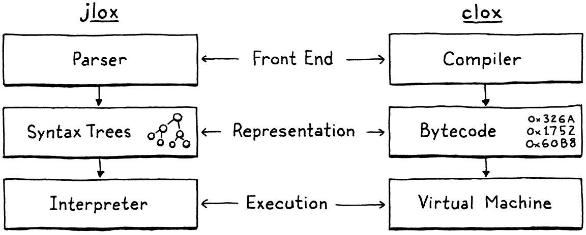

# 字节码块

> 如果你发现你几乎所有的时间都花在了理论上，那就开始关注实际的事情吧；它会改进你的理论。如果你发现你几乎把所有的时间都花在了练习上，那就开始把注意力转移到理论上的事情上；它会改善你的练习。
> 
> -- 唐纳德高德纳

我们已经用 jlox 完成了 Lox 的完整实现，那么为什么这本书还没有结束呢？部分原因是 jlox 依赖JVM为我们做很多事情。如果想了解解释器是如何工作的，需要自己构建这些点点滴滴。

> 当然，我们的第二个解释器依赖于 C 标准库来实现内存分配等基础，并且 C 编译器使我们摆脱了运行它的底层机器代码的细节。哎呀，该机器代码可能是根据芯片上的微代码实现的。而 C 运行时依赖操作系统来分发内存页面。但是如果这本书要放在你的书架上，我们必须在*某个地方*停下来。

jlox 不足的一个更根本的原因是它太慢了。树遍历解释器适用于某些高级声明性语言。但对于一种通用的命令式语言――即使是像 Lox 这样的“脚本”语言――它也不会飞起来。拿这个小脚本：

```js
fun fib(n) {
  if (n < 2) return n;
  return fib(n - 1) + fib(n - 2); 
}

var before = clock();
print fib(40);
var after = clock();
print after - before;
```

> 这是一种实际计算斐波那契数列的低效方式。我们的目标是看*解释器*运行多快，而不是看我们能写多快的程序。一个执行大量工作的缓慢程序――无论是否无意义――都是一个很好的测试用例。

在我的笔记本电脑上，执行 jlox 大约需要 72 秒。而等效的 C 程序在半秒内完成。我们的动态类型脚本语言永远不会像手动内存管理的静态类型语言一样快，但我们不能忍受慢*两个数量级*以上 。

我们可以采用 jlox 并在分析器中运行它，然后开始调整和优化热点，但这只会让我们走到这一步。执行模型――遍历 AST――从根本上说是错误的设计。无法将其微优化到我们想要的性能，就像您无法将 AMC Gremlin 打磨成 SR-71 Blackbird 一样。

我们需要重新考虑核心模型。本章介绍该模型、字节码，并开始介绍我们的新解释器 clox。

## 14.1 字节码？

在工程中，很少有选择是没有权衡的。为了最好地理解我们为什么要使用字节码，让我们将它与几个备选方案进行比较。

### 14.1.1 为什么不走 AST？

我们现有的解释器有几个优点：

- 好吧，首先，我们已经写好了。完成。这样做的主要原因是这种解释器的*实现方式非常简单*。代码的运行时表示直接映射到语法。在运行时从解析器获取我们需要的数据结构几乎毫不费力。

- 它是*便以移植*的。我们当前的解释器是用 Java 编写的，可以在 Java 支持的任何平台上运行。我们可以使用相同的方法在 C 语言中编写一个新的实现，并在几乎所有平台上编译和运行我们的语言。

这些都是真正的优势。但是，另一方面，它的*内存效率不高*。每一段语法解析成为一个 AST 节点。一个微小的 Lox 表达式`1 + 2`变成了一系列对象，它们之间有很多指针，比如：

> “(header)”部分是 Java 虚拟机用来支持内存管理和存储对象类型的簿记信息。那些也占空间！


这些指针中的每一个都会向对象添加额外的 32 或 64 位开销。更糟糕的是，以松散连接的对象网的方式将我们的数据散布在堆中,  会对*空间局部性*造成不利影响。

> *我在我的第一本书Game Programming Patterns*中写[了一整章](http://gameprogrammingpatterns.com/data-locality.html)来讨论这个确切的问题，如果你想深入了解的话。

现代 CPU 处理数据的速度比从 RAM 中提取数据的速度快得多。为了弥补这一点，芯片具有多层缓存。如果它需要的一块内存已经在缓存中，它可以更快地加载。我们的谈话速度快了 100*倍以上*。

数据如何进入该缓存？机器推测性地为您填充东西。它的启发式非常简单。每当 CPU 从 RAM 中读取一点数据时，它都会拉入一小块相邻字节并将它们填充到缓存中。

如果我们的程序接下来请求一些数据，这些数据足够接近以位于该缓存行内，我们的 CPU 就像工厂中润滑良好的传送带一样运行。我们*真的*很想利用这一点。为了有效地使用缓存，我们在内存中表示代码的方式应该像读取时一样密集和有序。

现在抬头看看那AST树。这些子对象可以在*任何地方*。tree-walker 在它遍历对子节点的引用的地方采取的每一步都可能超出缓存的范围并强制 CPU 停止，直到可以从 RAM 中插入新的数据块。只是这些树节点及其所有指针字段和对象标头的*开销*往往会将对象彼此推开并推出缓存。

> 即使当解析器第一次生成对象时对象恰好分配在顺序内存中，在几轮垃圾收集之后――这可能会在内存中移动对象――也不知道它们会在哪里。

我们的 AST walker 在接口派发和访问者模式方面也有其他开销，但仅局部性问题就足以证明更好的代码表示是合理的。

### 14.1.2 为什么不编译成本地代码？

如果你想*真正*快速地进行，你想要摆脱所有这些间接层。一直到裸机。机器代码。它甚至*听起来*很快。*机器代码。*

最快的语言所做的就是直接编译为芯片支持的本机指令集。自从早期工程师实际用机器代码手写程序以来，以本机代码为目标一直是最有效的选择。

> 是的，他们实际上是手工编写机器代码。在穿孔卡片上。据推测，他们用拳头打孔。

如果您以前从未编写过任何机器代码，或者是之前更易于人类接受的同类汇编代码，我将为您提供最温和的介绍。本机代码是一系列密集的操作，直接以二进制编码。每条指令的长度在一到几个字节之间，而且几乎是令人麻木的低级指令。“将一个值从这个地址移到这个寄存器。“将这两个寄存器中的整数相加。”类似的东西。

CPU 快速处理指令，按顺序解码和执行每条指令。没有像我们的 AST 这样的树结构，控制流是通过从代码中的一个点直接跳到另一个点来处理的。没有中间层，没有开销，没有不必要的跳过或追逐指针。

快如闪电，但这种性能是有代价的。首先，编译为本机代码并不容易。今天广泛使用的大多数芯片都具有庞大的Byzantine架构，其中包含数十年来积累的大量指令。它们需要复杂的寄存器分配、流水线和指令调度。

而且，当然，您已经放弃了可移植性。花几年时间掌握一些架构，这仍然只会让你进入几种流行的指令集*之一*。要掌握所有这些语言，您需要学习它们的所有指令集并为每个指令集编写一个单独的后端。

> 情况并不完全糟糕。一个架构良好的编译器可以让你在你支持的不同架构之间共享前端和大部分中间层优化传递。主要是代码生成和指令选择的一些细节，您每次都需要重新编写。
> 
> [LLVM](https://llvm.org/)项目为您提供了一些开箱即用的功能。如果您的编译器输出 LLVM 自己的特殊中间语言，LLVM 会依次将其编译为适用于过多体系结构的本机代码。

### 14.1.3 什么是字节码？

牢记这两点。一方面，树遍历解释器简单、易移植且速度慢。另一方面，本机代码复杂且特定于平台但速度很快。字节码位于中间。它保留了 tree-walker 的可移植性――我们不会在本书中动手处理汇编代码。它牺牲*了一些*简单性来换取性能提升，尽管速度不如完全原生。

在结构上，字节码类似于机器码。它是一个密集的线性二进制指令序列。这样可以保持**低开销并且与缓存配合得很好**。然而，它是一个比任何真正的芯片都简单得多、级别更高的指令集。（在许多字节码格式中，**每条指令只有一个字节长，因此称为“字节码**”。）

想象一下，您正在使用某种源语言编写本机编译器，并且您可以全权定义最简单的目标架构。字节码有点像那样。这是一个理想化的假想指令集，让您作为编译器编写者的生活更轻松。

当然，假想架构的问题在于它不存在。我们通过编写一个*模拟器来解决这个问题*――一个用软件编写的模拟芯片，一次解释一条指令的字节码。虚拟*机 (VM)*，如果您愿意的话。

该仿真层增加了开销，这是字节码比本机代码慢的一个关键原因。但作为回报，它给了我们可移植性。用我们关心的所有机器都支持的语言（如 C）编写我们的 VM，可以在我们喜欢的任何硬件上运行我们的模拟器。

> 最早的字节码格式之一是[p-code](https://en.wikipedia.org/wiki/P-code_machine)，它是为 Niklaus Wirth 的 Pascal 语言开发的。您可能认为以 15MHz 运行的 PDP-11 无法承受模拟虚拟机的开销。但那时候，计算机正处于寒武纪大爆发时期，每天都有新的架构出现。跟上最新的芯片比从每个芯片中榨取最大性能更有价值。这就是为什么 p-code 中的“p”不代表“Pascal”，而是“portable”。

这是我们的新解释器 clox 将采用的路径。我们将跟随 Python、Ruby、Lua、OCaml、Erlang 和其他语言的主要实现的脚步。在许多方面，我们的 VM 的设计将与之前的解释器的结构平行：



当然，我们不会严格按顺序执行。就像之前的解释器一样，我们会四处跳动，一次构建一个语言特性的实现。在本章中，我们将准备好应用程序的框架并创建存储和表示字节码块所需的数据结构。

## 14.2  入门

从哪里开始，但在`main()`？启动您可信赖的文本编辑器并开始输入。

> 现在是伸展身体的好时机，或许可以锻炼指关节。一点蒙太奇音乐也不会受到伤害。

```c
#include "common.h"

int main(int argc, const char* argv[]) {
  return 0;
}
// main.c, create new file
```

从这个微小的种子，我们将发展我们的整个 VM。既然C给我们提供的东西太少，我们首先要花点时间改良一下土壤。其中一些进入这个header 文件：

```c
#ifndef clox_common_h
#define clox_common_h

#include <stdbool.h>
#include <stddef.h>
#include <stdint.h>

#endif
// common.h, create new file
```

我们将在整个解释器中使用一些类型和常量，这是放置它们的一个方便的地方。现在，它是古老的`NULL`,`size_t`漂亮的 C99 Boolean`bool`和显式大小的整数类型-`uint8_t`和它的朋友们。

## 14.3 指令块

接下来，我们需要一个模块来定义代码表示。我一直使用“块”来指代字节码序列，所以让我们将其作为该模块的正式名称。

```c
#ifndef clox_chunk_h
#define clox_chunk_h

#include "common.h"

#endif
// chunk.h, create new file
```

在字节码格式中，每条指令都有一个单字节**操作码**（通常简称为**opcode**）。这个数字控制着正在处理的指令类型――加、减、查找变量等。在这里定义它们：

```c
#include "common.h"

typedef enum {
  OP_RETURN,
} OpCode;

#endif
// chunk.h
```

现在，我们从一条指令开始，`OP_RETURN`.当我们有一个全功能的 VM 时，这条指令将意味着“从当前函数返回”。我承认这还不是很有用，但我们必须从某个地方开始，这是一个特别简单的指令，原因稍后会谈到。

### 14.3.1 指令的动态数组

字节码是一系列指令。最终，我们将存储一些其他数据以及指令，所以让我们继续创建一个结构来保存所有这些数据。

```c
} OpCode;

typedef struct {
  uint8_t* code;
} Chunk;

#endif
// chunk.h, add after enum OpCode
```

目前，这只是一个字节数组的包装器。由于在开始编译块之前我们不知道数组需要多大，因此它必须是动态的。动态数组是我最喜欢的数据结构之一。这听起来像是在声称香草是我最喜欢的冰淇淋口味，但请听我说完。动态数组提供：

> 黄油山核桃实际上是我的最爱。

- 缓存友好的密集存储

- 恒定时间索引元素查找

- 恒定时间附加到数组的末尾

这些特性正是我们一直在 jlox 中打着 Java 的 ArrayList 类的幌子使用动态数组的原因。既然在 C 中，我们就可以自己动手了。如果您对动态数组生疏了，这个想法很简单。除了数组本身，我们还保留两个数字：数组中已分配的元素数（“capacity”）以及实际使用的分配条目数（“count”）。

```c
typedef struct {
  int count;
  int capacity;
  uint8_t* code;
} Chunk;
// chunk.h, in struct Chunk
```

当添加一个元素时，如果count小于capacity，那么数组中有可用空间。我们将新元素存储在那里并增加count。


如果我们没有多余的capacity，那么这个过程就会复杂一些。


1. 分配一个capacity更大的新数组。
2. 将现有元素从旧数组复制到新数组。
3. 存储新的`capacity`.
4. 删除旧数组。
5. 更新`code`以指向新数组。
6. 既然有空间，就将元素存储在新数组中。
7. 更新`count`.

> 在增长数组时复制现有元素使得附加元素看起来像是*O(n)*，而不是像我上面说的那样O(1) 。*但是，您只需要对*某些附加项执行此复制步骤。大多数时候，已经有额外的容量，所以你不需要复制。
> 
> 要了解这是如何工作的，我们需要[**摊销分析**](https://en.wikipedia.org/wiki/Amortized_analysis)。这向我们表明，只要我们将数组增长为其当前大小的倍数，当我们平均计算*一系列*追加的成本时，每个追加都是*O(1)*。

已经准备好结构，所以让我们实现使用它的功能。C 没有构造函数，所以我们声明一个函数来初始化一个新块。

块；

```c
} Chunk;

void initChunk(Chunk* chunk);

#endif
// chunk.h, add after struct Chunk
```

并如此实现：

```c
#include <stdlib.h>

#include "chunk.h"

void initChunk(Chunk* chunk) {
  chunk->count = 0;
  chunk->capacity = 0;
  chunk->code = NULL;
}
// chunk.c, create new file
```

动态数组开始时完全是空的。我们甚至还没有分配原始数组。为了将一个字节添加到块的末尾，使用了一个新函数。

```c
void initChunk(Chunk* chunk);
void writeChunk(Chunk* chunk, uint8_t byte);

#endif
// chunk.h, add after initChunk()
```

这是有趣的工作发生的地方。

```c
void writeChunk(Chunk* chunk, uint8_t byte) {
  if (chunk->capacity < chunk->count + 1) {
    int oldCapacity = chunk->capacity;
    chunk->capacity = GROW_CAPACITY(oldCapacity);
    chunk->code = GROW_ARRAY(uint8_t, chunk->code,
        oldCapacity, chunk->capacity);
  }

  chunk->code[chunk->count] = byte;
  chunk->count++;
}
// chunk.c, add after initChunk()
```

我们需要做的第一件事是查看当前数组是否已经具有容纳新字节的capacity。如果没有，那么首先需要扩大数组来创建空间。（当数组为`NULL` 且`capacity`为 0时，我们在第一次写入时也遇到了这种情况。）

要扩大数组，首先计算出新容量并将数组增加到该大小。这两个较低级别的内存操作都在一个新模块中定义。

```c
#include "chunk.h"
#include "memory.h"

void initChunk(Chunk* chunk) {
// chunk.c
```

这足以让我们开始。

```c
#ifndef clox_memory_h
#define clox_memory_h

#include "common.h"

#define GROW_CAPACITY(capacity) \
    ((capacity) < 8 ? 8 : (capacity) * 2)

#endif
// memory.h, create new file
```

该宏根据给定的当前容量计算新容量。为了获得我们想要的性能，重要的部分是它基于旧容量进行放大。我们增长了两倍，这是非常典型的。1.5× 是另一个常见的选择。

当当前容量为零时，我们也会处理。在那种情况下，我们直接跳到八个元素而不是从一个开始。当数组非常小时，这避免了一点额外的内存流失，代价是在非常小的块上浪费了几个字节。

> 我为这本书选择了数字八。大多数动态数组实现都有这样的最小阈值。为此选择一个值的正确方法是根据实际使用情况进行分析，并查看哪个常量在额外增长与浪费空间之间做出最佳性能权衡。

一旦我们知道了所需的容量，我们就可以使用`GROW_ARRAY()`.

```c
#define GROW_CAPACITY(capacity) \
    ((capacity) < 8 ? 8 : (capacity) * 2)

#define GROW_ARRAY(type, pointer, oldCount, newCount) \
    (type*)reallocate(pointer, sizeof(type) * (oldCount), \
        sizeof(type) * (newCount))

void* reallocate(void* pointer, size_t oldSize, size_t newSize);

#endif
// memory.h
```

这个宏实际调用到`reallocate()`。宏本身负责获取数组元素类型的大小并将结果转换`void*`回正确类型的指针。

这个`reallocate()`函数是我们将用于 clox 中所有动态内存管理的单一函数――分配内存、释放内存以及更改现有分配的大小。当我们添加一个需要跟踪正在使用的内存量的垃圾收集器时，通过单个函数路由所有这些操作将很重要。

两个size参数 传递给`reallocate()` 用以控制执行哪个操作的：

| oldSize  | newSize              | Operation                   |
| -------- | -------------------- | --------------------------- |
| 0        | Non?zero             | Allocate new block.         |
| Non?zero | 0                    | Free allocation.            |
| Non?zero | Smaller than oldSize | Shrink existing allocation. |
| Non?zero | Larger than oldSize  | Grow existing allocation.   |

这听起来像是要处理好多情况，但这里是实现：

```c
#include <stdlib.h>

#include "memory.h"

void* reallocate(void* pointer, size_t oldSize, size_t newSize) {
  if (newSize == 0) {
    free(pointer);
    return NULL;
  }

  void* result = realloc(pointer, newSize);
  return result;
}
// memory.c, create new file
```

当`newSize`为零时，我们通过调用`free()`处理释放情况。否则，我们依赖于 C 标准库的`realloc()`函数。该功能方便地支持我们策略的其他三个方面。当`oldSize`为零时，`realloc()`相当于调用`malloc()`.

有趣的情况是`oldSize`和`newSize`都不为零。那些告诉`realloc()`调整先前分配的块的size。如果新的size小于现有的内存块，它只是更新块的size并返回你给它的相同指针。如果新的size更大，它会尝试增加现有的内存块。

仅当该块之后的内存尚未使用时，它才能执行此操作。如果没有空间来增加块，`realloc()`则分配一个所需大小的*新*内存块，复制旧字节，释放旧块，然后返回指向新块的指针。请记住，这正是我们想要的动态数组的行为。

因为计算机是有限的资源，而不是计算机科学理论让我们相信的完美数学抽象，如果没有足够的内存，分配可能会失败并`realloc()`返回`NULL`。我们应该处理那个。

```c
  void* result = realloc(pointer, newSize);
  if (result == NULL) exit(1);
  return result;
// memory.c, in reallocate() 
```

如果我们的 VM 无法获得所需的内存，那么它实际上没有任何*用处*，但我们至少检测到这一点并立即中止进程，而不是返回一个`NULL`指针并让它稍后脱离轨道。

> 由于我们传入的只是指向内存第一个字节的裸指针，“更新”块的大小意味着什么？在引擎盖下，内存分配器为每个堆分配的内存块维护额外的簿记信息，包括它的大小。
> 
> 给定一个指向一些先前分配的内存的指针，它可以找到这个簿记信息，这是能够干净地释放它所必需的。更新的正是这种大小的元数据`realloc()`。
> 
> 许多实现`malloc()`将分配的大小存储 在返回地址*之前的内存中。*

好的，我们可以创建新的块并向它们写入指令。我们完成了吗？没有！我们现在在 C 中，记住，必须自己管理内存，就像在 Ye Olden Times 中一样，这也意味着*释放*它。

```c
void initChunk(Chunk* chunk);
void freeChunk(Chunk* chunk);
void writeChunk(Chunk* chunk, uint8_t byte);
// chunk.h, add after initChunk()
```

实现是：

```c
void freeChunk(Chunk* chunk) {
  FREE_ARRAY(uint8_t, chunk->code, chunk->capacity);
  initChunk(chunk);
}
// chunk.c, add after initChunk()
```

我们释放所有内存，然后调用`initChunk()`将字段清零，使块处于明确定义的空状态。为了释放内存，我们再添加一个宏。

```c
#define GROW_ARRAY(type, pointer, oldCount, newCount) \
    (type*)reallocate(pointer, sizeof(type) * (oldCount), \
        sizeof(type) * (newCount))

#define FREE_ARRAY(type, pointer, oldCount) \
    reallocate(pointer, sizeof(type) * (oldCount), 0)

void* reallocate(void* pointer, size_t oldSize, size_t newSize);
// memory.h
```

就像`GROW_ARRAY()`，这是对`reallocate()`调用的包装。这一个通过为新大小传递零来释放内存。我知道，这是很多无聊的低级内容。别担心，我们会在后面的章节中大量使用这些，并且会在更高层次上进行编程。但是，在我们这样做之前，我们必须奠定自己的基础。

## 14.4 反汇编指令块

现在我们有一个用于创建字节码块的小模块。让我们通过手动构建示例块来尝试一下。

```c
int main(int argc, const char* argv[]) {
  Chunk chunk;
  initChunk(&chunk);
  writeChunk(&chunk, OP_RETURN);
  freeChunk(&chunk);
  return 0;
// main.c, in main()
```

不要忘记包含头文件。

```c
#include "common.h"
#include "chunk.h"

int main(int argc, const char* argv[]) {
// main.c
```

运行它并尝试一下。有用吗？呃...谁知道？我们所做的只是在内存中推送一些字节。我们没有人性化的方式来查看我们制作的那个块里面到底有什么。

为了解决这个问题，我们将创建一个**反汇编**程序。**汇编程序**是一种老式程序，它获取一个包含 CPU 指令（如“ADD”和“MULT”）的人类可读助记名称的文件，并将它们翻译成等效的二进制机器代码。*反*汇编程序则相反――给定一团机器代码，它会产出指令的文本列表。

我们将实现类似的东西。给定一个块，它将打印出其中的所有指令。Lox*用户*不会使用它，但我们 Lox*维护者*肯定会受益，因为它为我们提供了一个了解解释器内部代码表示的窗口。

> 在 jlox 中，我们的类似工具是[AstPrinter 类](http://craftinginterpreters.com/representing-code.html#a-not-very-pretty-printer)。

在`main()`中，创建块后，我们将其传递给反汇编程序。

```c
  initChunk(&chunk);
  writeChunk(&chunk, OP_RETURN);

  disassembleChunk(&chunk, "test chunk");
  freeChunk(&chunk);
// main.c, in main() 
```

同样，我们启动了另一个模块。

> 我向你保证我们不会在后面的章节中创建这么多新文件。

```c
#include "chunk.h"
#include "debug.h"

int main(int argc, const char* argv[]) {
// main.c
```

这是头文件debug.h：

```c
#ifndef clox_debug_h
#define clox_debug_h

#include "chunk.h"

void disassembleChunk(Chunk* chunk, const char* name);
int disassembleInstruction(Chunk* chunk, int offset);

#endif
// debug.h, create new file
```

在`main()`中，调用`disassembleChunk()`反汇编整个块中的所有指令。这是根据另一个函数实现的，它只是反汇编一条指令。它显示在标题中，因为我们将在后面的章节中从 VM 调用它。

下面是实现文件的开始：

```c
#include <stdio.h>

#include "debug.h"

void disassembleChunk(Chunk* chunk, const char* name) {
  printf("== %s ==\n", name);

  for (int offset = 0; offset < chunk->count;) {
    offset = disassembleInstruction(chunk, offset);
  }
}
// debug.c, create new file
```

要反汇编一个块，我们打印一个小标题（这样我们就可以知道我们正在查看*哪个*块）然后遍历字节码，反汇编每条指令。我们遍历代码的方式有点奇怪。我们不是在循环中递增`offset`，而是让我们`disassembleInstruction()`自己做。当我们调用该函数时，在反汇编给定偏移量的指令后，它返回*下一*条指令的偏移量。这是因为，正如我们稍后将看到的，指令可以有不同的大小。

“调试”模块的核心是这个函数：

```c
int disassembleInstruction(Chunk* chunk, int offset) {
  printf("%04d ", offset);

  uint8_t instruction = chunk->code[offset];
  switch (instruction) {
    case OP_RETURN:
      return simpleInstruction("OP_RETURN", offset);
    default:
      printf("Unknown opcode %d\n", instruction);
      return offset + 1;
  }
}
// debug.c, add after disassembleChunk()
```

首先，它打印给定指令的字节偏移量――告诉我们这条指令在块中的位置。当我们开始控制流并在字节码中跳转时，这将是一个有用的路标。

接下来，它从给定偏移量的字节码中读取一个字节。那是我们的操作码。我们打开它。对于每一种指令，我们都会分配一个小的实用函数来显示它。如果给定的字节看起来根本不像一条指令――我们编译器中的一个错误――我们也打印它。对于我们确实有的一条指令`OP_RETURN`，显示函数是：

> 我们现在只有一个指令，但是这个开关将贯穿本书的其余部分。

```c
static int simpleInstruction(const char* name, int offset) {
  printf("%s\n", name);
  return offset + 1;
}
// debug.c, add after disassembleChunk()
```

return指令没有太多内容，所以它所做的只是打印操作码的名称，然后返回该指令之后的下一个字节偏移量。其他说明会有更多内容。

如果我们现在运行我们的初始解释器，它实际上会打印一些东西：

```
== test chunk ==
0000 OP_RETURN
```

可以工作了！这有点像我们代码表示的“Hello, world！”。我们可以创建一个块，向其写入一条指令，然后将该指令提取出来。我们对二进制字节码的编码和解码工作正常。

## 14.5 常量

现在有了一个基本的块结构，让我们开始让它更有用。我们可以将*代码*存储在块中，但是*数据*呢？解释器使用的许多值都是在运行时作为操作结果创建的。

```
1 + 2 ;
```

值 3 在此处的代码中无法体现。然而，文字`1`和`2`也一样。要将该语句编译为字节码，我们需要某种表示“产生常量”的指令，并且这些文字值需要存储在块中的某个地方。在 jlox 中，Expr.Literal AST 节点保存该值。现在没有语法树，需要一个不同的解决方案。

### 14.5.1 表示值

我们不会在本章中*运行*任何代码，但是由于常量在我们的解释器的静态和动态世界中都有影响，它们迫使我们至少开始思考 VM 应该如何表示值。

现在，我们将尽可能简单地开始――将只支持双精度、浮点数。这显然会随着时间的推移而扩展，因此我们设置了一个新模块来给自己成长的空间。

```c
#ifndef clox_value_h
#define clox_value_h

#include "common.h"

typedef double Value;

#endif
// value.h, create new file
```

这个 typedef 抽象了 Lox 值在 C 中的具体表示方式。这样，我们就可以更改该表示，而无需返回并修复传递值的现有代码。

回到块中常量存储位置的问题。对于像整数这样的**固定大小的小值**，许多指令集将值直接存储在操作码之后的代码流中。这些被称为**立即指令**，因为值的bits紧跟在操作码之后。

这对于像字符串这样的大型或可变大小的常量来说效果不佳。在机器代码的本机编译器中，那些较大的常量存储在二进制可执行文件中的单独“常量数据”区域中。然后，加载常量的指令有一个地址或偏移量，指向该部分中存储该值的位置。

大多数虚拟机做类似的事情。例如，Java 虚拟机[将一个**常量池**](https://docs.oracle.com/javase/specs/jvms/se7/html/jvms-4.html#jvms-4.4)与每个已编译的类相关联。对我来说，这听起来对 clox 来说已经足够好了。每个块都带有一个值列表，这些值在程序中显示为文字。为了让事情更简单，我们将把*所有*常量放在那里，甚至是简单的整数。

> 除了需要两种常量指令――一种用于立即值，一种用于常量表中的常量――立即数还迫使我们担心对齐、填充和字节序。如果您尝试说，将一个 4 字节整数填充到一个奇数地址，某些体系结构会不高兴。

### 14.5.2 值数组

常量池是一个值数组。加载常量的指令在该数组中按索引查找值。与字节码数组一样，编译器不知道数组需要提前多大。因此，再次需要一个动态的。由于 C 没有通用数据结构，将编写另一个动态数组数据结构，这次是用于值。

> 每次我们需要一个不同类型的动态数组时，定义一个新的结构和操作函数是一件苦差事。我们可以拼凑一些预处理器宏来伪造泛型，但这对 clox 来说太过分了。我们不需要更多这些。

```c
typedef double Value;

typedef struct {
  int capacity;
  int count;
  Value* values;
} ValueArray;

#endif
// value.h
```

与 Chunk 中的字节码数组一样，该结构包装了一个指向数组的指针及其分配的容量和使用中的元素数量。我们还需要相同的三个函数来处理值数组。

```c
} ValueArray;

void initValueArray(ValueArray* array);
void writeValueArray(ValueArray* array, Value value);
void freeValueArray(ValueArray* array);

#endif
// value.h, add after struct ValueArray
```

这些实现可能会给您似曾相识的感觉。首先，创建一个新的：

```c
#include <stdio.h>

#include "memory.h"
#include "value.h"

void initValueArray(ValueArray* array) {
  array->values = NULL;
  array->capacity = 0;
  array->count = 0;
}
// value.c, create new file
```

一旦我们有了一个初始化的数组，我们就可以开始向它添加值。

幸运的是，我们不需要插入和删除等其他操作。

```c
void writeValueArray(ValueArray* array, Value value) {
  if (array->capacity < array->count + 1) {
    int oldCapacity = array->capacity;
    array->capacity = GROW_CAPACITY(oldCapacity);
    array->values = GROW_ARRAY(Value, array->values,
                               oldCapacity, array->capacity);
  }

  array->values[array->count] = value;
  array->count++;
}
// value.c, add after initValueArray()
```

我们之前编写的内存管理宏确实让我们可以重用代码数组中的一些逻辑，所以这还不错。最后，释放数组使用的所有内存：

```c
void freeValueArray(ValueArray* array) {
  FREE_ARRAY(Value, array->values, array->capacity);
  initValueArray(array);
}
// value.c, add after writeValueArray()
```

现在我们有了可增长的值数组，我们可以将一个值添加到 Chunk 以存储块的常量。

```c
  uint8_t* code;
  ValueArray constants;
} Chunk;
// chunk.h, in struct Chunk
```

不要忘记包含value.h。

```c
#include "common.h"
#include "value.h"

typedef enum {
// chunk.h
```

啊，C 和它的石器时代模块化故事。我们刚刚说到哪了？对了，当我们初始化一个新块时，我们也初始化它的常量列表。

```c
  chunk->code = NULL;
  initValueArray(&chunk->constants);
}
// chunk.c, in initChunk() 
```

同样，我们在释放块时释放常量。

```c
  FREE_ARRAY(uint8_t, chunk->code, chunk->capacity);
  freeValueArray(&chunk->constants);
  initChunk(chunk);
// chunk.c, in freeChunk() 
```

接下来，我们定义一个方便的方法来向块中添加一个新常量。我们尚未编写的编译器可以直接写入 Chunk 中的常量数组――这不像 C 有私有字段或任何东西――但添加一个显式函数会更好一些。

```c
void writeChunk(Chunk* chunk, uint8_t byte);
int addConstant(Chunk* chunk, Value value);

#endif
// chunk.h, add after writeChunk()
```

然后实现它。

```c
int addConstant(Chunk* chunk, Value value) {
  writeValueArray(&chunk->constants, value);
  return chunk->constants.count - 1;
}
// chunk.c, add after writeChunk()
```

添加常量后，返回刚添加常量的索引，以便我们稍后可以找到相同的常量。

### 14.5.3 常量指令

我们可以*将*常量存储在块中，但我们也需要*执行*它们。在一段代码中，如：

```c
print 1;
print 2;
```

编译后的块不仅需要包含值 1 和 2，还需要知道*何时*生成它们，以便它们以正确的顺序打印。因此，我们需要一条产生特定常量的指令。

```c
typedef enum {
  OP_CONSTANT,
  OP_RETURN,
// chunk.h, in enum OpCode
```

当 VM 执行常量指令时，它会“loads”该常量以供使用。这条新指令比`OP_RETURN`稍微复杂.在上面的例子中，我们加载了两个不同的常量。一个简单的操作码不足以知道要加载*哪个常量。*

> 我对“load”或“produce”常量的含义含糊不清，因为我们还没有了解虚拟机如何在运行时实际执行代码。为此，您必须等到（或者我想是跳到）?[下一章](http://craftinginterpreters.com/a-virtual-machine.html)。

为了处理这样的情况，我们的字节码――和大多数其他字节码一样――允许指令有**操作数**。这些在指令流中的操作码之后立即存储为二进制数据，让我们参数化指令的作用。


每个操作码确定它有多少个操作数字节以及它们的含义。例如，像“return”这样的简单操作可能没有操作数，而“加载局部变量”的指令需要一个操作数来标识要加载的变量。每次向 clox 添加一个新的操作码时，我们都会指定它的操作数是什么样的――它的**指令格式**。

字节码指令操作数*与*传递给算术运算符的操作数不同。当我们到达表达式时，您会看到单独跟踪算术操作数值。指令操作数是一个较低级别的概念，它修改字节码指令本身的行为方式。

在这种情况下，`OP_CONSTANT`采用一个单字节操作数来指定要从块的常量数组中加载哪个常量。由于我们还没有编译器，我们在测试块中“手动编译”一条指令。

```c
  initChunk(&chunk);

  int constant = addConstant(&chunk, 1.2);
  writeChunk(&chunk, OP_CONSTANT);
  writeChunk(&chunk, constant);

  writeChunk(&chunk, OP_RETURN);
// main.c, in main()
```

我们将常量值本身添加到块的常量池中。这将返回数组中常量的索引。然后我们编写常量指令，从它的操作码开始。之后，我们写入一字节常量索引操作数。注意`writeChunk()`可以写操作码或操作数。就该功能而言，它都是原始字节。

如果我们现在尝试运行它，反汇编程序就会对我们大喊大叫，因为它不知道如何解码新指令。让我们解决这个问题。

```c
 switch (instruction) {
    case OP_CONSTANT:
      return constantInstruction("OP_CONSTANT", chunk, offset);
    case OP_RETURN:
// debug.c, in disassembleInstruction()  
```

这条指令有不同的指令格式，所以我们写了一个新的辅助函数来反汇编它。

```c
static int constantInstruction(const char* name, Chunk* chunk,
                               int offset) {
  uint8_t constant = chunk->code[offset + 1];
  printf("%-16s %4d '", name, constant);
  printValue(chunk->constants.values[constant]);
  printf("'\n");
}
// debug.c, add after disassembleChunk()
```

这里还有更多事情要做。与`OP_RETURN` 一样，我们打印出操作码的名称。然后我们从块中的后续字节中提取常量索引。我们打印该索引，但这对我们人类读者来说并不是很有用。所以我们也查找实际的常量值――因为毕竟常量在编译时*是已知的*――并且也显示值本身。

这需要某种方式来打印 clox 值。该功能将存在于“价值”模块中，因此我们将其包括在内。

```c
#include "debug.h"
#include "value.h"

void disassembleChunk(Chunk* chunk, const char* name) {
// debug.c
```

在该头文件中，我们声明：

```c
void freeValueArray(ValueArray* array);
void printValue(Value value);

#endif
// value.h, add after freeValueArray()
```

这是实现：

```c
void printValue(Value value) {
  printf("%g", value);
}
// value.c, add after freeValueArray()
```

壮观，对吧？可以想象，一旦我们将动态类型添加到 Lox 并具有不同类型的值，这将变得更加复杂。

回到 中`constantInstruction()`，唯一剩下的就是返回值。

```c
  printf("'\n");
  return offset + 2;
}
// debug.c, in constantInstruction() 
```

请记住，它`disassembleInstruction()`还会返回一个数字来告诉调用者*下一*条指令开始的偏移量。`OP_RETURN`只有一个字节的地方`OP_CONSTANT`是两个――一个用于操作码，一个用于操作数。

## 14.6 行号信息

块包含运行时从用户源代码中需要的几乎所有信息。认为我们可以将我们在 jlox 中创建的所有不同的 AST 类简化为一个字节数组和一个常量数组，这有点疯狂。我们只缺少一项数据。但需要它，即使用户希望永远看不到它。

当发生运行时错误时，我们会向用户显示有问题的源代码的行号。在 jlox 中，这些数字存在于token中，我们又将其存储在 AST 节点中。既然我们已经放弃了语法树以支持字节码，那么我们需要一个不同的 clox 解决方案。给定任何字节码指令，我们需要能够确定它是从用户源程序的哪一行编译而来的。

有很多巧妙的方法可以对此进行编码。我采用了我能想到的绝对最简单的方法，尽管它的内存效率低得令人尴尬。在块中，我们存储一个与字节码平行的单独整数数组。数组中的每个数字都是字节码中相应字节的行号。当发生运行时错误时，我们在与当前指令在代码数组中的偏移量相同的索引处查找行号。

> 这种 braindead 编码确实做了一件正确的事情：它将行信息保存在一个*单独*的数组中，而不是将其交织在字节码本身中。由于行信息仅在发生运行时错误时使用，我们不希望它出现在指令之间，占用 CPU 缓存中的宝贵空间并导致更多缓存未命中，因为解释器跳过它以获取它关心的操作码和操作数。

为了实现这一点，我们向 Chunk 添加了另一个数组。

```c
  uint8_t* code;
  int* lines;
  ValueArray constants;
// chunk.h, in struct Chunk 
```

因为它与字节码数组完全平行，所以我们不需要单独的计数或容量。每次我们触摸代码数组时，我们都会对行号数组进行相应的更改，从初始化开始。

```c
  chunk->code = NULL;
  chunk->lines = NULL;
  initValueArray(&chunk->constants);
// chunk.c, in initChunk()
```

同样释放分配：

```c
  FREE_ARRAY(uint8_t, chunk->code, chunk->capacity);
  FREE_ARRAY(int, chunk->lines, chunk->capacity);
  freeValueArray(&chunk->constants);
// chunk.c, in freeChunk() 
```

当我们向块中写入一个字节的代码时，我们需要知道它来自源代码哪一行，因此我们在 . 的声明`writeChunk()`中添加了一个额外的参数。

```c
void freeChunk(Chunk* chunk);
void writeChunk(Chunk* chunk, uint8_t byte, int line);
int addConstant(Chunk* chunk, Value value);
// chunk.h, function writeChunk(), replace 1 line
```

并在实现中：

```c
void writeChunk(Chunk* chunk, uint8_t byte, int line) {
  if (chunk->capacity < chunk->count + 1) {
// chunk.c, function writeChunk(), replace 1 line
```

当我们分配或增长代码数组时，我们对行信息也做同样的事情。

```c
    chunk->code = GROW_ARRAY(uint8_t, chunk->code,
        oldCapacity, chunk->capacity);
    chunk->lines = GROW_ARRAY(int, chunk->lines,
        oldCapacity, chunk->capacity);
  }
// chunk.c, in writeChunk()
```

最后，我们将行号存储在数组中。

```c
  chunk->code[chunk->count] = byte;
  chunk->lines[chunk->count] = line;
  chunk->count++;
// chunk.c, in writeChunk()
```

### 14.6.1 反汇编行号

好吧，让我们用我们小的，呃，手工块来试试这个。首先，由于我们向 `writeChunk()`中添加了一个新参数，因此我们需要修复这些调用以传入一些（此时为任意）行号。

```c
  int constant = addConstant(&chunk, 1.2);
  writeChunk(&chunk, OP_CONSTANT, 123);
  writeChunk(&chunk, constant, 123);

  writeChunk(&chunk, OP_RETURN, 123);

  disassembleChunk(&chunk, "test chunk");
// main.c, in main(), replace 4 lines 
```

当然，一旦我们有了一个真正的前端，编译器就会在解析并将其传入时跟踪当前行。

现在有了每条指令的行信息，让我们好好利用它。在我们的反汇编器中，显示每条指令是从哪一行源代码编译的很有帮助。当我们试图弄清楚一些字节码应该做什么时，这为提供了一种映射回原始代码的方法。在打印出指令的偏移量（从块开头开始的字节数）之后，我们显示了它的源代码行。

```c
int disassembleInstruction(Chunk* chunk, int offset) {
  printf("%04d ", offset);
  if (offset > 0 &&
      chunk->lines[offset] == chunk->lines[offset - 1]) {
    printf("   | ");
  } else {
    printf("%4d ", chunk->lines[offset]);
  }

  uint8_t instruction = chunk->code[offset];
// debug.c, in disassembleInstruction()
```

字节码指令往往非常细粒度。一行源代码通常会编译成一串指令。为了使它在视觉上更加清晰，我们为来自与前一个源代码行相同的任何指令显示一个`|`。我们的手写块的结果输出如下所示：

```
== test chunk ==
0000  123 OP_CONSTANT         0 '1.2'
0002    | OP_RETURN
```

我们有一个三字节的块。前两个字节是从块的常量池中加载 1.2 的常量指令。第一个字节是`OP_CONSTANT`操作码，第二个字节是常量池中的索引。第三个字节（在偏移量 2 处）是单字节返回指令。

在剩下的章节中，我们将用更多种类的指令充实它。但是基本结构就在这里，我们现在拥有在虚拟机中运行时完全表示一段可执行代码所需的一切。还记得我们在 jlox 中定义的整个 AST 类家族吗？在 clox 中，我们将其简化为三个数组：代码字节、常量值和用于调试的行信息。

这种减少是我们的新解释器比 jlox 更快的关键原因。您**可以将字节码视为 AST 的一种紧凑序列化**，针对解释器如何按照执行时所需的顺序对其进行反序列化进行了高度优化。在[下一章](http://craftinginterpreters.com/a-virtual-machine.html)中，我们将看到虚拟机是如何做到这一点的。

---

## [挑战](http://craftinginterpreters.com/chunks-of-bytecode.html#challenges)

1. 我们对行信息的编码非常浪费内存。鉴于一系列指令通常对应于同一源代码行，自然的解决方案类似于行号的[运行长度编码](https://en.wikipedia.org/wiki/Run-length_encoding)。
   
   设计一种编码，为同一行上的一系列指令压缩行信息。更改`writeChunk()`为编写此压缩形式，并实现一个`getLine()`函数，该函数在给定指令索引的情况下确定指令出现的行。
   
   *提示：没有必要`getLine()`特别高效。由于它仅在发生运行时错误时被调用，因此它远离性能至关重要的关键路径。*

2. 因为`OP_CONSTANT`它的操作数只使用一个字节，所以一个块最多只能包含 256 个不同的常量。这足够小，以至于编写现实世界代码的人会达到这个极限。我们可以使用两个或更多字节来存储操作数，但这会使*每个*常量指令占用更多空间。大多数块不需要那么多唯一常量，因此会浪费空间并在常见情况下牺牲一些局部性来支持罕见情况。
   
   为了平衡这两个相互竞争的目标，许多指令集都包含执行相同操作但操作数大小不同的多条指令。保留我们现有的单字节`OP_CONSTANT`指令，定义第二`OP_CONSTANT_LONG`条指令。它将操作数存储为 24 位数字，这应该足够了。
   
   实现这个功能：
   
   ```c
   void writeConstant(Chunk* chunk, Value value, int line) {
     // Implement me...
   }
   ```
   
   它添加`value`到`chunk`的常量数组，然后编写适当的指令来加载常量。还添加了对反汇编程序的支持以获取`OP_CONSTANT_LONG`指令。
   
   定义两条指令似乎是两全其美的方法。它迫使我们做出什么牺牲（如果有的话）？

3. 我们的`reallocate()`函数依赖于 C 标准库来进行动态内存分配和释放。`malloc()`并且`free()`不是魔术。找到它们的几个开源实现并解释它们是如何工作的。他们如何跟踪哪些字节已分配，哪些是空闲的？分配一块内存需要什么？免费吗？他们如何提高效率？他们对碎片化做了什么？
   
   *硬核模式：*`reallocate()`无需调用`realloc()`、`malloc()`或即可实现`free()`。您可以在解释器执行开始时调用`malloc()`*一次*，以分配一个大的内存块，您的`reallocate()`函数可以访问该内存块。它从单个区域（您自己的个人堆）中分配内存块。定义它如何做到这一点是您的工作。

## [设计笔记：测试你的语言](http://craftinginterpreters.com/chunks-of-bytecode.html#design-note)

我们几乎读完了本书的一半，但还没有谈到的一件事是*测试*您的语言实现。那不是因为测试不重要。为您的语言拥有一个良好、全面的测试套件是多么重要，我怎么强调都不为过。

在我写本书的一个字之前，我为 Lox编写了一个[测试套件（欢迎您在自己的 Lox 实现中使用它）。](https://github.com/munificent/craftinginterpreters/tree/master/test)这些测试在我的实现中发现了无数错误。

测试在所有软件中都很重要，但至少出于以下几个原因，它们对于编程语言更为重要：

- **用户希望他们的编程语言坚如磐石**。我们已经习惯了成熟、稳定的编译器和解释器，以至于“这是你的代码，而不是编译器”是[软件文化中根深蒂固的一部分](https://blog.codinghorror.com/the-first-rule-of-programming-its-always-your-fault/)。如果您的语言实现中存在错误，用户将经历完整的五个悲伤阶段，然后才能弄清楚发生了什么，而您不想让他们经历所有这些。

- **语言实现是一种深度互连的软件**。一些代码库广泛而浅薄。如果文件加载代码在您的文本编辑器中被破坏，它――希望如此！―不会导致屏幕上的文本呈现失败。语言实现更窄更深，尤其是处理语言实际语义的解释器的核心。这使得由于系统各部分之间奇怪的交互而导致的细微错误很容易潜入。需要进行良好的测试才能将其清除。

- **语言实现的输入在设计上是组合的**。用户可以编写无数种可能的程序，而您的实现需要正确运行它们。您显然无法详尽地测试它，但您需要努力工作以覆盖尽可能多的输入空间。

- **语言实现通常是复杂的、不断变化的，并且充满了优化**。这会导致粗糙的代码带有许多可以隐藏错误的黑暗角落。

所有这些都意味着您需要进行大量测试。但是*什么*测试？我见过的项目主要集中在端到端的“语言测试”上。每个测试都是用该语言编写的程序及其预期产生的输出或错误。然后你有一个测试运行器，它通过你的语言实现推动测试程序并验证它做了它应该做的事情。用语言本身编写测试有一些很好的优点：

- 这些测试不与任何特定的 API 或实施的内部架构决策相关联。这使您可以自由地重新组织或重写解释器或编译器的某些部分，而无需更新大量测试。

- 您可以对语言的多个实现使用相同的测试。

- 测试通常很简洁，易于阅读和维护，因为它们只是用您的语言编写的脚本。

不过，也不全是美好的：

- 端到端测试可以帮助您确定*是否*存在错误，但不能确定错误*在哪里*。可能更难找出实现中错误代码的位置，因为所有测试都告诉您没有出现正确的输出。

- 编写一个有效的程序来触及实现中一些晦涩的角落可能是一件苦差事。对于高度优化的编译器尤其如此，您可能需要编写复杂的代码以确保您最终找到可能隐藏错误的正确优化路径。

- 启动解释器、解析、编译和运行每个测试脚本的开销可能很高。对于一大套测试――记住，你*确实想要*――这可能意味着要花费大量时间等待测试完成运行。

我可以继续，但我不希望这变成布道。另外，我不会假装自己是*如何*测试语言的专家。我只想让您内化*测试*自己的重要性。严重地。测试你的语言。你会为此感谢我的。