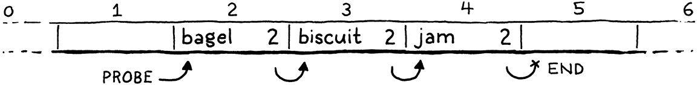

# 哈希表

> 哈希，x。这个词没有定义――没有人知道散列是什么。
> 
> -- Ambrose Bierce,*The Unabridged Devil’s Dictionary*

在我们可以将变量添加到蓬勃发展的虚拟机之前，我们需要一些方法来查找给定名称的变量值。后边，当添加类时，还需要一种方法来存储实例上的字段。这些问题和其他问题的完美数据结构是哈希表。

您可能已经知道哈希表是什么，即使您不知道它的名字。如果您是 Java 程序员，可以称它们为“HashMaps”。C# 和 Python 用户称它们为“字典(dictionaries)”。在 C++ 中，它是一个“无序映射(unordered map)”。JavaScript 中的“对象”和 Lua 中的“表”是引擎盖下的哈希表，这使它们具有灵活性。

哈希表，无论您使用何种语言称呼它，都将一组**键**与一组**值**相关联。每个键/值对都是表中的一个**条目**。给定一个键，可以查找其对应的值。可以添加新的键/值对并按键删除条目。如果为现有键添加新值，它将替换之前的条目。

哈希表出现在如此多的语言中，因为它们非常强大。这种能力大部分来自一个指标：给定一个键，哈希表会在常数时间内返回相应的值，*而不管哈希表中有多少个键*。

> 更具体地说，*平均案例*查找时间是恒定的。最坏情况下的表现可能会更糟。在实践中，很容易避免退化的行为并保持在快乐的道路上。

当你想到它时，这是非常了不起的。想象一下，你有一大叠名片，我要你找一个人。堆越大，需要的时间就越长。即使这堆已经排序并且足够的灵活性来进行二分查找，时间复杂度任然为*O(log n)*。但是对于哈希表，当堆栈中有 10 张名片时，查找名片所需的时间与堆中有 100 万张时相同。

> 把所有这些卡片都塞进名片夹里――还有人记得那些东西吗？―每个字母都有分隔符，您可以显着提高速度。正如我们将看到的，这与哈希表使用的技巧相差无几。

## 20.1 桶数组

一个完整、快速的哈希表有几个活动部分。我将通过解决几个玩具问题及其解决方案来逐一介绍它们。最终，我们将建立一个数据结构，可以将任何一组名称与其值相关联。

现在，想象一下如果 Lox在变量名方面受到很多限制。如果变量名只能是单个小写字母怎么办？怎样才能非常有效地表示一组变量名及其值？

> 这个限制并*不太*牵强。Dartmouth的 BASIC 初始版本允许变量名只是一个字母后跟一个可选数字。

只有 26 个可能的变量（如果你认为下划线是一个“字母”，我猜是 27 个），答案很简单。声明一个包含 26 个元素的固定大小的数组。我们将遵循传统并将每个元素称为**bucket**。每个代表一个变量，从字母 a开始其索引值为零，后边依次低增b为1 ,c为2 ...如果数组中某个字母的索引处有一个值，则该键与该值一起存在。否则，桶为空，并且该键/值对不在数据结构中。


内存使用率很高――只有一个大小合理的数组。空桶里有一些浪费，但不是很大。节点指针、填充或其他您通过链表或树获得的东西没有开销。

性能甚至更好。给定一个变量名――它的字符――你可以减去`a`的 ASCII 值并使用结果直接索引到数组中。然后可以查找现有值或将新值直接存储到该槽中。没有比这更快的了。

这是柏拉图式的理想数据结构。快如闪电，非常简单，内存紧凑。随着增加对更复杂键的支持，我们将不得不做出一些让步，但这正是我们的目标。即使你添加了哈希函数、动态调整大小和冲突解决，这仍然是每个哈希表的核心――一个连续的桶数组，你可以直接索引到其中。

### 20.1.1 负载因子 和 打包key

将 Lox 限制为单字母变量会使我们作为实现者的工作变得更容易，但是用一种只给你 26 个存储位置的语言编程可能并不有趣。如果放宽一点并允许变量最多八个字符呢？

> 同样，这个限制并不是那么疯狂。C 的早期链接器只将外部标识符的前六个字符视为有意义的。之后的一切都被忽略了。如果您曾经想知道为什么 C 标准库如此迷恋缩写―比如`strncmp()`―结果证明这不完全是因为当时的小屏幕（或电传打字机！）。

它足够小，我们可以将所有八个字符打包成一个 64 位整数，并轻松地将字符串转换为数字。然后可以将它用作数组索引。或者，至少，如果能以某种方式分配一个 295,148*PB*的数组，我们就可以做到。随着时间的推移，内存变得越来越便宜，但并没有*那么*便宜。即使我们能把一个数组做成那么大，那也是一种令人发指的浪费。除非用户开始编写比我们预期的更大的 Lox 程序，否则几乎每个桶都是空的。

即使我们的变量键覆盖了完整的 64 位数字范围，我们显然不需要那么大的数组。相反，我们分配一个数组，该数组的容量足以容纳我们需要的条目，但又不会过大。通过取数组大小的模值将完整的 64 位键映射到较小的范围。这样做基本上会将较大的数值范围折叠到自身上，直到它适合较小的数组元素范围。

例如，假设我们要存储“bagel”。我们分配了一个包含八个元素的数组，足够存储它，以后还可以存储更多。我们将key字符串视为 64 位整数。在像英特尔这样的小端机器上，将这些字符打包成一个 64 位字，将第一个字母“b”（ASCII 值 98）放在最低有效字节中。将该整数对数组大小 (8) 取模以使其适合边界并获得桶索引 2。然后我们像往常一样将值存储在那里。

> 我在这里对数组大小使用了 2 的幂，但它们并不需要如此。某些类型的散列表最适用于 2 的幂，包括我们将在本书中构建的散列表。其他人更喜欢质数数组大小或有其他规则。

使用数组大小作为模数可以让将键的数字范围向下映射以适应任何大小的数组。因此，**可以独立于键范围来控制桶的数量**。这解决了浪费问题，但引入了一个新问题。键号除以数组大小时具有相同余数的任何两个变量最终将在同一个桶中。键可以**碰撞**。例如，如果尝试添加“jam”，它最终也会出现在桶 2 中。


我们可以通过调整数组大小来对此进行一些控制。数组越大，映射到同一个桶的索引就越少，可能发生的冲突也就越少。哈希表实现者通过度量hash表的**负载因子**来跟踪这种冲突可能性。它被定义为条目数除以桶数。因此，具有 5 个条目和 16 个元素的数组的哈希表的加载因子为 0.3125。负载系数越高，发生碰撞的机会就越大。

我们减轻冲突的一种方法是调整数组的大小。就像之前实现的动态数组一样，在哈希表的数组填满时重新分配和增长它。但是，与常规动态数组不同的是，我们不会等到数组*已满*。相反，我们选择一个所需的负载因子并在超过该因子时增加数组。

## 20.2 碰撞解决

即使负载系数非常低，碰撞仍然会发生。[*生日悖论*](https://en.wikipedia.org/wiki/Birthday_problem)告诉我们，随着哈希表中条目数量的增加，发生碰撞的几率会增加得非常快。我们可以选择一个较大的数组大小来减少它，但这是一场失败的游戏。假设我们想在哈希表中存储一百个项目。为了将碰撞的可能性保持在仍然相当高的 10% 以下，我们需要一个至少包含 47,015 个元素的数组。要获得低于 1% 的机会，需要一个包含 492,555 个元素的数组，每个使用的元素有超过 4,000 个空桶。

低负载系数可以减少碰撞，但[*鸽巢原理*](https://en.wikipedia.org/wiki/Pigeonhole_principle)告诉我们，我们永远无法完全消除它们。如果你有五只宠物鸽子和四个洞可以放它们，至少有一个洞最终会出现不止一只鸽子。有 18,446,744,073,709,551,616 个不同的变量名，任何合理大小的数组都可能在同一个桶中有多个键。

因此，仍然必须在碰撞发生时优雅地处理它们。用户不喜欢他们的编程语言只能在*大多数*时候正确查找变量。

> 把这两个名字很有趣的数学规则放在一起，你会得到这样的观察结果：取一个包含 365 个鸽子笼的鸟舍，并使用每只鸽子的生日将其分配给一个鸽子笼。你只需要大约 26 只随机选择的鸽子，你就有超过 50% 的机会将两只鸽子放在同一个盒子里。


### 20.2.1 拉链法 （separate chaining）

解决冲突的技术分为两大类。第一个是**拉链法(separate chaining)**。我们让它包含一个集合，而不是每个桶只包含一个条目。在经典实现中，每个桶都指向一个条目链表。要查找条目，您可以找到它的存储桶，然后遍历列表，直到找到具有匹配键的条目。


在每个条目都在同一个桶中发生冲突的糟糕灾难性情况下，数据结构会退化为具有O(n)查找的单个未排序链表。在实践中，通过控制负载因子以及条目如何分散在桶中很容易避免这种情况。在典型的拉链哈希表中，一个桶很少有超过一个或两个条目。

拉链法在概念上很简单――它实际上是一个链表数组。大多数操作都可以直接实现，即使是删除，正如我们将看到的那样，也可能很痛苦。**但它不太适合现代 CPU。它有很多来自指针的开销，并且倾向于在内存中散布小链表节点，这不利于缓存使用**。

> 有一些技巧可以优化它。许多实现将第一个条目直接存储在桶中，因此在只有一个的常见情况下，不需要额外的指针间接寻址。您还可以让每个链表节点存储一些条目以减少指针开销。

### 20.2.2 开放寻址

另一种技术称为**开放寻址**或（令人困惑的）**封闭散列**。使用这种技术，所有条目都直接存在于桶数组中，每个桶一个条目。如果两个条目在同一个桶中发生冲突，会查找一个不同的空桶来代替。

> 之所以称为“开放式”寻址，是因为条目可能最终位于其首选地址之外的地址（存储桶）。它被称为“封闭”散列，因为所有条目都保留在桶数组中。

将所有条目存储在一个单一的、大的、连续的数组中对于保持内存表示的简单和快速非常有用。但它使哈希表上的所有操作更加复杂。插入条目时，它的桶可能已满，会导致查看另一个桶。那个桶本身可能被占用等等。这个寻找可用桶的过程称为**探测**，检查桶的顺序是**探测序列**。

有许多算法可用于确定要探测的桶以及如何决定哪个条目进入哪个桶。这里有大量的研究，因为即使是轻微的调整也会对性能产生很大的影响。而且，在像哈希表这样被大量使用的数据结构上，这种性能影响会涉及到大量具有一系列硬件功能的现实世界程序。

> 如果你想了解更多（你应该，因为其中一些真的很酷），请研究“双重哈希”、“布谷鸟哈希”、“罗宾汉哈希”以及任何引导你去的东西。

与本书中的往常一样，我们将选择最简单的方法来高效地完成工作。那是很好的旧**线性探测**。在查找条目时，我们会在其键映射到的第一个存储桶中查找。如果它不在那里，我们就查看数组中的下一个元素，依此类推。如果我们到达终点，我们将回到起点。

**线性探测的好处是它对高速缓存友好**。由于直接按内存顺序遍历数组，因此它使 CPU 的高速缓存行保持完整和快乐。不好的是容易**扎堆(clustering)**。如果有很多具有数字相似键值的条目，最终可能会遇到很多彼此相邻的碰撞、溢出的桶。

与拉链发相比，开放寻址更难理解。我认为开放寻址类似于单独的链表，除了节点“列表”是通过桶数组本身串接的。不是将它们之间的链接存储在指针中，而是根据您查看存储桶的顺序隐式计算连接。

棘手的部分是这些隐式列表中的多个可能交错在一起。让我们来看一个涵盖所有有趣案例的示例。我们暂时忽略值，只关心一组键。我们从一个包含 8 个桶的空数组开始。


我们决定插入“bagel”。第一个字母“b”（ASCII 值 98）以数组大小 (8) 为模将其放入桶 2。


接下来，我们插入“jam”。这也想进入存储桶 2 (106 mod 8 = 2)，但那个存储桶已被占用。我们继续探索下一个桶。它是空的，所以我们把它放在那里。


我们插入“fruit”，它愉快地落在桶 6 中。


同样，“migas”可以放入其首选的桶 5 中。


当我们尝试插入“eggs”时，它也想在桶 5 中。那是满的，所以我们跳到 6。桶 6 也满了。请注意，其中的条目*不是*同一探测序列的一部分。“Fruit”在它的首选桶 6 中。因此 5 和 6 序列发生碰撞并交错。我们跳过那个，最后将“eggs”放入桶 7 中。


在插入“nuts”时遇到了类似的问题。它不能像它想要的那样落在 6。也不能进入 7。所以我们继续前进。但是我们已经到了数组的末尾，所以我们回到 0 并将它放在那里。


实际上，交织并不是什么大问题。即使在拉链法中，也需要遍历列表以检查每个条目的键，因为多个键可以减少到同一个桶。对于开放寻址，我们需要进行相同的检查，这也涵盖了您跨过“属于”不同原始存储桶的条目的情况。

## 20.3 哈希函数

现在可以为自己构建一个相当有效的表来存储最多八个字符的变量名，但这个限制仍然很烦人。为了放宽最后一个约束，需要一种方法来获取任意长度的字符串并将其转换为固定大小的整数。

最后，我们到了“哈希表”的“哈希”部分。**散列函数**采用一些较大的数据块并将其“散列”以生成固定大小的整数散列**码**，其值取决于原始数据的所有位。一个好的哈希函数具有三个主要目标：

> 哈希函数也用于密码学。在那个领域，“好”有*更*严格的定义，以避免暴露有关被散列数据的细节。值得庆幸的是，我们无需为本书担心这些问题。

- **它必须是确定性的**。相同的输入必须始终散列为相同的数字。如果同一个变量在不同的时间点出现在不同的桶中，就很难找到它。

- **它必须是均匀的**。给定一组典型的输入，它应该产生范围广泛且分布均匀的输出数字，并尽可能少地出现聚集或模式。我们希望它在整个数值范围内分散值，以最大程度地减少冲突和聚类。

- **它必须很快**。哈希表上的每个操作都需要我们先对key进行哈希处理。如果散列很慢，它可能会抵消底层数组存储的速度。

> 哈希表的原始名称之一是“分散表scatter table”，因为它获取条目并将它们分散在整个数组中。“散列”一词源于这样一种想法，即散列函数获取输入数据，将其切碎，然后将它们一起扔成一堆，以从所有这些位中得出一个数字。

已经有一大堆散列函数。有些是旧的，并且针对没有人再使用的架构进行了优化。有些被设计成快速的，有些是加密安全的。一些利用特定芯片的矢量指令和高速缓存大小，另一些则旨在最大限度地提高可移植性。

对有些人来说，设计和评估哈希函数就像他们的*难题*一样。我很钦佩他们，但我在数学上还不够敏锐，无法*成为他们中*的一员。因此，对于 clox，我选择了一个简单、久经考验的哈希函数，称为[FNV-1a](http://www.isthe.com/chongo/tech/comp/fnv/)，多年来一直为我服务。考虑在您的代码中尝试不同的方法，看看它们是否有所作为。

谁知道呢，也许哈希函数也能成为你的菜？

好的，这是对桶、负载因子、开放寻址、冲突解决和散列函数的快速浏览。那是大量的文本，而不是大量的实际代码。如果它看起来仍然模糊，请不要担心。一旦我们完成编码，它就会全部安装到位。

## 20.4 构建哈希表

与平衡搜索树等其他经典技术相比，哈希表的优点在于实际数据结构非常简单。我们进入了一个新模块。

```c
#ifndef clox_table_h
#define clox_table_h

#include "common.h"
#include "value.h"

typedef struct {
  int count;
  int capacity;
  Entry* entries;
} Table;

#endif
// table.h, create new file
```

哈希表是一个条目数组。与之前的动态数组一样，我们跟踪数组的分配大小 (`capacity`) 和当前存储在其中的键/值对的数量 (`count`)。count与capacity的比值就是哈希表的负载因子。

每个条目都是其中之一：

```c
#include "value.h"

typedef struct {
  ObjString* key;
  Value value;
} Entry;

typedef struct {
// table.h
```

这是一个简单的键/值对。由于键始终是一个字符串，我们直接存储 ObjString 指针而不是将其包装在一个值中。这样速度更快，体积更小。

> 在 clox 中，我们只需要支持字符串形式的键。处理其他类型的密钥不会增加太多复杂性。只要您可以比较两个对象的相等性并将它们简化为位序列，就很容易将它们用作散列键。

为了创建一个新的空哈希表，我们声明了一个类似构造函数的函数。

```c
} Table;

void initTable(Table* table);

#endif
// table.h, add after struct Table
```

需要一个新的实现文件来定义它。当这样做的时候，把所有讨厌的include都放在一边。

```c
#include <stdlib.h>
#include <string.h>

#include "memory.h"
#include "object.h"
#include "table.h"
#include "value.h"

void initTable(Table* table) {
  table->count = 0;
  table->capacity = 0;
  table->entries = NULL;
}
// table.c, create new file
```

与我们的动态值数组类型一样，哈希表最初以零容量和`NULL`数组开始。除非需要，否则我们不会分配任何东西。假设我们最终确实分配了一些东西，也需要能够释放它。

```c
void initTable(Table* table);
void freeTable(Table* table);

#endif
// table.h, add after initTable()
```

及其伟大的实现：

```c
void freeTable(Table* table) {
  FREE_ARRAY(Entry, table->entries, table->capacity);
  initTable(table);
}
// table.c, add after initTable()
```

同样，它看起来就像一个动态数组。事实上，您可以将哈希表基本上看作是一个动态数组，它具有非常奇怪的插入项策略。我们不需要检查`NULL`这里，因为`FREE_ARRAY()`已经优雅地处理了。

### 20.4.1 字符串哈希

在开始将条目放入表中之前，需要对它们进行哈希处理。为了确保条目在整个数组中均匀分布，需要一个好的哈希函数来查看密钥字符串的所有位。如果它只查看前几个字符，那么一系列共享相同前缀的字符串最终会在同一个桶中发生冲突。

另一方面，遍历整个字符串来计算哈希有点慢。如果每次在表中查找键时都必须遍历字符串，将失去哈希表的一些性能优势。所以会做一件显而易见的事情：缓存它。

在 ObjString 的“对象”模块中，我们添加：

```c
  char* chars;
  uint32_t hash;
};
// object.h, in struct ObjString 
```

每个 ObjString 存储其字符串的哈希码。由于字符串在 Lox 中是不可变的，可以预先计算一次哈希码并确保它永远不会失效。急切地缓存它是有道理的：分配字符串并复制它的字符已经是一个O(n)操作，所以现在是对字符串的哈希进行O(n)计算的好时机。

每当我们调用内部函数分配一个字符串时，我们都会传入它的哈希码。

```c
static ObjString* allocateString(char* chars, int length,
                                 uint32_t hash) {
  ObjString* string = ALLOCATE_OBJ(ObjString, OBJ_STRING);
// object.c, function allocateString(), replace 1 line
```

该函数只是将散列存储在结构中。

```c
  string->chars = chars;
  string->hash = hash;
  return string;
}
// object.c, in allocateString() 
```

有趣的地方发生在调用者身上。从两个地方调用`allocateString()`：复制字符串的函数和获取现有动态分配字符串的所有权的函数。我们将从第一个开始。

```c
ObjString* copyString(const char* chars, int length) {
  uint32_t hash = hashString(chars, length);
  char* heapChars = ALLOCATE(char, length + 1);
// object.c, in copyString()
```

这里没有魔法。我们计算哈希码，然后传递它。

```c
  memcpy(heapChars, chars, length);
  heapChars[length] = '\0';
  return allocateString(heapChars, length, hash);
}
// object.c, in copyString(), replace 1 line
```

其他字符串函数类似。

```c
ObjString* takeString(char* chars, int length) {
  uint32_t hash = hashString(chars, length);
  return allocateString(chars, length, hash);
}
// object.c, in takeString(), replace 1 line
```

有趣的代码在这里：

```c
static uint32_t hashString(const char* key, int length) {
  uint32_t hash = 2166136261u;
  for (int i = 0; i < length; i++) {
    hash ^= (uint8_t)key[i];
    hash *= 16777619;
  }
  return hash;
}
// object.c, add after allocateString()
```

这是 clox 中真正的“哈希函数”。该算法称为“FNV-1a”，是我所知道的最短的体面哈希函数。在一本旨在向您展示每一行代码的书中，简洁无疑是一种美德。

基本思想非常简单，许多哈希函数都遵循相同的模式。您从一些初始哈希值开始，通常是具有某些精心选择的数学属性的常数。然后你遍历要散列的数据。对于每个字节（或有时是单词），您以某种方式将这些位混合到哈希值中，然后将生成的位围绕某些位打乱。

“混合”和“打乱”的含义可能非常复杂。不过，最终的基本目标是均匀分布 (uniformity)――我们希望生成的哈希值尽可能广泛地分散在数值范围内，以避免冲突和聚集。

### 20.4.2 插入条目

现在知道字符串对象哈希码，可以开始将它们放入哈希表中。

```c
void freeTable(Table* table);
bool tableSet(Table* table, ObjString* key, Value value);

#endif
// table.h, add after freeTable()
```

此函数将给定的键/值对添加到给定的哈希表中。如果该键的条目已经存在，则新值将覆盖旧值。如果添加了新条目，该函数将返回`true`。这是实现：

```c
bool tableSet(Table* table, ObjString* key, Value value) {
  Entry* entry = findEntry(table->entries, table->capacity, key);
  bool isNewKey = entry->key == NULL;
  if (isNewKey) table->count++;

  entry->key = key;
  entry->value = value;
  return isNewKey;
}
// table.c, add after freeTable()
```

大多数有趣的逻辑都在`findEntry()`其中，我们很快就会讲到。该函数的工作是获取一个键并确定它应该进入数组中的哪个桶。它返回一个指向该桶的指针――数组中 Entry 的地址。

一旦我们有了一个桶，插入就很简单了。我们更新哈希表的大小，注意不要在我们覆盖已经存在的键的值时增加计数。然后我们将键和值复制到条目中的相应字段中。

不过，我们在这里遗漏了一些东西。我们实际上还没有分配 Entry 数组。哎呀！在我们可以插入任何东西之前，我们需要确保我们有一个数组，并且它足够大。

```c
bool tableSet(Table* table, ObjString* key, Value value) {
  if (table->count + 1 > table->capacity * TABLE_MAX_LOAD) {
    int capacity = GROW_CAPACITY(table->capacity);
    adjustCapacity(table, capacity);
  }

  Entry* entry = findEntry(table->entries, table->capacity, key);
// table.c, in tableSet()
```

这类似于我们之前编写的用于增长动态数组的代码。如果我们没有足够的容量来插入一个项目，我们会重新分配并扩大数组。宏采用`GROW_CAPACITY()`现有容量并将其增长成倍数，以确保我们在一系列插入中获得摊销的恒定性能。

这里有趣的区别是那个`TABLE_MAX_LOAD`常数。

```c
#include "value.h"

#define TABLE_MAX_LOAD 0.75

void initTable(Table* table) {
// table.c
```

这就是我们管理表的负载因子的方式。我们不会等到 容量完全满时才增长。取而代之的是，我们在容量满之前增长，此时数组至少已满 75%。

> 理想的最大加载因子 根据 散列函数、冲突处理策略和您将看到的典型键集而异。由于像 Lox 这样的玩具语言没有“真实世界”的数据集，因此很难对其进行优化，我随意选择了 75%。当您构建自己的哈希表时，对其进行基准测试和调整。

很快就会开始实现`adjustCapacity()`。首先，让我们看看`findEntry()`您一直想知道的那个函数。

```c
static Entry* findEntry(Entry* entries, int capacity,
                        ObjString* key) {
  uint32_t index = key->hash % capacity;
  for (;;) {
    Entry* entry = &entries[index];
    if (entry->key == key || entry->key == NULL) {
      return entry;
    }

    index = (index + 1) % capacity;
  }
}
// table.c, add after freeTable()
```

这个函数才是哈希表真正的核心。它负责获取一个键和一个桶数组，并确定条目属于哪个桶。此功能也是线性探测和碰撞处理发挥作用的地方。我们将使用`findEntry()`两者来查找哈希表中的现有条目并决定在何处插入新条目。

尽管如此，它并没有太多。首先，使用模数将键的哈希码映射到数组边界内的索引。这返回一个桶索引，理想情况下，我们将能够在其中找到或放置条目。

有几种情况需要检查：

- 如果该数组索引处的 Entry 键为`NULL`，则该桶为空。如果我们要`findEntry()`在哈希表中查找某些内容，这意味着它不存在。如果我们使用它来插入，这意味着我们已经找到了添加新条目的地方。

- 如果桶中的键等于我们正在寻找的键，那么该键已经存在于表中。如果我们正在进行查找，那很好――我们已经找到了我们要查找的键。如果我们正在执行插入，这意味着我们将替换该键的值而不是添加新条目。

> 看起来我们正在使用`==`来查看两个字符串是否相等。那行不通，是吗？同一个字符串在内存中的不同位置可能有两个副本。不要害怕，精明的读者。我们将进一步解决这个问题。而且，奇怪的是，它是一个哈希表，提供了我们需要的工具。

- 否则，桶中有一个条目，但具有不同的键。这是一次碰撞。在这种情况下，我们开始探索。这就是那个`for`循环所做的。我们从条目理想的位置开始。如果那个桶是空的或者有相同的键，我们就完成了。否则，我们前进到下一个元素――这是“线性探测”的*线性*部分――并在那里检查。如果我们越过数组的末尾，第二个模运算符会将我们绕回到开头。

当我们找到一个空桶或一个与我们正在寻找的桶具有相同键的桶时，我们就退出循环。您可能想知道无限循环。如果我们与*每个*桶相撞怎么办？幸运的是，**由于我们的负载系数，这不会发生。因为我们在数组接近满时立即增长数组，所以我们知道总会有空桶**。

我们直接从循环内返回，产生指向找到的 Entry 的指针，因此调用者可以向其中插入内容或从中读取内容。回到`tableSet()`第一个启动它的函数，我们将新条目存储在返回的桶中，我们就完成了。

### 20.4.3 分配和调整大小

在可以将条目放入哈希表之前，我们确实需要一个地方来实际存储它们。需要分配一个桶数组。这发生在这个函数中：

```c
static void adjustCapacity(Table* table, int capacity) {
  Entry* entries = ALLOCATE(Entry, capacity);
  for (int i = 0; i < capacity; i++) {
    entries[i].key = NULL;
    entries[i].value = NIL_VAL;
  }

  table->entries = entries;
  table->capacity = capacity;
}
// table.c, add after findEntry()
```

我们创建一个包含`capacity`条目的桶数组。分配数组后，我们将每个元素初始化为一个空桶，然后将数组（及其容量）存储在哈希表的主结构中。当我们将第一个条目插入表中时，这段代码很好，我们需要数组的第一次分配。但是，当我们已经拥有一个并且需要扩容它时怎么办？

回到做动态数组的时候，可以使用`realloc()`并让 C 标准库复制所有内容。这不适用于哈希表。请记住，要为每个条目选择存储桶，我们将其散列键*对数组大小取模*。这意味着当数组大小发生变化时，条目可能会在不同的桶中结束。

那些新的桶可能有我们需要处理的新碰撞。因此，获取每个条目所属位置的最简单方法是通过将每个条目重新插入新的空数组来从头开始重建表。

```c
    entries[i].value = NIL_VAL;
  }

  for (int i = 0; i < table->capacity; i++) {
    Entry* entry = &table->entries[i];
    if (entry->key == NULL) continue;

    Entry* dest = findEntry(entries, capacity, entry->key);
    dest->key = entry->key;
    dest->value = entry->value;
  }

  table->entries = entries;
// table.c, in adjustCapacity()
```

我们从前到后遍历旧数组。每当我们找到一个非空桶时，我们就将该条目插入到新数组中。我们使用`findEntry()`，传入*新*数组而不是当前存储在表中的数组。（这就是为什么`findEntry()`将指针直接指向 Entry 数组而不是整个`Table`结构。这样，我们可以在将新数组和容量存储到结构中之前传递它们。）

完成后，我们可以释放旧数组的内存。

```c
    dest->value = entry->value;
  }

  FREE_ARRAY(Entry, table->entries, table->capacity);
  table->entries = entries;
// table.c, in adjustCapacity()
```

有了它，我们就有了一个哈希表，可以根据需要向其中填充尽可能多的条目。它处理所有现有key并根据需要自行扩展以维持所需的负载能力。

当我们这样做时，让我们还定义一个辅助函数，用于将一个哈希表的所有条目复制到另一个哈希表中。

```c
bool tableSet(Table* table, ObjString* key, Value value);
void tableAddAll(Table* from, Table* to);

#endif
// table.h, add after tableSet()
```

到以后我们支持方法继承时，才需要它，但是最好现在就实现它，因为我们已经对所有哈希表的东西都记忆犹新。

```c
void tableAddAll(Table* from, Table* to) {
  for (int i = 0; i < from->capacity; i++) {
    Entry* entry = &from->entries[i];
    if (entry->key != NULL) {
      tableSet(to, entry->key, entry->value);
    }
  }
}
// table.c, add after tableSet()
```

这个没什么好说的。它遍历源哈希表的桶数组。每当它找到一个非空桶时，它就会使用我们最近定义的函数`tableSet()`将条目添加到目标哈希表中。

### 20.4.4 检索值

现在我们的哈希表包含了一些东西，让我们开始把东西找出来。给定一个键，可以用这个函数查找对应的值，如果有的话：

```c
void freeTable(Table* table);
bool tableGet(Table* table, ObjString* key, Value* value);
bool tableSet(Table* table, ObjString* key, Value value);
// table.h, add after freeTable()
```

你传入一个表和一个键。如果找到具有该键的条目，则返回`true`，否则返回`false`。如果条目存在，则输出参数`value`指向结果值。

既然`findEntry()`已经做了很多工作，实现起来还不麻烦。

```c
bool tableGet(Table* table, ObjString* key, Value* value) {
  if (table->count == 0) return false;

  Entry* entry = findEntry(table->entries, table->capacity, key);
  if (entry->key == NULL) return false;

  *value = entry->value;
  return true;
}
// table.c, add after findEntry()
```

如果表完全是空的，肯定找不到该条目，所以首先检查它。这不仅仅是一种优化――它还确保我们不会在数组为`NULL`.否则，就让`findEntry()`发挥它的魔力。这会返回一个指向桶的指针。如果桶是空的，我们通过查看键是否为`NULL`来检测没有找到带有我们键的条目。如果`findEntry()`确实返回一个非空条目，那么这就是匹配项。获取 Entry 的值并将其复制到输出参数，以便调用者可以获取它。小菜一碟。

### 20.4.5 删除条目

全功能哈希表还需要支持一项更基本的操作：删除条目。这看起来很明显，如果你可以添加东西，你应该可以*取消*添加它们，对吧？但是您会惊讶于有多少关于哈希表的教程忽略了这一点。

我也可以走那条路。事实上，我们仅在 VM 中的极小边缘情况下使用 clox 中的删除。但是如果你想真正理解如何完整地实现一个哈希表，这感觉很重要。我可以同情他们想要忽视它的愿望。正如我们将看到的，从使用开放寻址的哈希表中删除 是很棘手的。

> 使用拉链法，删除就像从链表中删除节点一样简单。

至少声明很简单。

```c
bool tableSet(Table* table, ObjString* key, Value value);
bool tableDelete(Table* table, ObjString* key);
void tableAddAll(Table* from, Table* to);
// table.h, add after tableSet()
```

显而易见的实现方法是和插入类似。用`findEntry()`查找条目的桶。然后清理桶。完毕！

在没有碰撞的情况下，效果很好。但是如果发生了冲突，那么条目所在的桶可能是一个或多个隐式探测序列的一部分。例如，这是一个包含三个键的哈希表，它们都具有相同的首选存储桶 2：



请记住，当我们遍历探测序列以查找条目时，我们知道已经到达序列的末尾并且当遇到空桶时该条目不存在。这就像探测序列是一个条目列表，一个空条目终止该列表。

如果我们通过简单地清除条目来删除“biscuit”，那么会在中间破坏该探测序列，从而使尾随条目成为孤立的且无法访问。有点像从链表中删除一个节点而不将指针从前一个节点重新链接到下一个节点。

如果稍后尝试寻找“jam”，将从“bagel”开始，停在下一个空条目处，并且永远找不到它。


为了解决这个问题，大多数实现都使用了一种叫做**tombstones**的技巧。我们没有在删除时清除条目，而是用一个称为“墓碑”的特殊哨兵条目替换它。当在查找期间跟踪探测序列时，我们遇到了墓碑，我们*不会*将其视为空槽并停止循环。相反，会继续前进，以便删除条目不会破坏任何隐式碰撞链，我们仍然可以在它之后找到条目。


代码如下所示：

```c
bool tableDelete(Table* table, ObjString* key) {
  if (table->count == 0) return false;

  // Find the entry.
  Entry* entry = findEntry(table->entries, table->capacity, key);
  if (entry->key == NULL) return false;

  // Place a tombstone in the entry.
  entry->key = NULL;
  entry->value = BOOL_VAL(true);
  return true;
}
// table.c, add after tableSet()
```

首先，找到包含我们要删除的条目的桶。（如果我们没有找到它，就没有什么可删除的，所以我们放弃了。）我们用墓碑替换条目。在 clox 中，使用一个`NULL`键和一个`true`值来表示它，但任何不会与空桶或有效条目混淆的表示都有效。


这就是我们删除条目所需要做的全部工作。简单快捷。但是所有其他操作也需要正确处理墓碑。墓碑是一种“半”条目。它既有现在条目的一些特征，也有空条目的一些特征。

当我们在查找过程中跟踪探测序列时，我们遇到了墓碑，我们注意到它并继续前进。

```c
for (;;) {
    Entry* entry = &entries[index];
    if (entry->key == NULL) {
      if (IS_NIL(entry->value)) {
        // Empty entry.
        return tombstone != NULL ? tombstone : entry;
      } else {
        // We found a tombstone.
        if (tombstone == NULL) tombstone = entry;
      }
    } else if (entry->key == key) {
      // We found the key.
      return entry;
    }

    index = (index + 1) % capacity;
// table.c, in findEntry(), replace 3 lines
```

// 第一次传递墓碑时，我们将其存储在这个局部变量中：

```c
uint32_t index = key->hash % capacity;
  Entry* tombstone = NULL;

  for (;;) {
// table.c, in findEntry()  
```

如果我们到达一个真正空的条目，那么key不存在。在那种情况下，如果我们传递了一个墓碑，我们返回它的桶而不是后来的空桶。如果我们调用`findEntry()`是为了插入一个节点，那么我们就可以将逻辑删除桶视为空的，并将其重新用于新条目。

像这样自动重用墓碑插槽有助于减少桶阵列中浪费空间的墓碑数量。在混合插入和删除的典型用例中，墓碑的数量会增长一段时间，然后趋于稳定。

即便如此，也不能保证大量删除不会导致数组充满墓碑。在最坏的情况下，我们最终可能*没有*空桶。那会很糟糕，因为请记住，唯一阻止无限循环的`findEntry()`是假设我们最终会碰到一个空桶。

因此，我们需要考虑墓碑如何与表的负载因子和调整大小交互。关键问题是，在计算负载因子时，我们应该把墓碑当成满桶还是空桶？

### 20.4.6 墓碑计数

如果我们将墓碑视为满桶，那么我们最终可能会得到一个比我们可能需要的更大的数组，因为它人为地增加了负载因子。我们可以重复使用墓碑，但它们不会被视为未使用，因此我们最终会过早地扩容数组。

但是，如果我们将墓碑视为空桶并且*不*将它们包含在负载因子中，那么我们将面临最终*没有*实际空桶来终止查找的风险。无限循环比一些额外的数组槽更糟糕，因此对于负载因子，我们认为墓碑是满桶。

这就是为什么我们在前面的代码中删除条目时不减少count的原因。count不再是哈希表中的条目数，而是条目数加上墓碑。这意味着只有当新条目进入一个完全空的桶时，我们才会在插入期间增加计数。

```c
bool isNewKey = entry->key == NULL;
  if (isNewKey && IS_NIL(entry->value)) table->count++;

  entry->key = key;
// table.c, in tableSet(), replace 1 line  
```

如果我们用新条目替换墓碑，则桶已经被计算在内并且计数不会改变。

当我们调整数组大小时，我们分配一个新数组并将所有现有条目重新插入其中。在此过程中，我们*不会*将墓碑复制过来。它们不会增加任何价值，因为我们无论如何都要重建探测序列，只会减慢查找速度。这意味着我们需要重新计算count，因为它可能会在调整大小时发生变化。所以我们清除它：

```c
  }

  table->count = 0;
  for (int i = 0; i < table->capacity; i++) {
// table.c, in adjustCapacity()
```

然后每次我们找到一个非墓碑条目时，我们都会增加它。

```c
    dest->value = entry->value;
    table->count++;
  }
// table.c, in adjustCapacity()
```

这意味着当我们增加容量时，我们最终可能会在生成的更大数组中得到*更少的*条目，因为所有的墓碑都被丢弃了。这有点浪费，但不是一个大的实际问题。

我发现有趣的是，支持删除条目的大部分工作都在`findEntry()`和`adjustCapacity()`中。实际的删除逻辑非常简单和快速。在实践中，删除往往很少见，因此您希望哈希表在删除函数中完成尽可能多的工作，而让其他函数保持更快的速度。使用我们的墓碑方法，删除速度很快，但查找会受到惩罚。

我做了一些基准测试，以在几个不同的删除场景中对此进行测试。我惊讶地发现，与在删除期间完成所有工作以重新插入受影响的条目相比，逻辑删除最终确实更快。

但是仔细想想，并不是墓碑方式把完全删除一个条目的工作推给了其他操作，更多的是让删除变得*懒惰*了。起初，它做了最少的工作将条目变成墓碑。当以后的查找必须跳过它时，这可能会导致惩罚。但它也允许该墓碑桶被以后的插入重复使用。这种重用是避免重新排列以下所有受影响条目的成本的一种非常有效的方法。您基本上回收了探测条目链中的一个节点。这是一个巧妙的技巧。

## 20.5 字符串驻留 string-interning

我们已经得到了一个基本上可用的哈希表，尽管它的中心有一个严重的缺陷。此外，我们还没有将它用于任何事情。是时候解决这两个问题了，并在此过程中学习解释器使用的经典技术。

哈希表不能完全工作的原因是当`findEntry()`检查现有键是否与它正在寻找的键匹配时，它用于`==`比较两个字符串是否相等。仅当两个键在内存中是完全相同的字符串时才返回 true。具有相同字符的两个单独的字符串应该被认为是相等的，但事实并非如此。

请记住，当我们在上一章中添加字符串时，我们添加了[显式支持以逐个字符地比较字符串](http://craftinginterpreters.com/strings.html#operations-on-strings)以获得真正的值相等性。我们可以在 中做到这一点`findEntry()`，但那很慢。

> 实际上，我们会先比较两个字符串的哈希码。它可以快速检测到几乎所有不同的字符串――如果没有，它就不是一个很好的哈希函数。但是当两个哈希值相同时，我们仍然需要比较字符以确保我们没有在不同的字符串上发生哈希冲突。

相反，我们将使用一种称为**string interning**的技术。核心问题是内存中可能存在具有相同字符的不同字符串。即使它们是不同的对象，它们也需要表现得像  等值。它们本质上是重复的，必须比较它们的所有字节才能检测到。

字符串驻留是一个重复数据删除的过程。我们创建了一个“interned”字符串的集合。该集合中的任何字符串都保证在文本上与所有其他字符串不同。当你驻留(intern)一个字符串时，你会在集合中寻找一个匹配的字符串。如果找到，则使用原来的那个。否则，您拥有的字符串是唯一的，因此您将其添加到集合中。

> 我猜“intern”是“internal”的缩写。我认为这个想法是语言的运行时保留这些字符串自己的“内部”集合，而其他字符串可以由用户创建并在内存中浮动。当你intern一个字符串时，你要求运行时将字符串添加到该内部集合并返回一个指向它的指针。
> 
> 语言在它们进行多少字符串intern以及如何向用户公开这些方面有所不同。Lua intern*所有*的字符串，这也是 clox 会做的。Lisp、Scheme、Smalltalk、Ruby 和其他语言有一个单独的类似字符串的类型，称为“symbol”，它是隐式intern的。（这就是为什么他们说符号在 Ruby 中“更快”。）默认情况下，Java 会保留常量字符串，并提供一个 API 来让您显式地保留给它的任何字符串。

这样，您就知道每个字符序列在内存中仅由一个字符串表示。这使得 相等比较 变得很轻量级。如果两个字符串在内存中指向同一个地址，那么它们显然是同一个字符串，必须相等。而且，因为我们知道字符串是唯一的，所以如果两个字符串指向不同的地址，它们必须是不同的字符串。

因此，指针相等性与值相等性完全匹配。这反过来意味着我们在`findEntry()`使用`==`是正确的。或者，至少，一旦我们intern了所有的字符串，它就会。为了可靠地删除所有字符串的重复数据，VM 需要能够找到创建的每个字符串。我们通过给它一个哈希表来存储它们来做到这一点。

```c
  Value* stackTop;
  Table strings;
  Obj* objects;
// vm.h, in struct VM 
```

像往常一样，我们需要一个包含。

```c
#include "chunk.h"
#include "table.h"
#include "value.h"
// vm.h
```

当我们启动一个新的 VM 时，字符串表是空的。

```c
  vm.objects = NULL;
  initTable(&vm.strings);
}
// vm.c, in initVM() 
```

当我们关闭 VM 时，我们会清理该表使用的所有资源。

```c
void freeVM() {
  freeTable(&vm.strings);
  freeObjects();
// vm.c, in freeVM()
```

一些语言有一个单独的类型或一个明确的步骤来intern一个字符串。对于 clox，我们会自动intern每个字符串。这意味着每当我们创建一个新的唯一字符串时，都会将其添加到表中。

```c
  string->hash = hash;
  tableSet(&vm.strings, string, NIL_VAL);
  return string;
// object.c, in allocateString()
```

我们使用的表更像是哈希*集*而不是哈希*表*。键是字符串，我们只关心这些，所以我们只使用`nil`值。

这会在表中获取一个字符串，假设它是唯一的，但我们需要在到达这里之前实际检查重复项。我们在调用`allocateString()`.这是一个：

```c
  uint32_t hash = hashString(chars, length);
  ObjString* interned = tableFindString(&vm.strings, chars, length,
                                        hash);
  if (interned != NULL) return interned;

  char* heapChars = ALLOCATE(char, length + 1);
// object.c, in copyString() 
```

当将一个字符串复制到一个新的 LoxString 中时，首先在字符串表中查找它。如果找到它，而不是“复制”，只是返回对该字符串的引用。否则，我们会失败，分配一个新的字符串，并将其存储在字符串表中。

取得字符串的所有权有点不同。

```c
  uint32_t hash = hashString(chars, length);
  ObjString* interned = tableFindString(&vm.strings, chars, length,
                                        hash);
  if (interned != NULL) {
    FREE_ARRAY(char, chars, length + 1);
    return interned;
  }

  return allocateString(chars, length, hash);
// object.c, in takeString()
```

同样，我们首先在字符串表中查找字符串。如果我们找到它，在返回它之前，我们会为传入的字符串释放内存。由于所有权已传递给此函数并且我们不再需要重复的字符串，因此由我们来释放它。

在开始我们需要编写的新函数之前，还有一个 include。

```c
#include "object.h"
#include "table.h"
#include "value.h"
// object.c
```

要在表中查找字符串，我们不能使用普通`tableGet()`函数，因为它会调用`findEntry()`，这与我们现在正在尝试修复的重复字符串存在确切问题。相反，我们使用这个新函数：

```c
void tableAddAll(Table* from, Table* to);
ObjString* tableFindString(Table* table, const char* chars,
                           int length, uint32_t hash);

#endif
// table.h, add after tableAddAll()
```

实现看起来像这样：

```c
ObjString* tableFindString(Table* table, const char* chars,
                           int length, uint32_t hash) {
  if (table->count == 0) return NULL;

  uint32_t index = hash % table->capacity;
  for (;;) {
    Entry* entry = &table->entries[index];
    if (entry->key == NULL) {
      // Stop if we find an empty non-tombstone entry.
      if (IS_NIL(entry->value)) return NULL;
    } else if (entry->key->length == length &&
        entry->key->hash == hash &&
        memcmp(entry->key->chars, chars, length) == 0) {
      // We found it.
      return entry->key;
    }

    index = (index + 1) % table->capacity;
  }
}
// table.c, add after tableAddAll()
```

看来我们已经复制粘贴了`findEntry()`。有很多冗余，但也有一些关键差异。首先，我们传入要查找的键的原始字符数组，而不是 ObjString。在我们调用它时，我们还没有创建 ObjString。

其次，在检查是否找到key时，我们会查看实际的字符串。首先查看它们是否具有匹配的长度和哈希值。这些可以快速检查，如果它们不相等，则字符串肯定不相同。

如果存在哈希冲突，将进行实际的逐个字符的字符串比较。这是 VM 中我们实际测试字符串文本相等性的一个地方。我们在这里这样做是为了删除重复的字符串，然后 VM 的其余部分可以理所当然地认为内存中不同地址的任何两个字符串必须具有不同的内容。

事实上，既然我们已经interned了所有的字符串，就可以在字节码解释器中利用它了。当用户对两个恰好是字符串的对象进行`==`操作时，不再需要测试字符。

```c
    case VAL_NUMBER: return AS_NUMBER(a) == AS_NUMBER(b);
    case VAL_OBJ:    return AS_OBJ(a) == AS_OBJ(b);
    default:         return false; // Unreachable.
// value.c, in valuesEqual(), replace 7 lines
```

在创建字符串时来intern它们时增加了一些开销。但作为回报，在运行时，字符串上的相等运算符要快得多。这样，我们就有了一个功能齐全的哈希表，可供我们用于跟踪变量、实例或任何其他可能出现的键值对。

我们还加快了测试字符串的相等性。当用户对字符串进行`==`操作时，这很好。但它在像 Lox 这样的动态类型语言中更为重要，在 Lox 中，方法调用和实例字段在运行时按名称查找。如果测试字符串的相等性很慢，那么这意味着通过名称查找方法很慢。如果在你的面向对象语言中这很慢，那么一切都很慢。

---

## [挑战](http://craftinginterpreters.com/hash-tables.html#challenges)

1. 在 clox 中，我们碰巧只需要字符串形式的键，因此我们构建的哈希表针对该键类型进行了硬编码。如果我们将哈希表作为一流的集合向 Lox 用户公开，那么支持不同类型的键将会很有用。
   
   添加对其他基本类型键的支持：数字、布尔值和`nil`.稍后，clox 将支持用户定义的类。如果我们想要支持作为这些类实例的键，那会增加什么样的复杂性？

2. 哈希表有很多旋钮，您可以调整这些旋钮来影响它们的性能。您决定是使用拉链法还是开放寻址。根据您选择的那条路的分支，您可以调整每个节点中存储的条目数，或者您使用的探测策略。您可以控制散列函数、负载因子和增长率。
   
   所有这些多样性的创建不仅仅是为了给 CS 博士候选人一些发表论文的东西：每一种都有其在散列发挥作用的许多不同领域和硬件场景中的用途。在不同的开源系统中查找一些哈希表实现，研究他们做出的选择，并尝试找出他们这样做的原因。
   
   好吧，至少那不是创建它们的唯一原因。*这是否是*主要原因还有待商榷。

3. 对哈希表进行基准测试是出了名的困难。哈希表实现可能对某些键集执行良好而对其他键集执行不佳。它可能在小尺寸时工作良好，但随着它的增长而退化，反之亦然。当删除很常见时它可能会窒息，但当删除不常见时它会飞起来。创建能够准确表示您的用户将如何使用哈希表的基准是一项挑战。
   
   编写一些不同的基准程序来验证我们的哈希表实现。它们之间的性能有何不同？你为什么选择你选择的特定测试用例？